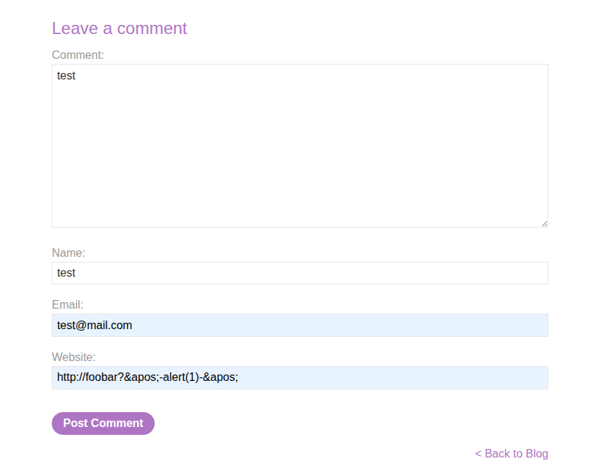
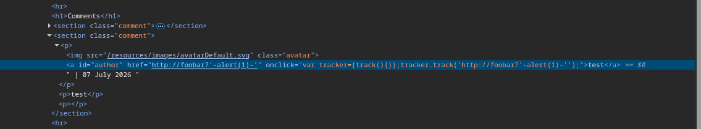
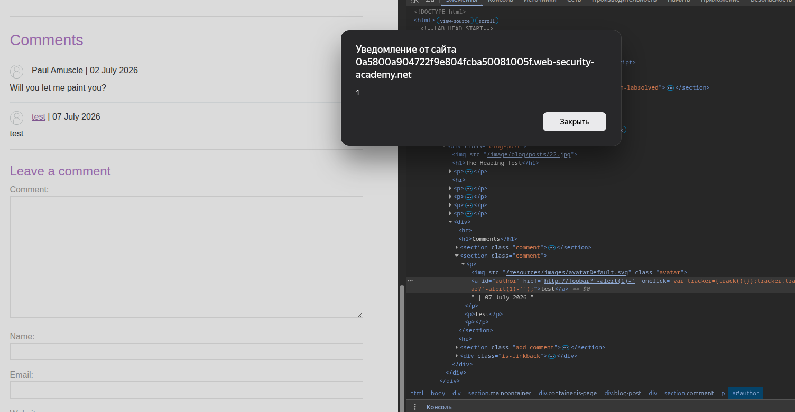

# Lab: Stored XSS into onclick event with angle brackets and double quotes HTML-encoded and single quotes and backslash escaped

**Платформа:** PortSwigger Web Security Academy  
**Категория:** Cross-Site Scripting (XSS)  
**Сложность:** Practitioner  
**Дата:** 2025-07-07

---

## TL;DR

Приложение уязвимо к сохранению XSS в обработчике события `onclick`. Значение поля `Website` вставляется в JavaScript-код без должной обработки, что позволяет выполнить произвольный JavaScript при нажатии на имя автора комментария.

---

## Описание уязвимости

Приложение сохраняет введенное пользователем значение поля `Website` и впоследствии использует его при формировании HTML-кода страницы.

Значение вставляется внутрь обработчика события `onclick`. Несмотря на экранирование угловых скобок (`<`, `>`), двойных кавычек (`"`), одинарных кавычек (`'`) и обратной косой черты (`\`), обработка пользовательского ввода остается недостаточной. Использование HTML-сущности `&apos;` позволяет обойти фильтрацию и изменить логику выполнения JavaScript-кода.

Поскольку комментарий сохраняется на сервере, вредоносный код будет выполняться для каждого пользователя, взаимодействующего с опубликованным комментарием.

---

## Разведка

Приложение предоставляет форму добавления комментариев со следующими полями:

- `Name`
- `Email`
- `Website`
- `Comment`

После публикации комментария имя автора становится ссылкой. Анализ HTML-кода страницы показал, что значение поля `Website` используется внутри обработчика события `onclick`.

---

## Эксплуатация

В поле **Website** вводим следующую полезную нагрузку:

```text
http://foo?&apos;-alert(1)-&apos;
```

Остальные поля можно заполнить произвольными значениями.

После отправки комментария нажимаем на имя автора.

В результате выполняется встроенный JavaScript-код и появляется окно:

```javascript
alert(1)
```

Это подтверждает успешную эксплуатацию сохраненной XSS.

---

## Почему работает эта полезная нагрузка

Полезная нагрузка использует HTML-сущность `&apos;`, которая при обработке браузером преобразуется в символ `'`.

Это позволяет выйти из существующей строки внутри обработчика `onclick`, выполнить собственный JavaScript-код:

```javascript
alert(1)
```

и затем корректно завершить исходное выражение, сохранив валидный синтаксис JavaScript.

---

## Скриншоты







---

## Итог

Удалось выполнить сохраненную XSS-атаку через поле `Website`. Вредоносный JavaScript сохраняется на сервере и выполняется при нажатии на имя автора комментария. Такая уязвимость позволяет выполнять произвольный код в браузере других пользователей, что может привести к краже сессионных данных, выполнению действий от имени пользователя или изменению содержимого страницы.

---

## Защита

Для предотвращения подобных атак необходимо:

- никогда не вставлять пользовательский ввод напрямую в JavaScript-код;
- использовать контекстно-зависимое экранирование данных;
- применять безопасные API для формирования HTML;
- использовать Content Security Policy (CSP) как дополнительный уровень защиты;
- проверять и валидировать пользовательский ввод на стороне сервера.