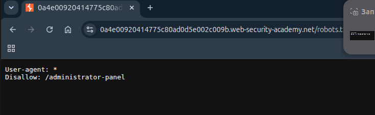
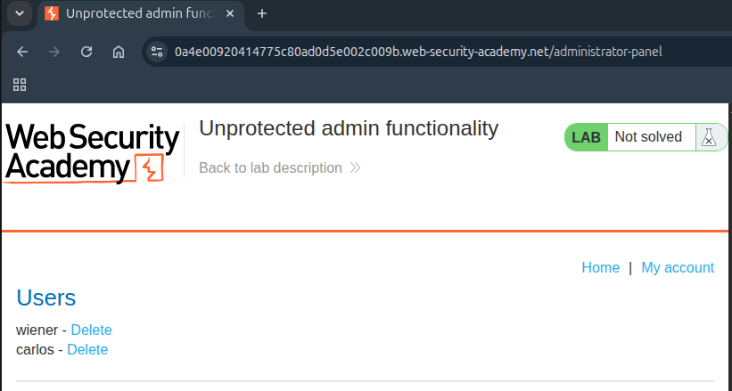
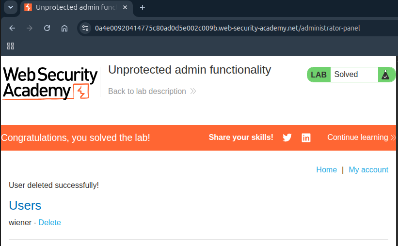

## Lab: Unprotected admin functionality

**Платформа:** PortSwigger Web Security Academy    
**Категория:** Access Control    
**Сложность:** Apprentice    
**Дата:** 2025-08-22    

---

## TL;DR
Административная панель доступна без авторизации.
Путь к ней найден в файле `robots.txt` который разработчики
использовали чтобы скрыть страницу от поисковиков.
Это не защита — `robots.txt` публичен и доступен всем.

---

## Описание уязвимости

Broken Access Control (нарушение контроля доступа) — уязвимость
при которой пользователь получает доступ к функциям или данным
для которых у него нет прав.

В этой лабе две проблемы одновременно:

```
Проблема 1: /administrator-panel доступен без авторизации
            → любой может зайти и выполнять административные действия

Проблема 2: путь указан в robots.txt
            → файл публичен → атакующий легко находит скрытые пути
```

### Что такое robots.txt

Файл для поисковых роботов — указывает какие страницы не нужно
индексировать. Разработчики часто добавляют туда служебные страницы
думая что это скроет их. На самом деле robots.txt публичен
и является готовой картой скрытых разделов сайта.

---

## Эксплуатация

### Шаг 1 — Проверка robots.txt

Открыла файл добавив `/robots.txt` к URL лабы:

```
https://LAB-ID.web-security-academy.net/robots.txt
```

Содержимое файла:

```
User-agent: *
Disallow: /administrator-panel
```

Строка `Disallow` раскрывает путь к административной панели.



### Шаг 2 — Доступ к административной панели

Заменила `/robots.txt` на найденный путь:

```
https://LAB-ID.web-security-academy.net/administrator-panel
```

Страница открылась без какой-либо авторизации — полный доступ
к административным функциям.



### Шаг 3 — Удаление пользователя carlos

В административной панели нашла список пользователей.
Нажала Delete напротив пользователя `carlos`.



---

## Итог

```
/robots.txt → Disallow: /administrator-panel
                    ↓
Открыть напрямую → панель доступна без авторизации
                    ↓
Удалить carlos → лаба решена
```

### Что можно найти в robots.txt

```
/admin          → панель администратора
/backup         → резервные копии
/config         → файлы конфигурации
/test           → тестовые страницы
/api            → внутренние API
/internal       → внутренние инструменты
/.git           → репозиторий с кодом
/phpMyAdmin     → управление базой данных
```

---

## Защита

```python
# УЯЗВИМО — страница доступна всем:
@app.route('/administrator-panel')
def admin_panel():
    return render_template('admin.html')

# БЕЗОПАСНО — проверка прав перед отдачей страницы:
@app.route('/administrator-panel')
def admin_panel():
    if not current_user.is_admin:
        abort(403)  # Forbidden
    return render_template('admin.html')
```

Дополнительно:
- Никогда не полагаться на сокрытие URL как на защиту —
  URL может быть найден через robots.txt, sitemap,
  JS файлы, HTML комментарии или простой перебор
- Проверять права доступа на сервере для каждого запроса
- Убрать чувствительные пути из robots.txt —
  лучше чтобы поисковик проиндексировал страницу
  (она всё равно вернёт 403) чем раскрывать путь всем