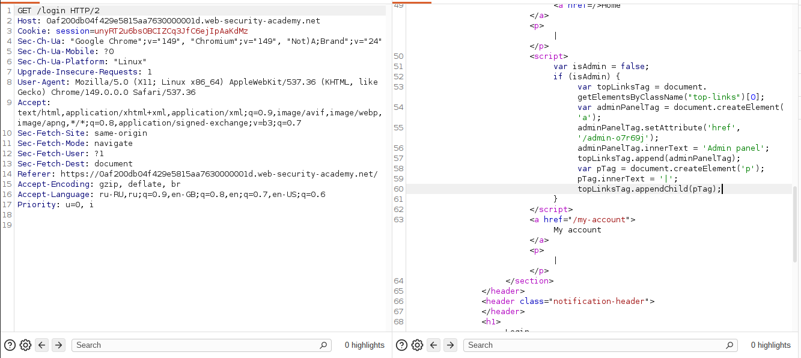

## Lab: Unprotected admin functionality with unpredictable URL

**Платформа:** PortSwigger Web Security Academy    
**Категория:** Access Control    
**Сложность:** Apprentice    
**Дата:** 2025-07-22    

---

## TL;DR
Административная панель находится по непредсказуемому URL
но её путь захардкожен в JavaScript коде главной страницы.
Исходный код страницы доступен всем — URL найден через DevTools.
Панель не требует авторизации.

---

## Описание уязвимости

Это улучшенная версия предыдущей лабы — разработчики убрали
путь из `robots.txt` и сделали URL непредсказуемым. Но совершили
другую ошибку — путь к панели захардкожен в JS коде который
отдаётся всем пользователям.


Безопасность через сокрытие (Security through obscurity) —
ненадёжный подход. Любой клиентский код доступен пользователю.

---

## Эксплуатация

### Шаг 1 — Просмотр исходного кода главной страницы

Открыла главную страницу лабы.
Открыла DevTools → Sources или нажала Ctrl+U (просмотр исходника).

В исходном коде нашла JavaScript блок:

```javascript
var isAdmin = false;
if (isAdmin) {
    var topLinksTag = document.getElementsByClassName("top-links")[0];
    var adminPanelTag = document.createElement('a');
    adminPanelTag.setAttribute('href', '/admin-h4r9jx');
    adminPanelTag.innerText = 'Admin panel';
    topLinksTag.append(adminPanelTag);
    var pTag = document.createElement('p');
    pTag.innerText = '|';
    topLinksTag.appendChild(pTag);
}
```

Путь к административной панели виден в атрибуте `href`:
```
/admin-h4r9jx
```



### Шаг 2 — Почему обычный пользователь не видит ссылку

Обрати внимание на условие:
```javascript
var isAdmin = false;
if (isAdmin) { ... }  // блок не выполняется для обычных пользователей
```

Ссылка на панель не отображается в интерфейсе — но сам путь
присутствует в коде страницы. Любой может просмотреть исходник
и найти URL независимо от значения `isAdmin`.

### Шаг 3 — Доступ к административной панели

Открыла найденный URL напрямую:

```
https://LAB-ID.web-security-academy.net/admin-h4r9jx
```

Страница открылась без авторизации.


### Шаг 4 — Удаление пользователя carlos

В панели нашла список пользователей → нажала Delete напротив `carlos`.


---

## Итог

```
Исходный код страницы → JS содержит /admin-h4r9jx
         ↓
Открыть URL напрямую → панель без авторизации
         ↓
Удалить carlos → лаба решена
```

### Сравнение двух лаб

```
Прошлая лаба:         Эта лаба:
robots.txt            JS исходный код
→ Disallow: /admin    → href: '/admin-h4r9jx'
Оба файла публичны — оба раскрывают скрытые пути
```

### Где ещё могут быть скрыты пути

```
robots.txt          → Disallow пути
sitemap.xml         → карта сайта
JS файлы            → захардкоженные URL и API эндпоинты
HTML комментарии    → <!-- TODO: remove /old-admin -->
CSS файлы           → background-image: url('/secret/...')
Ответы API          → поля с внутренними путями
```

---

## Защита

```javascript
// УЯЗВИМО — путь в клиентском JS:
var adminPath = '/admin-h4r9jx';
if (isAdmin) {
    link.href = adminPath;  // путь виден в исходнике всем
}

// БЕЗОПАСНО — путь только на сервере:
// JS не знает путь к панели
// Сервер сам формирует ссылку только для администраторов
// и проверяет права при каждом запросе к /admin-*
```

```python
# БЕЗОПАСНО — проверка прав на сервере:
@app.route('/admin-h4r9jx')
def admin_panel():
    if not current_user.is_admin:
        abort(404)  # возвращаем 404 а не 403
                    # чтобы не подтверждать существование страницы
    return render_template('admin.html')
```

Дополнительно:
- Никогда не помещать чувствительные пути в клиентский код
- Проверять права доступа на сервере при каждом запросе
- Непредсказуемый URL — не защита, а лишь усложнение
- Возвращать 404 вместо 403 для скрытых страниц —
  чтобы не подтверждать существование ресурса