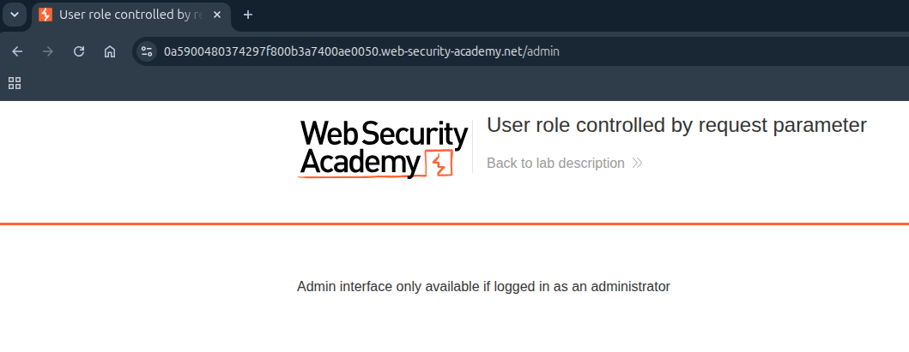
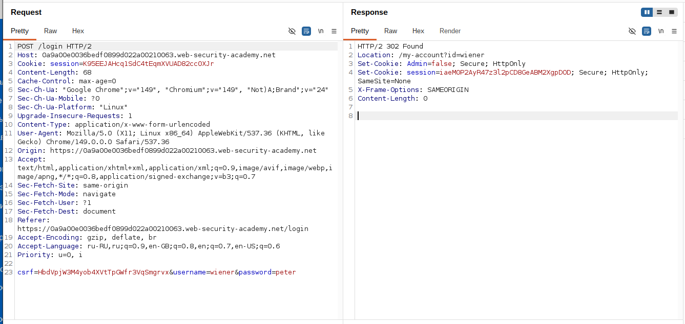
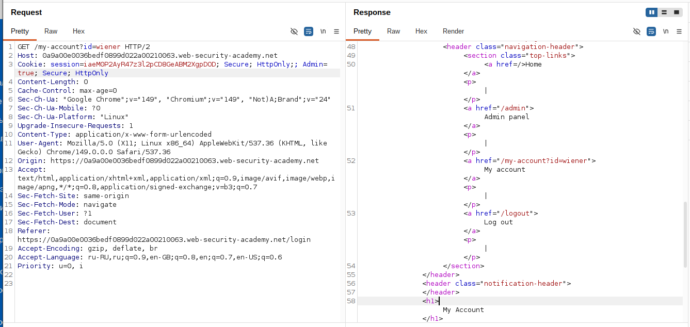
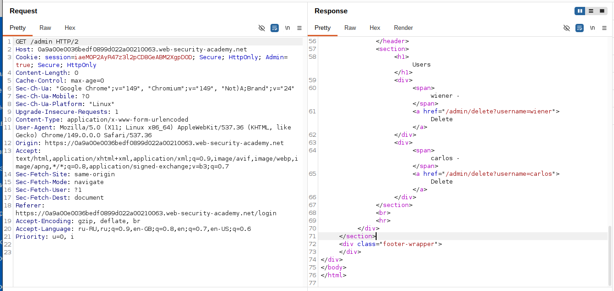
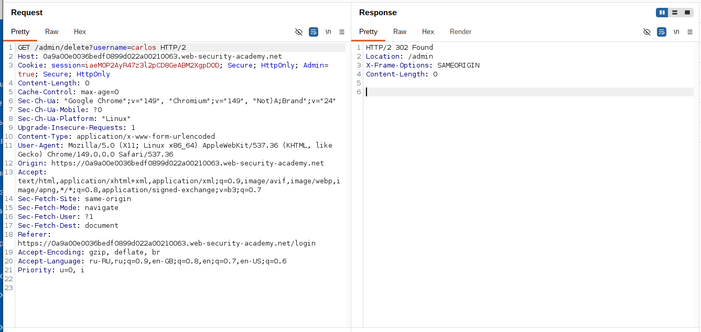

# Lab: User role controlled by request parameter

**Платформа:** PortSwigger Web Security Academy  
**Категория:** Access Control  
**Сложность:** Apprentice  
**Дата:** 2025-07-22  

---

## TL;DR
Роль пользователя определяется через куку `Admin=false/true`
которую сервер устанавливает при логине. Кука не подписана
и не проверяется на сервере должным образом — её можно
изменить вручную на `Admin=true` и получить доступ к панели администратора.

---

## Описание уязвимости

Сервер доверяет значению куки которую сам же отдал клиенту.
Это фундаментальная ошибка — клиент может изменить любую куку.

```
Правильная реализация:
Сервер хранит роль пользователя в БД
При каждом запросе проверяет роль по session ID
Клиент не может влиять на проверку прав

Уязвимая реализация (эта лаба):
Сервер отдаёт куку Admin=false
Клиент меняет на Admin=true
Сервер читает куку и доверяет ей → даёт права администратора
```

---

## Эксплуатация

### Шаг 1 — Проверка /admin без авторизации

Открыла `/admin` напрямую — получила отказ в доступе.
Доступ закрыт для обычных пользователей.



### Шаг 2 — Перехват ответа при логине

В Burp Proxy включила перехват ответов:
```
Proxy → Options → Intercept responses based on rules → включить
```

Перешла на страницу логина, ввела `wiener:peter`, отправила запрос.

В Burp перехватила **ответ** сервера на логин:

```http
HTTP/2 302 Found
Set-Cookie: session=abc123; HttpOnly; Secure
Set-Cookie: Admin=false
Location: /my-account
```

Сервер устанавливает куку `Admin=false`.



### Шаг 3 — Изменение куки в ответе

Прямо в перехваченном ответе изменила значение куки:

```http
Set-Cookie: Admin=false   →   Set-Cookie: Admin=true
```

Нажала Forward — браузер получил изменённый ответ
и сохранил куку `Admin=true`.



### Шаг 4 — Доступ к панели администратора

Открыла `/admin` — страница открылась без ошибок.
Сервер прочитал куку `Admin=true` и предоставил доступ.



### Шаг 5 — Удаление пользователя carlos

В панели администратора нашла список пользователей
→ нажала Delete напротив `carlos`.



---

## Альтернативный способ — изменить куку в DevTools

Вместо перехвата ответа можно изменить куку уже после логина:

```
DevTools → Application → Cookies → выбрать сайт
Найти куку Admin → двойной клик на значение false
Изменить на true → обновить страницу
```

---

## Итог

```
Логин → ответ сервера: Set-Cookie: Admin=false
         ↓
Перехват ответа в Burp → изменить на Admin=true
         ↓
Браузер сохраняет Admin=true
         ↓
Открыть /admin → сервер читает куку → даёт доступ
         ↓
Удалить carlos → лаба решена
```

### Почему кука — плохое место для хранения роли

```
Кука Admin=false:
→ Клиент может изменить в любой момент
→ Нет цифровой подписи → нельзя проверить подлинность
→ Сервер не знает что значение было изменено

Session ID в куке (правильно):
→ Клиент хранит только случайный ID
→ Роль хранится на сервере привязана к этому ID
→ Изменение куки даст доступ к чужой сессии
  но не позволит создать "новую" роль
```

---

## Защита

```python
# УЯЗВИМО — роль в куке:
@app.route('/admin')
def admin_panel():
    is_admin = request.cookies.get('Admin') == 'true'
    if not is_admin:
        abort(403)
    return render_template('admin.html')

# БЕЗОПАСНО — роль в сессии на сервере:
@app.route('/admin')
def admin_panel():
    user_id = session.get('user_id')
    user = db.get_user(user_id)
    if not user or not user.is_admin:
        abort(403)
    return render_template('admin.html')
```

Дополнительно:
- Никогда не хранить роли и права в клиентских куках без подписи
- Использовать подписанные JWT если нужно хранить данные на клиенте
- Проверять права на сервере при каждом запросе
- Добавить флаг `HttpOnly` на куки с ролями чтобы JS не мог их читать
  (но это не защищает от ручного изменения через DevTools)