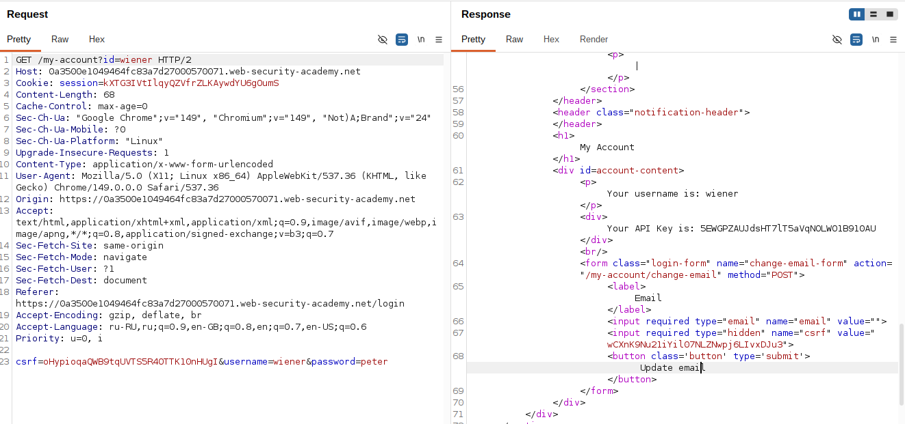
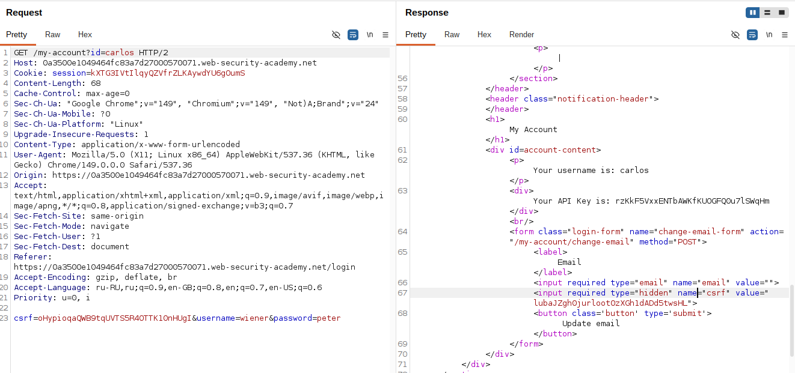
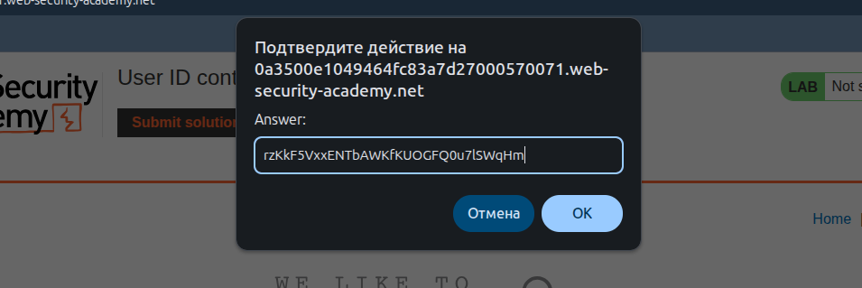

## Lab: User ID controlled by request parameter

**Платформа:** PortSwigger Web Security Academ    
**Категория:** Access Control / IDOR  
**Сложность:** Apprentice    
**Дата:** 2025-07-22    

---

## TL;DR
Страница аккаунта использует параметр `id` в URL для определения
какого пользователя показывать. Сервер не проверяет что параметр
соответствует текущей сессии. Заменив `id=wiener` на `id=carlos`
получила доступ к аккаунту carlos и его API ключу.

---

## Описание уязвимости

IDOR (Insecure Direct Object Reference) — небезопасная прямая
ссылка на объект. Уязвимость возникает когда сервер принимает
идентификатор объекта напрямую от пользователя без проверки
имеет ли он право на доступ к этому объекту.

```
Горизонтальная эскалация привилегий:
Атакующий получает доступ к данным ДРУГОГО пользователя
того же уровня привилегий

Пример:
wiener видит /my-account?id=wiener  → свои данные
wiener видит /my-account?id=carlos  → данные carlos (не должен!)
```

---

## Эксплуатация

### Шаг 1 — Анализ страницы аккаунта

Вошла под `wiener:peter`. Открылась страница аккаунта:

```
https://LAB-ID.web-security-academy.net/my-account?id=wiener
```

Параметр `id` содержит имя пользователя — определяет чей аккаунт показывать.
На странице виден API ключ текущего пользователя.



### Шаг 2 — Изменение параметра id

Отправила запрос в Burp Repeater.
Изменила параметр `id` с `wiener` на `carlos`:

```http
GET /my-account?id=carlos HTTP/2
Host: LAB-ID.web-security-academy.net
Cookie: session=МОЯ_СЕССИЯ
```

Сервер вернул страницу аккаунта carlos с его API ключом.
Нет никакой проверки что `id=carlos` соответствует текущей сессии.



### Шаг 3 — Получение API ключа

В ответе сервера увидела API ключ carlos:

```
API Key: [ключ carlos]
```

### Шаг 4 — Отправка решения

Скопировала API ключ и отправила как решение лабы.



---

## Итог

```
/my-account?id=wiener  → видим свои данные
         ↓
Изменить id=carlos в Burp Repeater
         ↓
Сервер не проверяет принадлежность id к сессии
         ↓
Возвращает данные carlos включая API ключ
         ↓
API ключ отправлен → лаба решена
```

### Где встречается IDOR

```
URL параметры:
/my-account?id=123
/profile?user=wiener
/orders?order_id=456

Тело POST запроса:
{"user_id": 123}

Пути:
/api/users/123/profile
/documents/invoice_456.pdf
```

---

## Защита

```python
# УЯЗВИМО — доверяем параметру из запроса:
@app.route('/my-account')
def account():
    user_id = request.args.get('id')
    user = db.get_user(user_id)  # берём любого пользователя
    return render_template('account.html', user=user)

# БЕЗОПАСНО — берём ID из сессии, не из параметра:
@app.route('/my-account')
def account():
    user_id = session.get('user_id')  # ID из сессии
    user = db.get_user(user_id)       # только свои данные
    return render_template('account.html', user=user)

# БЕЗОПАСНО — если нужен параметр, проверяем права:
@app.route('/my-account')
def account():
    requested_id = request.args.get('id')
    current_user_id = session.get('user_id')
    if requested_id != current_user_id and not is_admin(current_user_id):
        abort(403)
    user = db.get_user(requested_id)
    return render_template('account.html', user=user)
```

Дополнительно:
- Использовать сессию как источник истины об идентификаторе пользователя
- Если нужны параметры в URL — проверять что текущий пользователь
  имеет право на доступ к запрошенному ресурсу
- Использовать непредсказуемые GUID вместо предсказуемых имён/чисел
  как дополнительный слой защиты (но не замена проверки прав)