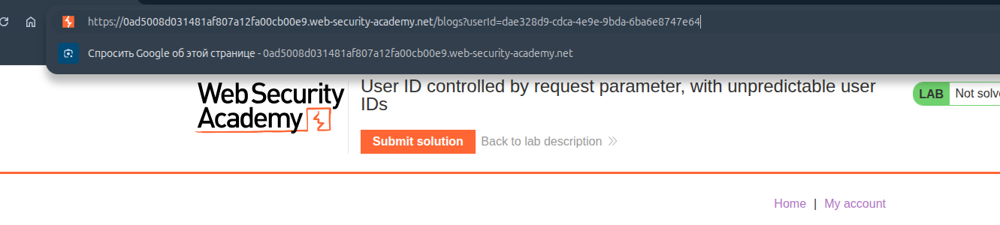
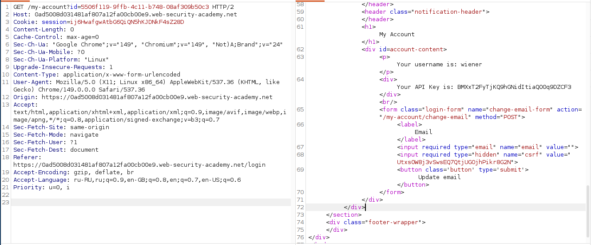
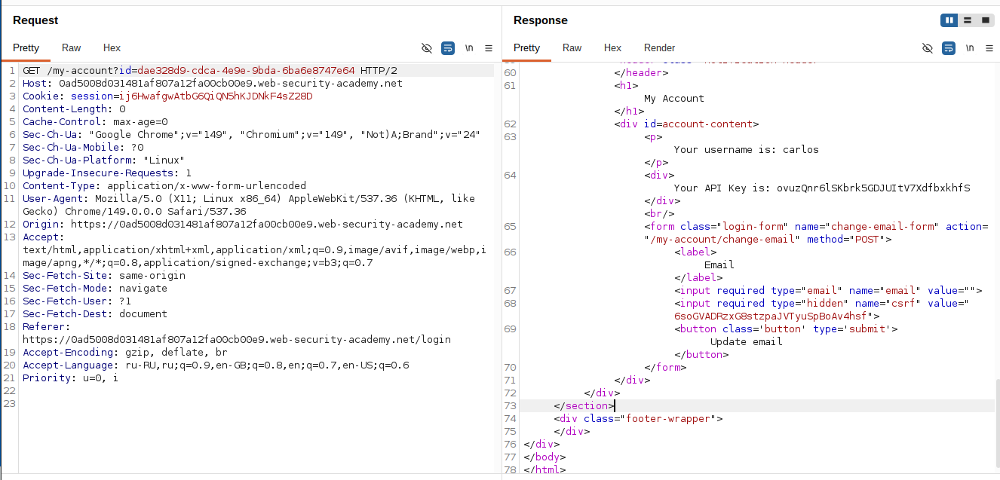
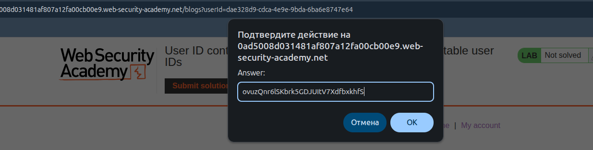

## Lab: User ID controlled by request parameter, with unpredictable user IDs

**Платформа:** PortSwigger Web Security Academy  
**Категория:** Access Control / IDOR  
**Сложность:** Apprentice  
**Дата:** 2025-07-22  

---

## TL;DR
Страница аккаунта уязвима к IDOR — параметр `id` содержит GUID
пользователя без проверки прав. GUID carlos найден в публичном
блоге где он является автором постов. Используя его GUID
получила доступ к аккаунту carlos и его API ключу.

---

## Отличие от предыдущей лабы

```
Прошлая лаба:
?id=wiener → легко угадать (имя пользователя)
Просто меняем на ?id=carlos → готово

Эта лаба:
?id=550e8400-e29b-41d4-a716-446655440000 → GUID (не угадать перебором)
НО: GUID carlos виден в публичном блоге → утечка через другой контекст
```

GUID не защищает от IDOR — он лишь усложняет угадывание.
Если GUID утекает где-то ещё — защита бесполезна.

---

## Эксплуатация

### Шаг 1 — Поиск GUID carlos в блоге

Открыла главную страницу сайта и нашла посты блога.
Нашла пост написанный пользователем `carlos`.
Кликнула на имя carlos — в URL появился его GUID:

```
https://LAB-ID.web-security-academy.net/blogs?userId=550e8400-e29b-41d4-a716-446655440000
```

Записала GUID carlos:
```
550e8400-e29b-41d4-a716-446655440000
```



### Шаг 2 — Вход в свой аккаунт

Вошла под `wiener:peter`. Открылась страница аккаунта:

```
https://LAB-ID.web-security-academy.net/my-account?id=МОЙ_GUID
```



### Шаг 3 — Подмена GUID в Burp Repeater

Отправила запрос страницы аккаунта в Burp Repeater.
Заменила свой GUID на GUID carlos:

```http
GET /my-account?id=550e8400-e29b-41d4-a716-446655440000 HTTP/2
Host: LAB-ID.web-security-academy.net
Cookie: session=МОЯ_СЕССИЯ
```

Сервер вернул страницу аккаунта carlos с его API ключом.



### Шаг 4 — Отправка API ключа как решения

Скопировала API ключ carlos и отправила как решение.



---

## Итог

```
Блог → пост carlos → клик на имя → URL содержит GUID carlos
         ↓
Войти под wiener → страница аккаунта с параметром ?id=GUID
         ↓
Заменить GUID на GUID carlos в Burp Repeater
         ↓
Сервер не проверяет принадлежность GUID к сессии
         ↓
Возвращает данные carlos → API ключ получен
```

### Почему GUID не защищает

```
Предсказуемый ID (wiener, 123):
→ Легко угадать и перебрать

GUID (550e8400-e29b-...):
→ 2^122 возможных значений → не угадать перебором
→ НО: если GUID виден в публичных местах
  (профили, блог, комментарии, ответы API)
  → атакующий получает GUID без перебора

GUID защищает от перебора но не от утечки
```

### Где могут утекать GUID

```
Публичные профили пользователей
Авторы постов в блоге
Комментарии к статьям
Ответы API (список пользователей)
HTML исходный код страниц
Логи доступные через другую уязвимость
```

---

## Защита

```python
# УЯЗВИМО — принимаем любой GUID без проверки прав:
@app.route('/my-account')
def account():
    user_guid = request.args.get('id')
    user = db.get_user_by_guid(user_guid)
    return render_template('account.html', user=user)

# БЕЗОПАСНО — проверяем что GUID принадлежит текущей сессии:
@app.route('/my-account')
def account():
    requested_guid = request.args.get('id')
    current_user = db.get_user(session['user_id'])

    if requested_guid != current_user.guid and not current_user.is_admin:
        abort(403)

    user = db.get_user_by_guid(requested_guid)
    return render_template('account.html', user=user)

# ЕЩЁ ЛУЧШЕ — не использовать параметр вообще:
@app.route('/my-account')
def account():
    user = db.get_user(session['user_id'])  # только из сессии
    return render_template('account.html', user=user)
```

Дополнительно:
- Не показывать GUID пользователей в публичных местах
  если они используются для контроля доступа
- Разделять публичные идентификаторы (slug, username)
  и внутренние идентификаторы (GUID для доступа к данным)
- Проверять права на сервере при каждом запросе
  независимо от предсказуемости идентификатора