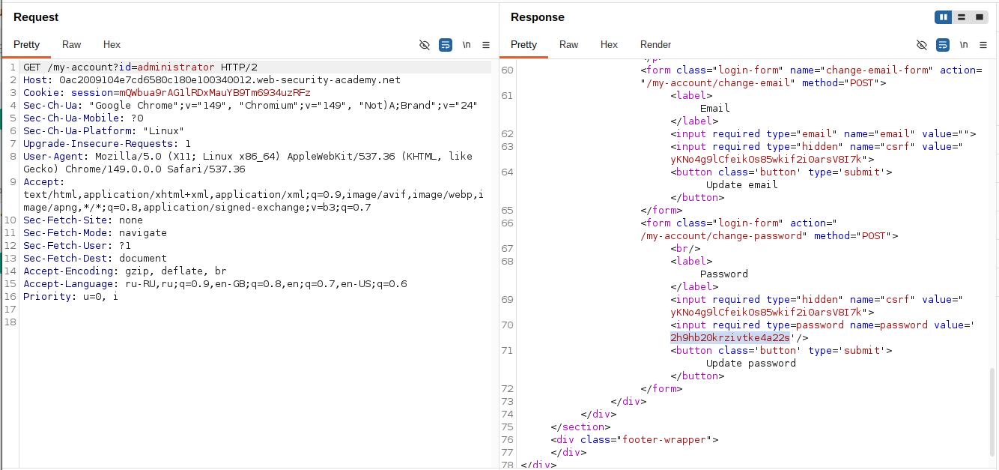
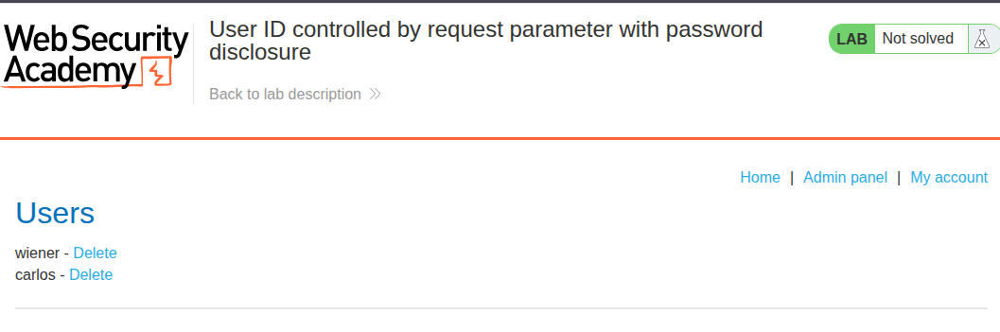
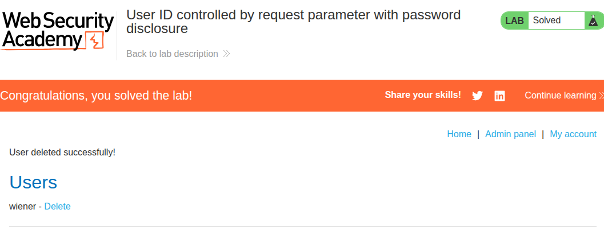

# Lab: User ID controlled by request parameter with password disclosure

**Платформа:** PortSwigger Web Security Academy    
**Категория:** Access Control / IDOR   
**Сложность:** Apprentice   
**Дата:** 2025-07-22    

---

## TL;DR
Страница аккаунта уязвима к IDOR — параметр `id` не проверяется.
Страница содержит скрытое поле с паролем текущего пользователя.
Заменив `id=wiener` на `id=administrator` получила пароль
администратора прямо в HTML ответе.

---

## Отличие от предыдущих лаб

```
Прошлые лабы:
IDOR → доступ к чужим данным (email, API ключ)

Эта лаба:
IDOR + Password Disclosure → раскрытие пароля через скрытое поле
Страница показывает пароль в HTML даже если поле замаскировано
```

Поле `type="password"` скрывает символы **визуально** — но пароль
всё равно присутствует в HTML исходнике и HTTP ответе.

---

## Эксплуатация

### Шаг 1 — Анализ страницы своего аккаунта

Вошла под `wiener:peter`. Открылась страница аккаунта:

```
https://LAB-ID.web-security-academy.net/my-account?id=wiener
```

На странице есть форма с замаскированным полем пароля.
Просмотрела исходный код — пароль виден в HTML:

```html
<input type="password" name="password" value="peter">
```

### Шаг 2 — Подмена id на administrator

Отправила запрос в Burp Repeater.
Изменила параметр `id` на `administrator`:

```http
GET /my-account?id=administrator HTTP/2
Host: LAB-ID.web-security-academy.net
Cookie: session=МОЯ_СЕССИЯ
```

В ответе сервера — HTML страницы аккаунта administrator.
В исходнике нашла скрытое поле с паролем:

```html
<input type="password" name="password" value="ПАРОЛЬ_АДМИНИСТРАТОРА">
```



### Шаг 3 — Вход под administrator

Перешла на страницу логина, ввела:

```
Username: administrator
Password: [пароль из HTML]
```



### Шаг 4 — Удаление carlos

После входа открыла `/admin` → нашла список пользователей
→ нажала Delete напротив `carlos`.



---

## Итог

```
/my-account?id=wiener  → HTML содержит value="peter" в поле пароля
         ↓
Изменить id=administrator в Burp Repeater
         ↓
HTML ответа содержит value="ПАРОЛЬ" в поле пароля
         ↓
Войти под administrator с найденным паролем
         ↓
Удалить carlos → лаба решена
```

### Две уязвимости в одной лабе

```
Уязвимость 1 — IDOR:
Параметр id не проверяется → доступ к чужим аккаунтам

Уязвимость 2 — Password Disclosure:
Пароль передаётся в HTML как значение поля
type="password" скрывает визуально но не из HTML
```

Каждая по отдельности опасна. Вместе — критично.

### Почему type="password" не защищает

```html
<!-- Браузер показывает: ••••••• -->
<!-- Но в HTML исходнике: -->
<input type="password" value="секретный_пароль">

<!-- В HTTP ответе тоже виден: -->
GET /my-account → 200 OK
...value="секретный_пароль"...
```

`type="password"` — только визуальная маска для экрана.
Пароль присутствует в DOM, HTTP ответе и памяти браузера.

---

## Защита

```python
# УЯЗВИМО 1 — IDOR:
@app.route('/my-account')
def account():
    user_id = request.args.get('id')
    user = db.get_user(user_id)
    return render_template('account.html', user=user)

# БЕЗОПАСНО:
@app.route('/my-account')
def account():
    user = db.get_user(session['user_id'])  # только из сессии
    return render_template('account.html', user=user)
```

```html
<!-- УЯЗВИМО 2 — пароль в HTML: -->
<input type="password" name="password" value="{{ user.password }}">

<!-- БЕЗОПАСНО — никогда не передавать пароль клиенту: -->
<input type="password" name="new_password" value="">
<!-- Пользователь вводит новый пароль, старый не нужен -->
```

Дополнительно:
- Никогда не передавать пароли (даже хэши) в HTML клиенту
- Для смены пароля требовать ввод текущего пароля
  а не передавать его предзаполненным
- Хранить пароли только в хэшированном виде (bcrypt, argon2)
- Проверять права доступа на сервере при каждом запросе