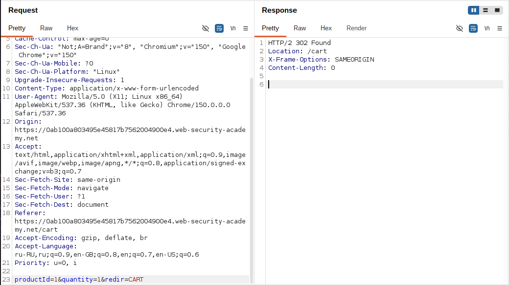
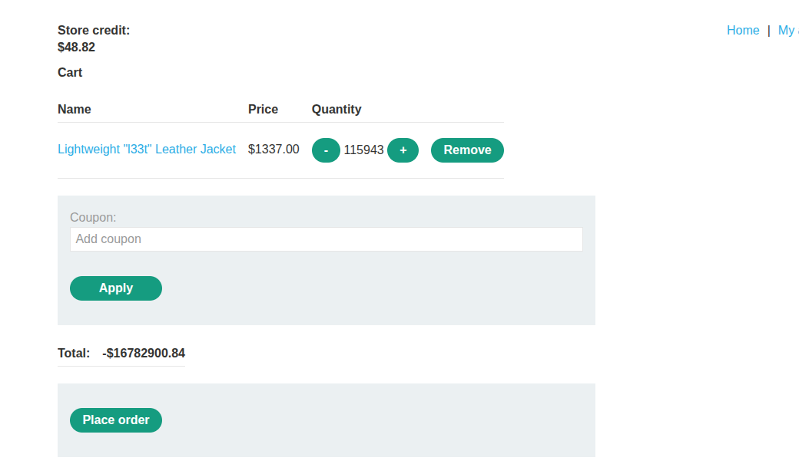

# Lab: Low-level logic flaw

**Платформа:** PortSwigger Web Security Academy
**Категория:** Business logic vulnerabilities
**Сложность:** Practitioner
**Дата:** 2026-07-30

---

## TL;DR
Поле `quantity` при добавлении товара в корзину не проверяется
на стороне сервера должным образом — в UI можно ввести только
двузначное число (максимум 99), но через Burp Repeater/Intruder
это ограничение обходится напрямую. Многократно добавляя товары,
можно превысить максимальное значение 32-битного знакового целого
(`2 147 483 647`), из-за чего сумма заказа **переполняется** и
"перескакивает" в минимально возможное отрицательное значение
(`-2 147 483 648`), а затем снова растёт. Подобрав точное
количество курток и добавив немного дешёвого товара, можно
загнать итоговую стоимость заказа в диапазон $0–100 — то есть
в пределах имеющегося баланса — и купить куртку `133700` центов
фактически бесплатно.

---

## Суть уязвимости: integer overflow в бизнес-логике

```
Обычная защита от переполнения:
Сервер валидирует quantity → отклоняет слишком большие числа
→ сумма заказа никогда не выходит за разумные пределы

Эта лаба:
UI ограничивает ввод (только 2 цифры в HTML-поле),
но это ограничение — чисто визуальное/клиентское
→ сервер сам quantity не проверяет
→ можно отправить сколько угодно запросов на добавление
  товара и накопить огромное количество в корзине
→ итоговая сумма (quantity * price) в какой-то момент
  превышает предел 32-битного int → переполнение →
  сумма "перепрыгивает" на отрицательное число и
  продолжает расти к нулю
```

Ключевая идея: это не инъекция и не обход авторизации, а чисто
**арифметическая логическая ошибка** — сервер доверяет
клиентскому ограничению интерфейса вместо того, чтобы валидировать
диапазон значений сам.

---

## Разведка

### Шаг 1 — Попытка купить куртку напрямую

Вошла как `wiener:peter`, попыталась купить «Lightweight l33t
leather jacket» — заказ отклонён: недостаточно средств на счёте
(товар стоит `$1337.00`, баланс намного меньше).


### Шаг 2 — Изучение процесса оформления заказа

Открыла историю прокси в Burp, нашла запрос добавления товара
в корзину:

```http
POST /cart HTTP/2
Host: LAB-ID.web-security-academy.net
Content-Type: application/x-www-form-urlencoded

productId=1&redir=PRODUCT&quantity=1
```

Отправила его в Burp Repeater. Заметила, что поле `quantity`
в форме на сайте ограничено двумя цифрами (максимум 99) —
но это ограничение задаётся только в HTML/JS на клиенте.
Через Repeater можно подставить в параметр `quantity` любое
число, и сервер его примет.


---

## Эксплуатация

### Шаг 3 — Первая атака: найти точку переполнения

Отправила запрос в Burp Intruder. Установила позицию payload
на значение параметра `quantity` (базовое значение — `99`,
максимум за один запрос). На вкладке **Payloads** выбрала тип
**Null payloads** — этот тип не подставляет никаких новых
значений, а просто заставляет Intruder отправить один и тот же
запрос множество раз подряд. В **Payload configuration** выбрала
**Continue indefinitely**, чтобы атака шла без остановки, пока
я её не прерву вручную.

Запустила атаку. Пока она выполнялась, периодически открывала
корзину и обновляла страницу, наблюдая за общей стоимостью:

```
Стоимость растёт линейно, пока не превышает
2 147 483 647 (максимум для 32-битного знакового int)
→ значение "переполняется" и скачком становится
  -2 147 483 648 (минимально возможное значение)
→ дальше стоимость продолжает РАСТИ от этого минимума
  к нулю, по мере того как в корзину добавляется
  всё больше курток
```

Убедившись, что переполнение действительно происходит, остановила
атаку и полностью очистила корзину — эта атака была разведочной,
чтобы подтвердить факт переполнения, а не точным расчётом.




### Шаг 4 — Расчёт нужного количества товара

Куртка стоит `133700` центов (`$1337.00`). Единственной курткой
попасть ровно в диапазон `$0–100` арифметически невозможно —
шаг цены слишком грубый, нужная сумма не делится ровно на цену
куртки. План:

```
1. Добавить в корзину ОЧЕНЬ БОЛЬШОЕ количество курток —
   ровно столько, чтобы после переполнения 32-битного
   int итоговая сумма стала отрицательной, но уже
   близкой к нулю (немного не доходя нужного диапазона)
2. Затем через Repeater добавить в корзину небольшое,
   уже подбираемое количество ДЕШЁВОГО товара, чтобы
   "дотянуть" сумму снизу до диапазона $0–100
```

### Шаг 5 — Точная атака Intruder: заданное число запросов

Повторила атаку Intruder на добавление курток, но на этот раз
не "бесконечно", а с точным числом повторов — в **Payload
configuration** указала генерацию ровно **323** запросов
(вместо "continue indefinitely").

Так как одновременные запросы могут обрабатываться сервером
не строго по порядку (race condition при параллельной обработке),
на вкладке **Resource Pool** создала новый пул ресурсов и
установила **Maximum concurrent requests = 1** — это гарантирует,
что запросы на добавление товара обрабатываются строго
последовательно, и итоговое количество в корзине будет
предсказуемым, а не "смазанным" из-за гонки потоков.

Запустила атаку.

### Шаг 6 — Точная добивка через Repeater

После завершения атаки Intruder перешла к запросу `POST /cart`
в Burp Repeater и отправила **один** запрос на добавление
**47** курток. Итоговая стоимость заказа в корзине стала
**-$1221.96** — то есть уже отрицательная, но близко к нулю
после переполнения.

### Шаг 7 — Добавление дешёвого товара для попадания в диапазон

Через Burp Repeater добавила в корзину подходящее количество
другого, дешёвого товара, подбирая его так, чтобы итоговая
сумма корзины сместилась из `-$1221.96` в диапазон **$0–100** —
то есть в пределы фактического баланса аккаунта.

### Шаг 8 — Оформление заказа

Когда итоговая сумма корзины оказалась в допустимом диапазоне,
оформила заказ через checkout. Куртка `133700` центов и большое
количество других товаров были куплены за сумму в пределах
имеющегося баланса. 


---

## Итог

```
Проблема: серверная бизнес-логика не валидирует диапазон
          quantity — ограничение существует только в HTML-форме
          на клиенте

Проблема: сумма заказа хранится как 32-битное знаковое целое
          без проверки на переполнение при накоплении
          большого количества товара

Эксплуатация: методично добавляя товар сверх любых разумных
          пределов (через Intruder, обходя UI-ограничение),
          можно довести сумму заказа до переполнения int32
          и "обернуть" её в отрицательную область, а затем
          точным расчётом количества товаров подвести итог
          в желаемый положительный диапазон
```

### Почему нужен Resource Pool с одним потоком

```
Без ограничения параллелизма:
Множество запросов на добавление товара обрабатываются
одновременно → сервер может читать/писать текущее
количество в корзине не строго последовательно (race condition)
→ итоговое количество товара непредсказуемо,
  точный расчёт срывается

С Maximum concurrent requests = 1:
Каждый запрос гарантированно обрабатывается ДО того,
как начнётся следующий → итоговое количество товара
в корзине точно соответствует числу отправленных запросов
```

---

## Защита

```python
# УЯЗВИМО — quantity ограничивается только на клиенте (HTML/JS),
# сервер использует значение как есть, без валидации диапазона:
def add_to_cart(product_id, quantity):
    total_cost = get_price(product_id) * quantity  # int32, без проверки
    cart.add(product_id, quantity, total_cost)

# БЕЗОПАСНО — валидация диапазона и типа на сервере,
# использование типов с защитой от переполнения:
MAX_QUANTITY_PER_ITEM = 99
MAX_CART_TOTAL_CENTS = 10_000_000  # разумный бизнес-лимит

def add_to_cart(product_id, quantity):
    if not (1 <= quantity <= MAX_QUANTITY_PER_ITEM):
        raise ValidationError("Invalid quantity")

    total_cost = get_price(product_id) * quantity  # использовать int64/decimal
    if cart.total_cost() + total_cost > MAX_CART_TOTAL_CENTS:
        raise ValidationError("Cart total exceeds allowed limit")

    cart.add(product_id, quantity, total_cost)
```

Дополнительно:
- Никогда не полагаться на ограничения, заданные только на клиенте
  (`maxlength`, паттерны в HTML-форме, JS-валидация) — сервер должен
  повторно проверять каждое значение независимо от UI
- Использовать типы данных, защищённые от переполнения
  (64-битные целые, `Decimal`/`BigInteger`), особенно для денежных
  сумм, и/или явно проверять переполнение перед сохранением значения
- Вводить бизнес-лимиты на количество товара за один заказ
  и на итоговую сумму корзины, независимо от арифметики
- Ограничивать частоту/параллелизм запросов на изменение
  состояния корзины (rate limiting), чтобы затруднить
  массовое автоматизированное накручивание значений
- Логировать и алертить на аномально большие значения
  quantity или на резкие скачки итоговой суммы заказа