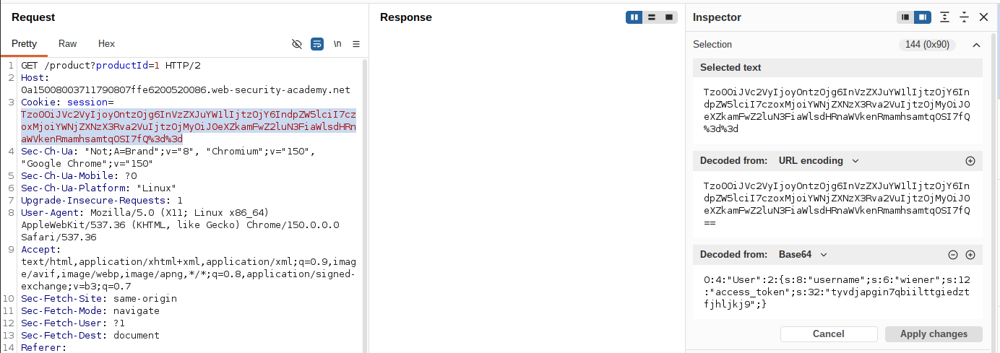
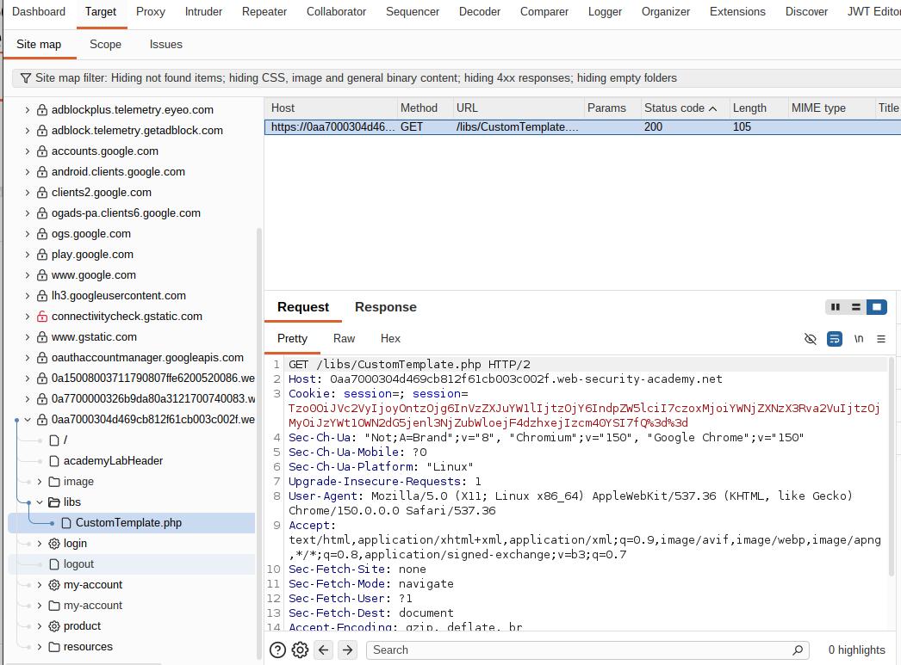
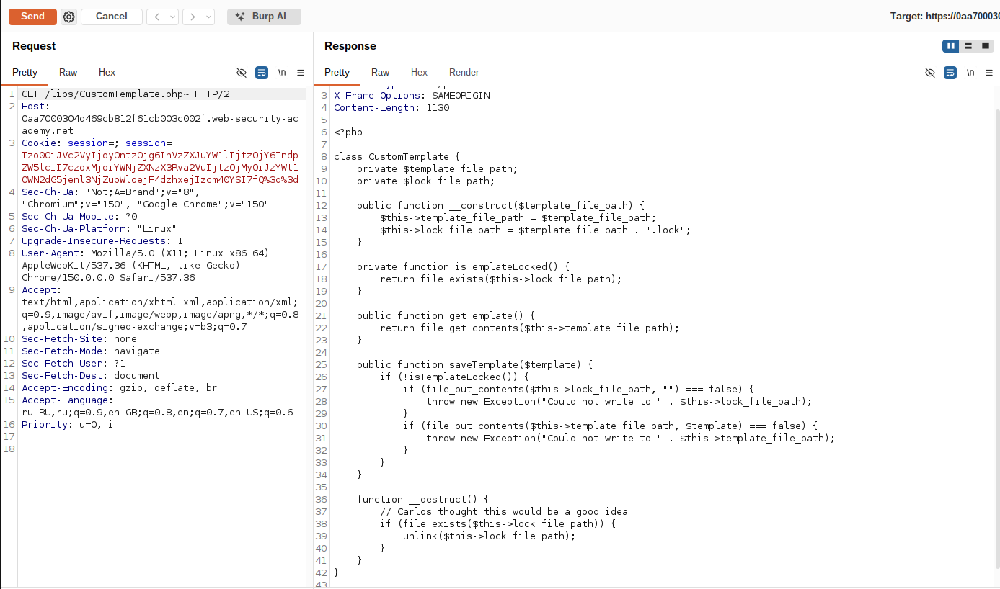
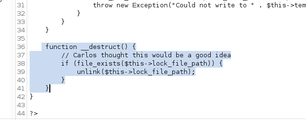
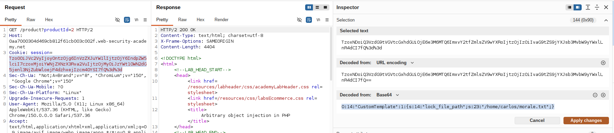
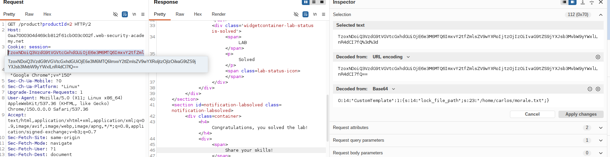

# Lab: Arbitrary object injection in PHP

**Платформа:** PortSwigger Web Security Academy  
**Категория:** Insecure Deserialization  
**Сложность:** Practitioner  
**Дата:** 2025-08-01  

---

## TL;DR
Механизм сессий приложения хранит состояние как сериализованный
PHP-объект прямо в cookie. Так как `unserialize()` вызывается на
данных, полностью контролируемых пользователем, можно подсунуть
объект **произвольного класса**, существующего в кодовой базе.
Найденный через раскрытие исходного кода класс `CustomTemplate`
содержит магический метод `__destruct()`, который вызывает
`unlink()` на пути из своего свойства `lock_file_path`. Собрав
вручную сериализованный объект этого класса с
`lock_file_path = "/home/carlos/morale.txt"` и подставив его
в cookie сессии, удалось удалить чужой файл на сервере простой
десериализацией — без какого-либо явного выполнения кода.

---

## Суть уязвимости: PHP Object Injection через магические методы

```
Обычная десериализация (по задумке):
Сервер сериализует СВОЙ объект сессии → кладёт в cookie
→ при следующем запросе десериализует его обратно,
  восстанавливая состояние

Уязвимость:
unserialize() вызывается на данных, которые полностью
контролирует клиент (сама cookie) →
клиент может подставить сериализованное представление
ЛЮБОГО класса, который существует в приложении →
если у такого класса есть магический метод (__destruct,
__wakeup, __toString и т.п.) с опасной логикой —
он выполнится АВТОМАТИЧЕСКИ, без явного вызова,
просто в результате десериализации присланных данных
```

---

## Разведка

### Шаг 1 — Изучение формата cookie сессии

Вошла как `wiener:peter`, в Burp Proxy изучила заголовок
`Cookie` — значение представляет собой сериализованный
PHP-объект характерного формата `O:N:"ClassName":...`.



### Шаг 2 — Поиск используемых классов через карту сайта

В **Site map** Burp нашла ссылку на файл `/libs/CustomTemplate.php` —
то есть в приложении используется класс `CustomTemplate`, доступ
к исходнику которого напрямую закрыт (PHP-файлы выполняются,
а не отдаются как текст).



Отправила запрос к этому файлу в Burp Repeater.

### Шаг 3 — Раскрытие исходного кода через бэкап-файл

В Repeater добавила тильду (`~`) к имени файла в строке запроса:

```
GET /libs/CustomTemplate.php~ HTTP/2
```

Сервер вернул **исходный код** файла вместо его выполнения —
классический бэкап-файл, оставленный текстовым редактором,
который не блокируется веб-сервером как исполняемый скрипт.





### Шаг 4 — Анализ уязвимого класса

В исходном коде нашла класс с магическим методом `__destruct()`:

```php
class CustomTemplate {
    private $lock_file_path;

    public function __construct($template_file_path) {
        $this->lock_file_path = $template_file_path . ".lock";
    }

    private function isTemplateLocked() {
        return file_exists($this->lock_file_path);
    }

    public function __destruct() {
        if ($this->isTemplateLocked()) {
            unlink($this->lock_file_path);
        }
    }
}
```

`__destruct()` вызывается PHP автоматически при уничтожении
объекта (в конце обработки запроса) и удаляет файл по пути,
хранящемуся в свойстве `lock_file_path`. В нормальном сценарии
это служебный `.lock`-файл шаблона, но так как объект может
быть создан через десериализацию присланных данных — значение
этого свойства полностью контролируется атакующим.




---

## Эксплуатация

### Шаг 5 — Сборка вредоносного сериализованного объекта

В Burp Decoder вручную собрала сериализованное представление
объекта `CustomTemplate` со свойством `lock_file_path`, указывающим
на файл жертвы:

```
O:14:"CustomTemplate":1:{s:14:"lock_file_path";s:23:"/home/carlos/morale.txt";}
```

Разбор:

```
O:14:"CustomTemplate"      — объект класса "CustomTemplate" (14 символов)
:1:                        — у объекта 1 свойство
s:14:"lock_file_path"      — имя свойства, строка длиной 14 символов
s:23:"/home/carlos/morale.txt"
                            — значение свойства: путь длиной 23 символа
```

Важно: все числовые индикаторы длины (`14`, `1`, `23` и т.д.)
должны точно соответствовать реальной длине строк — иначе
`unserialize()` не сможет корректно разобрать данные.




### Шаг 6 — Кодирование payload'а

Закодировала собранную строку сначала в **Base64**, затем
дополнительно в **URL-кодировку** — так, как приложение ожидает
формат cookie сессии.


### Шаг 7 — Подмена cookie сессии

Отправила любой запрос с валидной cookie сессии в Burp Repeater,
заменила значение cookie на подготовленный закодированный
вредоносный объект.


### Шаг 8 — Отправка запроса

Отправила запрос. Сервер десериализовал присланную cookie,
создав объект `CustomTemplate` со свойством
`lock_file_path = "/home/carlos/morale.txt"`. В конце обработки
запроса PHP автоматически вызвал `__destruct()` этого объекта,
что привело к выполнению `unlink("/home/carlos/morale.txt")` —
файл Карлоса был удалён. Лаба решена.




---

## Итог

```
Проблема: unserialize() вызывается на данных, полностью
          контролируемых пользователем (cookie сессии)

Проблема: в кодовой базе существует класс с магическим методом
          (__destruct), выполняющим потенциально опасное действие
          (unlink) над значением своего свойства

Эксплуатация: атакующий создаёт СВОЙ сериализованный объект
          этого класса с нужным значением свойства и подставляет
          его вместо ожидаемого объекта сессии → PHP автоматически
          вызывает магический метод при уничтожении объекта →
          опасное действие выполняется без единого явного вызова
          функции атакующим
```

### Почему это опаснее, чем кажется на первый взгляд

```
Здесь эффект — удаление одного файла (unlink).
Но принцип общий: ЛЮБОЙ класс в приложении (включая классы
из подключённых библиотек/фреймворков) с "интересной" логикой
в магическом методе может стать звеном gadget chain —
цепочки объектов, взаимно вызывающих друг друга через
магические методы, вплоть до произвольного чтения файлов,
SSRF или удалённого выполнения кода (RCE), если в кодовой
базе найдётся подходящий набор классов
```

---

## Защита

```php
// УЯЗВИМО — сессия основана на сериализации, unserialize()
// вызывается на данных, присланных клиентом (cookie):
$sessionData = base64_decode($_COOKIE['session']);
$sessionObject = unserialize($sessionData);

// БЕЗОПАСНО — использовать формат без выполнения кода при
// десериализации, например JSON, и не хранить в сессии
// произвольные объекты:
$sessionData = base64_decode($_COOKIE['session']);
$sessionArray = json_decode($sessionData, true);
```

```php
// Если сериализация PHP-объектов действительно нужна —
// ограничить unserialize() допустимым списком классов:
$sessionObject = unserialize($sessionData, [
    'allowed_classes' => ['SessionData'],  // никаких других классов
]);
```

Дополнительно:
- Не использовать `unserialize()` на данных, поступающих от
  пользователя (cookie, параметры запроса, загруженные файлы) —
  переходить на безопасные форматы (JSON) для хранения состояния
  сессии
- Если сериализация объектов необходима — всегда указывать
  `allowed_classes` в `unserialize()`, ограничивая набор классов,
  которые вообще могут быть восстановлены из внешних данных
- Не размещать резервные копии исходного кода (`~`, `.bak`, `.old`
  и т.п.) в директориях, доступных через веб-сервер — настраивать
  веб-сервер на явный отказ в доступе к таким файлам
- Избегать «опасной» логики (удаление файлов, выполнение команд,
  сетевые запросы) внутри магических методов (`__destruct`,
  `__wakeup`, `__toString`, `__call` и т.п.) — если такая логика
  необходима, явно проверять контекст вызова, а не полагаться
  на то, что объект создаётся только легитимным путём
- Подписывать/шифровать сериализованные данные сессии (HMAC),
  чтобы клиент не мог модифицировать их содержимое незаметно
  для сервера