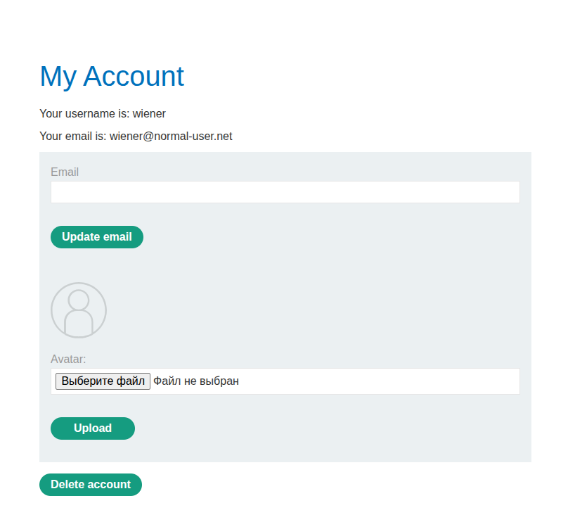
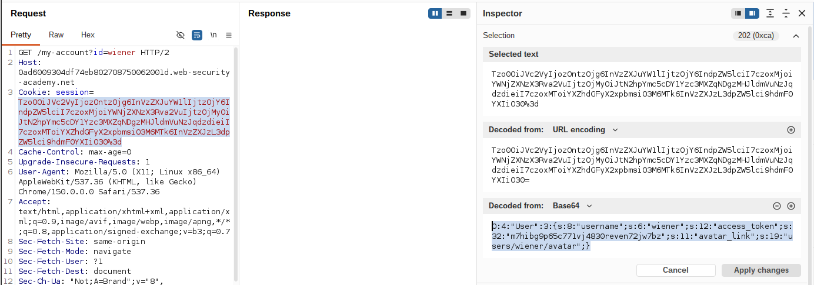
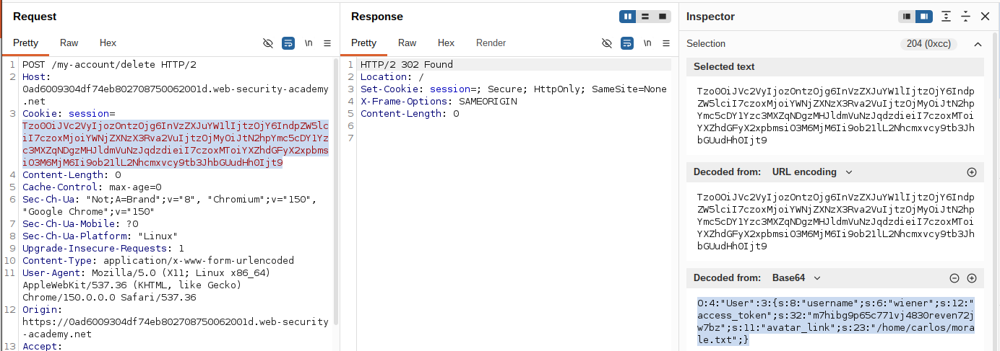

# Lab: Using application functionality to exploit insecure deserialization

**Платформа:** PortSwigger Web Security Academy  
**Категория:** Insecure Deserialization  
**Сложность:** Practitioner  
**Дата:** 2025-08-01

---

## TL;DR
Механизм сессий основан на сериализованном PHP-объекте в cookie,
который содержит поле `avatar_link` — путь к файлу аватара
текущего пользователя. При удалении аккаунта (`POST
/my-account/delete`) сервер, судя по всему, удаляет этот файл
как часть штатной, полностью легитимной логики очистки. Подменив
`avatar_link` на путь к файлу `/home/carlos/morale.txt` прямо
в cookie перед отправкой запроса на удаление своего аккаунта,
удалось заставить сервер удалить чужой файл его же собственной,
ничем не подозрительной функцией.

---

## Отличие от предыдущих десериализационных лаб

```
Object injection (CustomTemplate, __destruct):
Опасность — в магическом методе постороннего класса,
который вообще не задумывался для такого сценария

Modifying data types (access_token, == vs ===):
Опасность — в слабом сравнении внутри проверки авторизации

Эта лаба:
Опасности в логике/сравнении НЕТ вообще — функция удаления
аккаунта работает ровно так, как задумано разработчиком.
Уязвимость — в том, что ОДИН ИЗ ПАРАМЕТРОВ этой легитимной
функции (путь к файлу аватара) берётся напрямую из данных,
которые пользователь может свободно редактировать через
десериализацию, вместо того чтобы вычисляться сервером
самостоятельно на основе username
```

---

## Разведка

### Шаг 1 — Изучение функциональности аккаунта

Вошла как `wiener:peter`. На странице **My account** нашла
возможность удалить свой аккаунт — форма отправляет запрос:

```http
POST /my-account/delete HTTP/2
```



Отправила этот запрос (вместе с cookie сессии) в Burp Repeater,
не подтверждая удаление сразу.

### Шаг 2 — Изучение cookie сессии

На панели **Inspector** в Repeater открыла cookie сессии —
сериализованный PHP-объект. Среди полей нашла атрибут
`avatar_link`, содержащий путь к файлу аватара текущего
пользователя:

```
O:4:"User":3:{s:8:"username";s:6:"wiener";...;s:11:"avatar_link";s:29:"/some/path/to/wiener_avatar.png";}
```



Вывод: сервер хранит путь к файлу аватара не вычисляемо
(например, на основе username), а как есть, доверяя значению
из клиентских данных — потенциальная точка для подмены пути
при следующем использовании этого значения на сервере.

---

## Эксплуатация

### Шаг 3 — Подмена avatar_link

На панели Inspector отредактировала значение поля `avatar_link`,
указав путь к файлу жертвы:

```
s:11:"avatar_link";s:23:"/home/carlos/morale.txt"
```

Разбор:

```
s:11:"avatar_link"    — имя свойства (строка, 11 символов) — без изменений
s:23:"/home/carlos/morale.txt"
                       — новое значение: путь к чужому файлу,
                         СТРОГО 23 символа — индикатор длины
                         обязательно пересчитан под новую строку
```

Нажала **Apply changes** — Burp автоматически перекодировал
объект и обновил cookie в запросе.


### Шаг 4 — Отправка запроса на удаление аккаунта

Убедилась, что путь запроса — `POST /my-account/delete`, и
отправила его с изменённой cookie.




### Шаг 5 — Проверка результата

Сервер десериализовал присланный объект, получив
`avatar_link = "/home/carlos/morale.txt"`, и в рамках штатной
логики удаления аккаунта (которая заодно удаляет файл аватара)
удалил именно этот путь — то есть файл жертвы, а не реальный
аватар. Заодно был удалён и сам аккаунт `wiener`.


### Шаг 6 — Использование резервного аккаунта для проверки

Так как аккаунт `wiener` удалён, вошла под резервными
учётными данными `gregg:rosebud`, чтобы убедиться, что лаба
решена — `morale.txt` из домашнего каталога Карлоса удалён.

---

## Итог

```
Проблема: сервер хранит параметр (путь к файлу аватара)
          внутри сериализованного объекта сессии, который
          полностью присылается и может редактироваться
          клиентом

Проблема: штатная функция "удалить аккаунт" использует этот
          параметр напрямую (unlink(avatar_link)) без проверки,
          что путь действительно принадлежит текущему
          пользователю

Эксплуатация: подмена avatar_link на произвольный путь перед
          вызовом легитимной функции удаления аккаунта →
          сервер, ничего не подозревая, удаляет чужой файл
          собственной штатной логикой
```

### Почему это отдельный, более широкий класс проблемы

```
Здесь нет ни "плохого" магического метода, ни слабого
сравнения — сама функция работает ИДЕАЛЬНО ПРАВИЛЬНО.
Проблема в том, что десериализация из клиентских данных
фактически передаёт пользователю контроль над ЛЮБЫМ
внутренним параметром серверной логики, если этот параметр
хранится в сессии — включая пути к файлам, ID ресурсов,
флаги и прочее, что должно вычисляться сервером,
а не приниматься "как есть" от клиента
```

---

## Защита

```php
// УЯЗВИМО — путь к файлу аватара берётся из десериализованного
// объекта сессии, полностью присланного клиентом:
$user = unserialize(base64_decode($_COOKIE['session']));
// ...
unlink($user->avatar_link);          // путь под контролем клиента
delete_account($user->username);

// БЕЗОПАСНО — путь всегда вычисляется сервером заново,
// на основе доверенного идентификатора (username из БД),
// а не берётся из клиентских данных:
$user = getUserFromDatabase($sessionUserId);   // ID из проверенной сессии
$avatarPath = getAvatarPathForUser($user->id);  // путь вычисляется сервером
unlink($avatarPath);
delete_account($user->id);
```

Дополнительно:
- Не хранить в клиентски редактируемых данных (cookie на основе
  сериализации) ничего, что впоследствии используется как
  параметр опасных операций (пути к файлам, ID других
  пользователей, флаги прав доступа) — такие значения должны
  либо отсутствовать в клиентских данных, либо перепроверяться
  на сервере перед использованием
- Переходить на server-side сессии, где клиенту отдаётся только
  непрозрачный идентификатор сессии, а все реальные данные
  (включая пути к файлам) хранятся и вычисляются исключительно
  на сервере
- При использовании сериализации всё же — подписывать данные
  (HMAC) и/или сверять критичные параметры (путь к файлу,
  владелец ресурса) с независимым источником истины (БД) перед
  выполнением деструктивных операций
- Проектировать функции удаления/изменения ресурсов так, чтобы
  они принимали только идентификатор ресурса, а не готовый путь
  или прочие вычисляемые значения — и сами вычисляли путь заново
  на основе проверенного идентификатора владельца