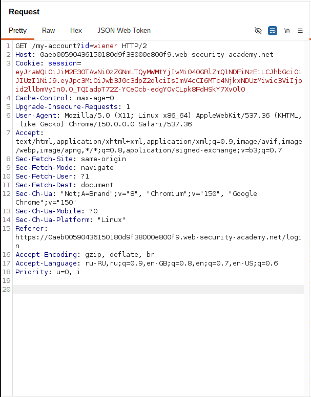
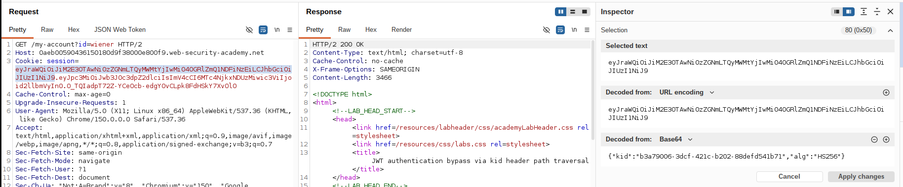
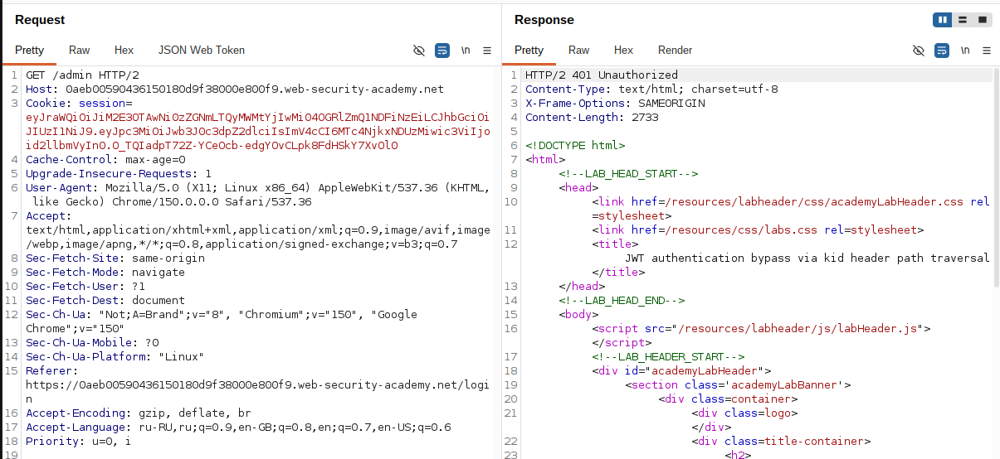
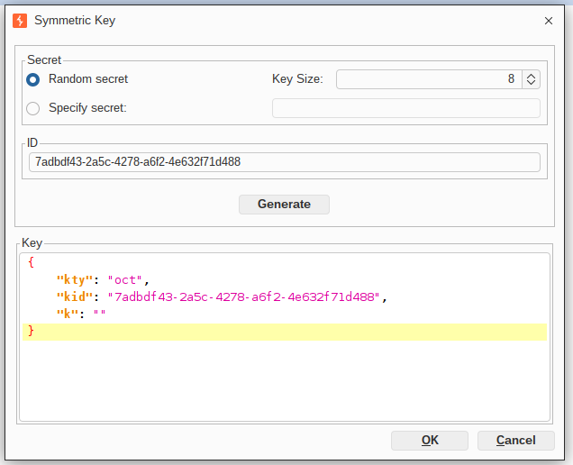
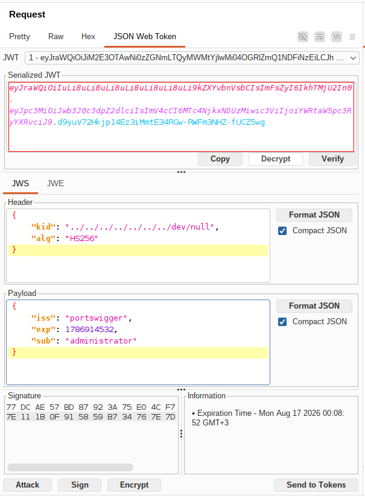
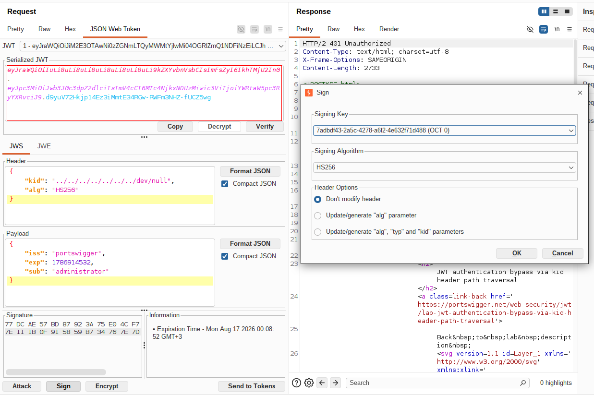
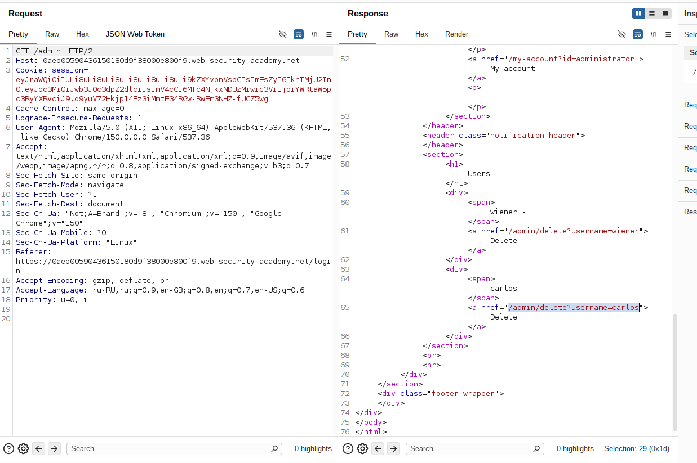
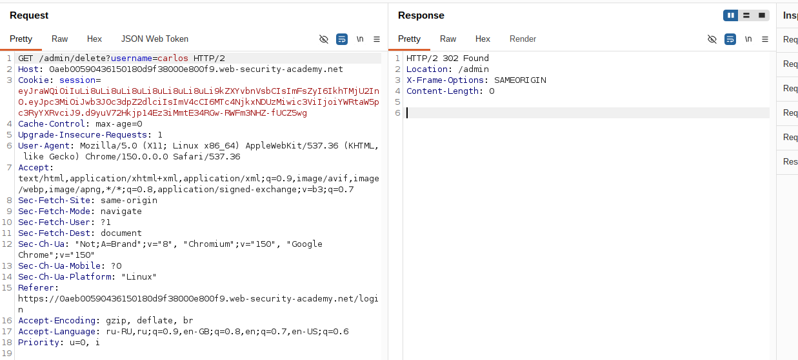

## Lab: JWT authentication bypass via kid header path traversal

**Платформа:** PortSwigger Web Security Academy  
**Категория:** JWT (JSON Web Token)  
**Сложность:** Practitioner  
**Дата:** 2026-08-16

---

## TL;DR

Приложение использует JWT с симметричным алгоритмом HS256.
Для проверки подписи сервер использует значение `kid` из заголовка
токена как имя файла, который читается с диска и используется как
секретный ключ. Значение `kid` не санитайзится, что позволяет
провести path traversal и заставить сервер прочитать заведомо
пустой файл `/dev/null` в качестве ключа.

Подписав токен HMAC-SHA256 с пустым секретом (соответствующим
содержимому `/dev/null`) и подменив `sub` на administrator,
удалось получить доступ к `/admin` и удалить пользователя carlos.

---

## Описание уязвимости

JWT с алгоритмом HS256 подписывается и проверяется одним и тем же
секретным ключом (симметричная схема).

```
JWT = Header.Payload.Signature

Signature = HMAC_SHA256(
    Header.Payload,
    secret_key
)
```

В этой лабе сервер не хранит секрет статически, а определяет,
**какой файл прочитать как секрет**, на основе значения `kid`
из заголовка токена:

```python
# Псевдокод сервера
key_path = f"/app/keys/{kid}"
secret = open(key_path).read()
verify(token, secret)
```

Поскольку `kid` не проверяется на выход за пределы разрешённой
директории, в него можно подставить path traversal (`../../`)
и заставить сервер прочитать **произвольный файл** файловой
системы как ключ проверки подписи.

```
Получили JWT с заголовком kid = "../../../../dev/null"
        │
        ▼
Сервер строит путь к файлу
на основе kid без санитайзинга
        │
        ▼
Читает файл /dev/null
(специальный файл, всегда пустой)
        │
        ▼
Использует пустую строку
как секретный ключ
        │
        ▼
Проверяет подпись HMAC с этим пустым ключом
        │
        ▼
Подписи совпали?
        │
   Да ──┴── Нет
   │          │
JWT принят   401
```

Ключевой момент: `/dev/null` — специальный файл в Unix-подобных
системах, чтение которого всегда возвращает **пустую строку**.
Если атакующий заранее знает содержимое файла, до которого можно
дотянуться через path traversal, он может подписать токен именно
этим значением как HMAC-секретом — подпись совпадёт, потому что
и сервер, и атакующий используют один и тот же (пустой) секрет.

---

## Разведка

### Шаг 1 — Получение JWT

Вошла в приложение под пользователем:

```
wiener:peter
```

Перехватила запрос к своему аккаунту.

```http
GET /my-account HTTP/2
Host: LAB-ID.web-security-academy.net
Cookie: session=<JWT>
```

В качестве значения cookie использовался JWT.


### Шаг 2 — Анализ заголовка токена

Декодировала JWT и увидела в заголовке:

```json
{
  "kid": "18fb3ae7-1234-4562-b3fc-2c963f66afa6",
  "typ": "JWT",
  "alg": "HS256"
}
```

Алгоритм уже симметричный (HS256), менять его не требуется —
достаточно подобрать секрет, соответствующий тому файлу, который
получится прочитать через `kid`.


### Шаг 3 — Проверка доступа к панели администратора

Изменила путь запроса:

```http
GET /admin HTTP/2
Cookie: session=<JWT>
```

Сервер ответил отказом в доступе,
так как токен принадлежал пользователю wiener.


---

## Эксплуатация

### Шаг 4 — Создание симметричного ключа с пустым значением

В Burp Suite открыла JWT Editor Keys → **New Symmetric Key** →
Generate.

Отредактировала сгенерированный ключ вручную: очистила значение
поля `k` (base64url-представление секрета), сделав его пустой
строкой — это соответствует содержимому файла `/dev/null`.


### Шаг 5 — Подмена payload

Открыла перехваченный запрос к `/my-account` во вкладке
**JSON Web Token**.

Изменила claim:

```json
{
  "sub": "administrator"
}
```



### Шаг 6 — Path traversal в заголовке kid

Изменила значение `kid` в заголовке на путь до `/dev/null`:

```json
{
  "kid": "../../../../../../../dev/null",
  "typ": "JWT",
  "alg": "HS256"
}
```

Количество `../` взято с запасом — лишние сегменты просто
"упираются" в корень файловой системы и не мешают достичь `/dev/null`.

### Шаг 7 — Подпись токена пустым секретом

Внизу вкладки JSON Web Token нажала **Sign**, выбрала симметричный
ключ с пустым `k`, созданный на шаге 4.

Burp подписал токен HMAC-SHA256 с пустым секретом — тем же
значением, которое сервер получит, прочитав `/dev/null`.


### Шаг 8 — Получение панели администратора

Отправила запрос с новым токеном:

```
GET /admin HTTP/2
Host: LAB-ID.web-security-academy.net
Cookie: session=<токен с kid path traversal>
```

Сервер прочитал `kid` из заголовка, из-за path traversal попал
в `/dev/null`, получил пустой секрет, проверил HMAC-подпись этим
секретом — она совпала, так как токен был подписан ровно тем же
пустым значением. Токен принят как подлинный, доступ к панели
администратора получен.


### Шаг 9 — Удаление пользователя

Из HTML страницы получила ссылку:

```
GET /admin/delete?username=carlos
```

Отправила запрос.

Пользователь был удалён,
лабораторная работа успешно решена.


---

## Итог

```
JWT пользователя wiener (HS256)
        │
        ▼
Создание симметричного ключа с пустым k
        │
        ▼
Изменение claim sub -> administrator
        │
        ▼
Path traversal в kid -> /dev/null
        │
        ▼
Подпись токена HMAC-SHA256 с пустым секретом
        │
        ▼
GET /admin
(сервер читает /dev/null как секрет и получает совпадение)
        │
        ▼
Доступ администратора
        │
        ▼
Удаление пользователя carlos
```

### Почему разработчики делают такую ошибку

Использование `kid` как прямого указателя на файл в файловой
системе — удобный способ поддерживать несколько ключей (ротацию,
разные окружения), но при этом разработчики забывают, что `kid`
приходит от клиента и является **недоверенным пользовательским
вводом**, который нужно санитайзить так же строго, как и любой
другой путь к файлу.

```
Удобная схема хранения ключей на диске
→ kid используется напрямую как имя файла

Отсутствие санитайзинга/whitelist для kid
→ path traversal позволяет выйти за пределы директории ключей

Возможность подсунуть предсказуемый файл (/dev/null)
→ атакующий заранее знает "секрет", которым можно подписать токен
```

### Где встречается в реальности

```
Файловые хранилища ключей на сервере приложений
→ kid используется как путь без валидации символов ../

Мультитенантные системы
→ kid используется для выбора ключа конкретного клиента/тенанта
  из общей директории, без проверки границ

Legacy-системы с самописной JWT-логикой
→ отсутствие использования проверенных библиотек для работы с kid
```

Во всех этих случаях отсутствие санитайзинга `kid` в сочетании
с предсказуемыми файлами файловой системы (`/dev/null`, файлы
с известным содержимым) позволяет атакующему подделывать токены
и эскалировать привилегии.

---

## Защита

```python
# УЯЗВИМО
# kid используется напрямую как путь к файлу без проверки
kid = header["kid"]
secret = open(f"/app/keys/{kid}").read()
verify(token, secret, algorithms=["HS256"])
```

```python
# БЕЗОПАСНО
# kid валидируется по строгому whitelist известных серверу ключей
ALLOWED_KEY_IDS = {"18fb3ae7-1234-4562-b3fc-2c963f66afa6", "..."}

kid = header["kid"]
if kid not in ALLOWED_KEY_IDS:
    raise InvalidTokenError("Unknown kid")

secret = KEY_STORE[kid]  # ключ берётся из защищённого хранилища,
                          # а не строится как путь к файлу из kid
verify(token, secret, algorithms=["HS256"])
```

Дополнительно:

- никогда не использовать значение `kid` напрямую как путь к файлу
  или ключ в БД — только как индекс в whitelist известных ключей;
- запрещать в `kid` любые символы вне ограниченного набора
  (например, только буквы/цифры/дефисы для UUID);
- хранить ключи в защищённом хранилище (Vault, KMS, Secrets
  Manager), а не как отдельные файлы на файловой системе сервиса;
- явно задавать ожидаемый алгоритм подписи на стороне сервера,
  не полагаясь на `alg` из заголовка токена;
- ограничивать процесс проверки JWT в изолированном окружении
  с минимальными правами доступа к файловой системе.
