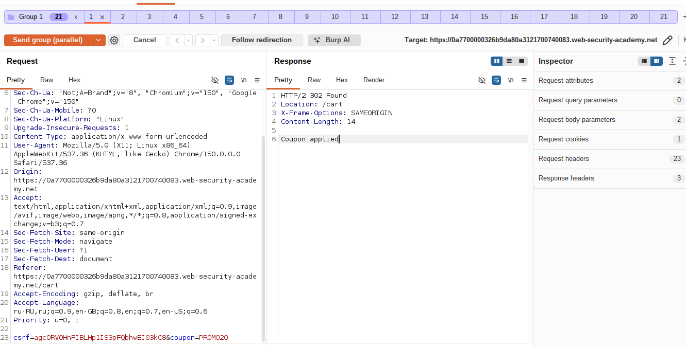
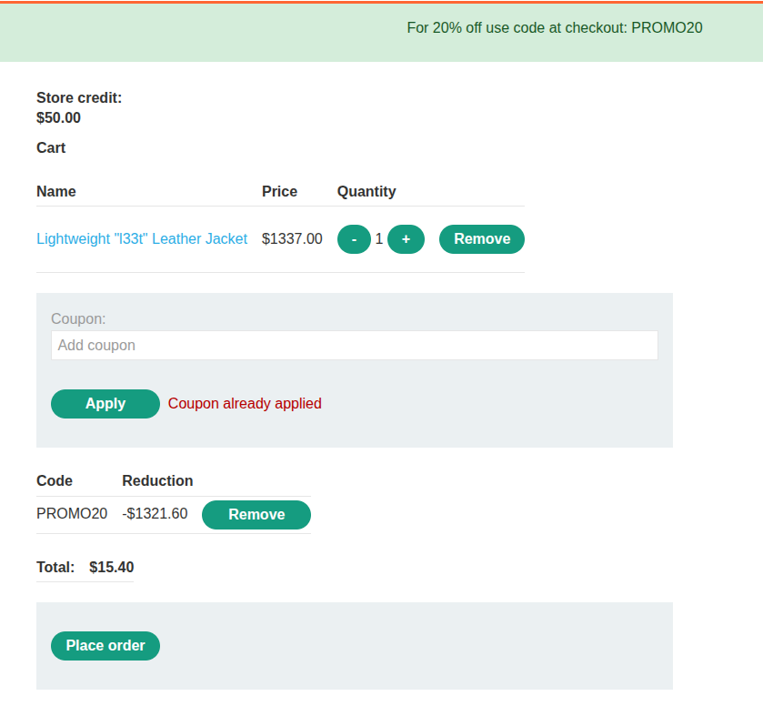
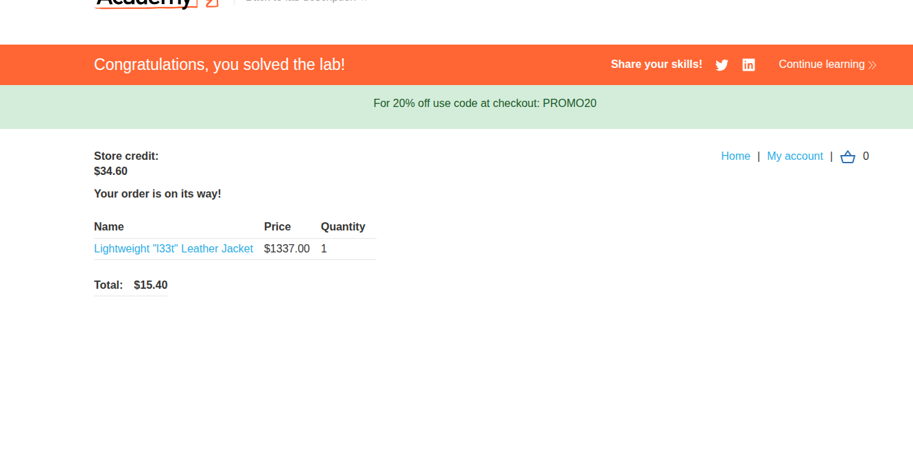

# Lab: Limit overrun race conditions

**Платформа:** PortSwigger Web Security Academy  
**Категория:** Race conditions  
**Сложность:** Student (Apprentice)  
**Дата:** 2025-08-01  

---

## TL;DR
Купонный код скидки 20% можно применить только один раз — сервер
проверяет флаг «купон уже использован» перед применением. Но между
проверкой этого флага и его фактической записью в БД есть временное
окно. Отправив **20 одинаковых запросов `POST /cart/coupon`
параллельно** (одним пакетом, чтобы минимизировать разброс по
времени), можно заставить сервер применить скидку **несколько раз
подряд**, прежде чем он успеет пометить купон как использованный.
Применив скидку так несколько раз к корзине с курткой, можно сбить
цену ниже баланса счёта и купить «Lightweight l33t leather jacket».

---

## Тип уязвимости: limit overrun

```
Задумано:
POST /cart/coupon (код скидки) → можно применить РОВНО ОДИН РАЗ
→ повторная попытка → "Coupon already applied"

Race condition:
ПРОВЕРКА "купон уже использован?"  и  ПРИМЕНЕНИЕ скидки + запись
флага "использован" — это РАЗНЫЕ шаги, разделённые временем
→ если отправить много одинаковых запросов ОДНОВРЕМЕННО,
  каждый успевает пройти проверку до того, как флаг
  будет обновлён хотя бы одним из них
→ скидка применяется многократно вместо одного раза
```

---

## Прогнозирование потенциального столкновения

### Шаг 1 — Изучение обычного процесса покупки

Вошла как `wiener:peter`, купила самый дешёвый товар в магазине,
применив предоставленный промокод на скидку 20%, чтобы изучить
обычный флоу корзины.


### Шаг 2 — Поиск эндпоинтов корзины в истории прокси

В истории Burp Proxy нашла ключевые эндпоинты, отвечающие
за работу с корзиной:

```http
POST /cart          — добавление товара в корзину
POST /cart/coupon   — применение кода скидки
GET  /cart          — просмотр текущего состояния корзины
```


### Шаг 3 — Обнаружение ограничения "один купон — один раз"

Попыталась применить купон повторно — получила ответ:

```
Coupon already applied
```

Значит, на сервере есть проверка, не позволяющая применить один
и тот же купон дважды.

### Шаг 4 — Проверка привязки корзины к сессии

Отправила `GET /cart` в Burp Repeater дважды: один раз с
cookie сессии, второй раз — без него.

```
С session cookie    → корзина с добавленными товарами
Без session cookie  → пустая корзина
```

Вывод: состояние корзины и всех связанных с ней ограничений
(включая флаг "купон применён") хранится на сервере и привязано
к сессии/пользователю — а значит, проверка и запись этого флага
потенциально разнесены во времени и могут стать точкой гонки.

---

## Сравнительный анализ поведения

### Шаг 5 — Последовательная отправка запросов (контрольная проверка)

Убедилась, что купон в корзине не применён. Отправила запрос
`POST /cart/coupon` в Repeater, создала новую группу вкладок
и продублировала её **19 раз** (итого 20 одинаковых запросов
в группе).

Отправила группу запросов **последовательно**, каждый через
отдельное соединение (Send group in sequence — separate
connections), чтобы свести к минимуму влияние гонки и посмотреть
на "нормальное" поведение.

[СКРИН 4: группа из 20 вкладок Repeater перед отправкой]

Результат: только **первый** запрос подтвердил успешное
применение купона, все остальные 19 — отклонены с
`Coupon already applied`. Это ожидаемое поведение без гонки —
подтверждает, что защита в целом работает корректно при
обычной, разнесённой по времени отправке запросов.

---

## Поиск подсказки (эксплуатация гонки)

### Шаг 6 — Параллельная отправка запросов

Удалила купон из корзины. В той же группе из 20 вкладок в
Repeater выбрала **Send group in parallel** — все запросы
уходят на сервер одновременно (single-packet attack), сводя
временной разброс между ними к минимуму.

[СКРИН 6: настройка параллельной отправки группы запросов]

Изучила ответы: на этот раз **несколько** запросов вернули
подтверждение успешного применения купона (а не только один),
так как все они прошли проверку "купон не использован" до того,
как хоть один успел записать флаг применения.




### Шаг 7 — Подтверждение в браузере

Обновила страницу корзины в браузере и убедилась, что скидка
20% была применена **несколько раз подряд**, из-за чего
итоговая цена товара оказалась значительно ниже ожидаемой.




---

### Шаг 8 — Покупка куртки

Оформила покупку куртки по заниженной, накрученной скидками
цене. Лаба решена.



---

## Итог

```
Проблема: проверка "купон уже применён" и запись этого факта
          в состояние корзины — два отдельных шага, разнесённых
          во времени (классический TOCTOU)

Эксплуатация: множество идентичных запросов POST /cart/coupon,
          отправленных ОДНОВРЕМЕННО (не последовательно),
          проходят проверку параллельно, до того как флаг
          "использован" успевает примениться хотя бы одним
          из них → скидка применяется многократно вместо
          одного раза

Результат: цена товара (куртки) сбивается ниже доступного
          баланса счёта, товар куплен по непредусмотренной
          цене
```

### Почему именно параллельная, а не последовательная отправка

```
Последовательная отправка (даже без задержек от браузера):
Каждый запрос обрабатывается сервером один за другим →
флаг "использован" успевает записаться до начала
следующего запроса → защита срабатывает как задумано

Параллельная отправка (single-packet attack через
Send group in parallel в Burp Repeater):
Все запросы физически прибывают на сервер одновременно →
все они читают состояние "купон не использован" ДО того,
как кто-либо из них успевает его изменить →
защита не успевает сработать вовремя
```

---

## Защита

```python
# УЯЗВИМО — проверка и применение купона разделены во времени,
# нет атомарности между чтением и записью флага:
def apply_coupon(session, code):
    if session.coupon_applied:          # ШАГ 1: проверка
        return "Coupon already applied"
    apply_discount(session, code)       # ШАГ 2: применение эффекта
    session.coupon_applied = True       # ШАГ 3: запись флага
    session.save()

# БЕЗОПАСНО — атомарная операция на уровне БД
# (проверка и обновление флага одной транзакцией/запросом):
def apply_coupon(session_id, code):
    updated = db.execute(
        """
        UPDATE cart
        SET coupon_applied = TRUE, discount = %s
        WHERE session_id = %s AND coupon_applied = FALSE
        """,
        (get_discount(code), session_id),
    )
    if updated.rowcount == 0:
        return "Coupon already applied"
    return "Coupon applied"
```

Дополнительно:
- Использовать атомарные операции на уровне БД (`UPDATE ... WHERE
  condition`, уникальные констрейнты, `SELECT ... FOR UPDATE`)
  вместо схемы "прочитать → проверить в коде → записать"
- Оборачивать критичные бизнес-операции (применение скидки,
  списание баланса, погашение купона) в транзакции с должным
  уровнем изоляции (например, `SERIALIZABLE` или явные блокировки
  строк), чтобы гарантировать, что только одна параллельная
  попытка операции завершится успехом
- Использовать распределённые блокировки (Redis lock, mutex по
  ключу "session_id + coupon_code") для операций, которые
  не укладываются напрямую в одну SQL-транзакцию
- Проектировать критичные эндпоинты как идемпотентные
  там, где это возможно — повторный вызов не должен приводить
  к повторному эффекту
- Тестировать подобные эндпоинты именно на конкурентный доступ
  (нагрузочное/параллельное тестирование), а не только на
  последовательные сценарии использования